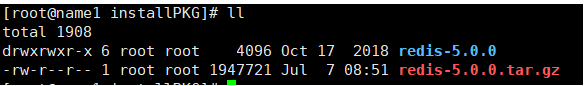
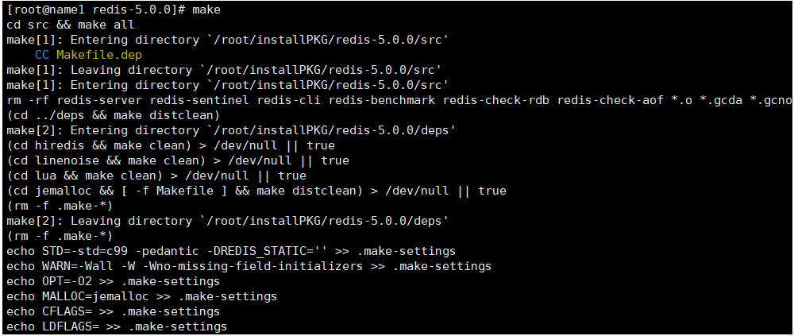
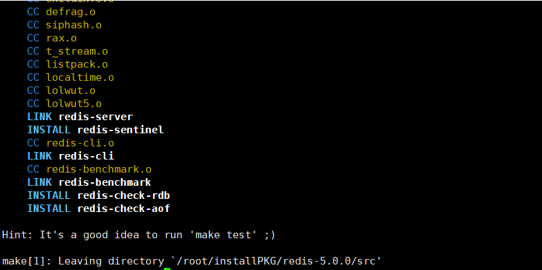
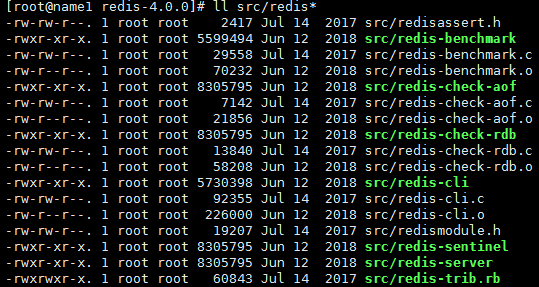
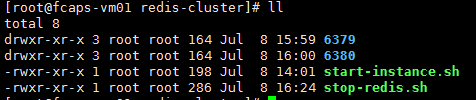
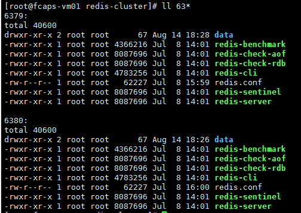
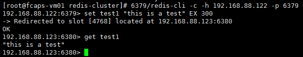

[TOC]

# Redid集群搭建

## 1. 环境准备

1. redis安装源码包下载
2. gcc编译器安装
3. 此次示例安装机器IP：192.168.30.10-12



```shell
# 解压命令
tar -zxvf redis-5.0.0.tar.gz
```


## 2.编译

进入解压后的目录，执行make进行编译：

编译开始：



编译结束：



编译完成后，编译完成的可执行文件都在src目录下：



## ３.配置

第一步：创建一个redis-cluster目录

第二步：在redis-cluster下分别创建6379、6389（目录名字代表此实例占用的端口号）两个子目录



第三步：把redis源码中编译后可执行命令分别拷贝到6379，6380目录下

第四步：编辑源码中的redis.conf文件，并拷贝到6379,6380目录下

```shell
# 配置文件修改
## 6379目录下的配置文件就写6379,6380目录下的配置文件写6380
port 6379 
pidfile /var/run/redis_6379.pid 
cluster-enabled yes 
## 指定配置文件
cluster-config-file redis.conf
## 数据存放目录，此处是设置的安装目录下，根据需要进行目录的修改
dir /root/redis-cluster/6379/data 
appendonly yes 
## 绑定的ip，根据需要进行修改
bind 192.168.30.10 
daemonize yes
```

修改后的目录内容如下：



编写一个启动脚本：

```shell
#!/bin/bash
BASE=`pwd`
SERVER=redis-server
CONF=redis.conf
function start(){
	for i in {6379..6380}
	do
		echo "${SERVER} ${BASE}/$i/${CONF}"
		$BASE/$i/${SERVER} ${BASE}/$i/${CONF}
	done
}

start

```

## 4.分发

把此处设置好的redis-cluster目录分发到其他要安装的机器上，**注意**新机器上配置文件中的ip需要修改。

此处安装的其他两台机器是192.168.30.11-12，所以此处就是分发到此处机器上。

```shell
# 分发命令,目录根据自己需要进行修改
scp redis-cluser/*  root@192.168.30.11:/opt/redis-cluster/
```


## 5. 实例启动

在每个机器上，执行启动脚本，把具体的redis实例启动起来。

## 6. 创建集群

执行命令进行集群创建：

```shell
# 启动了六个节点，创建三主三从集群模式.
redis-cli --cluster create 192.168.30.10:6379 192.168.30.11:6379 192.168.30.12:6379 192.168.30.10:6380 192.168.30.11:6380 192.168.30.12:6380 --cluster-replicas 1

# 查看集群节点
redis-cli -h ip -p 9001 cluster info
```

完成后输出界面如下：


## 7. 连接测试

安装到此就结束了，那肯定要测试一下啦，测试没问题，服务就可以提供功能了。

```shell
# 连接集群
redis-cli -c -h ip -p port
# 设置一个key-value
set key value
# 获取key的值
get key
```



