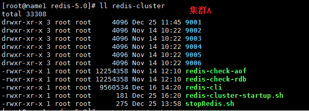
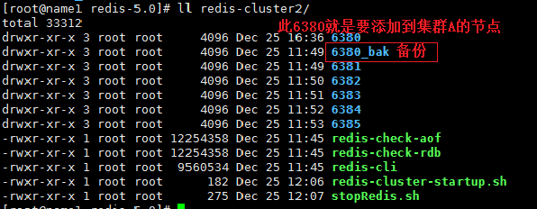
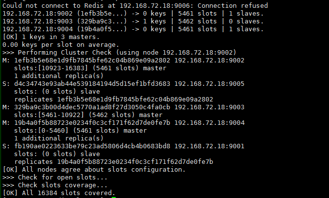
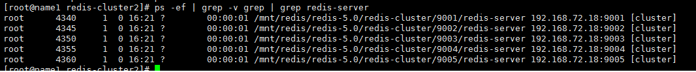
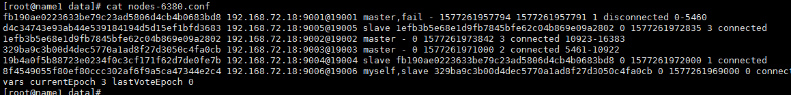
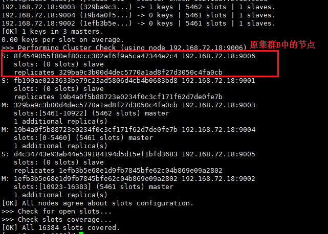
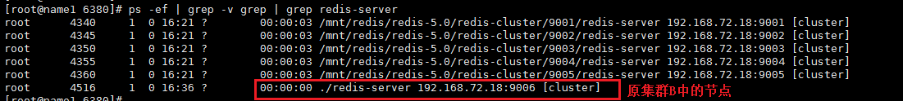

# 添加另一个集群中的节点到当前集群中

## 环境介绍

环境：redis5.0.0， 系统：centos6.4

问题：现在有一个运行良好的redis集群A，还有另外一个异常的的redis集群B，现在要把B集群中的节点添加到集群A中。而B集群中的节点就是原来A集群中的节点，不过因为操作不当，重建了一个B集群

## 解决方法

此操作有两种方法可以解决，

方法一：

1. 把B集群中要添加到A集群的节点进行一次数据转移操作
2. 把节点移出B集群
3. 把移出B集群的节点添加到A集群

一般通过上述几步就可以达到目的了。不够本次需求有些特殊，B集群只有一个节点，也就是不能进行数据转移，当然了通过正常的移出集群的方法就有些行不通了。

方法二：

在集群环境下，每个节点会在自己的data目录下有一个文件记录当前集群的信息，那方法二呢就是根据原来B集群中的节点原来就是A集群中的节点，重写一下B集群中的集群配置为A集群的集群配置来达到添加到目的。

**注意：**在redis中每个节点表示就是一串唯一的ID号，所以每个节点在集群中的标识就是此ID号。也就是操作中需要注意此ID号一定要对应的上，不然就会导致集群状态异常，此时就比较难恢复了，除非有一份当初的初始集群配置文件。所以此方法操作前还是先进行一下集群文件的备份。

下面就方法二进行一下演示，大概步骤如下：

1. 创建两个集群，集群A端口为9001-9006，集群B端口为6380-6385(把B集群中6380节点添加到集群A中)
2. 集群A端口为9006的节点不要启动
3. 把集群B节点的6380的节点集群配置文件修改为9006对应的集群配置文件
4. 修改6380的节点的配置信息，修改其端口为9006；当然了此时的6380本身的配置文件可以不做修改，仍然使用6380端口，不过此操作就要对集群A中所有节点的结群配置进行修改，把原来9006端口的节点的端口修改为6380，此修改比较大（此处修改比较大，出错概率也大），故使用修改6380占用端口的方法
5. 启动6380节点，发现其已经加入到了集群中。

集群A和集群B：





集群A信息：





可以看到9006节点没有启动。

看一下9006节点的配置信息：

```shell
fb190ae0223633be79c23ad5806d4cb4b0683bd8 192.168.72.18:9001@19001 master,fail - 1577261957794 1577261957791 1 disconnected 0-5460
d4c34743e93ab44e539184194d5d15ef1bfd3683 192.168.72.18:9005@19005 slave 1efb3b5e68e1d9fb7845bfe62c04b869e09a2802 0 1577261972835 3 connected
1efb3b5e68e1d9fb7845bfe62c04b869e09a2802 192.168.72.18:9002@19002 master - 0 1577261973842 3 connected 10923-16383
329ba9c3b00d4dec5770a1ad8f27d3050c4fa0cb 192.168.72.18:9003@19003 master - 0 1577261971000 2 connected 5461-10922
19b4a0f5b88723e0234f0c3cf171f62d7de0fe7b 192.168.72.18:9004@19004 slave fb190ae0223633be79c23ad5806d4cb4b0683bd8 0 1577261972000 1 connected
8f4549055f80ef80ccc302af6f9a5ca47344e2c4 192.168.72.18:9006@19006 myself,slave 329ba9c3b00d4dec5770a1ad8f27d3050c4fa0cb 0 1577261969000 0 connected
vars currentEpoch 3 lastVoteEpoch 0
```


看一下6380节点的配置信息：

```shell
fb190ae0223633be79c23ad5806d4cb4b0683bd8 192.168.72.18:6380@16380 myself,master - 0 1577246504733 1 connected 0-5460
1efb3b5e68e1d9fb7845bfe62c04b869e09a2802 :0@0 master,noaddr - 1577246504741 1577246504732 3 disconnected 10923-16383
8f4549055f80ef80ccc302af6f9a5ca47344e2c4 192.168.72.18:6385@16385 slave 329ba9c3b00d4dec5770a1ad8f27d3050c4fa0cb 1577246504741 1577246504732 2 disconnected
19b4a0f5b88723e0234f0c3cf171f62d7de0fe7b 192.168.72.18:6383@16383 slave fb190ae0223633be79c23ad5806d4cb4b0683bd8 1577246504741 1577246504733 1 disconnected
329ba9c3b00d4dec5770a1ad8f27d3050c4fa0cb 192.168.72.18:6382@16382 master - 1577246504741 1577246504732 2 disconnected 5461-10922
d4c34743e93ab44e539184194d5d15ef1bfd3683 192.168.72.18:6384@16384 slave 1efb3b5e68e1d9fb7845bfe62c04b869e09a2802 1577246504741 1577246504733 3 disconnected
vars currentEpoch 3 lastVoteEpoch 0
```

下面咱们把9006的配置信息覆盖6380的配置，



然后修改一下6380的配置文件，修改其端口为9006. 然后启动

最后查看一下集群信息：



查看一下启动的进程：



从上面的查看，可以了解到新加入节点成功，而且集群状态正常。