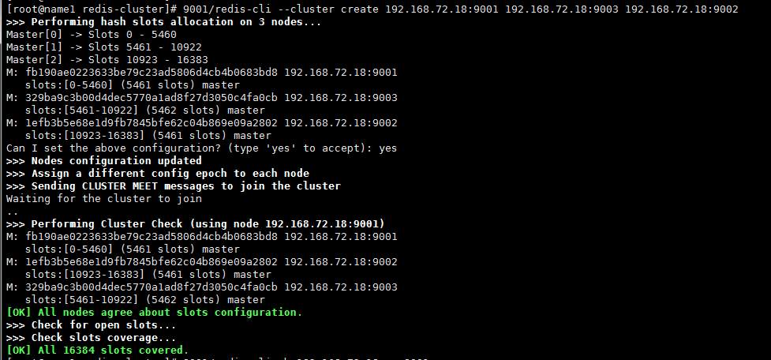
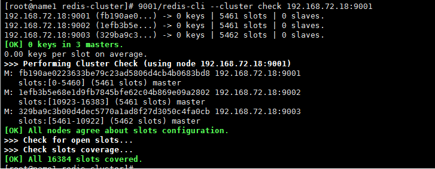
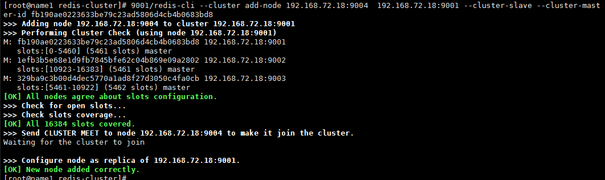
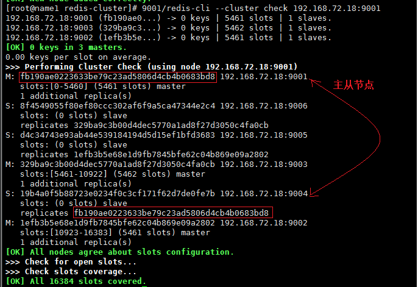

# redis集群指定从节点

首先说明，此文档对应的redis是5.0以上版本，对于redis5.0以下的版本参数可以参考。5.0直接使用redis-cli命令，5.0以下的版本一般使用redis-trib.rb。

指定从节点的方式有二，下面分别进行说明。

## 方式一

如果已经创建好了集群，那么可以登录到集群上，进行从节点的修改。

如图所示：

```shell
# 命令行
## 把192.168.72.18:9001 节点指定为 node-id的从节点
redis-cli -h 192.168.72.18 -p 9001  REPLICATE  <node-id>

# 登录操作
## 把当前登录的节点指定为 node-id的从节点
REPLICATE  <node-id>
```


## 方式二

此方式分为两步(示例创建的是三主三从redis集群)：

1. 启动redis的6个实例，并创建其中的三个位主节点
2. 逐个添加后面的三个节点作为指定节点的从节点

```shell
redis-cli --cluster create 192.168.72.18:9001 192.168.72.18:9003 192.168.72.18:9002
```



```shell
redis-cli --cluster check 192.168.72.18:9001
```



```shell
# 把9004指定为9001的从节点
redis-cli --cluster add-node 192.168.72.18:9004  192.168.72.18:9001 --cluster-slave --cluster-master-id fb190ae0223633be79c23ad5806d4cb4b0683bd8

192.168.72.18:9004: 添加的节点
192.168.72.18:9001：集群中的任意一个节点
--cluster-slave： 表示添加从节点
--cluster-master-id：主节点的 node ID
```



按照上面的方法以此添加其他从节点。



可以看到，指定成功。


删除脚本：

```shell
#!/bin/bash
BASE=$(cd $(dirname $0);pwd)
stop(){
PID=$(ps -ef | grep -v grep | grep redis-server | awk '{print $2}')
if [ ${#PID[@]} -gt 1 ];then
  for pid in ${PID[@]}
  do
    echo "stop redis  $pid"
    kill -9 $pid
  done
else
  echo "no redis is running"
fi
}
stop
```

