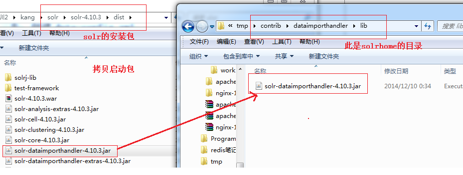
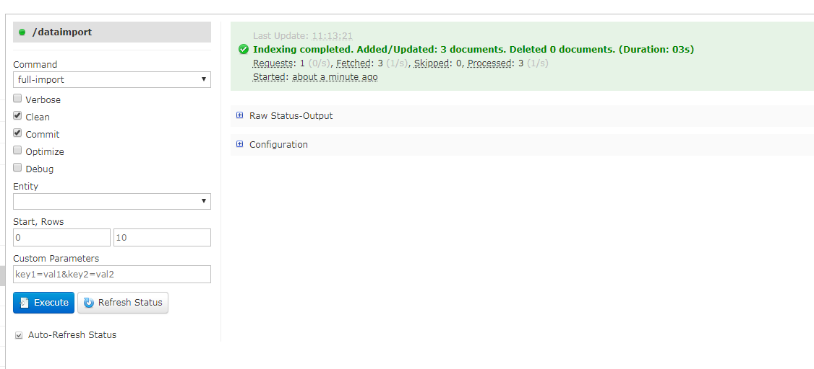
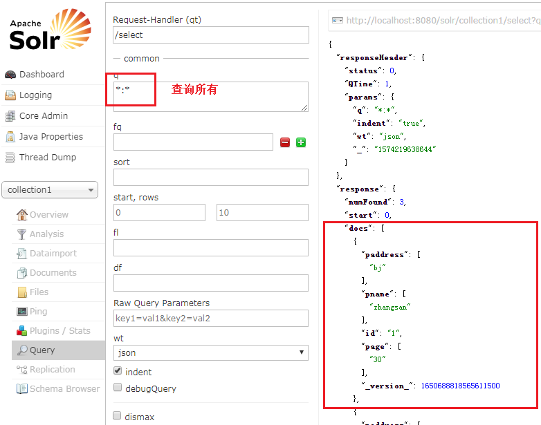

[TOC]

# Data Import

## 1.拷贝import包



## ２.拷贝DB驱动


## 3. 配置solrConfig让其识别到添加的jar包

```xml
<lib dir="${solr.install.dir:../..}/contrib/dataimporthandler/lib" regex=".*\.jar" />
<lib dir="${solr.install.dir:../..}/contrib/db/lib" regex=".*\.jar" />
```


## 4.设置数据库连接信息

```xml
<field name="pname" type="text_ik" indexed="true" stored="true" multiValued="true"/>
<field name="page" type="text_ik" indexed="true" stored="true" multiValued="true"/>
<field name="paddress" type="text_ik" indexed="true" stored="true" multiValued="true"/>
```


```xml
<!--data-config.xml-->
<?xml version="1.0" encoding="UTF-8"?>
<dataConfig>
	<!--定义数据源信息-->
	<dataSource type="JdbcDataSource"
		driver="com.mysql.jdbc.Driver"
		url="jdbc:mysql://localhost:3306/ssm"
		user="root"
		password="admin"
	/>
	<!--定义导出数据映射到document
	注意id字段是必须的，不然导入就不会成功
	-->
	<document>
		<entity name="product" query="SELECT id,name,age,address FROM USER;">
			<field column="id" name="id"/>
			<field column="name" name="pname"/>
			<field column="age" name="page"/>
			<field column="address" name="paddress"/>
		</entity>
	</document>
</dataConfig>

## 解析:
<field column="name" name="pname"/> : 其中name是查询出来的列的别名, name是在schema中定义的field
```


## 5. 添加数据导入的handler

在solrConfig.xml中添加数据导入的handler

```xml
<requestHandler name="/dataimport" class="org.apache.solr.handler.dataimport.DataImportHandler">
    <lst name="defaults">
        <str name="config">data-config.xml</str>
    </lst>
</requestHandler>
```


导入：



导入结果查询：

