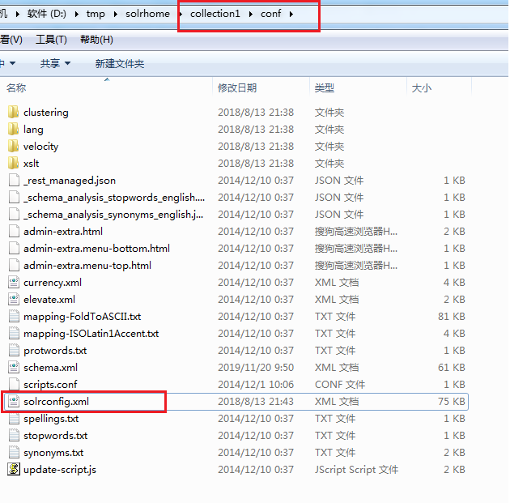

[TOC]

# schema.xml

在schema.xml文件中，主要配置了solrCore的一些数据信息，包括Field和FieldType的定义等信息。在solr中，Field和FieldType都需要先定义后使用。



## 1.Field

```xml
## 定义field域
<field name="id" type="string" indexed="true" stored="true" required="true" multiValued="false" /> 

## 解析:
name: 域的名字
type: 指定域的类型
indexed: 是否索引
stored: 是否存储
required: 是否必须
multiValued: 是否多值.如:商品信息中,一个商品有多张图片,一个field想存储多个值的话,必须将multiValued设置为true
```


## 2.dynamicField

```xml
## 定义dynamicField域
<dynamicField name="*_is" type="int"    indexed="true"  stored="true"  multiValued="true"/>

## 参数
name:指定动态域的命名规则
type:类型
indexed: 是否索引
stored: 是否存储
multiValued: 是否多值
```

官方解释:

```shell
Dynamic field definitions allow using convention over configuration
for fields via the specification of patterns to match field names. 
EXAMPLE:  name="*_i" will match any field ending in _i (like myid_i, z_i)
RESTRICTION: the glob-like pattern in the name attribute must have
a "*" only at the start or the end. 
### 简单说
动态域允许使用正则去匹配field name.
```


## 3.uniqueKey

```xml
## 定义uniqueKey域
 <uniqueKey>id</uniqueKey>

## 指定唯一键
其中的id是在Field标签中已经定义好的域名,而且该域要设置为required为true. 一个schema.xml文件中必须有且仅有一个唯一键.
```


## 4.copyField

```xml
## 定义copyField域
<copyField source="cat" dest="text"/>
## 
source: 要复制的源域的域名
dest: 目标域的域名
由dest指定的目标域,必须设置multiValued为true.

简单说: 也就是会把多个copyField指定的域拷贝到text域中,之后进行多个域搜索的时候,可以直接搜索最终的dest指定的域就可以了.

<!-- catchall field, containing all other searchable text fields (implemented
        via copyField further on in this schema  -->
<field name="text" type="text_general" indexed="true" stored="false" multiValued="true"/>
```

官方解析:

```shell
copyField commands copy one field to another at the time a document
is added to the index.  It's used either to index the same field differently,
or to add multiple fields to the same field for easier/faster searching.

## 简单说就是:copyField 作用是在把document添加到索引时会把一个field的值拷贝到另一个field.它通常是为了更方便的同时搜索多个域.

```


## 5.FieldType

定义域的类型。

```xml
## 定义FieldType域
<fieldType name="text_ik" class="solr.TextField">
    <analyzer class="org.wltea.analyzer.lucene.IKAnalyzer"></analyzer>
</fieldType>
```

```xml
<!-- A general text field that has reasonable, generic  cross-language defaults: it tokenizes with StandardTokenizer, removes stop words from case-insensitive "stopwords.txt"  (empty by default), and down cases.  At query time only, it
also applies synonyms. -->
<fieldType name="text_general" class="solr.TextField" positionIncrementGap="100">
    <analyzer type="index">
        <tokenizer class="solr.StandardTokenizerFactory"/>
        <filter class="solr.StopFilterFactory" ignoreCase="true" words="stopwords.txt" />
        <!-- in this example, we will only use synonyms at query time
        <filter class="solr.SynonymFilterFactory" synonyms="index_synonyms.txt" ignoreCase="true" expand="false"/> -->
        <filter class="solr.LowerCaseFilterFactory"/>
    </analyzer>
    <analyzer type="query">
        <tokenizer class="solr.StandardTokenizerFactory"/>
        <filter class="solr.StopFilterFactory" ignoreCase="true" words="stopwords.txt" />
        <filter class="solr.SynonymFilterFactory" synonyms="synonyms.txt" ignoreCase="true" expand="true"/>
        <filter class="solr.LowerCaseFilterFactory"/>
    </analyzer>
</fieldType>

## 参数：
name：指定该FieldType的名称
class： 指定该域类型对应的solr的类型
Analyzer： 指定分析器
Type：index，query; 分别指定搜索和索引时的分析器
Tokenizer：指定分词器
Filter：指定过滤器
```

