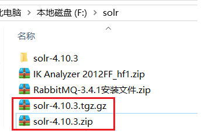
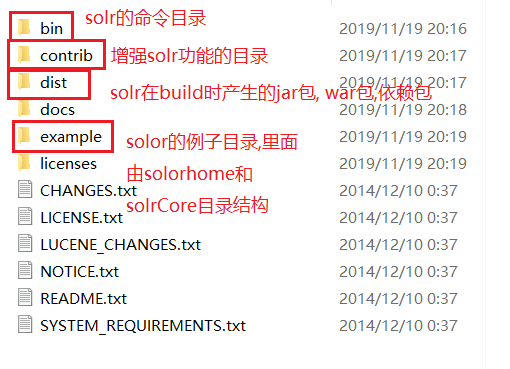
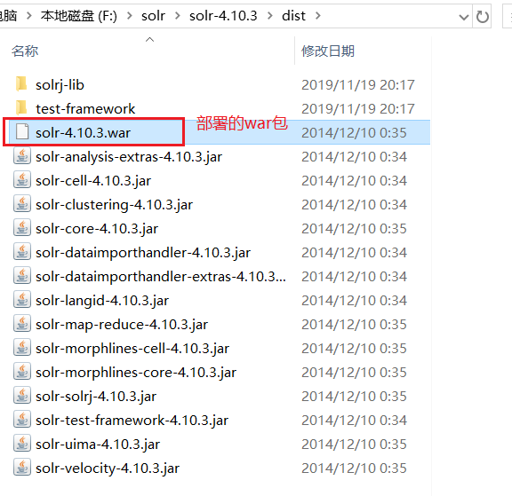
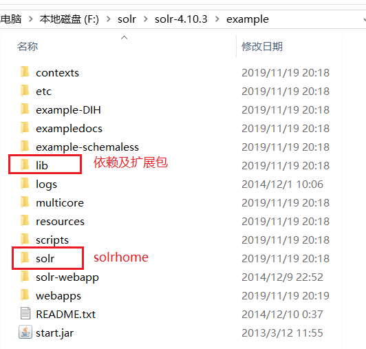
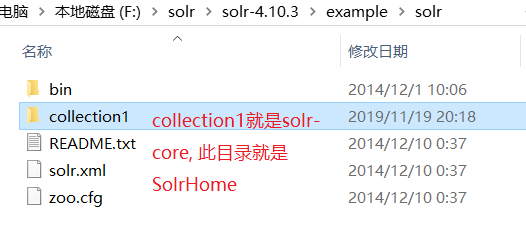
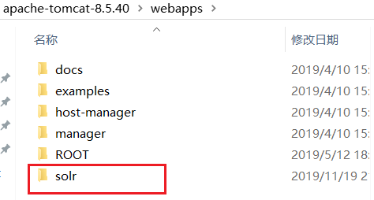
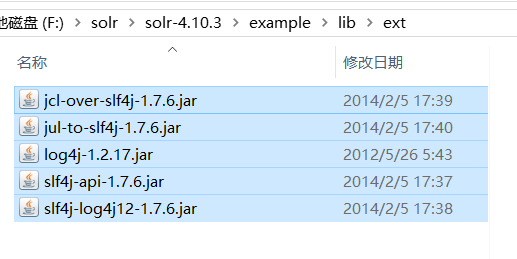
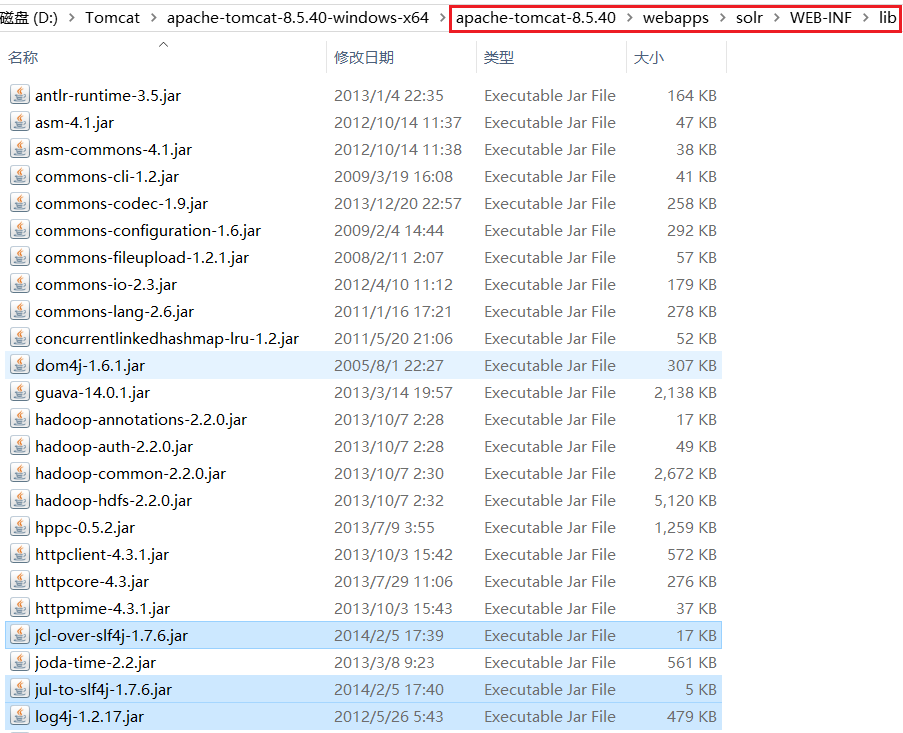
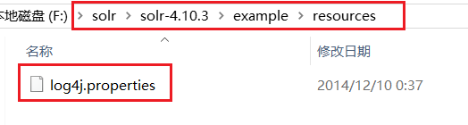
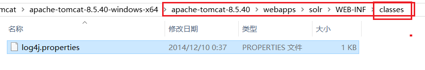

[TOC]

# solr Install

## 1.下载solr发布包

```shell
http://archive.apache.org/dist/lucene/solr/
```

如下:



## 2. 目录解析







SolrCore就是在solrHome目录下的一个目录，用于存放各种各种索引数据。



## 3. 安装部署

1.安装tomcat

2.将solr.war包拷贝到tomcat下的webapp下



3.解压war包，并把原来的删除(不然tomcat启动会解压，然后把配置的好的覆盖)

4.添加solr的扩展包



将上面的扩展包拷贝到下面目录中：



5.添加日志配置文件



把上面的文件拷贝到下面的位置：



6.在web.xml文件中指定solrhome的位置


```xml
    <env-entry>
       <env-entry-name>solr/home</env-entry-name>
       <env-entry-value>F:/solr/solr-4.10.3/example/solr</env-entry-value>
       <env-entry-type>java.lang.String</env-entry-type>
    </env-entry>

```

7.启动tomcat就可以了。

这样安装就完成了。