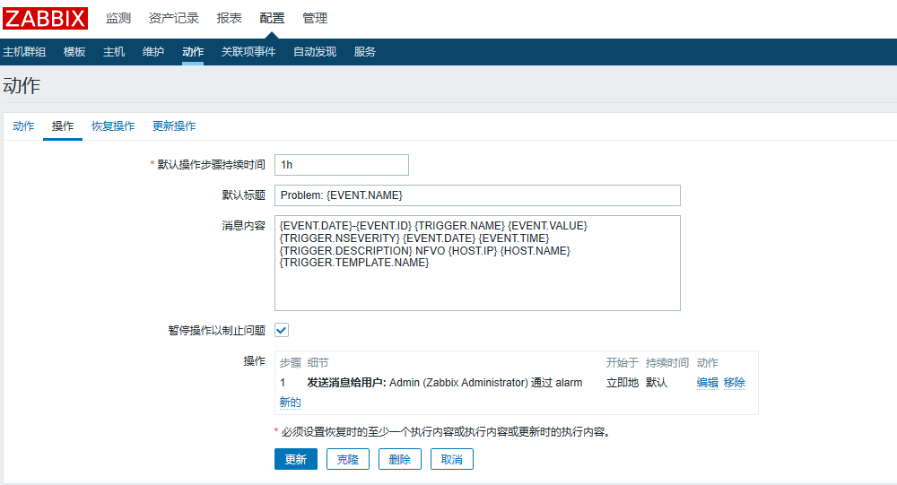
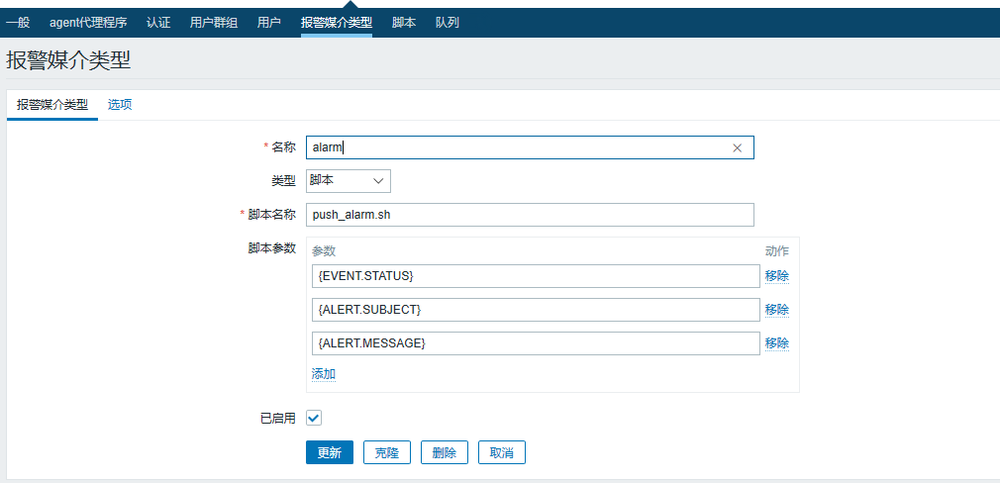
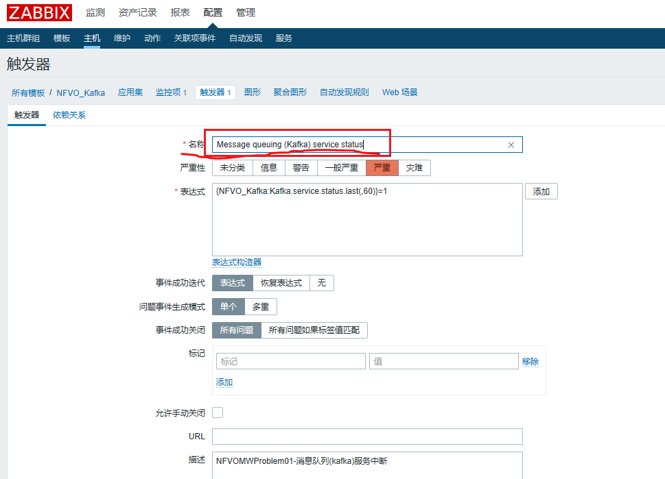

[TOC]

# Trigger名称引起的错误

情景描述:

当zabbix出发告警时，没有按照规定的数据发送告警，现象看起来就是数据格式错位了。

Action的配置：



告警媒介的配置：



trigger出发的配置：



也就是说告警发送脚本时，会传递三个参数，分别是:

```shell
{ALERT.SENDTO} : 告警接收人的邮件
{ALERT.SUBJECT} : trigger的标题
{ALERT.MESSAGE} : 告警的内容
```

告警内容配置如下:

```shell
# 告警格式如下  {ALERT.MESSAGE}
{EVENT.DATE}-{EVENT.ID} {TRIGGER.NAME} {EVENT.VALUE} {TRIGGER.NSEVERITY} {EVENT.DATE} {EVENT.TIME} {TRIGGER.DESCRIPTION} NFWKVO {HOST.IP} {HOST.NAME} {TRIGGER.TEMPLATE.NAME}
# 也就是下面几个宏
{EVENT.DATE}-{EVENT.ID}		时间年月日-事件ID
{TRIGGER.NAME}			触发器名称
{EVENT.VALUE}			事件的值
{TRIGGER.NSEVERITY}		 事件的优先级
{EVENT.DATE}			事件时间  年月日
{EVENT.TIME}		     事件时间  时分秒
{TRIGGER.DESCRIPTION}	  事件的描述
NFWKVO		固定值
{HOST.IP}				事件发生的主机ip
{HOST.NAME}				事件发生的主机名字
{TRIGGER.TEMPLATE.NAME}	 触发器模板的名字

# 正常告警的值
{ALERT.SENDTO}: zabbix@12345.com 
{ALERT.SUBJECT}: Resolved: FSpark进程终止 
{EVENT.DATE}-{EVENT.ID} :2020.07.23-87120 
{TRIGGER.NAME}: 模块Spark进程终止 
{EVENT.VALUE}:0 
{TRIGGER.NSEVERITY}:4 
{EVENT.DATE} :2020.07.23 
{EVENT.TIME} :10:10:06 
{TRIGGER.DESCRIPTION}:APPProblem31-模块Spark进程状态异常 
NFWKVO :NFWKVO 
{HOST.IP} :10.200.10.225 
{HOST.NAME} :DP1 
{TRIGGER.TEMPLATE.NAME}:Spark_template
```

现在发生告警错位的告警的结果如下：

```shell
zabbix@12345.com Resolved: Message queuing (Kafka) service status 2020.07.23-87112 Message queuing (Kafka) service status 0 4 2020.07.23 10:05:19  NFWKVO 10.200.10.225 DP1 Kafka_template
```

看一下处理的脚本:

```shell
#!/bin/bash
# $1 $2 $3
url=http://host:Ip/receiveAlarmInfo
j=0
# 这里主要是把传递进来的 $3,也就是{ALERT.MESSAGE} 中的值读取进来,并设置为变量
# 那问题就是 这里读取$3的值时, 默认是使用空格来读取的
for i in $3
do
 export var$j=$i
(( ++j ))
done
## 此处主要是用于调试  记录一下alarm值
echo "all   is  $@">>/usr/lib/zabbix/alertscripts/test.txt
echo "var0   is  $var0">>/usr/lib/zabbix/alertscripts/test.txt
echo "var1   is  $var1">>/usr/lib/zabbix/alertscripts/test.txt
echo "var2   is  $var2">>/usr/lib/zabbix/alertscripts/test.txt
echo "var3   is  $var3">>/usr/lib/zabbix/alertscripts/test.txt
echo "var4   is  $var4">>/usr/lib/zabbix/alertscripts/test.txt
echo "var5   is  $var5">>/usr/lib/zabbix/alertscripts/test.txt
echo "var6   is  $var6">>/usr/lib/zabbix/alertscripts/test.txt
echo "var7   is  $var7">>/usr/lib/zabbix/alertscripts/test.txt
echo "var8   is  $var8">>/usr/lib/zabbix/alertscripts/test.txt
echo "var9   is  $var9">>/usr/lib/zabbix/alertscripts/test.txt
echo "var10  is  $var10">>/usr/lib/zabbix/alertscripts/test.txt
echo "var11  is  $var11">>/usr/lib/zabbix/alertscripts/test.txt
echo "var12  is  $var12">>/usr/lib/zabbix/alertscripts/test.txt

#curl -H "Content-Type: application/json; charset=UTF-8" -X POST --data '{"alarmId":"'"$var0"'","alarmTitle":"'"$var1"'","alarmStatus":"'"$var2"'","origSeverity":"'"$var3"'","eventDate":"'"$var4"'","eventTime":"'"$var5"'","specificProblem":"'"$var6"'","objectType":"'"$var7"'","subObjectUID":"'"$var8"'","subObjectName":"'"$var9"'","subObjectType":"'"$var10"'"}' "$url" -i

```


出问题就在：

```shell
# 问题在这里
{ALERT.SUBJECT}: Resolved: Message queuing (Kafka) service status

# 那什么出问题呢? 根据上面的脚本,此读取消息时会按照空格分隔来读取消息
# 那上面{ALERT.SUBJECT} 这个消息呢使用空格分隔,导致了脚本在读取消息了没有按照格式读取.
```

总结一下就是在zabbix告警参数定义一定要和shell脚本中配置起来。


