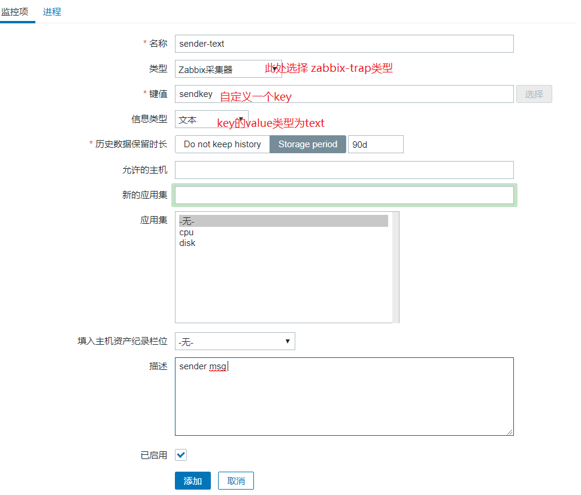
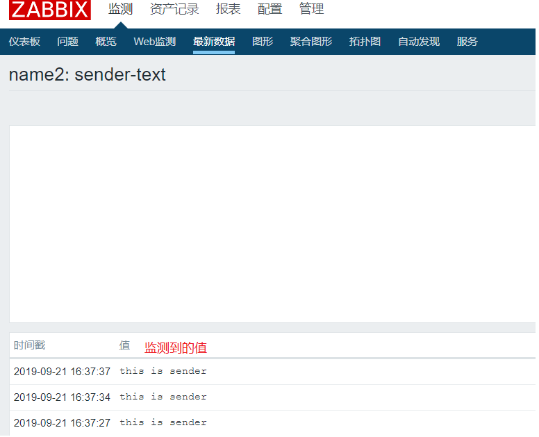

# sender发送数据到server

## 1.创建一个可以接收sender发送数据的key



## 2. 发送数据到server

```shell
# sender 帮助
[root@name2 ~]# zabbix_sender -help
usage:
  zabbix_sender [-v] -z server [-p port] [-I IP-address] -s host -k key
                -o value
  zabbix_sender [-v] -z server [-p port] [-I IP-address] [-s host] [-T] [-r]
                -i input-file
  zabbix_sender [-v] -c config-file [-z server] [-p port] [-I IP-address]
                [-s host] -k key -o value
  zabbix_sender [-v] -c config-file [-z server] [-p port] [-I IP-address]
                [-s host] [-T] [-r] -i input-file
  zabbix_sender [-v] -z server [-p port] [-I IP-address] -s host
                --tls-connect cert --tls-ca-file CA-file
                [--tls-crl-file CRL-file]
                [--tls-server-cert-issuer cert-issuer]
                [--tls-server-cert-subject cert-subject]
                --tls-cert-file cert-file --tls-key-file key-file -k key
                -o value
  zabbix_sender [-v] -z server [-p port] [-I IP-address] [-s host]
                --tls-connect cert --tls-ca-file CA-file
                [--tls-crl-file CRL-file]
                [--tls-server-cert-issuer cert-issuer]
                [--tls-server-cert-subject cert-subject]
                --tls-cert-file cert-file --tls-key-file key-file [-T] [-r]
                -i input-file
  zabbix_sender [-v] -c config-file [-z server] [-p port] [-I IP-address]
                [-s host] --tls-connect cert --tls-ca-file CA-file
                [--tls-crl-file CRL-file]
                [--tls-server-cert-issuer cert-issuer]
                [--tls-server-cert-subject cert-subject]
                --tls-cert-file cert-file --tls-key-file key-file -k key
                -o value
  zabbix_sender [-v] -c config-file [-z server] [-p port] [-I IP-address]
                [-s host] --tls-connect cert --tls-ca-file CA-file
                [--tls-crl-file CRL-file]
                [--tls-server-cert-issuer cert-issuer]
                [--tls-server-cert-subject cert-subject]
                --tls-cert-file cert-file --tls-key-file key-file [-T] [-r]
                -i input-file
  zabbix_sender [-v] -z server [-p port] [-I IP-address] -s host
                --tls-connect psk --tls-psk-identity PSK-identity
                --tls-psk-file PSK-file -k key -o value
  zabbix_sender [-v] -z server [-p port] [-I IP-address] [-s host]
                --tls-connect psk --tls-psk-identity PSK-identity
                --tls-psk-file PSK-file [-T] [-r] -i input-file
  zabbix_sender [-v] -c config-file [-z server] [-p port] [-I IP-address]
                [-s host] --tls-connect psk --tls-psk-identity PSK-identity
                --tls-psk-file PSK-file -k key -o value
  zabbix_sender [-v] -c config-file [-z server] [-p port] [-I IP-address]
                [-s host] --tls-connect psk --tls-psk-identity PSK-identity
                --tls-psk-file PSK-file [-T] [-r] -i input-file
  zabbix_sender -h
  zabbix_sender -V

Utility for sending monitoring data to Zabbix server or proxy.

General options:
  -c --config config-file    Path to Zabbix agentd configuration file

  -z --zabbix-server server  Hostname or IP address of Zabbix server or proxy
                             to send data to. When used together with --config,
                             overrides the first entry of "ServerActive"
                             parameter specified in agentd configuration file

  -p --port port             Specify port number of trapper process of Zabbix
                             server or proxy. When used together with --config,
                             overrides the port of the first entry of
                             "ServerActive" parameter specified in agentd
                             configuration file (default: 10051)

  -I --source-address IP-address   Specify source IP address. When used
                             together with --config, overrides "SourceIP"
                             parameter specified in agentd configuration file

  -s --host host             Specify host name the item belongs to (as
                             registered in Zabbix frontend). Host IP address
                             and DNS name will not work. When used together
                             with --config, overrides "Hostname" parameter
                             specified in agentd configuration file

  -k --key key               Specify item key
  -o --value value           Specify item value

  -i --input-file input-file   Load values from input file. Specify - for
                             standard input. Each line of file contains
                             whitespace delimited: <host> <key> <value>.
                             Specify - in <host> to use hostname from
                             configuration file or --host argument

  -T --with-timestamps       Each line of file contains whitespace delimited:
                             <host> <key> <timestamp> <value>. This can be used
                             with --input-file option. Timestamp should be
                             specified in Unix timestamp format

  -r --real-time             Send metrics one by one as soon as they are
                             received. This can be used when reading from
                             standard input

  -v --verbose               Verbose mode, -vv for more details

  -h --help                  Display this help message
  -V --version               Display version number

TLS connection options:
  --tls-connect value        How to connect to server or proxy. Values:
                               unencrypted - connect without encryption
                                             (default)
                               psk         - connect using TLS and a pre-shared
                                             key
                               cert        - connect using TLS and a
                                             certificate

  --tls-ca-file CA-file      Full pathname of a file containing the top-level
                             CA(s) certificates for peer certificate
                             verification

  --tls-crl-file CRL-file    Full pathname of a file containing revoked
                             certificates

  --tls-server-cert-issuer cert-issuer   Allowed server certificate issuer

  --tls-server-cert-subject cert-subject   Allowed server certificate subject

  --tls-cert-file cert-file  Full pathname of a file containing the certificate
                             or certificate chain

  --tls-key-file key-file    Full pathname of a file containing the private key

  --tls-psk-identity PSK-identity   Unique, case sensitive string used to
                             identify the pre-shared key

  --tls-psk-file PSK-file    Full pathname of a file containing the pre-shared
                             key

Example(s):
  zabbix_sender -z 127.0.0.1 -s "Linux DB3" -k db.connections -o 43

  zabbix_sender -z 127.0.0.1 -s "Linux DB3" -k db.connections -o 43 \
    --tls-connect cert --tls-ca-file /home/zabbix/zabbix_ca_file \
    --tls-server-cert-issuer \
    "CN=Signing CA,OU=IT operations,O=Example Corp,DC=example,DC=com" \
    --tls-server-cert-subject \
    "CN=Zabbix proxy,OU=IT operations,O=Example Corp,DC=example,DC=com" \
    --tls-cert-file /home/zabbix/zabbix_agentd.crt \
    --tls-key-file /home/zabbix/zabbix_agentd.key

  zabbix_sender -z 127.0.0.1 -s "Linux DB3" -k db.connections -o 43 \
    --tls-connect psk --tls-psk-identity "PSK ID Zabbix agentd" \
    --tls-psk-file /home/zabbix/zabbix_agentd.psk
```

```shell
# 此处的-s指定的是agent的名字，此处的name2和agent前置指定的hostname以及和agent.conf中的配置的
# HostName是一样的. -z指定的是server的ip，-p指定的是server的端口， -k要发送的key，-o要发送
# 的值
[root@name2 ~]# zabbix_sender -v  -z 192.168.30.15 -p 10051 -s name2 -k sendkey -o "this is sender"
info from server: "processed: 1; failed: 0; total: 1; seconds spent: 0.000027"
sent: 1; skipped: 0; total: 1
```


## 3. 查看数据



