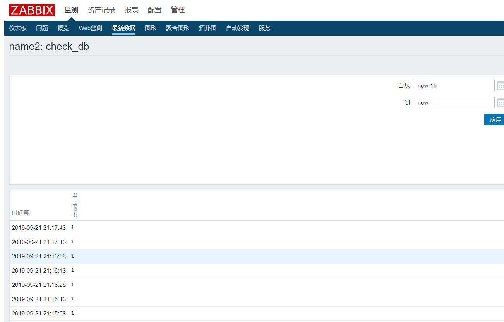

# 演示用户自定义item

参考文档:

```shell
# 官方文档
https://www.zabbix.com/documentation/4.0/zh/manual/config/items/userparameters
```

## 1. 修改agent配置文件，添加自定义key

```shell
### Option: UserParameter
#       User-defined parameter to monitor. There can be several user-defined parameters.
#       Format: UserParameter=<key>,<shell command>
#       See 'zabbix_agentd' directory for examples.
#
## 此处定义的key为check.DB[*],并且可以接收参数
UserParameter=check.DB[*],mysqladmin -u$1 -h 192.168.30.15 -p$2 ping | grep -c  alive
```


## 2. 在前台页面添加自定义key


有了此监控项，那么就可以添加响应的触发器，动作等，这样整个告警就串联起来了。

## 3. 查看key



可以看到数据已经上报上来了。