# 配置告警媒介，触发器，动作

大家都了解zabbix是作为监控软件的，那么如果出现了异常，当然得需要通知对应的人员了。那么怎么做呢？那就是本篇要说的告警媒介，触发器以及动作的作用了。

简单理解，**告警媒介**就是通过什么方式来告知对应的人员，**触发器**定义了具体什么情况下算出错了，也就是定义一些阈值，**动作**就是如果条件符合了触发器定义的条件，要做的工作，如:调用具体的脚本啊，发邮件等。

本篇就定义一套告警到脚本执行的流程。

## 1. 定义告警媒介

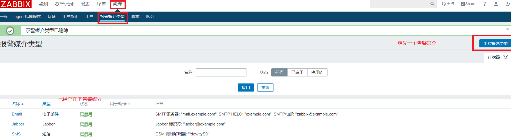

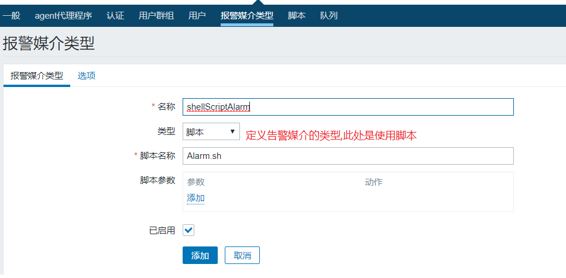

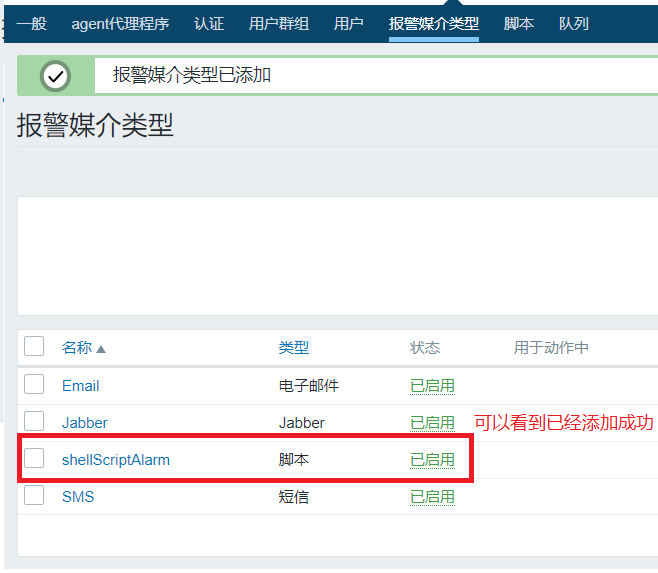

看一下脚本内容：

```shell
# 可以看到就是往/tmp/test.txt 文件中追截内容
#!/bin/bash
echo `data +'%Y%m%d %H%M%S'` >> /tmp/test.txt
echo "alarm generate" >> /tmp/test.txt
```


## 2. 给用户分配告警媒介

定义好了告警媒介，需要把告警媒介分配给用户，不然用户也无法使用。

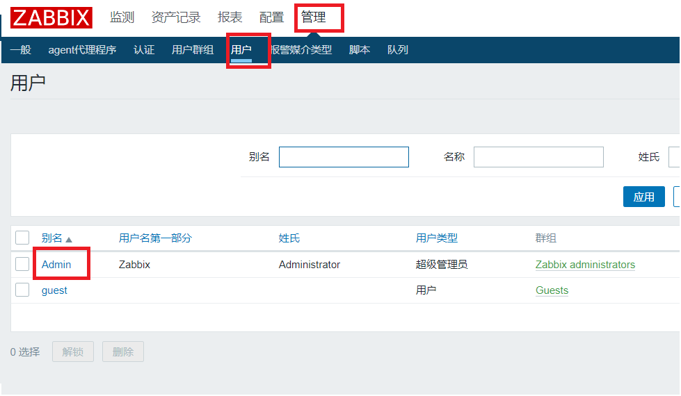

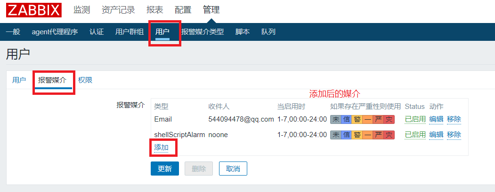

## 3. 定义触发器

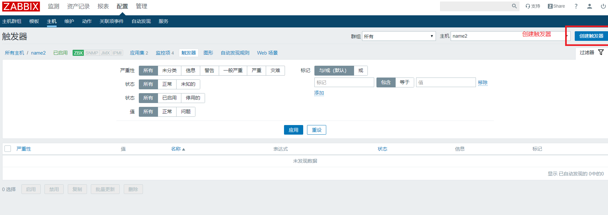

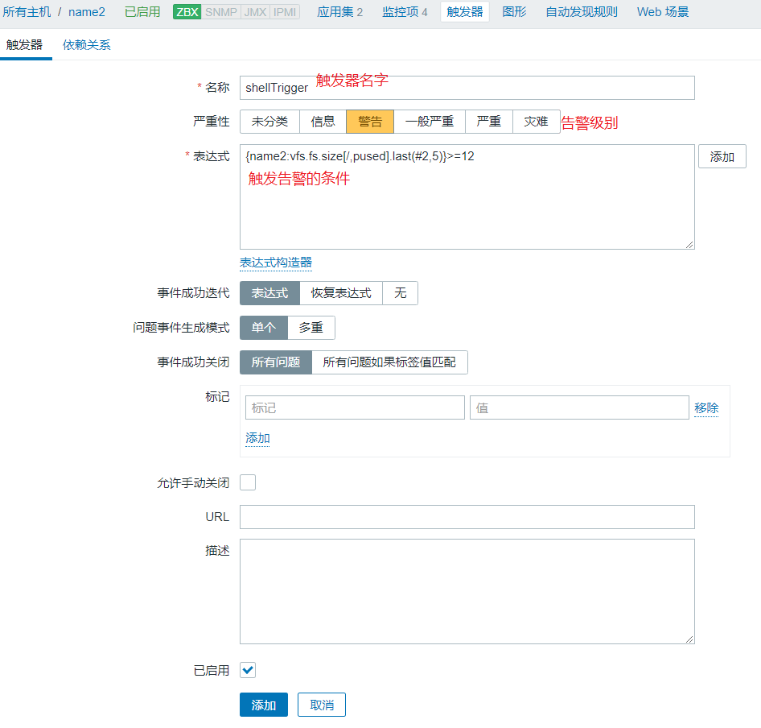

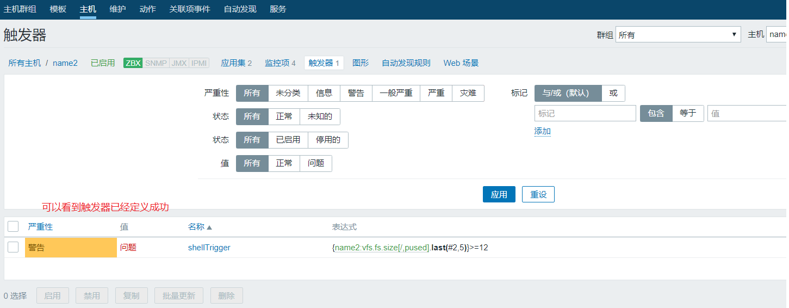

## 4. 定义动作

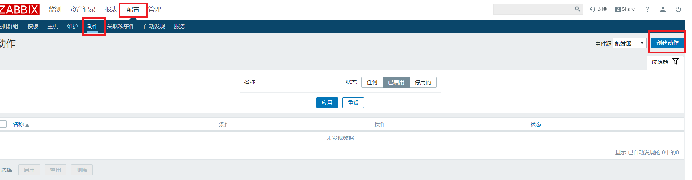

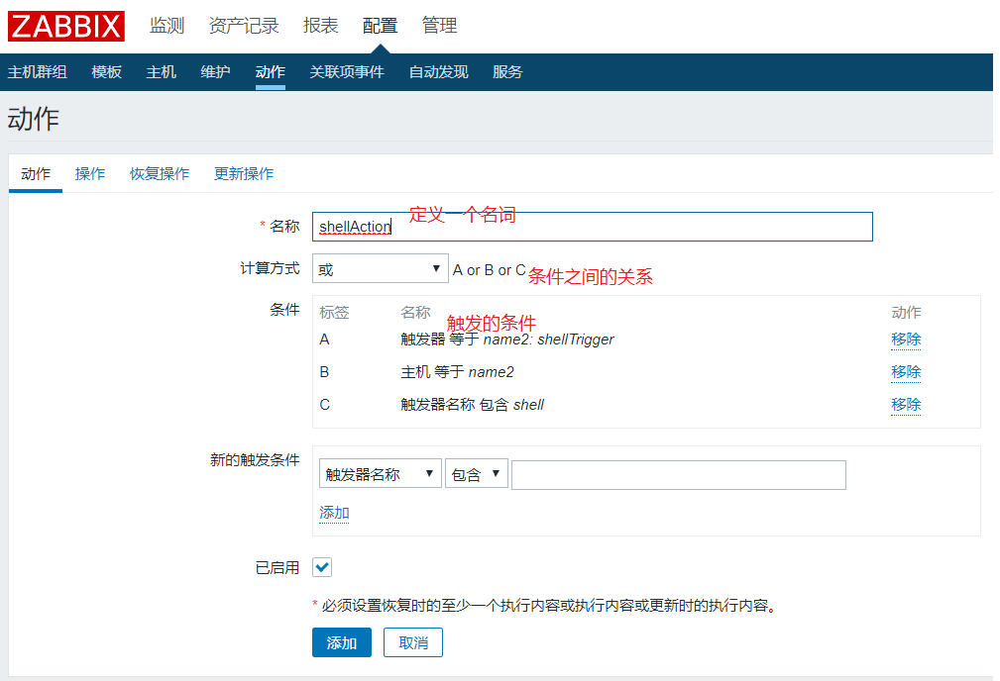

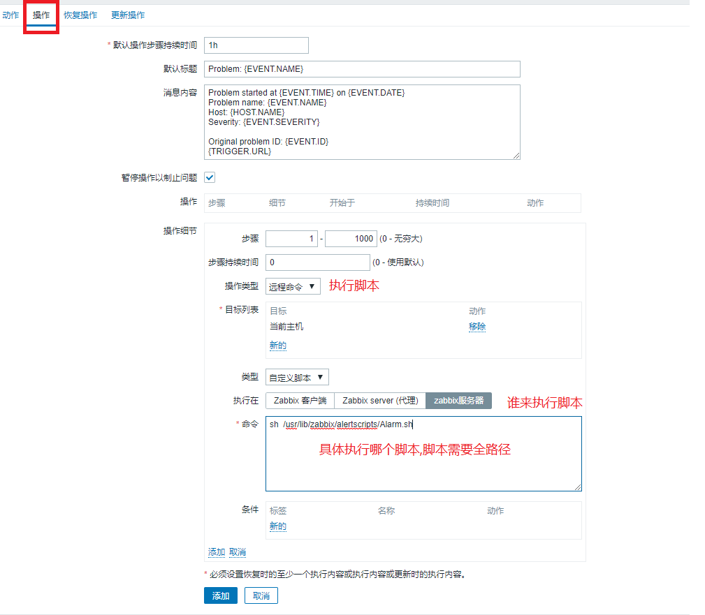

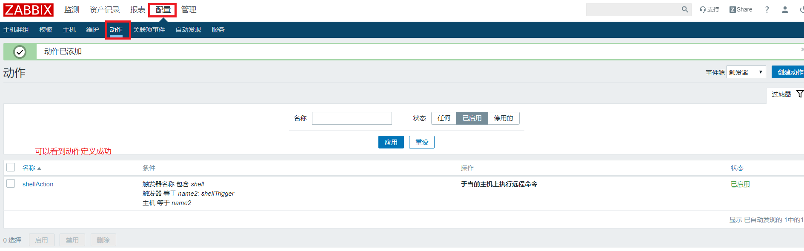

现在咱们触发器的阈值，调的低一点，就会触发响应的告警，并执行脚本。


看一下告警脚本生成的文件:


哦啦,整个流程就完成了。


## 5. 设置一个带参数的脚本

```shell
#!/bin/bash
echo `date +'%Y%m%d %H%M%S'` >> /tmp/test.txt
echo "alarm generate" >> /tmp/test.txt
# 打印所有参数
echo $@ >> /tmp/test.txt
```

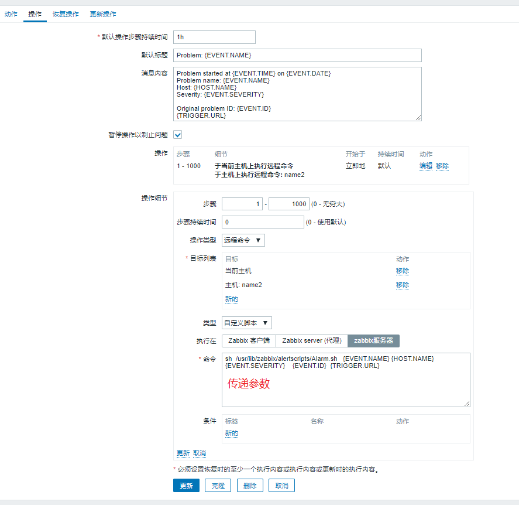

脚本触发:

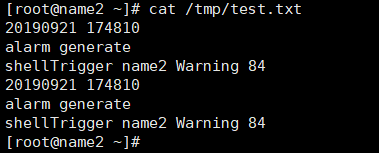

