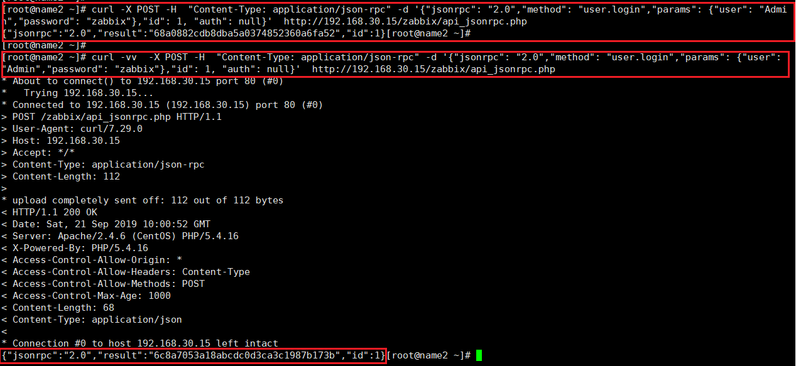
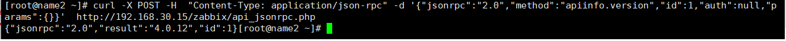

# 命令行访问API

此处给出几个实例，其他更丰富的操作参考官网.

## 1. login

```shell
curl -X POST -H  "Content-Type: application/json-rpc" -d '{"jsonrpc": "2.0","method": "user.login","params": {"user": "Admin","password": "zabbix"},"id": 1, "auth": null}'  http://192.168.30.15/zabbix/api_jsonrpc.php

```



## 2. 访问API-Version

```shell
curl -X POST -H  "Content-Type: application/json-rpc" -d '{"jsonrpc":"2.0","method":"apiinfo.version","id":1,"auth":null,"params":{}}'  http://192.168.30.15/zabbix/api_jsonrpc.php
```

