[TOC]

#  模板的创建及使用

zabbix自带很多监控项，当然了也可以自定义监控项。现实使用中，根据监控机器或业务机器的不同，监控项往往有一些是一样的，那么就可以把这些相同的监控项提取出来，作为一个模板，然后应用到要监控的机器上。 好处：修改配置项时，可以统一快速修改。

## 模板的创建

### 1. 模板的创建

1. 进入到配置 -->  模板   页面

   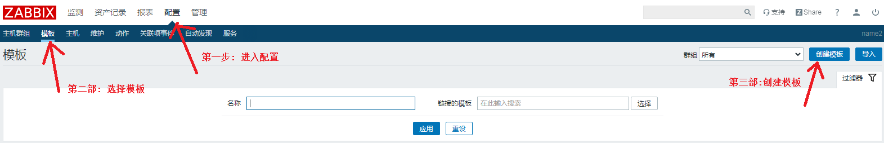

2. 点击右上角的  "创建模板"  按钮

   模板的创建

   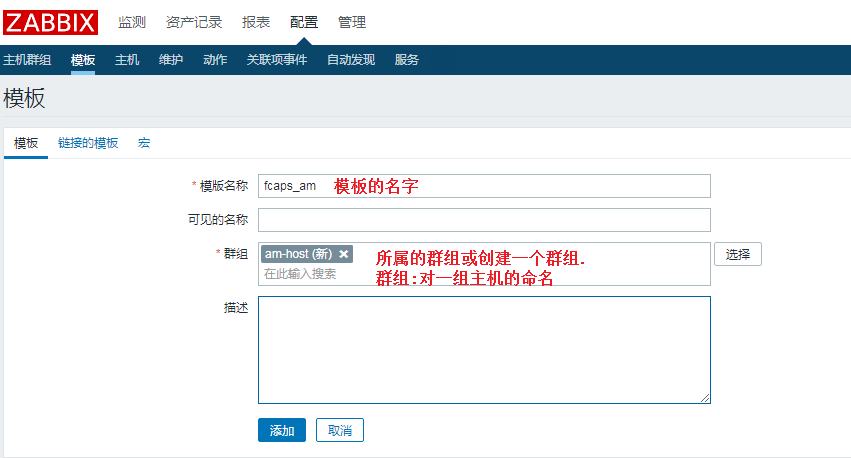

   

   还可以连接其他模板，这样其他模板的监控项就被继承下来

   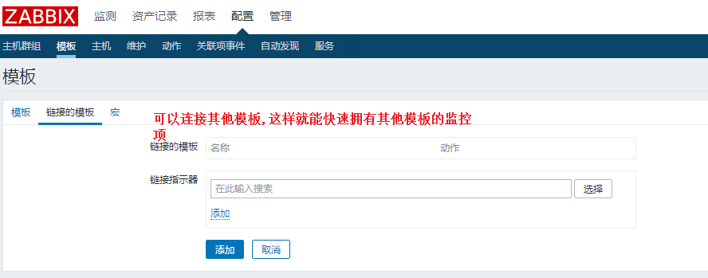

定义宏：

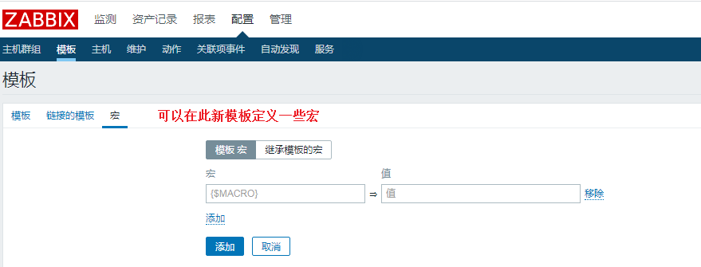

3. 当然了模板也可以导入

模板添加成功

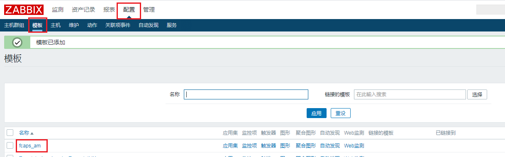

### 2. 模板的监控项配置

模板添加好之后，就可以配置此模板的监控项

主要步骤：配置 -->  模板 --> 点击要配置的模板的监控项 --> 右上角有创建监控项按钮   

之后就可以进行创建操作

​	1,  配置 --> 模板

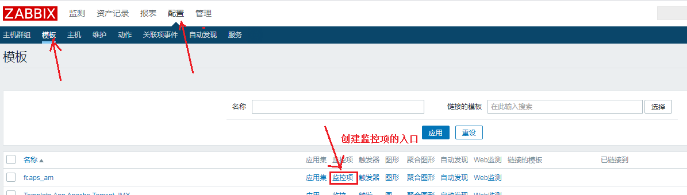

​	2, 进入监控项创建页面

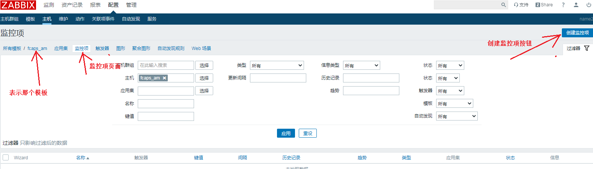

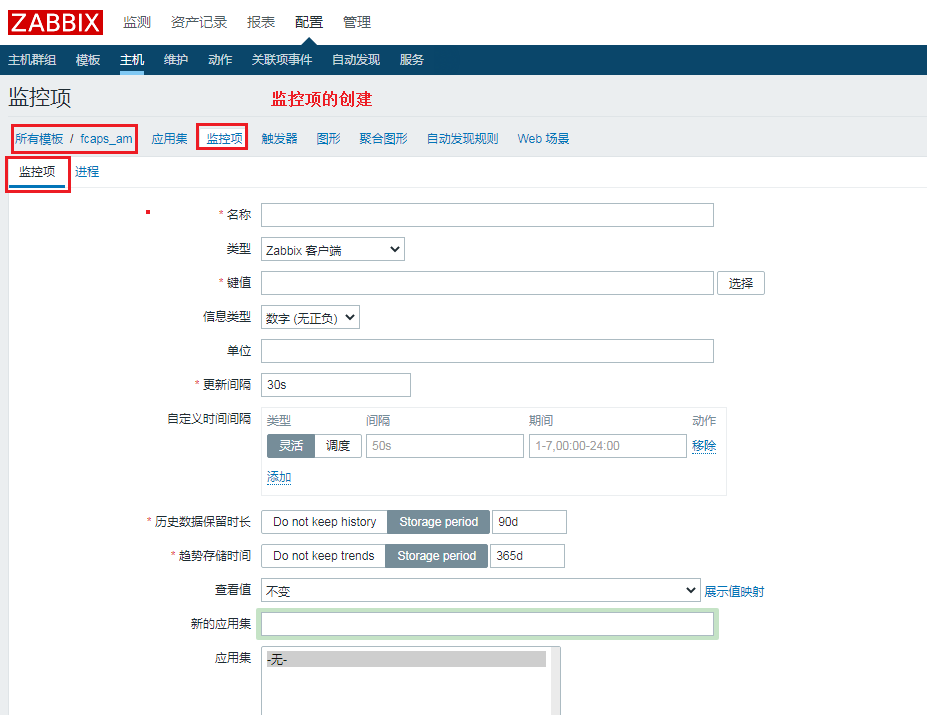

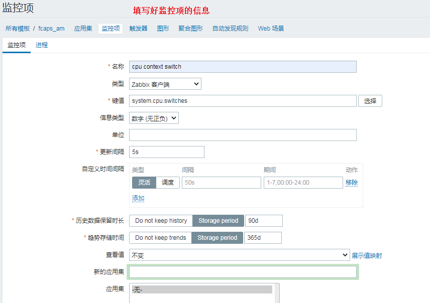

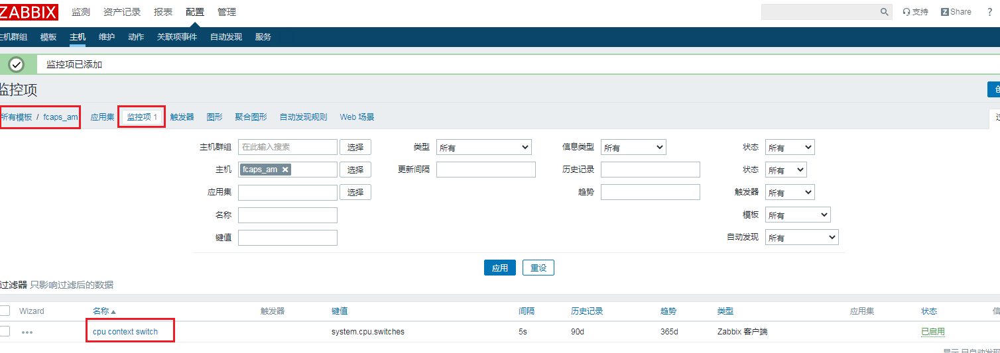

### 3.模板的触发器配置

模板对应的监控项创建好之后， 创建此监控项对应的触发器。

当然了此触发器有多个入口：

入口一： 配置 --> 模板 --> 要修改模板的触发器 链接 --> 右上角有添加触发器  按钮

入口二：在查看模板对应的监控项的页面，点击触发器链接，进入触发器页面，右上角有创建触发器按钮

入口三：配置 --> 模板 --> 要修改模板的触发器链接 --> 进入触发器页面 --> 右上角有创建触发器按钮

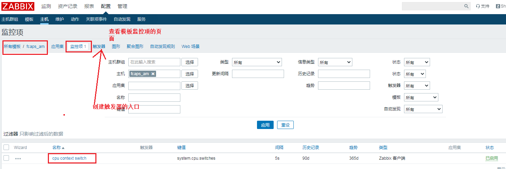

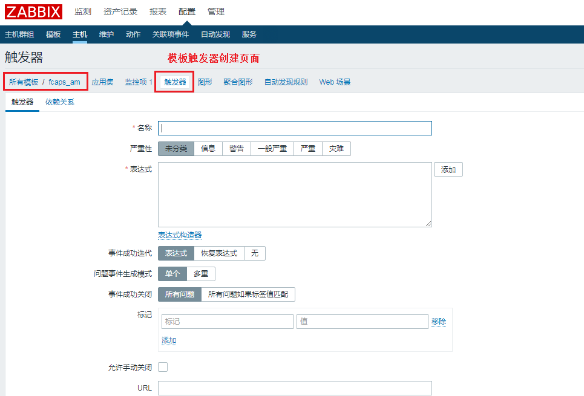

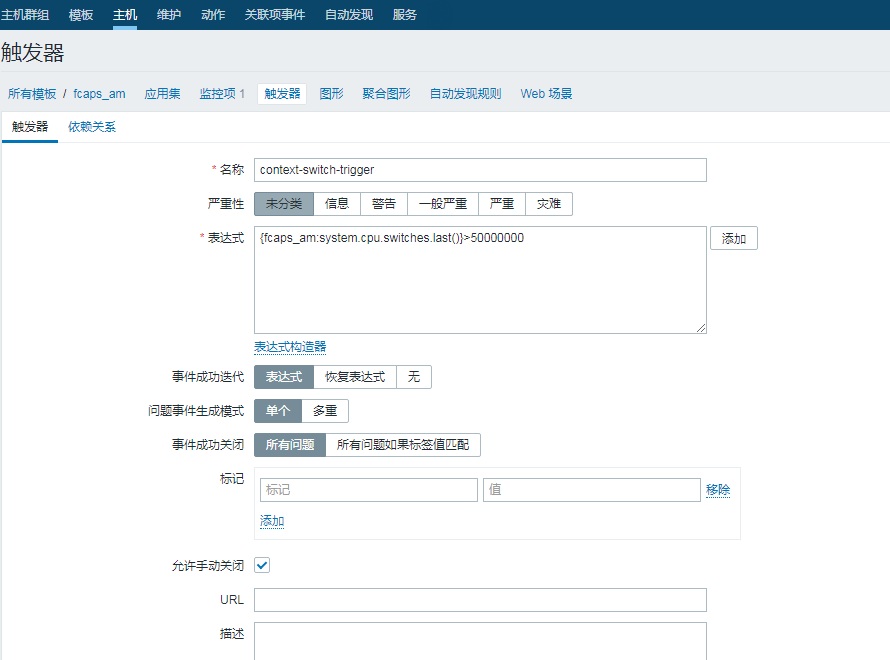

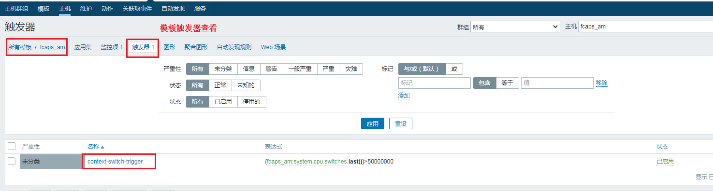

## 模板的应用

那模板创建好了，模板的监控项以及触发器也创建完成了，怎么应用到主机呢?

主要步骤: 配置 --> 主机 --> 点击要配置的主机名  --> 最上面有一个模板链接 --> 给此主机设置连接的模板

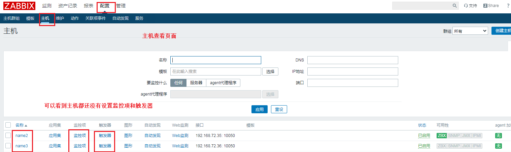

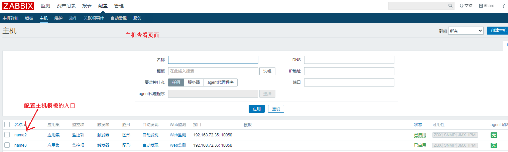

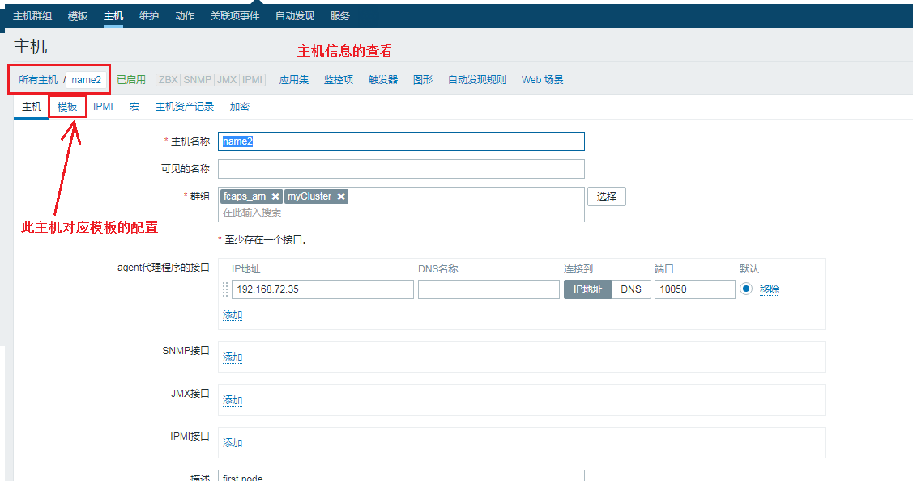

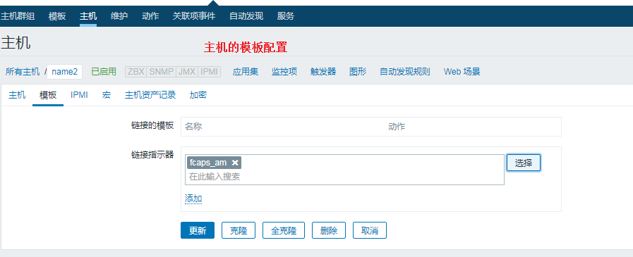

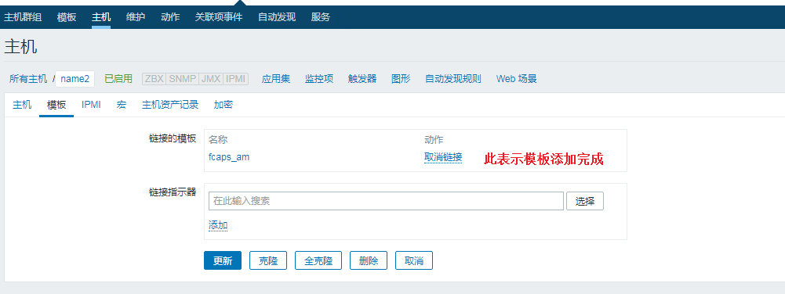

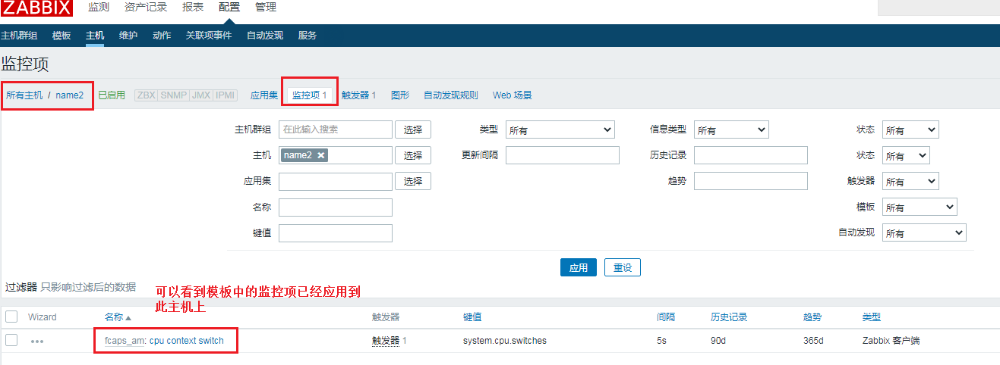