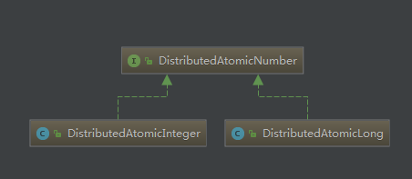

# zk分布式计数器 DistributedAtomicInteger


好的框架真的是值得学习的，从中包名就可以看到提供的各个功能模块。

本篇咱们分析一下分布式计数器的使用及其原理，咱们看一下其diagram图：



本篇讲解DistributeAtomicInteger的使用，先看一个具体的使用demo把：

```java
public class DistributedIntegerDemo {
    private static final String CONNECT_ADDR = "192.168.72.15:2181";
    private static final int SESSION_TIMEOUT = 50000;

    public static void main(String[] args) {
        //重试策略
        RetryPolicy policy = new ExponentialBackoffRetry(1000,10);
        CuratorFramework curator = CuratorFrameworkFactory.builder().connectString(CONNECT_ADDR)
            .sessionTimeoutMs(SESSION_TIMEOUT).retryPolicy(policy).build();
        curator.start();
        // promotedToLock 对分布式计数器添加了分布式锁
  // 分布式计数器默认是不使用分布式锁操作的，这里添加一个分布式锁;具体的使用,下面会讲解到
        PromotedToLock promotedToLock = PromotedToLock.builder().lockPath("/atomic/lock").retryPolicy(new RetryNTimes(3, 1000)).timeout(10, TimeUnit.SECONDS).build();
        // 分布式计数器初始化
        DistributedAtomicInteger distributedAtomicInteger = new DistributedAtomicInteger(curator, "/super",
 new RetryNTimes(3, 1000),promotedToLock);
        try {
            // 增加1
            AtomicValue<Integer> value = distributedAtomicInteger.add(1);
            System.out.println(value.succeeded());
            System.out.println(value.preValue());
            System.out.println(value.postValue());
        } catch (Exception e) {
            e.printStackTrace();
        }finally {
            curator.close();
        }
    }
}
```

那咱们就从add增加函数开始入手把:

```java
public AtomicValue<Integer> add(Integer delta) throws Exception
    {
        return worker(delta);
    }


    private AtomicValue<Integer>   worker(final Integer addAmount) throws Exception
    {
        Preconditions.checkNotNull(addAmount, "addAmount cannot be null");
        MakeValue   makeValue = new MakeValue()	// 回调函数，最终用于对值的设置
        {
            @Override
            public byte[] makeFrom(byte[] previous)
            {
              int  previousValue = (previous != null) ? bytesToValue(previous) : 0;
              int  newValue = previousValue + addAmount;
                return valueToBytes(newValue);
            }
        };
		// 进行值的添加
        AtomicValue<byte[]>     result = value.trySet(makeValue);
        return new AtomicInteger(result);
    }
```

```java
    AtomicValue<byte[]>   trySet(MakeValue makeValue) throws Exception
    {
 MutableAtomicValue<byte[]>  result = new MutableAtomicValue<byte[]>(null, null, false);
 		// 先不加锁，进行尝试
        tryOptimistic(result, makeValue);
        // 如果设置没有成功，而且设置了分布式锁，则再次进行尝试
        if ( !result.succeeded() && (mutex != null) )
        {
        // 使用分布式锁再次进行尝试
            tryWithMutex(result, makeValue);
        }

        return result;
    }
```

看一下不加锁进行修改的方法:

```java
    private void tryOptimistic(MutableAtomicValue<byte[]> result, MakeValue makeValue) throws Exception
    {
        long            startMs = System.currentTimeMillis();
        int             retryCount = 0;
        boolean         done = false;
        while ( !done )
        {
        // result.stats是一些统计值
        // 此处是增加 不加锁的尝试次数
            result.stats.incrementOptimisticTries();
            if ( tryOnce(result, makeValue) )
            {
                result.succeeded = true;
                done = true;
            }
            else
            { // 如果没有成呢，则进行重试。  此处的重试策略的实现，可以借鉴！！！！！
                if ( !retryPolicy.allowRetry(retryCount++, System.currentTimeMillis() - startMs, RetryLoop.getDefaultRetrySleeper()) )
                {
                    done = true;
                }
            }
        }
		// 不加锁尝试的 时间值的统计更新
        result.stats.setOptimisticTimeMs(System.currentTimeMillis() - startMs);
    }
```

尝试增加值的操作:

```java
    private boolean tryOnce(MutableAtomicValue<byte[]> result, MakeValue makeValue) throws Exception
    {
        Stat        stat = new Stat();
        // 获取当前值
        boolean     createIt = getCurrentValue(result, stat);
        boolean     success = false;
        try
        {	// 还记得上面的哪个回调函数吗,就是在此处进行了调用
            byte[]  newValue = makeValue.makeFrom(result.preValue);
            if ( createIt )
            {
            // 更新值
         client.create().creatingParentContainersIfNeeded().forPath(path, newValue);
            }
            else
            {
        client.setData().withVersion(stat.getVersion()).forPath(path, newValue);
            }
            // 获取新增后值
            result.postValue = Arrays.copyOf(newValue, newValue.length);
            success = true;
        }
        catch ( KeeperException.NodeExistsException e )
        {
            // do Retry
        }
        catch ( KeeperException.BadVersionException e )
        {
            // do Retry
        }
        catch ( KeeperException.NoNodeException e )
        {
            // do Retry
        }

        return success;
    }
```

获取值的操作:

```java
    private boolean getCurrentValue(MutableAtomicValue<byte[]> result, Stat stat) throws Exception
    {
        boolean             createIt = false;
        try
        {  // 读取一个node的值并存储到stat中
            result.preValue = client.getData().storingStatIn(stat).forPath(path);
        }
        catch ( KeeperException.NoNodeException e )
        {
            result.preValue = null;
            createIt = true;
        }
        return createIt;
    }
```

如果刚才的更新操作成功了，那么此次操作也就结束了。如果不成功，而且配置了分布式锁，那么会使用分布式锁再次进行尝试。

下面咱们看一下具体的使用分布式锁更新的操作:

```java
private void tryWithMutex(MutableAtomicValue<byte[]> result, MakeValue makeValue) throws Exception
     {
         long            startMs = System.currentTimeMillis();
         int             retryCount = 0;
         // 获取分布式锁，并获取最长占用锁的时间
         if ( mutex.acquire(promotedToLock.getMaxLockTime(), promotedToLock.getMaxLockTimeUnit()) )
         {
             try
             {
                 boolean         done = false;
                 while ( !done )
                 {	// 统计值的增加，晋升分布式锁的尝试次数
                     result.stats.incrementPromotedTries();
                     // 仍然是使用 tryOnce进行增加操作,只不过是在此之前增加了获取分布式锁
                     if ( tryOnce(result, makeValue) )
                     {
                         result.succeeded = true;
                         done = true;
                     }
                     else
                     { // 如果没有成功呢,则进行重试操作
                         if ( !promotedToLock.getRetryPolicy().allowRetry(retryCount++, System.currentTimeMillis() - startMs, RetryLoop.getDefaultRetrySleeper()) )
                         {
                             done = true;
                         }
                     }
                 }
             }
             finally
             {	// 释放锁
                 mutex.release();
             }
         }
         // 晋升锁操作的 统计时间增加
         result.stats.setPromotedTimeMs(System.currentTimeMillis() - startMs);
    }
    

// 注意上面的finally的使用,finally前面的使用的是 {} 花括号括起来的一个代码块，在之后加上finally代码块。 值得借鉴使用
```

好的，分布式计数器就分析到这里，总体还是比较通俗易懂的。值得借鉴：

1. 重试方式的使用
2. finally代码块的使用