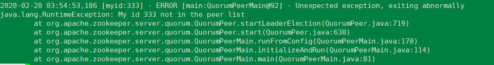
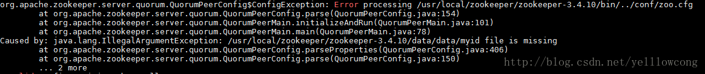
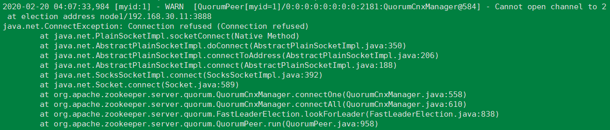
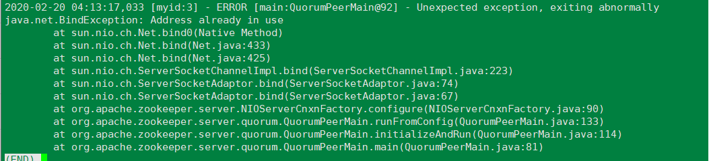

[TOC]

# zookeeper 运维常见问题

## 1. myid配置和zoo.cfg中配置的不一致

输出日志可能如下:



解决方法:

把myid中的值和下面配置中server后的数字对应上.

```shell
server.1=name1:2888:3888
server.2=node1:2888:3888
server.3=node2:2888:3888
```

## 2.myid文件没有配置



可能是myid文件配置的路径不对，也可能是myid文件没有配置。

解决：

1. 如果是创建的路径不对，则需要根据zoo.cfg配置文件中的dataDir项目配置的路径，重新创建myid文件
2. 如果没有创建myid文件，则需要在zoo.cfg配置的dataDir配置的目录下创建myid

## 3.连接拒绝

错误日志:



导致此的原因可能由以下集中：

1. 位于192.168.30.11机器上的服务没有启动
2. 192.168.30.11机上的3888端口可能没有开放
3. 192.168.30.11机器上的服务意外退出

## 4. 端口占用



解决：端口被占用，需要修改端口重新启动服务。

## 5.同步问题

follower错误日志：

```shell
2016-05-15 04:04:40,569 [myid:1] - WARN  [SyncThread:1:FileTxnLog@334] - fsync-ing the write ahead log in SyncThread:1 took 2243ms which will adversely effect operation latency. See the ZooKeeper troubleshooting guide
2016-05-14 15:32:50,764 [myid:1] - WARN  [QuorumPeer[myid=1]/0:0:0:0:0:0:0:0:2181:Follower@89] - Exception when following the leader java.io.EOFException
        at java.io.DataInputStream.readInt(DataInputStream.java:375)
        at org.apache.jute.BinaryInputArchive.readInt(BinaryInputArchive.java:63)
        at org.apache.zookeeper.server.quorum.QuorumPacket.deserialize(QuorumPacket.java:83)
        at org.apache.jute.BinaryInputArchive.readRecord(BinaryInputArchive.java:103)
        at org.apache.zookeeper.server.quorum.Learner.readPacket(Learner.java:153)
        at org.apache.zookeeper.server.quorum.Follower.followLeader(Follower.java:85)
        at org.apache.zookeeper.server.quorum.QuorumPeer.run(QuorumPeer.java:786)
2016-05-14 15:32:50,764 [myid:1] - INFO  [QuorumPeer[myid=1]/0:0:0:0:0:0:0:0:2181:Follower@166] - shutdown called
java.lang.Exception: shutdown Follower
        at org.apache.zookeeper.server.quorum.Follower.shutdown(Follower.java:166)
        at org.apache.zookeeper.server.quorum.QuorumPeer.run(QuorumPeer.java:790)
```


leader错误日志:

```shell
2016-05-14 15:32:42,605 [myid:3] - WARN  [SyncThread:3:FileTxnLog@334] - fsync-i
ng the write ahead log in SyncThread:3 took 3041ms which will adversely effect o
peration latency. See the ZooKeeper troubleshooting guide
2016-05-14 15:32:50,764 [myid:3] - WARN  [QuorumPeer[myid=3]/0:0:0:0:0:0:0:0:218
1:LearnerHandler@687] - Closing connection to peer due to transaction timeout.
2016-05-14 15:32:50,764 [myid:3] - WARN  [LearnerHandler-/10.110.20.23:39390:Lea
rnerHandler@646] - ******* GOODBYE /10.110.20.23:39390 ********
2016-05-14 15:32:50,764 [myid:3] - WARN  [LearnerHandler-/10.110.20.23:39390:Lea
rnerHandler@658] - Ignoring unexpected exception
java.lang.InterruptedException
        at java.util.concurrent.locks.AbstractQueuedSynchronizer.acquireInterrup
tibly(AbstractQueuedSynchronizer.java:1199)
        at java.util.concurrent.locks.ReentrantLock.lockInterruptibly(ReentrantL
ock.java:312)
        at java.util.concurrent.LinkedBlockingQueue.put(LinkedBlockingQueue.java
:294)
        at org.apache.zookeeper.server.quorum.LearnerHandler.shutdown(LearnerHan
dler.java:656)
        at org.apache.zookeeper.server.quorum.LearnerHandler.run(LearnerHandler.
java:649)
```

原因分析：

FOLLOWER在跟LEADER同步时， fsync操作时间过长，导致超时。

解决：

方法一： 增加 tickTime 

方法二：增加 initLimit 和 syncLimit的值

方法三：tickTime  initLimit  syncLimit的值都增加。