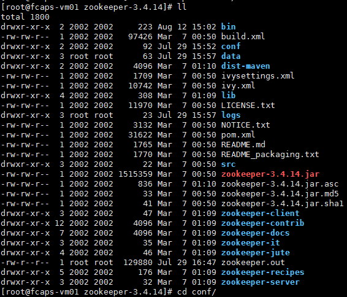
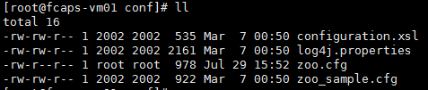
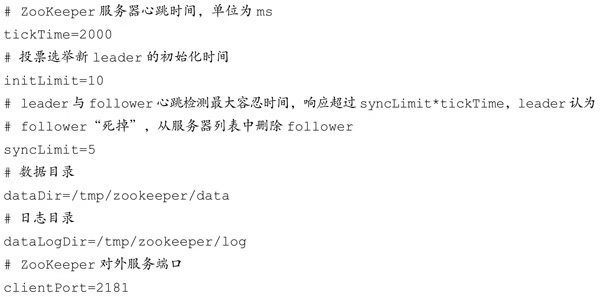
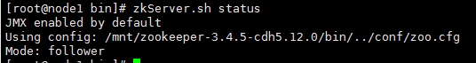
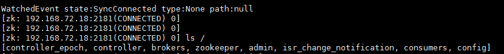

[TOC]

# zookeeper集群模式安装

## 1.环境准备

zookeeper安装前需要先进行JDK的安装，并配置好JDK的环境变量。集群机器设置好**免密登录**。

下载zookeeper的安装包，并进行解压。

```shell
tar -zxvf zookeeper-3.4.14.tar.gz
```

解压后目录类似这样：



## 2.配置文件配置

解压好之后，下面进行参数的配置。配置文件在conf目录下。

进入conf目录可以看到一个zoo_sample.cfg的文件，此文件是一个配置的样例文件，安装时可以在此文件基础上进行修改。首先把zoo_sample.cfg文件复制一份，名为zoo.cfg(zookeeper使用的配置文件)，再对zoo.cfg文件进行修改。

```shell
# 复制一份
cp zoo_sample.cfg zoo.cfg
```



第一步：修改配置文件

配置文件修改：(此处配置为zookeeper集群模式下的配置)

```shell
tickTime=2000
initLimit=10
syncLimit=5
# 此处是zookeeper的安装目录,安装时根据实际情况进行修改
dataDir=/opt/software/zookeeper-3.4.14/data
clientPort=2181
# zookeeper其他机器的ip,其他两个端口分别是同步以及选举端口
# 这里的1,2,3分别对应dataDir目录下myid文件中的值
server.1=192.168.88.122:2888:3888
server.2=192.168.88.123:2888:3888
server.3=192.168.88.124:2888:3888

```



第二步：创建myid

在配置文件中dataDir目录下，创建一个myid文件，并写上一个数字(要和配置文件中配置的一致)，**注意**此文件中不能有空格之类的无用字符，只有一个数字就可以。

```shell
echo 1 > ${dataDir}/myid
```

第三步：安装包分发

把此处修改好的安装包分发到要安装的机器上，**注意**分发完后，要修改其他机器上的myid的值。

## ３.启动并测试

配置完成后，下面进行服务的启动，以及测试操作。

```shell
# 服务启动
zkServer.sh start

# 服务状态查看
zkServer.sh status

# 测试,ip:port 根据实际情况连接
zkCli.sh -server 192.168.88.122:2181
```

状态查看：



此处状态一般为follower ，leader，observer。

连接测试：



此时服务就安装完成了，可以提供服务了。