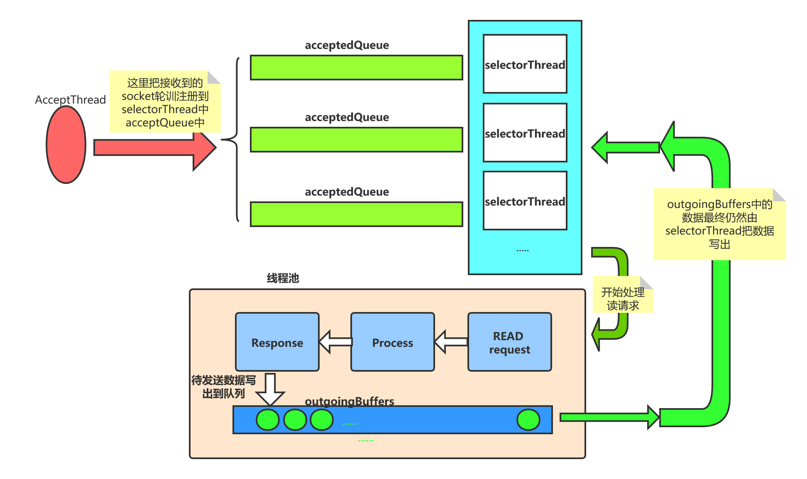

[TOC]

# zk Server Nio模型分析

本篇咱们来看一下zk server端的nio实现，了解其是如何接收到客户端请求，以及接收到请求后如何进行处理。

注意启动的分析主要是把握整体流程，其中贴出来的源码会酌情进行删减，不过不影响总体的流程。(有兴趣可以私下看一下)

分析方式:

1. 从脚本获取到启动的主函数
2. 然后从主函数入口分析NIO的创建
3. 查看NIO启动
4. 分析对应的请求 以及 请求处理

## 1. 获取主函数

```shell
# 对应的主函数
ZOOMAIN="org.apache.zookeeper.server.quorum.QuorumPeerMain"
# 主函数的启动
nohup "$JAVA" $ZOO_DATADIR_AUTOCREATE "-Dzookeeper.log.dir=${ZOO_LOG_DIR}" \
    "-Dzookeeper.log.file=${ZOO_LOG_FILE}" "-Dzookeeper.root.logger=${ZOO_LOG4J_PROP}" \
    -XX:+HeapDumpOnOutOfMemoryError -XX:OnOutOfMemoryError='kill -9 %p' \
    -cp "$CLASSPATH" $JVMFLAGS $ZOOMAIN "$ZOOCFG" > "$_ZOO_DAEMON_OUT" 2>&1 < /dev/null &
```


## 2. 主函数获取NIO的创建

直接从主函数入口，看一下NIO的创建:

> org.apache.zookeeper.server.quorum.QuorumPeerMain#main

```java
    public static void main(String[] args) {
        // 创建一个 QuorumPeerMain
        QuorumPeerMain main = new QuorumPeerMain();
            // 根据传递进来的参数 进行初始化
            main.initializeAndRun(args);
    }
```

> org.apache.zookeeper.server.quorum.QuorumPeerMain#initializeAndRun

```java
    protected void initializeAndRun(String[] args)
        throws ConfigException, IOException, AdminServerException
    {
        // 创建一个配置类,主要用来保存配置文件中的配置
        QuorumPeerConfig config = new QuorumPeerConfig();
        if (args.length == 1) {
            // 配置文件解析
            // 创建server机器信息
            config.parse(args[0]);
        }

        // Start and schedule the the purge task
        // 数据清理线程  snap 快照清理
        DatadirCleanupManager purgeMgr = new DatadirCleanupManager(config
                .getDataDir(), config.getDataLogDir(), config
                .getSnapRetainCount(), config.getPurgeInterval());
        purgeMgr.start();
        // 集群模式
        if (args.length == 1 && config.isDistributed()) {
            runFromConfig(config);
        } else {
            LOG.warn("Either no config or no quorum defined in config, running "
                    + " in standalone mode");
            // there is only server in the quorum -- run as standalone
            // standalone模式的启动
            ZooKeeperServerMain.main(args);
        }
    }
```

> org.apache.zookeeper.server.quorum.QuorumPeerMain#runFromConfig

```java
    public void runFromConfig(QuorumPeerConfig config)
            throws IOException, AdminServerException
    {
        ServerCnxnFactory cnxnFactory = null;
        ServerCnxnFactory secureCnxnFactory = null;
        // getClientPortAddress 获取客户端登录时的地址
        if (config.getClientPortAddress() != null) {
            // 通过反射创建NIOServerCnxnFactory, NIO 通信
            // ***************************************************
            cnxnFactory = ServerCnxnFactory.createFactory();
            // 创建 NioServerSocket 以及 worker处理IO的线程
            // 对NioServer进行一些配置
            cnxnFactory.configure(config.getClientPortAddress(),
                                  config.getMaxClientCnxns(),
                                  false);
            // 创建 quorumPeer
          quorumPeer = getQuorumPeer();
          // auth相关的配置
          quorumPeer.initialize();
          // 启动
          quorumPeer.start();
          // 等待线程结束
          quorumPeer.join();
        }
```

可以看到这里通过工厂方法创建了对应的ServerCnxnFactory，配置，以及启动。

> org.apache.zookeeper.server.ServerCnxnFactory#createFactory()

```java
public static final String ZOOKEEPER_SERVER_CNXN_FACTORY = "zookeeper.serverCnxnFactory";
static public ServerCnxnFactory createFactory() throws IOException {
    String serverCnxnFactoryName =
        System.getProperty(ZOOKEEPER_SERVER_CNXN_FACTORY);
    if (serverCnxnFactoryName == null) {
        serverCnxnFactoryName = NIOServerCnxnFactory.class.getName();
    }
    // 通过反射来创建对应的 ServerCnxnFactory; 具体的类可以通过zookeeper.serverCnxnFactory进行配置
    // 默认的是 NIOServerCnxnFactory, 这里也主要是对此NIOServerCnxnFactory类进行分析
    ServerCnxnFactory serverCnxnFactory = (ServerCnxnFactory) Class.forName(serverCnxnFactoryName)
        .getDeclaredConstructor().newInstance();
    LOG.info("Using {} as server connection factory", serverCnxnFactoryName);
    return serverCnxnFactory;
}
```

> org.apache.zookeeper.server.NIOServerCnxnFactory#configure

```java
// NIOServerCnxnFactory的配置
    @Override
    public void configure(InetSocketAddress addr, int maxcc, boolean secure) throws IOException {
        if (secure) {
            throw new UnsupportedOperationException("SSL isn't supported in NIOServerCnxn");
        }
        configureSaslLogin();
        // 最大客户端数
        maxClientCnxns = maxcc;
        // sessionTimeout时间
        sessionlessCnxnTimeout = Integer.getInteger(
            ZOOKEEPER_NIO_SESSIONLESS_CNXN_TIMEOUT, 10000);
        // 过期队列
        cnxnExpiryQueue =
            new ExpiryQueue<NIOServerCnxn>(sessionlessCnxnTimeout);
        // 超时处理线程; 操作就是进行关闭
        expirerThread = new ConnectionExpirerThread();
        // cpu核数
        int numCores = Runtime.getRuntime().availableProcessors();
        // 32 cores sweet spot seems to be 4 selector threads
        // selector的线程数量
        // 选择: 核数/2的平方根
        numSelectorThreads = Integer.getInteger(
            ZOOKEEPER_NIO_NUM_SELECTOR_THREADS,
            Math.max((int) Math.sqrt((float) numCores/2), 1));
        if (numSelectorThreads < 1) {
            throw new IOException("numSelectorThreads must be at least 1");
        }
        // woker的线程处, 核数*2
        numWorkerThreads = Integer.getInteger(
            ZOOKEEPER_NIO_NUM_WORKER_THREADS, 2 * numCores);
        // worker的超时关闭时间
        workerShutdownTimeoutMS = Long.getLong(
            ZOOKEEPER_NIO_SHUTDOWN_TIMEOUT, 5000);
        // 创建selector线程
        for(int i=0; i<numSelectorThreads; ++i) {
            // 以此为入口, 看一下具体的io读写操作操作
            selectorThreads.add(new SelectorThread(i));
        }
        // server端
        this.ss = ServerSocketChannel.open();
        ss.socket().setReuseAddress(true);
        LOG.info("binding to port " + addr);
        // server地址绑定
        ss.socket().bind(addr);
        // 非阻塞
        ss.configureBlocking(false);
        // 接收下线程
        acceptThread = new AcceptThread(ss, addr, selectorThreads);
    }
```

这里的配置全是干货:

1. 对connection超时处理的线程创建
2. 创建selectorThread, nio中对network io的处理, 并且创建了多个
3. 创建server端 ServerSocketChannel
4. 创建 acceptThread, 即 接收线程


## 3. NIO 的启动

> org.apache.zookeeper.server.quorum.QuorumPeer#start

```java
    @Override
    public synchronized void start() {
        if (!getView().containsKey(myid)) {
            throw new RuntimeException("My id " + myid + " not in the peer list");
         }
        // 加载磁盘数据
        loadDataBase();
        // selector 接收客户端请求 并进行处理
        // 一个selector 多个worker 和 netty 很像
        // ************************************服务端请求接收****************
        startServerCnxnFactory();
        // 开始leader选举前的准备
        startLeaderElection();
        // 开始选举
        // 注意 QuorumPeer 也就是本class 也是一个线程
        // 也就是说,此处的start会运行本类的run方法
        super.start();
    }
```

这里的startServerCnxnFactory启动的server端的连接:

> org.apache.zookeeper.server.quorum.QuorumPeer#startServerCnxnFactory

```java
    private void startServerCnxnFactory() {
        // 此主要是 selector 处理接收,也就是客户端的连接请求处理
        if (cnxnFactory != null) {
            cnxnFactory.start();
        }
        if (secureCnxnFactory != null) {
            secureCnxnFactory.start();
        }
    }
```

> org.apache.zookeeper.server.NIOServerCnxnFactory#start

```java
@Override
public void start() {
    stopped = false;
    if (workerPool == null) {
        // 初始化 workerPool
        // 具体处理接收到的读写事件的 线程池
        workerPool = new WorkerService(
            "NIOWorker", numWorkerThreads, false);
    }
    // 开启工作线程; 真正的线程启动操作  selector
    // **********************selector 接收线程启动****************************
    for(SelectorThread thread : selectorThreads) {
        if (thread.getState() == Thread.State.NEW) {
            thread.start();
        }
    }
    // ensure thread is started once and only once
    // 开启接收线程
    // ********************请求接收线程*****************
    if (acceptThread.getState() == Thread.State.NEW) {
        acceptThread.start();
    }
    // 开启超时处理线程
    // *******************过期线程处理************************
    if (expirerThread.getState() == Thread.State.NEW) {
        expirerThread.start();
    }
}
```

很明了，对上面创建的selectorThread   acceptThread  expirerThread线程的启动。

## 4.NIO请求接收及处理

## 4.1  nio请求接收

nio请求接收的处理主要是在 acceptThread线程进行处理，首先看一下此类的构造:

```java
public AcceptThread(ServerSocketChannel ss, InetSocketAddress addr,
                    Set<SelectorThread> selectorThreads) throws IOException {
    super("NIOServerCxnFactory.AcceptThread:" + addr);
    // NIOServerSocket  server端
    this.acceptSocket = ss;
    // 注册serversocket的 accept事件到  selector上
    this.acceptKey =
        acceptSocket.register(selector, SelectionKey.OP_ACCEPT);
    // worker 线程,即对应的 selectorThread
    this.selectorThreads = Collections.unmodifiableList(
        new ArrayList<SelectorThread>(selectorThreads));
    // worker线程的迭代器
    selectorIterator = this.selectorThreads.iterator();
}
```

> org.apache.zookeeper.server.NIOServerCnxnFactory.AcceptThread#run

```java
// 接收下线程,此会把接收的socket  注册到处理线程
public void run() {
    try {
        // 如果没有停止 且  NioServerSocket 没有关闭
        while (!stopped && !acceptSocket.socket().isClosed()) {
            try {
                // 执行select查询
                select();
            } catch (RuntimeException e) {
                LOG.warn("Ignoring unexpected runtime exception", e);
            } catch (Exception e) {
                LOG.warn("Ignoring unexpected exception", e);
            }
        }
    } finally {
        closeSelector();
        // This will wake up the selector threads, and tell the
        // worker thread pool to begin shutdown.
        if (!reconfiguring) {                    
            NIOServerCnxnFactory.this.stop();
        }
        LOG.info("accept thread exitted run method");
    }
}

```

上面的函数也简单，判断线程还在运行，且serverSocket正常，就进行接收的处理.

> org.apache.zookeeper.server.NIOServerCnxnFactory.AcceptThread#select

```java
// 请求的接收
private void select() {
    try {
        // 查询
        selector.select();
        // 获取所有的key
        Iterator<SelectionKey> selectedKeys =
            selector.selectedKeys().iterator();
        // 遍历所有就绪的key
        while (!stopped && selectedKeys.hasNext()) {
            SelectionKey key = selectedKeys.next();
            selectedKeys.remove();

            if (!key.isValid()) {
                continue;
            }
            if (key.isAcceptable()) {
                // 处理接收事件
                // ***********************接收事件
                if (!doAccept()) {
                    // If unable to pull a new connection off the accept
                    // queue, pause accepting to give us time to free
                    // up file descriptors and so the accept thread
                    // doesn't spin in a tight loop.
                    // 暂停一下
                    pauseAccept(10);
                }
            } else {
                LOG.warn("Unexpected ops in accept select "
                         + key.readyOps());
            }
        }
    } catch (IOException e) {
        LOG.warn("Ignoring IOException while selecting", e);
    }
}
```

> org.apache.zookeeper.server.NIOServerCnxnFactory.AcceptThread#doAccept

```java
        // 真实的接收操作
        private boolean doAccept() {
            boolean accepted = false;
            SocketChannel sc = null;
            try {
                // 接收操作
                sc = acceptSocket.accept();
                // 表示接收到了
                accepted = true;
                // 对端地址
                InetAddress ia = sc.socket().getInetAddress();
                // 获取此ip已经连接的数量
                int cnxncount = getClientCnxnCount(ia);
                // 如果超过最大连接数,则 报错
                if (maxClientCnxns > 0 && cnxncount >= maxClientCnxns){
                    throw new IOException("Too many connections from " + ia
                                          + " - max is " + maxClientCnxns );
                }
                // 设置为非阻塞
                sc.configureBlocking(false);
                // Round-robin assign this connection to a selector thread
                // 轮询 worker selector, 来吧接收的socket注册上
                if (!selectorIterator.hasNext()) {
                    selectorIterator = selectorThreads.iterator();
                }
                SelectorThread selectorThread = selectorIterator.next();
                // 把接收到socket注册到 selectorThread中
                if (!selectorThread.addAcceptedConnection(sc)) {
                    throw new IOException(
                        "Unable to add connection to selector queue"
                        + (stopped ? " (shutdown in progress)" : ""));
                }
                acceptErrorLogger.flush();
            } catch (IOException e) {
                // accept, maxClientCnxns, configureBlocking
                acceptErrorLogger.rateLimitLog(
                    "Error accepting new connection: " + e.getMessage());
                fastCloseSock(sc);
            }
            return accepted;
        }
    }
```

> org.apache.zookeeper.server.NIOServerCnxnFactory.SelectorThread#addAcceptedConnection

```java
// 把接收的socket 当做事件放入到queue中
public boolean addAcceptedConnection(SocketChannel accepted) {
    // 把接收到的socket当做事件放入到  acceptedQueue中
    // ***************************** 缓存接收到的socket
    if (stopped || !acceptedQueue.offer(accepted)) {
        return false;
    }
    // 有事件进来,立即唤醒一次查询
    // 接收一个socket,则立即执行一些 select操作
    wakeupSelector();
    return true;
}
```

可以看到最后把接收到的socket其实是放入到了 acceptQueue中缓存了起来，由后面的线程进行处理。

可以认为是生产-消费者模型，当然和tomcat也很相似。

到这里一个请求就接收进来了，下面看一下具体是如何处理的。

## 4.2  NIO 请求的处理

具体的请求处理，就是由selectorThread来进行处理了

> org.apache.zookeeper.server.NIOServerCnxnFactory.SelectorThread#SelectorThread

```java
public SelectorThread(int id) throws IOException {
    super("NIOServerCxnFactory.SelectorThread-" + id);
    this.id = id;
    // 接收的队列
    acceptedQueue = new LinkedBlockingQueue<SocketChannel>();
    // 更新队列
    // 或改变此队列中selectionKey对应的 感兴趣事件
    // 有发送的数据 则添加 write事件
    // 没有正在处理的请求,则添加  read进行读取
    updateQueue = new LinkedBlockingQueue<SelectionKey>();
}
```

> org.apache.zookeeper.server.NIOServerCnxnFactory.SelectorThread#run

```java
public void run() {
    while (!stopped) {
        try {
            // 具体的 network IO 的处理
            select();
            // 对acceptedQueue中缓存的连接进行处理
            processAcceptedConnections();
            // 更新key的感兴趣的事件  read write
            processInterestOpsUpdateRequests();
        }
    }
}
```

这里三个函数，主要是处理三种情况:

1. select 具体的network IO 的处理
2. processAcceptedConnections 即对 acceptedQueue队列中接收的socket进行再注册，即注册read感兴趣事件
3. processInterestOpsUpdateRequests 对updateQueue中的selectionKey 感兴趣的事件进行更新
   1. 如果对应的socket有待发送的数据，则为selectionKey添加write事件
   2. 如果当前server正在处理的请求为0，则添加read事件，否则不添加 read事件，变相的限流

这三个函数，咱们倒着看.

> org.apache.zookeeper.server.NIOServerCnxnFactory.SelectorThread#processInterestOpsUpdateRequests

```java
private void processInterestOpsUpdateRequests() {
    SelectionKey key;
    while (!stopped && (key = updateQueue.poll()) != null) {
        if (!key.isValid()) {
            cleanupSelectionKey(key);
        }
        NIOServerCnxn cnxn = (NIOServerCnxn) key.attachment();
        if (cnxn.isSelectable()) {
            // 这里更新 selectionKey感兴趣的事件
            key.interestOps(cnxn.getInterestOps());
        }
    }
}
}
```

> org.apache.zookeeper.server.NIOServerCnxn#getInterestOps

```java
// 获取此连接对应的 感兴趣事件  read|write
@Override
public int getInterestOps() {
    if (!isSelectable()) {
        return 0;
    }
    int interestOps = 0;
    // 设置read 事件
    if (getReadInterest()) {
        interestOps |= SelectionKey.OP_READ;
    }
    // 如果outgoingBuffers 待发送列表不为空,则对 write事件感兴趣
    if (getWriteInterest()) {
        interestOps |= SelectionKey.OP_WRITE;
    }
    return interestOps;
}
// 没有写限流,则进行读取; 当当前server正在处理请求大于 outstandingLimit时,限流
private boolean getReadInterest() {
    return !throttled.get();
}
// 当有待发送的数据时, 添加 write事件
private boolean getWriteInterest() {
    return !outgoingBuffers.isEmpty();
}
```

processAcceptedConnections

> org.apache.zookeeper.server.NIOServerCnxnFactory.SelectorThread#processAcceptedConnections

```java
private void processAcceptedConnections() {
    SocketChannel accepted;
    // 处理 acceptedQueue 中缓存的 接收到的连接
    while (!stopped && (accepted = acceptedQueue.poll()) != null) {
        SelectionKey key = null;
        try {
            // 注册此连接的 read事件
            key = accepted.register(selector, SelectionKey.OP_READ);
            // 创建此连接的 NIOServerCnxn
            NIOServerCnxn cnxn = createConnection(accepted, key, this);
            // 把连接的包装 NIOServerCnxn attach到key上
            key.attach(cnxn);
            // 添加到 IpMap中,用于限制客户端连接数
            addCnxn(cnxn);
        } catch (IOException e) {
            // register, createConnection
            cleanupSelectionKey(key);
            fastCloseSock(accepted);
        }
    }
}
```

这里对acceptedQueue中的socket处理也很明了:

1. 再次注册其read事件
2. 封装一个NIOServerCnxn来处理对应的网络IO，也变相说明了一个NIOServerCnxn对应一个连接
3. 把NIOServerCnxn添加到 IpMap中，由此来达到对 对应IP连接数的一个限制


select 网络IO的处理

> org.apache.zookeeper.server.NIOServerCnxnFactory.SelectorThread#select

```java
private void select() {
    try {
        // 执行一次查询操作
        selector.select();

        Set<SelectionKey> selected = selector.selectedKeys();
        ArrayList<SelectionKey> selectedList =
            new ArrayList<SelectionKey>(selected);
        Collections.shuffle(selectedList);
        Iterator<SelectionKey> selectedKeys = selectedList.iterator();
        while(!stopped && selectedKeys.hasNext()) {
            SelectionKey key = selectedKeys.next();
            selected.remove(key);

            if (!key.isValid()) {
                cleanupSelectionKey(key);
                continue;
            }
            if (key.isReadable() || key.isWritable()) {
                // 处理读写事件
                // ********************************
                handleIO(key);
            } else {
                LOG.warn("Unexpected ops in select " + key.readyOps());
            }
        }
    } catch (IOException e) {
        LOG.warn("Ignoring IOException while selecting", e);
    }
}

```

> org.apache.zookeeper.server.NIOServerCnxnFactory.SelectorThread#handleIO

```java
private void handleIO(SelectionKey key) {
    // 对接收到的socket封装为 IOWorkRequest
    IOWorkRequest workRequest = new IOWorkRequest(this, key);
    NIOServerCnxn cnxn = (NIOServerCnxn) key.attachment();

    // Stop selecting this key while processing on its
    // connection
    cnxn.disableSelectable();
    key.interestOps(0);
    // 相当于记录下此连接 的 一个超时
    touchCnxn(cnxn);
    workerPool.schedule(workRequest);
}

// 把请求放入线程池中进行处理
public void schedule(WorkRequest workRequest) {
    schedule(workRequest, 0);
}
```

> org.apache.zookeeper.server.WorkerService#schedule(org.apache.zookeeper.server.WorkerService.WorkRequest, long)

```java
public void schedule(WorkRequest workRequest, long id) {
    if (stopped) {
        workRequest.cleanup();
        return;
    }
    // 把请求再次封装
    ScheduledWorkRequest scheduledWorkRequest =
        new ScheduledWorkRequest(workRequest);

    // If we have a worker thread pool, use that; otherwise, do the work
    // directly.
    int size = workers.size();
    if (size > 0) {
        try {
            // make sure to map negative ids as well to [0, size-1]
            // 放到线程池中 执行
            int workerNum = ((int) (id % size) + size) % size;
            ExecutorService worker = workers.get(workerNum);
            worker.execute(scheduledWorkRequest);
        } catch (RejectedExecutionException e) {
            LOG.warn("ExecutorService rejected execution", e);
            workRequest.cleanup();
        }
    } else {
        // When there is no worker thread pool, do the work directly
        // and wait for its completion
        // 如果没有线程池，则在本线程执行
        scheduledWorkRequest.run();
    }
}
```

由此可见最后是吧请求封装为ScheduledWorkRequest，并把其提交到线程池中异步进行处理。

> org.apache.zookeeper.server.WorkerService.ScheduledWorkRequest#run

```java
@Override
public void run() {
    try {
        // Check if stopped while request was on queue
        if (stopped) {
            workRequest.cleanup();
            return;
        }
        // ********************具体 network IO的处理
        workRequest.doWork();
    } catch (Exception e) {
        LOG.warn("Unexpected exception", e);
        workRequest.cleanup();
    }
}
}
```

具体的请求就是调用WorkRequest的doWork来进行处理了。继续向下看网络IO的处理:

> org.apache.zookeeper.server.NIOServerCnxnFactory.IOWorkRequest#doWork

```java
// run起来时,执行的方法
public void doWork() throws InterruptedException {
    // 如果可读 或者 可写
    // 则处理一些 读写
    if (key.isReadable() || key.isWritable()) {
        // 处理IO
        //*********************************
        cnxn.doIO(key);
        // Check if we shutdown or doIO() closed this connection
        if (stopped) {
            cnxn.close();
            return;
        }
        if (!key.isValid()) {
            selectorThread.cleanupSelectionKey(key);
            return;
        }
        // 再次更新时间, 用于超时检测
        touchCnxn(cnxn);
    }
    // Mark this connection as once again ready for selection
    cnxn.enableSelectable();
    if (!selectorThread.addInterestOpsUpdateRequest(key)) {
        cnxn.close();
    }
}
```

最后由NIOServerCnxn来进行网络数据的读取:

> org.apache.zookeeper.server.NIOServerCnxn#doIO

```java
// 处理客户端的读写请求
void doIO(SelectionKey k) throws InterruptedException {
    // 如果数据可读,则输入数据到 buffer中
    if (k.isReadable()) {
        // 读取数据的长度
        int rc = sock.read(incomingBuffer);
        if (incomingBuffer.remaining() == 0) {
            boolean isPayload;
            if (incomingBuffer == lenBuffer) { // start of next request
                incomingBuffer.flip();
                // 读取此次数据包的长度,并分配一个和数据长度相等的缓存
                isPayload = readLength(k);
                incomingBuffer.clear();
            } else {
                // continuation
                isPayload = true;
            }
            if (isPayload) { // not the case for 4letterword
                // **********************
                // 读物 socket中的数据
                readPayload();
            }
            else {
                return;
            }
        }
    }
    if (k.isWritable()) {
        // 写数据
        handleWrite(k);

        if (!initialized && !getReadInterest() && !getWriteInterest()) {
            throw new CloseRequestException("responded to info probe");
        }
    }
  
}
```

数据的读:

1. 先读取数据的长度
2. 读取上面长度的数据，就是本次的请求数据

```java
// 如果数据可读,则输入数据到 buffer中
if (k.isReadable()) {
    // 读取数据的长度
    int rc = sock.read(incomingBuffer);
    if (incomingBuffer.remaining() == 0) {
        boolean isPayload;
        if (incomingBuffer == lenBuffer) { // start of next request
            incomingBuffer.flip();
            // 读取此次数据包的长度,并分配一个和数据长度相等的缓存
            isPayload = readLength(k);
            incomingBuffer.clear();
        } else {
            // continuation
            isPayload = true;
        }
        if (isPayload) { // not the case for 4letterword
            // **********************
            // 读物 socket中的数据
            readPayload();
        }
        else {
            // four letter words take care
            // need not do anything else
            return;
        }
    }
}
```

> org.apache.zookeeper.server.NIOServerCnxn#readLength

```java
private boolean readLength(SelectionKey k) throws IOException {
    // Read the length, now get the buffer
    // 获取此次包的 数据长度
    int len = lenBuffer.getInt();
    if (!initialized && checkFourLetterWord(sk, len)) {
        return false;
    }
    if (len < 0 || len > BinaryInputArchive.maxBuffer) {
        throw new IOException("Len error " + len);
    }
    if (!isZKServerRunning()) {
        throw new IOException("ZooKeeperServer not running");
    }
    // 分配 和要读取数据长度一致的一个 缓存
    incomingBuffer = ByteBuffer.allocate(len);
    return true;
}
```

> org.apache.zookeeper.server.NIOServerCnxn#readPayload

```java
private void readPayload() throws IOException, InterruptedException {
    if (incomingBuffer.remaining() != 0) { // have we read length bytes?
        // 读取数据
        int rc = sock.read(incomingBuffer); // sock is non-blocking, so ok
    }

    if (incomingBuffer.remaining() == 0) { // have we read length bytes?
        // server端接收的packet数增加  监控数据
        packetReceived();
        incomingBuffer.flip();
        if (!initialized) {
            readConnectRequest();
        } else {
            // 读取包信息,进行处理
            // ****************************
            readRequest();
        }
        lenBuffer.clear();
        incomingBuffer = lenBuffer;
    }
}
```

> org.apache.zookeeper.server.NIOServerCnxn#readRequest

```java
    // ******************************
    // 开始对接收到的 packet进行处理
    private void readRequest() throws IOException {
        zkServer.processPacket(this, incomingBuffer);
    }
```

> org.apache.zookeeper.server.ZooKeeperServer#processPacket

```java
    // 对接收到的数据  开始进行处理
    public void processPacket(ServerCnxn cnxn, ByteBuffer incomingBuffer) throws IOException {
        // We have the request, now process and setup for next
        InputStream bais = new ByteBufferInputStream(incomingBuffer);
        BinaryInputArchive bia = BinaryInputArchive.getArchive(bais);
        RequestHeader h = new RequestHeader();
        h.deserialize(bia, "header");
        // to the start of the txn
        incomingBuffer = incomingBuffer.slice();
        // 根据不同的消息类型  进行对应的处理
        //1. auth 认证的处理
        if (h.getType() == OpCode.auth) {
            ....
            return;
        } else {
            // 2.sasl的处理
            if (h.getType() == OpCode.sasl) {
                return;
            }
            else {
                // 3. 其他消息的处理
                // 封装请求数据
                Request si = new Request(cnxn, cnxn.getSessionId(), h.getXid(),
                  h.getType(), incomingBuffer, cnxn.getAuthInfo());
                si.setOwner(ServerCnxn.me);
                // Always treat packet from the client as a possible
                // local request.
                setLocalSessionFlag(si);
                // ******************************
                // 提交请求,开始对请求进行处理
                submitRequest(si);
            }
        }
        // **********************
        // 这里就开始机制进行数据的接收了,即 selectionKey不会设置read事件
        cnxn.incrOutstandingRequests(h);
    }
```

> org.apache.zookeeper.server.ZooKeeperServer#submitRequest

```java
// 对请求的处理
public void submitRequest(Request si) {
    try {
        touch(si.cnxn);
        // 对请求类型的一个校验
        boolean validpacket = Request.isValid(si.type);
        if (validpacket) {
            // 正确的请求类型  开始处理请求
            // 这里对不同的请求,有不同的处理方式,即这里有很多的处理器
            // 本次分析 直接看最后的处理器
            firstProcessor.processRequest(si);
            if (si.cnxn != null) {
                incInProcess();
            }
        } else {
            LOG.warn("Received packet at server of unknown type " + si.type);
            new UnimplementedRequestProcessor().processRequest(si);
        }
    }
}
```

> org.apache.zookeeper.server.FinalRequestProcessor#processRequest

```java
    // 处理请求
    public void processRequest(Request request) {
        if (LOG.isDebugEnabled()) {
            LOG.debug("Processing request:: " + request);
        }
        // request.addRQRec(">final");
        long traceMask = ZooTrace.CLIENT_REQUEST_TRACE_MASK;
        if (request.type == OpCode.ping) {
            traceMask = ZooTrace.SERVER_PING_TRACE_MASK;
        }
        if (LOG.isTraceEnabled()) {
            ZooTrace.logRequest(LOG, traceMask, 'E', request, "");
        }
        ProcessTxnResult rc = null;
        synchronized (zks.outstandingChanges) {
            // Need to process local session requests
            //************************
            // 请求的处理
            rc = zks.processTxn(request);

            // request.hdr is set for write requests, which are the only ones
            // that add to outstandingChanges.
            if (request.getHdr() != null) {
                TxnHeader hdr = request.getHdr();
                Record txn = request.getTxn();
                long zxid = hdr.getZxid();
                while (!zks.outstandingChanges.isEmpty()
                       && zks.outstandingChanges.peek().zxid <= zxid) {
                    ChangeRecord cr = zks.outstandingChanges.remove();
                    if (cr.zxid < zxid) {
                        LOG.warn("Zxid outstanding " + cr.zxid
                                 + " is less than current " + zxid);
                    }
                    if (zks.outstandingChangesForPath.get(cr.path) == cr) {
                        zks.outstandingChangesForPath.remove(cr.path);
                    }
                }
            }
            // do not add non quorum packets to the queue.
            if (request.isQuorum()) {
                zks.getZKDatabase().addCommittedProposal(request);
            }
        }
        ServerCnxn cnxn = request.cnxn;
        String lastOp = "NA";
        zks.decInProcess();
        Code err = Code.OK;
        Record rsp = null;
        try {
            if (request.getHdr() != null && request.getHdr().getType() == OpCode.error) {
                if (request.getException() != null) {
                    throw request.getException();
                } else {
                    throw KeeperException.create(KeeperException.Code
                            .get(((ErrorTxn) request.getTxn()).getErr()));
                }
            }

            KeeperException ke = request.getException();
            // 根据不同的请求类型 生成不同的 response
            switch (request.type) {
            case OpCode.ping: {
                .....
        } 

        long lastZxid = zks.getZKDatabase().getDataTreeLastProcessedZxid();
        ReplyHeader hdr =
            new ReplyHeader(request.cxid, lastZxid, err.intValue());

        zks.serverStats().updateLatency(request.createTime);
        cnxn.updateStatsForResponse(request.cxid, lastZxid, lastOp,
                    request.createTime, Time.currentElapsedTime());

        try {
            // 响应请求
            // ********************************************
            cnxn.sendResponse(hdr, rsp, "response");
            if (request.type == OpCode.closeSession) {
                cnxn.sendCloseSession();
            }
        } catch (IOException e) {
            LOG.error("FIXMSG",e);
        }
    }
```

> org.apache.zookeeper.server.NIOServerCnxn#sendResponse

```java
// 发送响应
@Override
public void sendResponse(ReplyHeader h, Record r, String tag) {
    try {
        super.sendResponse(h, r, tag);
        if (h.getXid() > 0) {
            // check throttling
            if (outstandingRequests.decrementAndGet() < 1 ||
                zkServer.getInProcess() < outstandingLimit) {
                enableRecv();
            }
        }
    } catch(Exception e) {
        LOG.warn("Unexpected exception. Destruction averted.", e);
    }
}
```

> org.apache.zookeeper.server.ServerCnxn#sendResponse

```java
// 响应客户端的请求
public void sendResponse(ReplyHeader h, Record r, String tag) throws IOException {
    ByteArrayOutputStream baos = new ByteArrayOutputStream();
    // Make space for length
    BinaryOutputArchive bos = BinaryOutputArchive.getArchive(baos);
    try {
        baos.write(fourBytes);
        bos.writeRecord(h, "header");
        if (r != null) {
            bos.writeRecord(r, tag);
        }
        baos.close();
    } catch (IOException e) {
        LOG.error("Error serializing response");
    }
    byte b[] = baos.toByteArray();
    serverStats().updateClientResponseSize(b.length - 4);
    ByteBuffer bb = ByteBuffer.wrap(b);
    // 放入大小
    bb.putInt(b.length - 4).rewind();
    // 发送数据
    sendBuffer(bb);
}
```

> org.apache.zookeeper.server.NIOServerCnxn#sendBuffer

```java
// 发送server处理完的响应数据
public void sendBuffer(ByteBuffer bb) {
    if (LOG.isTraceEnabled()) {
        LOG.trace("Add a buffer to outgoingBuffers, sk " + sk
                  + " is valid: " + sk.isValid());
    }
    // 可以看到这里其实是吧数据缓存起来,异步发送
    outgoingBuffers.add(bb);
    requestInterestOpsUpdate();
}
```

最后把处理完的数据发送到 outgoingBuffers中，并修改对应的selectionKey对应的事件。

这里的处理函数比较长，这里主要看一下具体的处理函数 以及 响应发送函数:

> org.apache.zookeeper.server.ZooKeeperServer#processTxn(org.apache.zookeeper.server.Request)

```java
    // 请求处理
    public ProcessTxnResult processTxn(Request request) {
        return processTxn(request, request.getHdr(), request.getTxn());
    }
```

> org.apache.zookeeper.server.ZooKeeperServer#processTxn(org.apache.zookeeper.server.Request, org.apache.zookeeper.txn.TxnHeader, org.apache.jute.Record)

```java
// 请求处理
private ProcessTxnResult processTxn(Request request, TxnHeader hdr,
                                    Record txn) {
    ProcessTxnResult rc;
    // 获取操作类型
    int opCode = request != null ? request.type : hdr.getType();
    // 获取sessionID
    long sessionId = request != null ? request.sessionId : hdr.getClientId();
    if (hdr != null) {
        // ************************
        // 请求处理
        rc = getZKDatabase().processTxn(hdr, txn);
    } else {
        rc = new ProcessTxnResult();
    }
    if (opCode == OpCode.createSession) {
        if (hdr != null && txn instanceof CreateSessionTxn) {
            CreateSessionTxn cst = (CreateSessionTxn) txn;
            sessionTracker.addGlobalSession(sessionId, cst.getTimeOut());
        } else if (request != null && request.isLocalSession()) {
            request.request.rewind();
            int timeout = request.request.getInt();
            request.request.rewind();
            sessionTracker.addSession(request.sessionId, timeout);
        } else {
            LOG.warn("*****>>>>> Got "
                     + txn.getClass() + " "
                     + txn.toString());
        }
    } else if (opCode == OpCode.closeSession) {
        sessionTracker.removeSession(sessionId);
    }
    return rc;
}

```

> org.apache.zookeeper.server.ZKDatabase#processTxn

```java
    // 请求处理
    public ProcessTxnResult processTxn(TxnHeader hdr, Record txn) {
        return dataTree.processTxn(hdr, txn);
    }
```

> org.apache.zookeeper.server.DataTree#processTxn(org.apache.zookeeper.txn.TxnHeader, org.apache.jute.Record)

```java
    // 请求处理
    public ProcessTxnResult processTxn(TxnHeader header, Record txn) {
        return this.processTxn(header, txn, false);
    }
```

> org.apache.zookeeper.server.DataTree#processTxn(org.apache.zookeeper.txn.TxnHeader, org.apache.jute.Record, boolean)

```java
// 请求处理
public ProcessTxnResult processTxn(TxnHeader header, Record txn, boolean isSubTxn)
{
    ProcessTxnResult rc = new ProcessTxnResult();

    try {
        rc.clientId = header.getClientId();
        rc.cxid = header.getCxid();
        rc.zxid = header.getZxid();
        rc.type = header.getType();
        rc.err = 0;
        rc.multiResult = null;
        // 根据不同的类型  来进行处理
        switch (header.getType()) {
            case OpCode.create:
                // 如果是create,则创建节点
                CreateTxn createTxn = (CreateTxn) txn;
                rc.path = createTxn.getPath();
                createNode(
                    createTxn.getPath(),
                    createTxn.getData(),
                    createTxn.getAcl(),
                    createTxn.getEphemeral() ? header.getClientId() : 0,
                    createTxn.getParentCVersion(),
                    header.getZxid(), header.getTime(), null);
                break;
            case OpCode.create2:
                CreateTxn create2Txn = (CreateTxn) txn;
                rc.path = create2Txn.getPath();
                Stat stat = new Stat();
                createNode(
                    create2Txn.getPath(),
                    create2Txn.getData(),
                    create2Txn.getAcl(),
                    create2Txn.getEphemeral() ? header.getClientId() : 0,
                    create2Txn.getParentCVersion(),
                    header.getZxid(), header.getTime(), stat);
                rc.stat = stat;
                break;
            case OpCode.createTTL:
                CreateTTLTxn createTtlTxn = (CreateTTLTxn) txn;
                rc.path = createTtlTxn.getPath();
                stat = new Stat();
                createNode(
                    createTtlTxn.getPath(),
                    createTtlTxn.getData(),
                    createTtlTxn.getAcl(),
                    EphemeralType.TTL.toEphemeralOwner(createTtlTxn.getTtl()),
                    createTtlTxn.getParentCVersion(),
                    header.getZxid(), header.getTime(), stat);
                rc.stat = stat;
                break;
            case OpCode.createContainer:
                CreateContainerTxn createContainerTxn = (CreateContainerTxn) txn;
                rc.path = createContainerTxn.getPath();
                stat = new Stat();
                createNode(
                    createContainerTxn.getPath(),
                    createContainerTxn.getData(),
                    createContainerTxn.getAcl(),
                    EphemeralType.CONTAINER_EPHEMERAL_OWNER,
                    createContainerTxn.getParentCVersion(),
                    header.getZxid(), header.getTime(), stat);
                rc.stat = stat;
                break;
            case OpCode.delete:
            case OpCode.deleteContainer:
                DeleteTxn deleteTxn = (DeleteTxn) txn;
                rc.path = deleteTxn.getPath();
                deleteNode(deleteTxn.getPath(), header.getZxid());
                break;
            case OpCode.reconfig:
            case OpCode.setData:
                SetDataTxn setDataTxn = (SetDataTxn) txn;
                rc.path = setDataTxn.getPath();
                rc.stat = setData(setDataTxn.getPath(), setDataTxn
                                  .getData(), setDataTxn.getVersion(), header
                                  .getZxid(), header.getTime());
                break;
            case OpCode.setACL:
                SetACLTxn setACLTxn = (SetACLTxn) txn;
                rc.path = setACLTxn.getPath();
                rc.stat = setACL(setACLTxn.getPath(), setACLTxn.getAcl(),
                                 setACLTxn.getVersion());
                break;
            case OpCode.closeSession:
                killSession(header.getClientId(), header.getZxid());
                break;
            case OpCode.error:
                ErrorTxn errTxn = (ErrorTxn) txn;
                rc.err = errTxn.getErr();
                break;
            case OpCode.check:
                CheckVersionTxn checkTxn = (CheckVersionTxn) txn;
                rc.path = checkTxn.getPath();
                break;
            case OpCode.multi:
                MultiTxn multiTxn = (MultiTxn) txn ;
                List<Txn> txns = multiTxn.getTxns();
                rc.multiResult = new ArrayList<ProcessTxnResult>();
                boolean failed = false;
                for (Txn subtxn : txns) {
                    if (subtxn.getType() == OpCode.error) {
                        failed = true;
                        break;
                    }
                }

                boolean post_failed = false;
                for (Txn subtxn : txns) {
                    ByteBuffer bb = ByteBuffer.wrap(subtxn.getData());
                    Record record = null;
                    switch (subtxn.getType()) {
                        case OpCode.create:
                            record = new CreateTxn();
                            break;
                        case OpCode.createTTL:
                            record = new CreateTTLTxn();
                            break;
                        case OpCode.createContainer:
                            record = new CreateContainerTxn();
                            break;
                        case OpCode.delete:
                        case OpCode.deleteContainer:
                            record = new DeleteTxn();
                            break;
                        case OpCode.setData:
                            record = new SetDataTxn();
                            break;
                        case OpCode.error:
                            record = new ErrorTxn();
                            post_failed = true;
                            break;
                        case OpCode.check:
                            record = new CheckVersionTxn();
                            break;
                        default:
                            throw new IOException("Invalid type of op: " + subtxn.getType());
                    }
                    assert(record != null);

                    ByteBufferInputStream.byteBuffer2Record(bb, record);

                    if (failed && subtxn.getType() != OpCode.error){
                        int ec = post_failed ? Code.RUNTIMEINCONSISTENCY.intValue()
                            : Code.OK.intValue();

                        subtxn.setType(OpCode.error);
                        record = new ErrorTxn(ec);
                    }

                    if (failed) {
                        assert(subtxn.getType() == OpCode.error) ;
                    }

                    TxnHeader subHdr = new TxnHeader(header.getClientId(), header.getCxid(),
                                                     header.getZxid(), header.getTime(),
                                                     subtxn.getType());
                    ProcessTxnResult subRc = processTxn(subHdr, record, true);
                    rc.multiResult.add(subRc);
                    if (subRc.err != 0 && rc.err == 0) {
                        rc.err = subRc.err ;
                    }
                }
                break;
        }
    } catch (KeeperException e) {
        if (LOG.isDebugEnabled()) {
            LOG.debug("Failed: " + header + ":" + txn, e);
        }
        rc.err = e.code().intValue();
    } catch (IOException e) {
        if (LOG.isDebugEnabled()) {
            LOG.debug("Failed: " + header + ":" + txn, e);
        }
    }

    if (!isSubTxn) {
        if (rc.zxid > lastProcessedZxid) {
            lastProcessedZxid = rc.zxid;
        }
    }

    if (header.getType() == OpCode.create &&
        rc.err == Code.NODEEXISTS.intValue()) {
        LOG.debug("Adjusting parent cversion for Txn: " + header.getType() +
                  " path:" + rc.path + " err: " + rc.err);
        int lastSlash = rc.path.lastIndexOf('/');
        String parentName = rc.path.substring(0, lastSlash);
        CreateTxn cTxn = (CreateTxn)txn;
        try {
            setCversionPzxid(parentName, cTxn.getParentCVersion(),
                             header.getZxid());
        } catch (KeeperException.NoNodeException e) {
            LOG.error("Failed to set parent cversion for: " +
                      parentName, e);
            rc.err = e.code().intValue();
        }
    } else if (rc.err != Code.OK.intValue()) {
        LOG.debug("Ignoring processTxn failure hdr: " + header.getType() +
                  " : error: " + rc.err);
    }
    return rc;
}

```

这里可以看到对不同的类型有不同的处理,如: 创建节点, 获取节点数据,  获取child.


数据的写:

> org.apache.zookeeper.server.NIOServerCnxn#handleWrite

```java
// *******************************88
// 数据的发送
void handleWrite(SelectionKey k) throws IOException, CloseRequestException {
    ByteBuffer directBuffer = NIOServerCnxnFactory.getDirectBuffer();
    // fByteBuffer发送数据
    if (directBuffer == null) {
        ByteBuffer[] bufferList = new ByteBuffer[outgoingBuffers.size()];
        // ********************* 数据发送*******
        sock.write(outgoingBuffers.toArray(bufferList));
        ByteBuffer bb;
        while ((bb = outgoingBuffers.peek()) != null) {
            if (bb == ServerCnxnFactory.closeConn) {
                throw new CloseRequestException("close requested");
            }
            if (bb.remaining() > 0) {
                break;
            }
            // 数据发送的统计数据 更新
            packetSent();
            outgoingBuffers.remove();
        }
    } else { // 直接内存发送数据
        directBuffer.clear();
        for (ByteBuffer b : outgoingBuffers) {
            if (directBuffer.remaining() < b.remaining()) {
                b = (ByteBuffer) b.slice().limit(
                    directBuffer.remaining());
            }
            int p = b.position();
            directBuffer.put(b);
            b.position(p);
            if (directBuffer.remaining() == 0) {
                break;
            }
        }
        directBuffer.flip();
        // 发送 ********************************
        int sent = sock.write(directBuffer);
        ByteBuffer bb;
        // Remove the buffers that we have sent
        while ((bb = outgoingBuffers.peek()) != null) {
            if (bb == ServerCnxnFactory.closeConn) {
                throw new CloseRequestException("close requested");
            }
            if (sent < bb.remaining()) {
                bb.position(bb.position() + sent);
                break;
            }
            // 数据发送的统计数据 更新
            packetSent();
            /* We've sent the whole buffer, so drop the buffer */
            sent -= bb.remaining();
            outgoingBuffers.remove();
        }
    }
}
```




