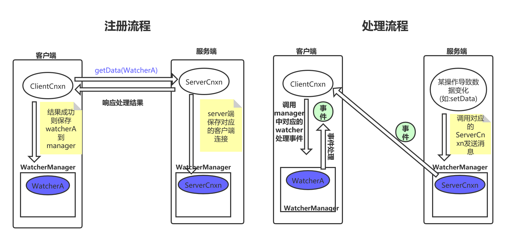

[TOC]

# zk watcher机制实现原理

这里以监测node数据来看一下watcher的处理，这里需要你了解前面的server Nio处理，以及zk client NIO 处理。

客户端的set:

> org.apache.zookeeper.ZooKeeper#getData(java.lang.String, boolean, org.apache.zookeeper.data.Stat)

```java
public byte[] getData(String path, boolean watch, Stat stat)
    throws KeeperException, InterruptedException {
    return getData(path, watch ? watchManager.defaultWatcher : null, stat);
}
```

```java
// 以此为入口 来分析一下 watcher的注册流程
public byte[] getData(final String path, Watcher watcher, Stat stat)
    throws KeeperException, InterruptedException
{
    // 要获取数据的 path 地址
    final String clientPath = path;
    PathUtils.validatePath(clientPath);

    // the watch contains the un-chroot path
    WatchRegistration wcb = null;
    if (watcher != null) {
        // 如果设置了watcher,则再一次包装为 DataWatchRegistration
        wcb = new DataWatchRegistration(watcher, clientPath);
    }

    final String serverPath = prependChroot(clientPath);
    // 创建 请求头
    RequestHeader h = new RequestHeader();
    // 设置 请求的操作类型
    h.setType(ZooDefs.OpCode.getData);
    // 创建getDateRequest
    GetDataRequest request = new GetDataRequest();
    // 设置请求的地址
    request.setPath(serverPath);
    // 设置是否注册了 watcher
    request.setWatch(watcher != null);
    // 创建getDateResponse,记录具体的响应
    GetDataResponse response = new GetDataResponse();
    // 由cnxn 进行数据的发送
    // r即server返回的响应头
    // 这里提交后,会调用wait函数,等待对应的数据返回; 当数据返回后,会调用notifyAll进行唤醒
    ReplyHeader r = cnxn.submitRequest(h, request, response, wcb);
    if (r.getErr() != 0) {
        throw KeeperException.create(KeeperException.Code.get(r.getErr()),
                                     clientPath);
    }
    // 参数中的stat 记录 响应的stat值
    if (stat != null) {
        DataTree.copyStat(response.getStat(), stat);
    }
    // 返回响应的数据
    return response.getData();
}
```

这里通过submitRequest 把packet放入到队列后，线程进行休眠，等待server端的响应，响应成功后，会把对应的watcher注册到客户端的watcherManger中。


当setDate发送到server后，server的处理:

> org.apache.zookeeper.server.DataTree#processTxn(org.apache.zookeeper.txn.TxnHeader, org.apache.jute.Record, boolean)

```java
// 请求处理
public ProcessTxnResult processTxn(TxnHeader header, Record txn, boolean isSubTxn)
{
    ProcessTxnResult rc = new ProcessTxnResult();

    rc.clientId = header.getClientId();
    rc.cxid = header.getCxid();
    rc.zxid = header.getZxid();
    rc.type = header.getType();
    rc.err = 0;
    rc.multiResult = null;
    // 根据不同的类型  来进行处理
    switch (header.getType()) {
        case OpCode.reconfig:
        case OpCode.setData:
            SetDataTxn setDataTxn = (SetDataTxn) txn;
            rc.path = setDataTxn.getPath();
            rc.stat = setData(setDataTxn.getPath(), setDataTxn
                              .getData(), setDataTxn.getVersion(), header
                              .getZxid(), header.getTime());
            break;
    }
}
```

具体看一下server是如何处理的:

> org.apache.zookeeper.server.DataTree#setData

```java
public Stat setData(String path, byte data[], int version, long zxid,
                    long time) throws KeeperException.NoNodeException {
    Stat s = new Stat();
    DataNode n = nodes.get(path);
    if (n == null) {
        throw new KeeperException.NoNodeException();
    }
    byte lastdata[] = null;
    synchronized (n) {
        lastdata = n.data;
        n.data = data;
        n.stat.setMtime(time);
        n.stat.setMzxid(zxid);
        n.stat.setVersion(version);
        n.copyStat(s);
    }
    // now update if the path is in a quota subtree.
    String lastPrefix = getMaxPrefixWithQuota(path);
    if(lastPrefix != null) {
        this.updateBytes(lastPrefix, (data == null ? 0 : data.length)
                         - (lastdata == null ? 0 : lastdata.length));
    }
    // 节点内容改变了, 触发了对应的watcher事件
    dataWatches.triggerWatch(path, EventType.NodeDataChanged);
    return s;
}
```

这里更新完数据后，调用了一个triggerWatch来触发watcher机制:

> org.apache.zookeeper.server.WatchManager#triggerWatch(java.lang.String, org.apache.zookeeper.Watcher.Event.EventType)

```java
    // 触发watcher机制
    Set<Watcher> triggerWatch(String path, EventType type) {
        return triggerWatch(path, type, null);
    }
```

> org.apache.zookeeper.server.WatchManager#triggerWatch(java.lang.String, org.apache.zookeeper.Watcher.Event.EventType, java.util.Set<org.apache.zookeeper.Watcher>)

```java
// 存储path对应的watcher
// key为path, value对应多个 watcher
private final HashMap<String, HashSet<Watcher>> watchTable =
    new HashMap<String, HashSet<Watcher>>();
// watch 对应的path
// 此key为watcher, value为监控的path
// 由此可见 watcher可以监控多个 path
private final HashMap<Watcher, HashSet<String>> watch2Paths =
    new HashMap<Watcher, HashSet<String>>();


// 触发watcher机制
Set<Watcher> triggerWatch(String path, EventType type, Set<Watcher> supress) {
    // 封装具体的事件
    WatchedEvent e = new WatchedEvent(type,
                                      KeeperState.SyncConnected, path);
    HashSet<Watcher> watchers;
    synchronized (this) {
        // 移除watcher,并获取到对应的watcher
        // 由此可见 watcher 只能使用一次,使用完后,需要再次进行绑定
        watchers = watchTable.remove(path);
        if (watchers == null || watchers.isEmpty()) {
            if (LOG.isTraceEnabled()) {
                ZooTrace.logTraceMessage(LOG,
                                         ZooTrace.EVENT_DELIVERY_TRACE_MASK,
                                         "No watchers for " + path);
            }
            return null;
        }
        // 移除对应的watcher
        for (Watcher w : watchers) {
            HashSet<String> paths = watch2Paths.get(w);
            if (paths != null) {
                paths.remove(path);
            }
        }
    }
    for (Watcher w : watchers) {
        if (supress != null && supress.contains(w)) {
            continue;
        }
        // watch的事件处理
        // ******************************
        w.process(e);
    }
    return watchers;
}
```

在server端有一个WatcherManager来保存那些path有watcher，当然在server端实现watcher并不是由客户端传递过来的，而是对应每个客户端连接在server端的实现NIOServerCnxn实现的。最终处理时同样是调用NIOServerCnxn来对watcher进行处理，即发对应的事件发送到对应的客户端，使其知道有事件发生。

> org.apache.zookeeper.server.NIOServerCnxn#process

```java
// zk watcher机制的触发
@Override
public void process(WatchedEvent event) {
    // 响应头的创建
    ReplyHeader h = new ReplyHeader(-1, -1L, 0);
    if (LOG.isTraceEnabled()) {
        ZooTrace.logTraceMessage(LOG, ZooTrace.EVENT_DELIVERY_TRACE_MASK,
                                 "Deliver event " + event + " to 0x"
                                 + Long.toHexString(this.sessionId)
                                 + " through " + this);
    }

    // Convert WatchedEvent to a type that can be sent over the wire
    // 获取到 对应的 watcherEvent
    WatcherEvent e = event.getWrapper();
    // 发送事件到  客户端
    sendResponse(h, e, "notification");
}
```

> org.apache.zookeeper.server.NIOServerCnxn#sendResponse

```java
// 发送响应
@Override
public void sendResponse(ReplyHeader h, Record r, String tag) {
    try {
        super.sendResponse(h, r, tag);
        if (h.getXid() > 0) {
            // check throttling
            if (outstandingRequests.decrementAndGet() < 1 ||
                zkServer.getInProcess() < outstandingLimit) {
                enableRecv();
            }
        }
    } catch(Exception e) {
        LOG.warn("Unexpected exception. Destruction averted.", e);
    }
}
```

> org.apache.zookeeper.server.ServerCnxn#sendResponse

```java
// 响应客户端的请求
public void sendResponse(ReplyHeader h, Record r, String tag) throws IOException {
    ByteArrayOutputStream baos = new ByteArrayOutputStream();
    // Make space for length
    BinaryOutputArchive bos = BinaryOutputArchive.getArchive(baos);
    try {
        baos.write(fourBytes);
        bos.writeRecord(h, "header");
        if (r != null) {
            bos.writeRecord(r, tag);
        }
        baos.close();
    } catch (IOException e) {
        LOG.error("Error serializing response");
    }
    byte b[] = baos.toByteArray();
    serverStats().updateClientResponseSize(b.length - 4);
    ByteBuffer bb = ByteBuffer.wrap(b);
    // 放入大小
    bb.putInt(b.length - 4).rewind();
    // 发送数据
    sendBuffer(bb);
}
```

> org.apache.zookeeper.server.NIOServerCnxn#sendBuffer

```java
// 发送server处理完的响应数据
public void sendBuffer(ByteBuffer bb) {
    if (LOG.isTraceEnabled()) {
        LOG.trace("Add a buffer to outgoingBuffers, sk " + sk
                  + " is valid: " + sk.isValid());
    }
    // 可以看到这里其实是吧数据缓存起来,异步发送
    outgoingBuffers.add(bb);
    requestInterestOpsUpdate();
}
// 这里把要发送的数缓存起来,并把对应的selectionKey放入到updateQueue中,等待为其添加write感兴趣事件
```

> org.apache.zookeeper.server.NIOServerCnxn#requestInterestOpsUpdate

```java
private void requestInterestOpsUpdate() {
    if (isSelectable()) {
        selectorThread.addInterestOpsUpdateRequest(sk);
    }
}
```

>  org.apache.zookeeper.server.NIOServerCnxnFactory.SelectorThread#addInterestOpsUpdateRequest

```java
        public boolean addInterestOpsUpdateRequest(SelectionKey sk) {
            // 把selectionkey 添加到updateQueue中 等待更新其 感兴趣事件
            if (stopped || !updateQueue.offer(sk)) {
                return false;
            }
            wakeupSelector();
            return true;
        }
```

这样把事件发送到客户端后，客户端解析数据得知这是一个event事件packet，会把对应的packet封装到放入到waitingEvent队列中，由eventThread来处理； eventThread会得到此path对应的所有watcher，然后调用watcher对事件进行处理。

画个图总结一下:




