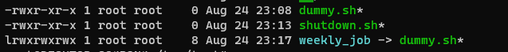
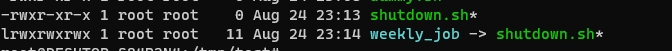
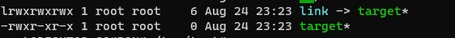
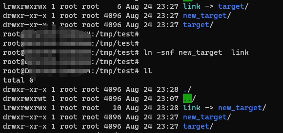

本文记录两个由于linux symbolic link文件操作引起的production issue。

### issue 1
在server node1有类似以下的symbolic link文件， 表示此server上调用weekly_job时，不执行任何操作。


node2上的文件如下， 当调用weekly_job时，会reboot server。


现在的情况是要修改week_job文件，添加一些新的job。
当在node2上修改好之后，需要拷贝到其他server上，执行如下命令
```
scp shutdown.sh  node1:/tmp/test/weekly_job
```
因为weekly_job是symbolic link，那么shutdown.sh 拷贝后，之后覆盖了dummy.sh 文件，本来空空如也，没有任何内容的文件，被修改了，导致weekly_job在node1上被调用后，重启了server，引起了重要的issue。

**注意：**
**_修改/覆盖 symbolic link文件时，最终修改的是symbolic link真实link到的文件。__**

### issue 2
强制修改symbolic文件失败。

总结以下两种情况：
1.link到文件

一般大家都会先把link文件删除,  然后link到新的目标文件上.  不过可以简写为
```
ln -sf new_target link

-f: force create symbolic link
```
添加-f参数, 相当于是把link删除, 并重建.


2.link到 directory


当link到的目标是目录时, 要使用如下操作
```
ln -snf new_target link
```



当时的的production issue就是因为link到的目标文件是  directory,  而使用了 _ln -sf_ 来修改, 最终导致没有修改成功.


