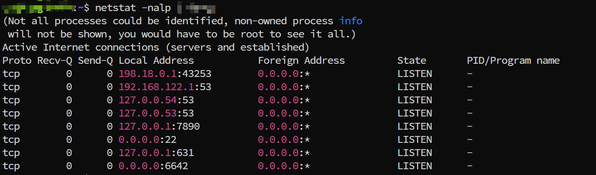

---
tags:
  - tcp
  - tcp-buffer
  - production-issue
---
# A TCP "network" incident that was really a 214 KB read-buffer limit

## What users saw

A vendor connected to an internal service over TCP. The connection would occasionally drop, report `receive peer heartbeat timeout`, and reconnect about one second later. Because the symptom looked like a broken connection, the first assumption was a network problem.

The actual cause was in the service: one incoming message was larger than the application's fixed **214 KB** read buffer. The read loop could not consume that message, so later messages, including heartbeats, were stuck behind it. The peer then timed out and reconnected.

## Topology


The path was:

`Vendor client -> F5 -> firewalls/NAT -> proxy -> internal service`

This involved enough network components that checking the path was reasonable. The important lesson is that a heartbeat timeout says the heartbeat was not processed; it does not, by itself, identify the network as the cause.

## How we narrowed it down

We worked from the sender toward the service and recorded what each layer could prove.

| Check | Result | What it told us |
| --- | --- | --- |
| Vendor application | Healthy | The client was still sending heartbeats. |
| Firewall and NAT logs | No relevant rule or policy change | There was no evidence that the connection was being blocked by a firewall change. |
| Proxy TRACE logs | Heartbeats arrived at the proxy | Traffic reached the proxy successfully. |
| Packet capture between proxy and service | Messages left the proxy | The proxy was forwarding data toward the service. |
| Service socket queue | `Recv-Q` stayed above `0` | The operating system had received data that the service had not read yet. |

The decisive clue was the receive queue:

```shell
netstat -nalp | grep '<service-port>'
```



`Recv-Q` is the number of bytes already received by the kernel but not yet read by the application. A non-zero value is not automatically an error--brief spikes are normal under load. In this incident, it remained non-zero while the connection repeatedly timed out, which pointed to a consumer that had stopped making progress.

> The screenshot above is illustrative. The production screenshot was not retained.

## The failure sequence

1. The client sent a message larger than 214 KB.
2. The service's TCP read logic used a fixed 214 KB buffer and could not complete that read correctly.
3. The oversized message remained at the front of the receive queue.
4. Subsequent messages, including heartbeats, could arrive at the host but could not be processed by the service.
5. The client did not receive the expected heartbeat response, reported a timeout, and reconnected.

```text
large message > fixed read buffer
          |
          v
service stops consuming the socket
          |
          v
Recv-Q accumulates and heartbeats wait behind the message
          |
          v
peer heartbeat timeout -> reconnect
```

## Root cause

The defect was an application-level message-reading limitation. The 214 KB value was the default read-buffer capacity in the service implementation, and the implementation did not grow the buffer or correctly assemble a message that exceeded it.

This is different from simply saying that "the TCP buffer was full." TCP can deliver a byte stream in fragments of arbitrary size; application code must retain partial data and continue reading until it has a complete, valid message according to its framing protocol. A fixed-size temporary buffer is fine, but it must not become the maximum supported message size unless that limit is explicitly enforced and communicated to clients.

## Fix

We applied two measures:

1. **Immediate mitigation:** asked the vendor not to send messages larger than 214 KB.
2. **Permanent fix:** changed the read logic so it can accumulate a partial message and grow its storage when the message exceeds the default buffer size.

The permanent implementation should also keep a configured maximum message size. Without one, a malformed or hostile peer can force unbounded memory allocation. When the limit is exceeded, reject the message clearly, log the peer and message size, and close or reset the connection according to the protocol.

## What to check next time

When a TCP connection appears to "flap," separate transport delivery from application consumption:

- Confirm at which hop the heartbeat was last observed: sender, proxy, host, and application logs.
- Inspect the service's socket queues. Sustained `Recv-Q` growth usually means the application is not reading fast enough or is blocked.
- Correlate queue growth with message sizes, thread dumps, garbage-collection pauses, and error logs.
- Review framing and buffer management: partial reads, message assembly, maximum-message validation, and backpressure.
- Treat kernel TCP tuning as a later step. It can change how much data waits in queues, but it cannot fix an application that cannot consume a valid message.

## Takeaway

The network delivered the data correctly; the service could not consume one oversized message. Following the data hop by hop and then checking `Recv-Q` turned a vague heartbeat-timeout report into a specific, reproducible application bug.
