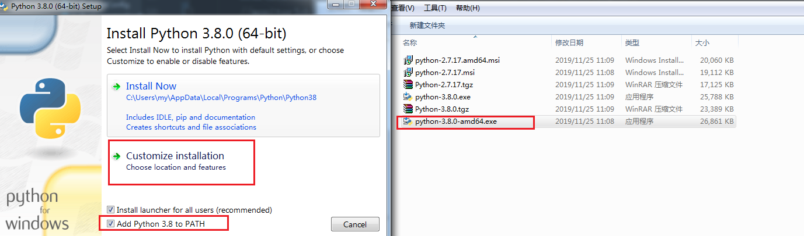
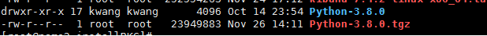
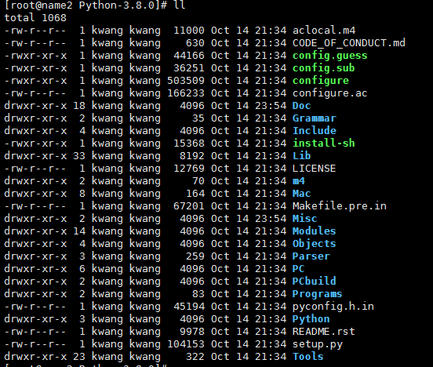

# install

## windows install

1.下载安装包

2.单机进行安装就好。(仍旧是傻瓜式的)



自己指定安装目录就好，选择添加环境变量。

## centos install

1.下载源码包



2.拷贝到系统上

3.编译进行安装



```shell
# 先安装一些依赖
yum install zlib-devel bzip2-devel openssl-devel ncurses-devel sqlite-devel readline-devel tk-devel gcc make
## 先进行配置
./configura
## 编译安装
make && make install

# 创建一个连接
mv /usr/bin/python /usr/bin/python.bak
ln -s /usr/local/bin/python3 /usr/bin/python
mv /usr/bin/pip /usr/bin/pip.bak
ln -s /usr/local/bin/pip3 /usr/bin/pip
```

