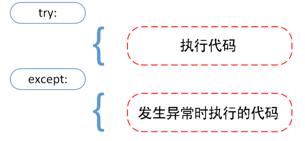
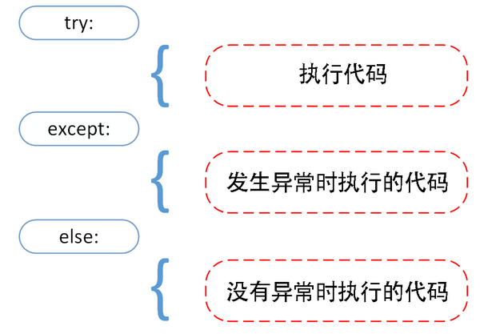
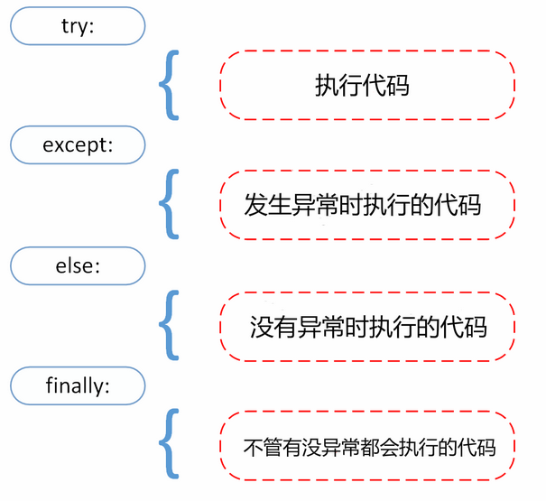
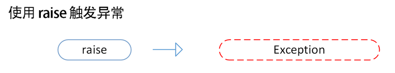

错误和异常

python有两种错误很容易辨认：语法错误和异常。

Python assert(断言)用于判断一个表达式，在表达条件为false的时候触发异常。

 ## 1.捕获异常

### 1.1 try/except



* 首先，执行try子句(在关键字try和关键字except之间的语句)
* 如果没有发生异常，则忽略except子句，try子句执行后结束
* 如果在执行try子句的过程中发生了异常，那么try子句余下的部分将被忽略。如果异常的类型和except之后的名称相符，那么对应的except子句将被执行
* 如果一个异常没有与任何的except匹配，那么这个异常将会传递给上层的try中

当然了，一个except可以同时捕获多个异常。

```python
#!/usr/bin/python3
# coding=utf-8

while True:
    try:
        x = int(input("please input a number: "))
        print("Input number is:%d"%x)
        break
    except (RuntimeError, ValueError):	
        print("Input value is not a number , error ....")
        break
print("exist..")

### 输入:
please input a number: a
Input value is not a number , error ....
exist..
```


### 1.2 try/except...else



可选的else子句，必须放在except子句之后。else子句将在try子句没有发生任何异常的时候执行。

```python
#!/usr/bin/python3
# coding=utf-8

try:
    x = int(input("please input a number: "))
    print("Input number is:%d"%x)
except (RuntimeError, ValueError):
    print("Input value is not a number , error ....")
else:
    print("else msg .....")


print("exist..")

### 输出1： 没有异常，则else输出
please input a number: 1
Input number is:1
else msg .....
exist..

### 输出2： 有异常，else不输出
please input a number: a
Input value is not a number , error ....
exist..
```


### 1.3 try-finally



finally语句无论是否发送异常都将执行最后的代码：

```python
#!/usr/bin/python3
# coding=utf-8
try:
    x = int(input("please input a number: "))
    print("Input number is:%d"%x)
except (RuntimeError, ValueError):
    print("Input value is not a number , error ....")
else:
    print("else msg ...")
finally:
    print("finally msg .....")


print("exist..")

### 输出1：  没有异常，此时else和finally都由运行
please input a number: 1
Input number is:1
else msg ...
finally msg .....
exist..

## 输出2：  出现异常，此时就没有else的输出
please input a number: a
Input value is not a number , error ....
finally msg .....
exist..
```


## 2.主动抛出异常

raise 语法:

```shell
raise [Exception [, arg[, traceback]]]
```



```python
#!/usr/bin/python3
# coding=utf-8
x=10
if x > 5:
    raise Exception('x 不能大于5. x 的值为:{}'.format(x))
    
### 输出:
Traceback (most recent call last):
  File "F:/pythonDemo/python_operation/basic/test-for-doc.py", line 5, in <module>
    raise Exception('x 不能大于5. x 的值为:{}'.format(x))
Exception: x 不能大于5. x 的值为:10
```

## 3.自定义异常

```python
#!/usr/bin/python3
# coding=utf-8

class myException(Exception):
    def __init__(self, value):
        self.value = value

    def __str__(self):
        return repr(self.value)

x=10
if x > 5:
    try:
        raise myException(2*1000)
    except myException as e:
        print("My Exception, value", e.value)
        
### 输出
My Exception, value 2000
```

## 4.预定义清理行为

一般情况下，清理行为都是爱finally中执行，但是有一部分是默认拥有

```python
for line in open("myfile.txt"):
    print(line, end="")
    
## 这个代码问题就是读取文件后，没有关闭文件句柄
```

```python
with open("myfile.txt") as f:
    for line in f:
        print(line, end="")

## 使用 with ，则会在读取操作完毕后，自动关闭文件句柄
```

