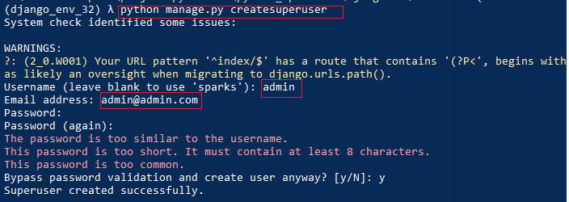

# Django 环境搭建

## 环境搭建

###  1. 创建virtualenv

```shell
virtualenv -p python3 Django_3.2
```


###  2. 安装对应的软件包

```shell
pip install Django==3.2 -i https://pypi.douban.com/simple
```


### 3. 创建项目

```shell
django-admin.exe  startproject  WebServer
```

可用的admin命令

```shell
(venv) λ django-admin.exe --help

Type 'django-admin help <subcommand>' for help on a specific subcommand.

Available subcommands:

[django]
    check
    compilemessages
    createcachetable
    dbshell
    diffsettings
    dumpdata
    flush
    inspectdb
    loaddata
    makemessages
    makemigrations
    migrate
    runserver
    sendtestemail
    shell
    showmigrations
    sqlflush
    sqlmigrate
    sqlsequencereset
    squashmigrations
    startapp
    startproject
    test
    testserver
```

`manage.py`的可用命令

```shell
(django_env_32) λ python manage.py --help

Type 'manage.py help <subcommand>' for help on a specific subcommand.

Available subcommands:

[auth]
    changepassword
    createsuperuser

[contenttypes]
    remove_stale_contenttypes

[django]
    check
    compilemessages
    createcachetable
    dbshell
    diffsettings
    dumpdata
    flush
    inspectdb
    loaddata
    makemessages
    makemigrations
    migrate
    sendtestemail
    shell
    showmigrations
    sqlflush
    sqlmigrate
    sqlsequencereset
    squashmigrations
    startapp
    startproject
    test
    testserver

[sessions]
    clearsessions

[staticfiles]
    collectstatic
    findstatic
    runserver
```


###  4. 启动项目

```shell
python manage.py runserver

```

## 子模块

### 4.1 添加项目中的子模块

```shell
python manage.py startapp book   # 创建book模块
```


## migration

### 1. 应用Django默认的auth相关的表


### 2. 创建superuser

```shell
python manage.py createsuperuser
```



创建完成superuser后，就可以使用创建的用户登录Django了。

## 配置文件解析


