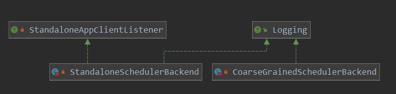

[TOC]

# Driver backend and taskScheduler

上面分析了SparkEnv的创建，同样是干活满满哦，不过不着急，这里咱们继续SparkContext中的点。

还记得在SparkContext创建中初始化了schedulerBackend 和 taskScheduler，这里咱们看一下这两个重要的类。

回顾SparkContext中的创建操作:

```scala
 // Create and start the scheduler
    // 重点
    // 创建 taskScheduler 和 backend
    val (sched, ts) = SparkContext.createTaskScheduler(this, master, deployMode)
    _schedulerBackend = sched
    _taskScheduler = ts
    // 创建 DAGScheduler
    _dagScheduler = new DAGScheduler(this)
    _heartbeatReceiver.ask[Boolean](TaskSchedulerIsSet)

    // start TaskScheduler after taskScheduler sets DAGScheduler reference in DAGScheduler's
    // constructor
    _taskScheduler.start()
    // 从taskScheduler 来获取 application的id 以及 attemptId
    _applicationId = _taskScheduler.applicationId()
    _applicationAttemptId = taskScheduler.applicationAttemptId()
```

> org.apache.spark.SparkContext#createTaskScheduler

```scala
// 这里的创建操作还是很清晰的, 就是根据不行的 deployMode 来创建不同环境下的实现类
private def createTaskScheduler(
    sc: SparkContext,
    master: String,
    deployMode: String): (SchedulerBackend, TaskScheduler) = {
    import SparkMasterRegex._

    // When running locally, don't try to re-execute tasks on failure.
    val MAX_LOCAL_TASK_FAILURES = 1

    master match {
        case "local" =>
        val scheduler = new TaskSchedulerImpl(sc, MAX_LOCAL_TASK_FAILURES, isLocal = true)
        val backend = new LocalSchedulerBackend(sc.getConf, scheduler, 1)
        scheduler.initialize(backend)
        (backend, scheduler)

        case LOCAL_N_REGEX(threads) =>
        def localCpuCount: Int = Runtime.getRuntime.availableProcessors()
        // local[*] estimates the number of cores on the machine; local[N] uses exactly N threads.
        val threadCount = if (threads == "*") localCpuCount else threads.toInt
        if (threadCount <= 0) {
            throw new SparkException(s"Asked to run locally with $threadCount threads")
        }
        val scheduler = new TaskSchedulerImpl(sc, MAX_LOCAL_TASK_FAILURES, isLocal = true)
        val backend = new LocalSchedulerBackend(sc.getConf, scheduler, threadCount)
        // 先调用 scheduler.initializer进行调度的初始化,以及获取到了 backend
        // 之后调用start
        scheduler.initialize(backend)
        (backend, scheduler)
        // 本例  咱们分析这里
        // 创建的 taskScheduler是TaskSchedulerImpl
        // 创建的 schedulerbackend 是LocalSchedulerBackend
        case LOCAL_N_FAILURES_REGEX(threads, maxFailures) =>
        def localCpuCount: Int = Runtime.getRuntime.availableProcessors()
        // local[*, M] means the number of cores on the computer with M failures
        // local[N, M] means exactly N threads with M failures
        val threadCount = if (threads == "*") localCpuCount else threads.toInt
        val scheduler = new TaskSchedulerImpl(sc, maxFailures.toInt, isLocal = true)
        val backend = new LocalSchedulerBackend(sc.getConf, scheduler, threadCount)
        scheduler.initialize(backend)
        (backend, scheduler)
        // 创建的 taskScheduler是TaskSchedulerImpl
        // 创建的 schedulerbackend 是 StandaloneSchedulerBackend
        case SPARK_REGEX(sparkUrl) =>
        val scheduler = new TaskSchedulerImpl(sc)
        val masterUrls = sparkUrl.split(",").map("spark://" + _)
        val backend = new StandaloneSchedulerBackend(scheduler, sc, masterUrls)
        // taskScheduler的初始化 并记录 backend
        scheduler.initialize(backend)
        (backend, scheduler)

        case LOCAL_CLUSTER_REGEX(numSlaves, coresPerSlave, memoryPerSlave) =>
        // Check to make sure memory requested <= memoryPerSlave. Otherwise Spark will just hang.
        val memoryPerSlaveInt = memoryPerSlave.toInt
        if (sc.executorMemory > memoryPerSlaveInt) {
            throw new SparkException(
                "Asked to launch cluster with %d MB RAM / worker but requested %d MB/worker".format(
                    memoryPerSlaveInt, sc.executorMemory))
        }

        val scheduler = new TaskSchedulerImpl(sc)
        val localCluster = new LocalSparkCluster(
            numSlaves.toInt, coresPerSlave.toInt, memoryPerSlaveInt, sc.conf)
        val masterUrls = localCluster.start()
        val backend = new StandaloneSchedulerBackend(scheduler, sc, masterUrls)
        scheduler.initialize(backend)
        backend.shutdownCallback = (backend: StandaloneSchedulerBackend) => {
            localCluster.stop()
        }
        (backend, scheduler)

        case masterUrl =>
        val cm = getClusterManager(masterUrl) match {
            case Some(clusterMgr) => clusterMgr
            case None => throw new SparkException("Could not parse Master URL: '" + master + "'")
        }
        try {
            val scheduler = cm.createTaskScheduler(sc, masterUrl)
            val backend = cm.createSchedulerBackend(sc, masterUrl, scheduler)
            cm.initialize(scheduler, backend)
            (backend, scheduler)
        } catch {
            case se: SparkException => throw se
            case NonFatal(e) =>
            throw new SparkException("External scheduler cannot be instantiated", e)
        }
    }
}
```

> TaskSchedulerImpl 类的初始化

```scala
private[spark] class TaskSchedulerImpl(
    val sc: SparkContext,
    val maxTaskFailures: Int,
    isLocal: Boolean = false)
extends TaskScheduler with Logging {
	// 隐士函数
    import TaskSchedulerImpl._
    // taskScheduler的构造函数
    def this(sc: SparkContext) = {
        this(sc, sc.conf.get(config.MAX_TASK_FAILURES))
    }

    // Lazily initializing blacklistTrackerOpt to avoid getting empty ExecutorAllocationClient,
    // because ExecutorAllocationClient is created after this TaskSchedulerImpl.
    private[scheduler] lazy val blacklistTrackerOpt = maybeCreateBlacklistTracker(sc)
    // sparkConf的记录
    val conf = sc.conf

    // How often to check for speculative tasks
    val SPECULATION_INTERVAL_MS = conf.getTimeAsMs("spark.speculation.interval", "100ms")

    // Duplicate copies of a task will only be launched if the original copy has been running for
    // at least this amount of time. This is to avoid the overhead of launching speculative copies
    // of tasks that are very short.
    val MIN_TIME_TO_SPECULATION = 100

    private val speculationScheduler =
    ThreadUtils.newDaemonSingleThreadScheduledExecutor("task-scheduler-speculation")

    // Threshold above which we warn user initial TaskSet may be starved
    val STARVATION_TIMEOUT_MS = conf.getTimeAsMs("spark.starvation.timeout", "15s")

    // CPUs to request per task
    val CPUS_PER_TASK = conf.getInt("spark.task.cpus", 1)

    // TaskSetManagers are not thread safe, so any access to one should be synchronized
    // on this class.
    // stageId 和 taskSet的对应关系
    private val taskSetsByStageIdAndAttempt = new HashMap[Int, HashMap[Int, TaskSetManager]]

    // Protected by `this`
    private[scheduler] val taskIdToTaskSetManager = new ConcurrentHashMap[Long, TaskSetManager]
    val taskIdToExecutorId = new HashMap[Long, String]

    @volatile private var hasReceivedTask = false
    @volatile private var hasLaunchedTask = false
    private val starvationTimer = new Timer(true)

    // Incrementing task IDs
    // 可见生成taskId的方法  是 long来递增得到
    val nextTaskId = new AtomicLong(0)

    // IDs of the tasks running on each executor
    private val executorIdToRunningTaskIds = new HashMap[String, HashSet[Long]]

    // The set of executors we have on each host; this is used to compute hostsAlive, which
    // in turn is used to decide when we can attain data locality on a given host
    // executor 和host的对应关系
    protected val hostToExecutors = new HashMap[String, HashSet[String]]
    protected val hostsByRack = new HashMap[String, HashSet[String]]
    protected val executorIdToHost = new HashMap[String, String]

    private val abortTimer = new Timer(true)
    private val clock = new SystemClock
    // Exposed for testing
    val unschedulableTaskSetToExpiryTime = new HashMap[TaskSetManager, Long]

    // Listener object to pass upcalls into
    var dagScheduler: DAGScheduler = null

    var backend: SchedulerBackend = null

    val mapOutputTracker = SparkEnv.get.mapOutputTracker.asInstanceOf[MapOutputTrackerMaster]

    private var schedulableBuilder: SchedulableBuilder = null
    // default scheduler is FIFO
    private val schedulingModeConf = conf.get(SCHEDULER_MODE_PROPERTY, SchedulingMode.FIFO.toString)
    val schedulingMode: SchedulingMode =
    try {
        SchedulingMode.withName(schedulingModeConf.toUpperCase(Locale.ROOT))
    } catch {
        case e: java.util.NoSuchElementException =>
        throw new SparkException(s"Unrecognized $SCHEDULER_MODE_PROPERTY: $schedulingModeConf")
    }
    // Pool会保存提交的那些 task,也就是说 driver的task会放在这里,后面进行任务调度时,也会从此按照
    // 配置的调度算法来获取task , 并发送给  executor
    val rootPool: Pool = new Pool("", schedulingMode, 0, 0)

    // This is a var so that we can reset it for testing purposes.
    private[spark] var taskResultGetter = new TaskResultGetter(sc.env, this)

    private lazy val barrierSyncTimeout = conf.get(config.BARRIER_SYNC_TIMEOUT)

    private[scheduler] var barrierCoordinator: RpcEndpoint = null
    
}
```


> StandaloneSchedulerBackend 类的初始化

看一下此类的类图:



```scala
// 这个类很关键哦,可以看到此是 CoarseGrainedSchedulerBackend的子类
// 构造函数
private[spark] class StandaloneSchedulerBackend(
    scheduler: TaskSchedulerImpl,
    sc: SparkContext,
    masters: Array[String])
extends CoarseGrainedSchedulerBackend(scheduler, sc.env.rpcEnv)
with StandaloneAppClientListener
with Logging {
    // driver提价任务的一个 cliend
    private var client: StandaloneAppClient = null
    // 启动或停止的标志
    private val stopping = new AtomicBoolean(false)
    // 猜测此 lunchBackend 是和 standalone  client 模式有关
    private val launcherBackend = new LauncherBackend() {
        override protected def conf: SparkConf = sc.conf
        override protected def onStopRequest(): Unit = stop(SparkAppHandle.State.KILLED)
    }
    // 关闭的回调方法
    @volatile var shutdownCallback: StandaloneSchedulerBackend => Unit = _
    @volatile private var appId: String = _
    // 注册的  栅栏
    private val registrationBarrier = new Semaphore(0)
    // 最大核数
    private val maxCores = conf.getOption("spark.cores.max").map(_.toInt)
    // 总的 期望的 核数
    private val totalExpectedCores = maxCores.getOrElse(0)
    ... 
}
```

> org.apache.spark.scheduler.TaskSchedulerImpl#initialize

```scala
// taskScheduler 先进行 initialize 在进行 start
def initialize(backend: SchedulerBackend) {
    // 记录传递进来的 backend
    this.backend = backend
    // 根据不同的模式,来创建调度器
    // 也就是调度算法
    schedulableBuilder = {
        schedulingMode match {
            case SchedulingMode.FIFO =>
            new FIFOSchedulableBuilder(rootPool)
            case SchedulingMode.FAIR =>
            new FairSchedulableBuilder(rootPool, conf)
            case _ =>
            throw new IllegalArgumentException(s"Unsupported $SCHEDULER_MODE_PROPERTY: " +
                                               s"$schedulingMode")
        }
    }
    // 对调度器的一些工作
    schedulableBuilder.buildPools()
}
```

> org.apache.spark.scheduler.TaskSchedulerImpl#start

```scala
// initialize 之后, 就调用start 启动
override def start() {
    // 在这里先进行了 backend的启动
    // backend是  StandaloneSchedulerBackend
    // 看一下此backend start做了什么工作
    backend.start()
    // 这里提交了一个任务
    // 用来检测 checkSpeculatableTasks
    if (!isLocal && conf.getBoolean("spark.speculation", false)) {
        logInfo("Starting speculative execution thread")
        speculationScheduler.scheduleWithFixedDelay(new Runnable {
            override def run(): Unit = Utils.tryOrStopSparkContext(sc) {
                checkSpeculatableTasks()
            }
        }, SPECULATION_INTERVAL_MS, SPECULATION_INTERVAL_MS, TimeUnit.MILLISECONDS)
    }
}
```

> org.apache.spark.scheduler.cluster.StandaloneSchedulerBackend#start

```scala
// 启动操作
override def start() {
    // 这就相当于启动了 driver的backend
    // driver的backend是 StandaloneSchedulerBackend -> CoarseGrainedSchedulerBackend
    // 这样有了 driver端的 rpcEndpoint driver就算是启动了
    // 这里调用 CoarseGrainedSchedulerBackend的start 方法
    super.start()

    // SPARK-21159. The scheduler backend should only try to connect to the launcher when in client
    // mode. In cluster mode, the code that submits the application to the Master needs to connect
    // to the launcher instead.
    if (sc.deployMode == "client") {
        launcherBackend.connect()
    }

    // The endpoint for executors to talk to us
    // driver 用来和 executor talk 的rpcEndpoint
    val driverUrl = RpcEndpointAddress(
        sc.conf.get("spark.driver.host"),
        sc.conf.get("spark.driver.port").toInt,
        CoarseGrainedSchedulerBackend.ENDPOINT_NAME).toString
    val args = Seq(
        "--driver-url", driverUrl,
        "--executor-id", "{{EXECUTOR_ID}}",
        "--hostname", "{{HOSTNAME}}",
        "--cores", "{{CORES}}",
        "--app-id", "{{APP_ID}}",
        "--worker-url", "{{WORKER_URL}}")
    val extraJavaOpts = sc.conf.getOption("spark.executor.extraJavaOptions")
    .map(Utils.splitCommandString).getOrElse(Seq.empty)
    val classPathEntries = sc.conf.getOption("spark.executor.extraClassPath")
    .map(_.split(java.io.File.pathSeparator).toSeq).getOrElse(Nil)
    val libraryPathEntries = sc.conf.getOption("spark.executor.extraLibraryPath")
    .map(_.split(java.io.File.pathSeparator).toSeq).getOrElse(Nil)

    // When testing, expose the parent class path to the child. This is processed by
    // compute-classpath.{cmd,sh} and makes all needed jars available to child processes
    // when the assembly is built with the "*-provided" profiles enabled.
    val testingClassPath =
    if (sys.props.contains("spark.testing")) {
        sys.props("java.class.path").split(java.io.File.pathSeparator).toSeq
    } else {
        Nil
    }

    // Start executors with a few necessary configs for registering with the scheduler
    val sparkJavaOpts = Utils.sparkJavaOpts(conf, SparkConf.isExecutorStartupConf)
    val javaOpts = sparkJavaOpts ++ extraJavaOpts
    // 创建了一个命令
    // 可以看到创建的命令是 CoarseGrainedExecutorBackend
    // 此类是 executor的主要类
    val command = Command("org.apache.spark.executor.CoarseGrainedExecutorBackend",
                          args, sc.executorEnvs, classPathEntries ++ testingClassPath, libraryPathEntries, javaOpts)
    val webUrl = sc.ui.map(_.webUrl).getOrElse("")
    val coresPerExecutor = conf.getOption("spark.executor.cores").map(_.toInt)
    // If we're using dynamic allocation, set our initial executor limit to 0 for now.
    // ExecutorAllocationManager will send the real initial limit to the Master later.
    val initialExecutorLimit =
    if (Utils.isDynamicAllocationEnabled(conf)) {
        Some(0)
    } else {
        None
    }
    // 在schedulerBackend 创建了 ApplicationDescription,也就是对要提交的application的描述
    val appDesc = ApplicationDescription(sc.appName, maxCores, sc.executorMemory, command,
            webUrl, sc.eventLogDir, sc.eventLogCodec, coresPerExecutor, initialExecutorLimit)
    // 这里是启动一个客户端来 和 master交互
    // 并把启动 executor backend的command发送到master,由master来查找worke启动  executor
    client = new StandaloneAppClient(sc.env.rpcEnv, masters, appDesc, this, conf)
    // 启动
    client.start()
    launcherBackend.setState(SparkAppHandle.State.SUBMITTED)
    waitForRegistration()
    launcherBackend.setState(SparkAppHandle.State.RUNNING)
}
```

> org.apache.spark.scheduler.cluster.CoarseGrainedSchedulerBackend#start

```scala
//  driver的backend的启动
// 可以看住主要的还是 创建了 driver的 rpcEndpoint
override def start() {
    val properties = new ArrayBuffer[(String, String)]
    // 相当于复制了一个 以 spark开头的配置
    for ((key, value) <- scheduler.sc.conf.getAll) {
        if (key.startsWith("spark.")) {
            properties += ((key, value))
        }
    }
    // TODO (prashant) send conf instead of properties
    // 创建 driver的Endpoint
    driverEndpoint = createDriverEndpointRef(properties)
}


protected def createDriverEndpointRef(
    properties: ArrayBuffer[(String, String)]): RpcEndpointRef = {
    // createDriverEndpoint 创建endpoint
    rpcEnv.setupEndpoint(ENDPOINT_NAME, createDriverEndpoint(properties))
}

// 创建 DriverEndpoint的实例
protected def createDriverEndpoint(properties: Seq[(String, String)]): DriverEndpoint = {
    new DriverEndpoint(rpcEnv, properties)
}
```

> org.apache.spark.scheduler.cluster.CoarseGrainedSchedulerBackend.DriverEndpoint

```scala

// driver endpint的 构造方法
class DriverEndpoint(override val rpcEnv: RpcEnv, sparkProperties: Seq[(String, String)])
extends ThreadSafeRpcEndpoint with Logging {

    // Executors that have been lost, but for which we don't yet know the real exit reason.
    protected val executorsPendingLossReason = new HashSet[String]
    protected val addressToExecutorId = new HashMap[RpcAddress, String]
    override def onStart() {
        // Periodically revive offers to allow delay scheduling to work
        val reviveIntervalMs = conf.getTimeAsMs("spark.scheduler.revive.interval", "1s")
        // 在线程池中提交一个 定时任务,  定时发送 ReviveOffers
        // 在接收线程池中 提价任务,定时发送 ReviveOffers消息 给自己
        reviveThread.scheduleAtFixedRate(new Runnable {
            override def run(): Unit = Utils.tryLogNonFatalError {
                Option(self).foreach(_.send(ReviveOffers))
            }
        }, 0, reviveIntervalMs, TimeUnit.MILLISECONDS)
    }
}
```

这样 StandaloneSchedulerBackend 就启动了，下面会想master发送application任务。

> org.apache.spark.deploy.client.StandaloneAppClient#StandaloneAppClient

```scala
// StandaloneAppClient构造
private[spark] class StandaloneAppClient(
    rpcEnv: RpcEnv,
    masterUrls: Array[String],
    appDescription: ApplicationDescription,
    listener: StandaloneAppClientListener,
    conf: SparkConf)
extends Logging {
    // master的地址
    private val masterRpcAddresses = masterUrls.map(RpcAddress.fromSparkURL(_))
    // 注册超时时间
    private val REGISTRATION_TIMEOUT_SECONDS = 20
    // 注册重试次数
    private val REGISTRATION_RETRIES = 3
    // 和master交互的 endPoint
    private val endpoint = new AtomicReference[RpcEndpointRef]
    //
    private val appId = new AtomicReference[String]
    // 注册成功的标志
    private val registered = new AtomicBoolean(false)
 ...   
}
```

> org.apache.spark.deploy.client.StandaloneAppClient#start

```scala
def start() {
    // Just launch an rpcEndpoint; it will call back into the listener.
    // 创建了一个rpcEndpoint
    endpoint.set(rpcEnv.setupEndpoint("AppClient", new ClientEndpoint(rpcEnv)))
}
```

> org.apache.spark.deploy.client.StandaloneAppClient.ClientEndpoint

```scala
// ClientEndpoint 的构造函数 以及 onStart方法
private class ClientEndpoint(override val rpcEnv: RpcEnv) extends ThreadSafeRpcEndpoint
with Logging {
    // master的地址
    private var master: Option[RpcEndpointRef] = None
    // To avoid calling listener.disconnected() multiple times
    private var alreadyDisconnected = false
    // To avoid calling listener.dead() multiple times
    // 死亡标志
    private val alreadyDead = new AtomicBoolean(false)
    // 注册到master的操作
    private val registerMasterFutures = new AtomicReference[Array[JFuture[_]]]
    // 注册的重试次数
    private val registrationRetryTimer = new AtomicReference[JScheduledFuture[_]]

    // A thread pool for registering with masters. Because registering with a master is a blocking
    // action, this thread pool must be able to create "masterRpcAddresses.size" threads at the same
    // time so that we can register with all masters.
    // 向master进行注册是阻塞操作,这里使用线程池,来同时向所有master进行注册
    private val registerMasterThreadPool = ThreadUtils.newDaemonCachedThreadPool(
        "appclient-register-master-threadpool",
        masterRpcAddresses.length // Make sure we can register with all masters at the same time
    )
    // A scheduled executor for scheduling the registration actions
    // 重试注册的线程池
    private val registrationRetryThread =
    ThreadUtils.newDaemonSingleThreadScheduledExecutor("appclient-registration-retry-thread")
    // 启动会执行
    override def onStart(): Unit = {
        try {
            // 注册操作
            registerWithMaster(1)
        } catch {
            case e: Exception =>
            logWarning("Failed to connect to master", e)
            markDisconnected()
            stop()
        }
    }
    /**
     *  Register with all masters asynchronously and returns an array `Future`s for cancellation.
     */
    private def tryRegisterAllMasters(): Array[JFuture[_]] = {
        for (masterAddress <- masterRpcAddresses) yield {
            registerMasterThreadPool.submit(new Runnable {
                override def run(): Unit = try {
                    // 如果注册成功,则返回
                    if (registered.get) {
                        return
                    }
                    logInfo("Connecting to master " + masterAddress.toSparkURL + "...")
                    // 此举相当于 获取一个可以和master 交互信息的 endpoint
                    val masterRef = rpcEnv.setupEndpointRef(masterAddress, Master.ENDPOINT_NAME)
                    // 向master发送 RegisterApplication 消息
                    // 第二个参数标识driver,此处发送自己; 开始向 driver进行application的注册操作
                    masterRef.send(RegisterApplication(appDescription, self))
                } catch {
                    case ie: InterruptedException => // Cancelled
                    case NonFatal(e) => logWarning(s"Failed to connect to master $masterAddress", e)
                }
            })
        }
    }
..... 
}
```

可以看到向master发送了消息: RegisterApplication， 下面就看一下master的处理把：

> org.apache.spark.deploy.master.Master#receive

```scala
 override def receive: PartialFunction[Any, Unit] = {
 ....
    // 接收到 AppClient发送过来的 注册Application消息
    case RegisterApplication(description, driver) =>
      // TODO Prevent repeated registrations from some driver
      if (state == RecoveryState.STANDBY) {
        // ignore, don't send response
      } else {
        logInfo("Registering app " + description.name)
        // 创建app
        val app = createApplication(description, driver)
        // 把创建好的app 记录下来
        registerApplication(app)
        logInfo("Registered app " + description.name + " with ID " + app.id)
        persistenceEngine.addApplication(app)
        // 回复 driver RegisteredApplication消息
        driver.send(RegisteredApplication(app.id, self))
        // 调度
        // 1.找合适的worker 来启动driver
        // 2.找合适的worker 来启动 executor 运行 application
        schedule()
      }
     ....
 }
```

> org.apache.spark.deploy.master.Master#createApplication

```scala
// master根据提交的信息,创建application
private def createApplication(desc: ApplicationDescription, driver: RpcEndpointRef):
ApplicationInfo = {
    val now = System.currentTimeMillis()
    val date = new Date(now)
    // 创建appId
    val appId = newApplicationId(date)
    new ApplicationInfo(now, appId, desc, date, driver, defaultCores)
}
```

> org.apache.spark.deploy.master.Master#registerApplication

```scala
// 记录application的信息
private def registerApplication(app: ApplicationInfo): Unit = {
    val appAddress = app.driver.address
    if (addressToApp.contains(appAddress)) {
        logInfo("Attempted to re-register application at same address: " + appAddress)
        return
    }
    // 记录app信息
    // 并 更新此app到指标系统
    applicationMetricsSystem.registerSource(app.appSource)
    apps += app
    idToApp(app.id) = app
    endpointToApp(app.driver) = app
    addressToApp(appAddress) = app
    waitingApps += app
}
```

> org.apache.spark.deploy.master.Master#schedule

```scala
private def schedule(): Unit = {
    // 如果状态不是  ALIVE,则不进行调度工作
    if (state != RecoveryState.ALIVE) {
        return
    }
    // Drivers take strict precedence over executors
    // 获取ALIVE 的 worker
    val shuffledAliveWorkers = Random.shuffle(workers.toSeq.filter(_.state == WorkerState.ALIVE))
    // 存活的 worker的 数量
    val numWorkersAlive = shuffledAliveWorkers.size
    var curPos = 0
    // 遍历所有正在等待的 driver
    for (driver <- waitingDrivers.toList) { // iterate over a copy of waitingDrivers
        // We assign workers to each waiting driver in a round-robin fashion. For each driver, we
        // start from the last worker that was assigned a driver, and continue onwards until we have
        // explored all alive workers.
        var launched = false
        var numWorkersVisited = 0
        while (numWorkersVisited < numWorkersAlive && !launched) {
            val worker = shuffledAliveWorkers(curPos)
            numWorkersVisited += 1
            if (worker.memoryFree >= driver.desc.mem && worker.coresFree >= driver.desc.cores) {
                // 启动driver
                launchDriver(worker, driver)
                waitingDrivers -= driver
                launched = true
            }
            curPos = (curPos + 1) % numWorkersAlive
        }
    }
    // 在worker上启动 executors
    // 这里咱们主要看这里  重点
    startExecutorsOnWorkers()
}
```

> org.apache.spark.deploy.master.Master#startExecutorsOnWorkers

```scala
private def startExecutorsOnWorkers(): Unit = {
    // Right now this is a very simple FIFO scheduler. We keep trying to fit in the first app
    // in the queue, then the second app, etc.
    // 遍历所有等待的app,把app分发到worker上运行
    for (app <- waitingApps) {
        // app 每个executor 需要的核数
        val coresPerExecutor = app.desc.coresPerExecutor.getOrElse(1)
        // If the cores left is less than the coresPerExecutor,the cores left will not be allocated
        //
        if (app.coresLeft >= coresPerExecutor) {
            // Filter out workers that don't have enough resources to launch an executor
            // 过滤 找出所有可用 且 资源足够的worker 并按照 可用核数排序
            val usableWorkers = workers.toArray.filter(_.state == WorkerState.ALIVE)
            .filter(worker => worker.memoryFree >= app.desc.memoryPerExecutorMB &&
                    worker.coresFree >= coresPerExecutor)
            .sortBy(_.coresFree).reverse
            // 每个worker要分配的core
            val assignedCores = scheduleExecutorsOnWorkers(app, usableWorkers, spreadOutApps)
            // Now that we've decided how many cores to allocate on each worker, let's allocate them
            // 在worker上启动 executor
            for (pos <- 0 until usableWorkers.length if assignedCores(pos) > 0) {
                // 在worker上启动 executor
                // 这里主要看这里
                allocateWorkerResourceToExecutors(
                    app, assignedCores(pos), app.desc.coresPerExecutor, usableWorkers(pos))
            }
        }
    }
}
```


```scala
// 分配worker的资源到 executor
private def allocateWorkerResourceToExecutors(
    app: ApplicationInfo,
    assignedCores: Int,
    coresPerExecutor: Option[Int],
    worker: WorkerInfo): Unit = {
    // If the number of cores per executor is specified, we divide the cores assigned
    // to this worker evenly among the executors with no remainder.
    // Otherwise, we launch a single executor that grabs all the assignedCores on this worker.
    // 需要启动 多少个 executor
    val numExecutors = coresPerExecutor.map { assignedCores / _ }.getOrElse(1)
    //
    val coresToAssign = coresPerExecutor.getOrElse(assignedCores)
    for (i <- 1 to numExecutors) {
        val exec = app.addExecutor(worker, coresToAssign)
        // 启动 executor
        launchExecutor(worker, exec)
        app.state = ApplicationState.RUNNING
    }
}
```

> org.apache.spark.deploy.master.Master#launchExecutor

```scala
// 在worker上启动 executor
private def launchExecutor(worker: WorkerInfo, exec: ExecutorDesc): Unit = {
    logInfo("Launching executor " + exec.fullId + " on worker " + worker.id)
    worker.addExecutor(exec)
    // 发送 LaunchExecutor消息,让 worker 启动 executor
    worker.endpoint.send(LaunchExecutor(masterUrl,
              exec.application.id, exec.id, exec.application.desc, exec.cores, exec.memory))
    // 向driver 汇报消息 ExecutorAdded
    exec.application.driver.send(
        ExecutorAdded(exec.id, worker.id, worker.hostPort, exec.cores, exec.memory))
}
```

这里看到是Master向driver发送消息 LaunchExecutor 来启动 executor，下面咱们看一下 wokrer对此消息的处理

> org.apache.spark.deploy.worker.Worker#receive

```scala
// 只看重点
override def receive: PartialFunction[Any, Unit] = synchronized {
    .....
    // 在worker上启动executor
    // 接收到 master发送过来的消息
    case LaunchExecutor(masterUrl, appId, execId, appDesc, cores_, memory_) =>
    // 如果不是有效的 master发送过来的任务,则 打印warning
    if (masterUrl != activeMasterUrl) {
        logWarning("Invalid Master (" + masterUrl + ") attempted to launch executor.")
    } else {
        try {
            logInfo("Asked to launch executor %s/%d for %s".format(appId, execId, appDesc.name))
            // Create the executor's working directory
            // 创建工作目录
            val executorDir = new File(workDir, appId + "/" + execId)
            if (!executorDir.mkdirs()) {
                throw new IOException("Failed to create directory " + executorDir)
            }
            // Create local dirs for the executor. These are passed to the executor via the
            // SPARK_EXECUTOR_DIRS environment variable, and deleted by the Worker when the
            // application finishes.
            // app 目录
            val appLocalDirs = appDirectories.getOrElse(appId, {
                val localRootDirs = Utils.getOrCreateLocalRootDirs(conf)
                val dirs = localRootDirs.flatMap { dir =>
                    try {
                        val appDir = Utils.createDirectory(dir, namePrefix = "executor")
                        Utils.chmod700(appDir)
                        Some(appDir.getAbsolutePath())
                    } catch {
                        case e: IOException =>
                        logWarning(s"${e.getMessage}. Ignoring this directory.")
                        None
                    }
                }.toSeq
                if (dirs.isEmpty) {
                    throw new IOException("No subfolder can be created in " +
                                          s"${localRootDirs.mkString(",")}.")
                }
                dirs
            })
            // 记录 app的目录
            appDirectories(appId) = appLocalDirs
            // 创建 executorRunner 来启动 executor
            val manager = new ExecutorRunner(
                appId,
                execId,
                appDesc.copy(command = Worker.maybeUpdateSSLSettings(appDesc.command, conf)),
                cores_,
                memory_,
                self,
                workerId,
                host,
                webUi.boundPort,
                publicAddress,
                sparkHome,
                executorDir,
                workerUri,
                conf,
                appLocalDirs, ExecutorState.RUNNING)
            // 记录创建的 executor
            executors(appId + "/" + execId) = manager
            // 启动创建的executor
            manager.start()
            // 增加使用的 核数 和 内存
            coresUsed += cores_
            memoryUsed += memory_
            // 回复ExecutorStateChanged 消息
            sendToMaster(ExecutorStateChanged(appId, execId, manager.state, None, None))
        } catch {
            case e: Exception =>
            logError(s"Failed to launch executor $appId/$execId for ${appDesc.name}.", e)
            if (executors.contains(appId + "/" + execId)) {
                executors(appId + "/" + execId).kill()
                executors -= appId + "/" + execId
            }
            sendToMaster(ExecutorStateChanged(appId, execId, ExecutorState.FAILED,
                                              Some(e.toString), None))
        }
    }
 ......   
}
```

这里创建了一个类 ExecutorRunner来启动Executor，具体来看一下此类：

> org.apache.spark.deploy.worker.ExecutorRunner#start

```scala
// executor的启动
private[worker] def start() {
    // 启动一个线程来启动 executor
    // executor真正运行的函数  fetchAndRunExecutor
    // 从名字看 就是 fetch拉取资源
    // AndRunExecutor 运行executor
    workerThread = new Thread("ExecutorRunner for " + fullId) {
        override def run() { fetchAndRunExecutor() }
    }
    workerThread.start()
    // Shutdown hook that kills actors on shutdown.
    // 关闭的回调函数
    shutdownHook = ShutdownHookManager.addShutdownHook { () =>
        // It's possible that we arrive here before calling `fetchAndRunExecutor`, then `state` will
        // be `ExecutorState.RUNNING`. In this case, we should set `state` to `FAILED`.
        if (state == ExecutorState.RUNNING) {
            state = ExecutorState.FAILED
        }
        killProcess(Some("Worker shutting down")) }
}
```

这里单独启动一个线程来做启动的操作：

>  org.apache.spark.deploy.worker.ExecutorRunner#fetchAndRunExecutor

```scala
   /* 下载并使用 executor运行在 ApplicationDescription中描述的任务
   */
  private def fetchAndRunExecutor() {
    try {
      // Launch the process
      val subsOpts = appDesc.command.javaOpts.map {
        Utils.substituteAppNExecIds(_, appId, execId.toString)
      }
      val subsCommand = appDesc.command.copy(javaOpts = subsOpts)
      // 创建 进程 启动的命令
      // 在这里就是启动 CoarseGrainedExecutorBackend
      val builder = CommandUtils.buildProcessBuilder(subsCommand, new SecurityManager(conf),
        memory, sparkHome.getAbsolutePath, substituteVariables)
      val command = builder.command()
      val formattedCommand = command.asScala.mkString("\"", "\" \"", "\"")
      logInfo(s"Launch command: $formattedCommand")

      builder.directory(executorDir)
      builder.environment.put("SPARK_EXECUTOR_DIRS", appLocalDirs.mkString(File.pathSeparator))
      // In case we are running this from within the Spark Shell, avoid creating a "scala"
      // parent process for the executor command
      builder.environment.put("SPARK_LAUNCH_WITH_SCALA", "0")

      // Add webUI log urls
      val baseUrl =
        if (conf.getBoolean("spark.ui.reverseProxy", false)) {
          s"/proxy/$workerId/logPage/?appId=$appId&executorId=$execId&logType="
        } else {
          s"http://$publicAddress:$webUiPort/logPage/?appId=$appId&executorId=$execId&logType="
        }
      builder.environment.put("SPARK_LOG_URL_STDERR", s"${baseUrl}stderr")
      builder.environment.put("SPARK_LOG_URL_STDOUT", s"${baseUrl}stdout")
      // 进程启动
        // 还记得 driver提交的command中的启动类把, 这里调用的是java中启动进程的方法,构建具体的名字,来启动类
        // org.apache.spark.executor.CoarseGrainedExecutorBackend
      process = builder.start()
      val header = "Spark Executor Command: %s\n%s\n\n".format(
        formattedCommand, "=" * 40)

      // Redirect its stdout and stderr to files
      // 标准输出
      val stdout = new File(executorDir, "stdout")
      // 进程的输出 重定向到 stdout
      stdoutAppender = FileAppender(process.getInputStream, stdout, conf)
      // 标准错误输出
      val stderr = new File(executorDir, "stderr")
      Files.write(header, stderr, StandardCharsets.UTF_8)
      stderrAppender = FileAppender(process.getErrorStream, stderr, conf)

      // Wait for it to exit; executor may exit with code 0 (when driver instructs it to shutdown)
      // or with nonzero exit code
      val exitCode = process.waitFor()
      state = ExecutorState.EXITED
      val message = "Command exited with code " + exitCode
      // 向worker 汇报executor状态的消息
      worker.send(ExecutorStateChanged(appId, execId, state, Some(message), Some(exitCode)))
    } catch {
      case interrupted: InterruptedException =>
        logInfo("Runner thread for executor " + fullId + " interrupted")
        state = ExecutorState.KILLED
        killProcess(None)
      case e: Exception =>
        logError("Error running executor", e)
        state = ExecutorState.FAILED
        killProcess(Some(e.toString))
    }
  }
```

到这里worker就已经单独拉起一个进程来启动executor了。

限于篇幅，咱们新起一片看一下这个新启动的进程做什么工作。


> org.apache.spark.deploy.client.StandaloneAppClient.ClientEndpoint#receive

```scala
// client 处理master返回的 RegisteredApplication 消息
override def receive: PartialFunction[Any, Unit] = {
    // 向master发送 RegisterApplication 后,master返回的消息
    case RegisteredApplication(appId_, masterRef) =>
    // FIXME How to handle the following cases?
    // 1. A master receives multiple registrations and sends back multiple
    // RegisteredApplications due to an unstable network.
    // 2. Receive multiple RegisteredApplication from different masters because the master is
    // changing.
    // 记录提交的app的appId
    appId.set(appId_)
    // 表示注册成功
    registered.set(true)
    // 记录 master
    master = Some(masterRef)
    listener.connected(appId.get)
   ...
}
```


