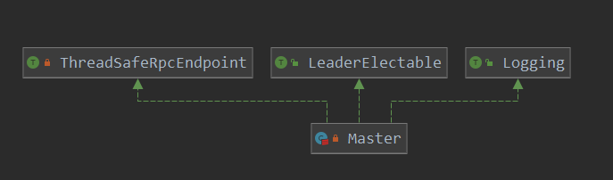

[TOC]

# Master的启动

## Master的启动类

由上面两篇分析可知，最终Master启动是调用类：

> org.apache.spark.deploy.master.Master

类图:



下面咱们就可以master的启动流程：

```scala
private[deploy] object Master extends Logging {
  val SYSTEM_NAME = "sparkMaster"
  val ENDPOINT_NAME = "Master"
  // master启动入口
  def main(argStrings: Array[String]) {
      // 设置线程对于未处理线程的处理函数
    Thread.setDefaultUncaughtExceptionHandler(new SparkUncaughtExceptionHandler(
      exitOnUncaughtException = false))
      // 日志相关的处理
    Utils.initDaemon(log)
    // 创建一个 application config
    // 1.SparkConf构造器中加载了 System.getProperties中所有以 spark开头的配置
    val conf = new SparkConf
    // 包装命令行参数
    val args = new MasterArguments(argStrings, conf)
    //
    val (rpcEnv, _, _) = startRpcEnvAndEndpoint(args.host, args.port, args.webUiPort, conf)
    // 等待停止
    rpcEnv.awaitTermination()
  }
```

可以做了这么几件事：

1. 设置线程未捕获异常处理函数
2. 日志初始化
3. 创建SparkConf
4. 解析命令行参数
5. 创建RPCEndpoint并启动
6. 等待，防止线程退出

### SparkConf的创建

咱们就从第三步继续分析：

> org.apache.spark.SparkConf

```scala
// 主构造函数 
class SparkConf(loadDefaults: Boolean) extends Cloneable with Logging with Serializable
// 辅助构造器
def this() = this(true)
```

```scala
// 存储配置的容器
private val settings = new ConcurrentHashMap[String, String]()
 // 通过构造器 设置的是true
if (loadDefaults) {
    // 从System中加载配置
    loadFromSystemProperties(false)
}

// 加载配置
private[spark] def loadFromSystemProperties(silent: Boolean): SparkConf = {
    // Load any spark.* system properties
    // 遍历System.getProperties中所有以  spark开头的配置
    for ((key, value) <- Utils.getSystemProperties if key.startsWith("spark.")) {
        // 设置配置到 setting中
        set(key, value, silent)
    }
    this
}
// 存储配置
private[spark] def set(key: String, value: String, silent: Boolean): SparkConf = {
    if (key == null) {
      throw new NullPointerException("null key")
    }
    if (value == null) {
      throw new NullPointerException("null value for " + key)
    }
    // 对于已经废弃的配置,是否打印警告信息
    if (!silent) {
      logDeprecationWarning(key)
    }
    // 设置属性到 setting中
    settings.put(key, value)
    this
  }
```

对于已经废弃的配置打印井盖信息:

```scala
def logDeprecationWarning(key: String): Unit = {
    // 已经废弃配置
    deprecatedConfigs.get(key).foreach { cfg =>
      logWarning(
        s"The configuration key '$key' has been deprecated as of Spark ${cfg.version} and " +
        s"may be removed in the future. ${cfg.deprecationMessage}")
      return
    }
    // 打印可选的配置
    allAlternatives.get(key).foreach { case (newKey, cfg) =>
      logWarning(
        s"The configuration key '$key' has been deprecated as of Spark ${cfg.version} and " +
        s"may be removed in the future. Please use the new key '$newKey' instead.")
      return
    }
    // 如果key为 spark.akka开头 或 spark.ssl.akka,则直接打印warnning
    if (key.startsWith("spark.akka") || key.startsWith("spark.ssl.akka")) {
      logWarning(
        s"The configuration key $key is not supported anymore " +
          s"because Spark doesn't use Akka since 2.0")
    }
  }
```

```scala
// 已经废弃配置的初始化
private val deprecatedConfigs: Map[String, DeprecatedConfig] = {
    // 创建已经废弃配置的 序列
    val configs = Seq(
      DeprecatedConfig("spark.cache.class", "0.8",
        "The spark.cache.class property is no longer being used! Specify storage levels using " +
        "the RDD.persist() method instead."),
      DeprecatedConfig("spark.yarn.user.classpath.first", "1.3",
        "Please use spark.{driver,executor}.userClassPathFirst instead."),
      DeprecatedConfig("spark.kryoserializer.buffer.mb", "1.4",
        "Please use spark.kryoserializer.buffer instead. The default value for " +
          "spark.kryoserializer.buffer.mb was previously specified as '0.064'. Fractional values " +
          "are no longer accepted. To specify the equivalent now, one may use '64k'."),
      DeprecatedConfig("spark.rpc", "2.0", "Not used anymore."),
      DeprecatedConfig("spark.scheduler.executorTaskBlacklistTime", "2.1.0",
        "Please use the new blacklisting options, spark.blacklist.*"),
      DeprecatedConfig("spark.yarn.am.port", "2.0.0", "Not used anymore"),
      DeprecatedConfig("spark.executor.port", "2.0.0", "Not used anymore"),
      DeprecatedConfig("spark.shuffle.service.index.cache.entries", "2.3.0",
        "Not used anymore. Please use spark.shuffle.service.index.cache.size"),
      DeprecatedConfig("spark.yarn.credentials.file.retention.count", "2.4.0", "Not used anymore."),
      DeprecatedConfig("spark.yarn.credentials.file.retention.days", "2.4.0", "Not used anymore.")
    )
    // 把创建的序列转换为map,DeprecatedConfig.key, value为 DeprecatedConfig
    Map(configs.map { cfg => (cfg.key -> cfg) } : _*)
  }
```

有可替代的配置

```scala
// allAlternatives 是configsWithAlternatives转换后的结果
  private val allAlternatives: Map[String, (String, AlternateConfig)] = {
    configsWithAlternatives.keys.flatMap { key =>
      configsWithAlternatives(key).map { cfg => (cfg.key -> (key -> cfg)) }
    }.toMap
  }


private val configsWithAlternatives = Map[String, Seq[AlternateConfig]](
    "spark.executor.userClassPathFirst" -> Seq(
        AlternateConfig("spark.files.userClassPathFirst", "1.3")),
    "spark.history.fs.update.interval" -> Seq(
        AlternateConfig("spark.history.fs.update.interval.seconds", "1.4"),
        AlternateConfig("spark.history.fs.updateInterval", "1.3"),
        AlternateConfig("spark.history.updateInterval", "1.3")),
    "spark.history.fs.cleaner.interval" -> Seq(
        AlternateConfig("spark.history.fs.cleaner.interval.seconds", "1.4")),
    MAX_LOG_AGE_S.key -> Seq(
        AlternateConfig("spark.history.fs.cleaner.maxAge.seconds", "1.4")),
    "spark.yarn.am.waitTime" -> Seq(
        AlternateConfig("spark.yarn.applicationMaster.waitTries", "1.3",
                        // Translate old value to a duration, with 10s wait time per try.
                        translation = s => s"${s.toLong * 10}s")),
    "spark.reducer.maxSizeInFlight" -> Seq(
        AlternateConfig("spark.reducer.maxMbInFlight", "1.4")),
    "spark.kryoserializer.buffer" -> Seq(
        AlternateConfig("spark.kryoserializer.buffer.mb", "1.4",
                        translation = s => s"${(s.toDouble * 1000).toInt}k")),
    "spark.kryoserializer.buffer.max" -> Seq(
        AlternateConfig("spark.kryoserializer.buffer.max.mb", "1.4")),
    "spark.shuffle.file.buffer" -> Seq(
        AlternateConfig("spark.shuffle.file.buffer.kb", "1.4")),
    "spark.executor.logs.rolling.maxSize" -> Seq(
        AlternateConfig("spark.executor.logs.rolling.size.maxBytes", "1.4")),
    "spark.io.compression.snappy.blockSize" -> Seq(
        AlternateConfig("spark.io.compression.snappy.block.size", "1.4")),
    "spark.io.compression.lz4.blockSize" -> Seq(
        AlternateConfig("spark.io.compression.lz4.block.size", "1.4")),
    "spark.rpc.numRetries" -> Seq(
        AlternateConfig("spark.akka.num.retries", "1.4")),
    "spark.rpc.retry.wait" -> Seq(
        AlternateConfig("spark.akka.retry.wait", "1.4")),
    "spark.rpc.askTimeout" -> Seq(
        AlternateConfig("spark.akka.askTimeout", "1.4")),
    "spark.rpc.lookupTimeout" -> Seq(
        AlternateConfig("spark.akka.lookupTimeout", "1.4")),
    "spark.streaming.fileStream.minRememberDuration" -> Seq(
        AlternateConfig("spark.streaming.minRememberDuration", "1.5")),
    "spark.yarn.max.executor.failures" -> Seq(
        AlternateConfig("spark.yarn.max.worker.failures", "1.5")),
    MEMORY_OFFHEAP_ENABLED.key -> Seq(
        AlternateConfig("spark.unsafe.offHeap", "1.6")),
    "spark.rpc.message.maxSize" -> Seq(
        AlternateConfig("spark.akka.frameSize", "1.6")),
    "spark.yarn.jars" -> Seq(
        AlternateConfig("spark.yarn.jar", "2.0")),
    "spark.yarn.access.hadoopFileSystems" -> Seq(
        AlternateConfig("spark.yarn.access.namenodes", "2.2")),
    MAX_REMOTE_BLOCK_SIZE_FETCH_TO_MEM.key -> Seq(
        AlternateConfig("spark.reducer.maxReqSizeShuffleToMem", "2.3")),
    LISTENER_BUS_EVENT_QUEUE_CAPACITY.key -> Seq(
        AlternateConfig("spark.scheduler.listenerbus.eventqueue.size", "2.3")),
    DRIVER_MEMORY_OVERHEAD.key -> Seq(
        AlternateConfig("spark.yarn.driver.memoryOverhead", "2.3")),
    EXECUTOR_MEMORY_OVERHEAD.key -> Seq(
        AlternateConfig("spark.yarn.executor.memoryOverhead", "2.3"))
)
```

到这里，sparkConf的构建就完成了，咱们继续向下：

### 参数的解析

看第四步:  解析命令行参数;

> val args = new MasterArguments(argStrings, conf)

```scala
// 主构造函数
private[master] class MasterArguments(args: Array[String], conf: SparkConf) extends Logging

// 构造体
// 获取 local hostName
  var host = Utils.localHostName()
  // master 端口号
  var port = 7077
  // master web端口号
  var webUiPort = 8080
  // 记录参数中传递的配置文件路径
  var propertiesFile: String = null

  // Check for settings in environment variables
  if (System.getenv("SPARK_MASTER_IP") != null) {
    logWarning("SPARK_MASTER_IP is deprecated, please use SPARK_MASTER_HOST")
    // 如果设置了 SPARK_MASTER_IP,则覆盖host
    host = System.getenv("SPARK_MASTER_IP")
  }

  if (System.getenv("SPARK_MASTER_HOST") != null) {
    // 使用SPARK_MASTER_HOST 此配置设置 host
    host = System.getenv("SPARK_MASTER_HOST")
  }
  if (System.getenv("SPARK_MASTER_PORT") != null) {
    // 使用配置的 SPARK_MASTER_PORT作为port
    port = System.getenv("SPARK_MASTER_PORT").toInt
  }
  if (System.getenv("SPARK_MASTER_WEBUI_PORT") != null) {
    // 使用配置的 SPARK_MASTER_WEBUI_PORT 作为web prot
    webUiPort = System.getenv("SPARK_MASTER_WEBUI_PORT").toInt
  }
  // 解析参数
  parse(args.toList)

  // This mutates the SparkConf, so all accesses to it must be made after this line
  propertiesFile = Utils.loadDefaultSparkProperties(conf, propertiesFile)

  if (conf.contains("spark.master.ui.port")) {
    webUiPort = conf.get("spark.master.ui.port").toInt
  }
```

参数解析:

```scala
  @tailrec
// 参数的解析; 使用match来进行list的匹配
  private def parse(args: List[String]): Unit = args match {
    case ("--ip" | "-i") :: value :: tail =>
      Utils.checkHost(value)
      host = value
      parse(tail)
    case ("--host" | "-h") :: value :: tail =>
      Utils.checkHost(value)
      host = value
      parse(tail)
    case ("--port" | "-p") :: IntParam(value) :: tail =>
      port = value
      parse(tail)
    case "--webui-port" :: IntParam(value) :: tail =>
      webUiPort = value
      parse(tail)
    case ("--properties-file") :: value :: tail =>
      propertiesFile = value
      parse(tail)
    // 打印帮助信息
    case ("--help") :: tail =>
      printUsageAndExit(0)  // 打印帮助信息
    case Nil => // No-op
    case _ =>
      printUsageAndExit(1)
  }
```

### Rpc的初始化

参数就解析完了，继续向下看， 第五步： 创建Rpc

> ```scala
> val (rpcEnv, _, _) = startRpcEnvAndEndpoint(args.host, args.port, args.webUiPort, conf)
> ```

```scala
  /**
   * Start the Master and return a three tuple of:
   *   (1) The Master RpcEnv
   *   (2) The web UI bound port
   *   (3) The REST server bound port, if any
   *  此处 javadoc说最终返回一个三元组,内容为:(RpcEnv, webUiPort,rest-Server-port)
   */
  def startRpcEnvAndEndpoint(
      host: String,
      port: Int,
      webUiPort: Int,
      conf: SparkConf): (RpcEnv, Int, Option[Int]) = {
      // 创建securityManager; 此处先略过, 不做分析
    val securityMgr = new SecurityManager(conf)
    // 创建rpcEnv
    val rpcEnv = RpcEnv.create(SYSTEM_NAME, host, port, conf, securityMgr)
    // 设置 endPoint; 也就是把 Master注册到 dispatcher
    // 也可以看出, 此处是 Master的创建的地方
    val masterEndpoint = rpcEnv.setupEndpoint(ENDPOINT_NAME,
      new Master(rpcEnv, rpcEnv.address, webUiPort, securityMgr, conf))
    // 发送消息
    val portsResponse = masterEndpoint.askSync[BoundPortsResponse](BoundPortsRequest)
    (rpcEnv, portsResponse.webUIPort, portsResponse.restPort)
  }
```

此处主要的工作:

1. 创建SecurityManager
2. 创建RpcEnv
3. 设置创建的RpcEnv的Endpoint为创建的Master
4. masterEndpoint 发送消息
5. 返回创建的RpcEnv  webUIPort  restPort

这里咱们就先不看securityManager(毕竟不是重点，先看具体的业务逻辑)，直接从第二步开始:

#### RpcEnv的创建

```scala
def create(
    name: String,
    host: String,
    port: Int,
    conf: SparkConf,
    securityManager: SecurityManager,
    clientMode: Boolean = false): RpcEnv = {
    // 调用另一个方法
    create(name, host, host, port, conf, securityManager, 0, clientMode)
}

def create(
    name: String,
    bindAddress: String,
    advertiseAddress: String,
    port: Int,
    conf: SparkConf,
    securityManager: SecurityManager,
    numUsableCores: Int,
    clientMode: Boolean): RpcEnv = {
    // 使用RpcEnvConfig吧参数封装起来
    val config = RpcEnvConfig(conf, name, bindAddress, advertiseAddress, port, securityManager,
                              numUsableCores, clientMode)
    new NettyRpcEnvFactory().create(config) // 使用NettyRpcEnvFactory工厂类创建
}
// 封装配置
private[spark] case class RpcEnvConfig(
    conf: SparkConf,
    name: String,
    bindAddress: String,
    advertiseAddress: String,
    port: Int,
    securityManager: SecurityManager,
    numUsableCores: Int,
    clientMode: Boolean)
```

NettyRpcFactory创建NettyEnv的方式:

```scala
def create(config: RpcEnvConfig): RpcEnv = {
    val sparkConf = config.conf
    // Use JavaSerializerInstance in multiple threads is safe. However, if we plan to support
    // KryoSerializer in future, we have to use ThreadLocal to store SerializerInstance
    // 序列化的方式
    val javaSerializerInstance =
    new JavaSerializer(sparkConf).newInstance().asInstanceOf[JavaSerializerInstance]
    // RpcEnv的创建,此会创建Dispatcher(发送信息到对应的endpoint)
    // 绑定webUi
    val nettyEnv =
    new NettyRpcEnv(sparkConf, javaSerializerInstance, config.advertiseAddress,
                    config.securityManager, config.numUsableCores)
    // 此主要是创建一个启动server的 函数
    if (!config.clientMode) {
        val startNettyRpcEnv: Int => (NettyRpcEnv, Int) = { actualPort =>
            nettyEnv.startServer(config.bindAddress, actualPort)
            (nettyEnv, nettyEnv.address.port)
        }
        try {
            // 真正上面创建的启动server的地方; 启动master的Rpc
            Utils.startServiceOnPort(config.port, startNettyRpcEnv, sparkConf, config.name)._1
        } catch {
            case NonFatal(e) =>
            nettyEnv.shutdown()
            throw e
        }
    }
    nettyEnv
}
```


