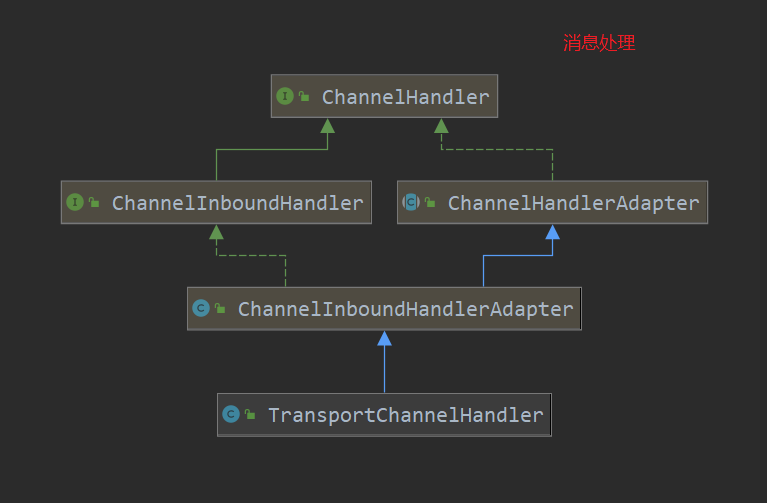

[TOC]

# Master的rpc跟netty整合

上篇分析了master的rpc的启动，启动完成后就可以处理消息了。那么问题来了：我们都知道低版本的spark是使用akka(其底层仍然是封装了netty)来作为通信的工具，高版本直接使用了netty；也就是说消息一般都是通过netty来接收发送的，那么master是感知netty接收消息，并进行处理的呢？

好了，本篇就来分析一下，master rpc的自定义类是如何整合到netty的。

仍然从master rpc的创建开始：

```scala
def startRpcEnvAndEndpoint(
    host: String,
    port: Int,
    webUiPort: Int,
    conf: SparkConf): (RpcEnv, Int, Option[Int]) = {
    val securityMgr = new SecurityManager(conf)
    // 创建rpcEnv
    // 1. dispatcher 用于分发消息
    // 2. 创建 master rpc server
    val rpcEnv = RpcEnv.create(SYSTEM_NAME, host, port, conf, securityMgr)
    // 设置 endPoint; 也就是把 Master注册到 dispatcher
    // 这里真正创建了Master
    // 注册 master的RpcEndpoint 到 dispatcher
    val masterEndpoint = rpcEnv.setupEndpoint(ENDPOINT_NAME,
         new Master(rpcEnv, rpcEnv.address, webUiPort, securityMgr, conf))
    // MasterEndpoint 发送消息 BoundPortsRequest  端口绑定请求
    val portsResponse = masterEndpoint.askSync[BoundPortsResponse](BoundPortsRequest)
    (rpcEnv, portsResponse.webUIPort, portsResponse.restPort)
}
```

```scala
  def create(
      name: String,
      host: String,
      port: Int,
      conf: SparkConf,
      securityManager: SecurityManager,
      clientMode: Boolean = false): RpcEnv = {
    create(name, host, host, port, conf, securityManager, 0, clientMode)
  }

  def create(
      name: String,
      bindAddress: String,
      advertiseAddress: String,
      port: Int,
      conf: SparkConf,
      securityManager: SecurityManager,
      numUsableCores: Int,
      clientMode: Boolean): RpcEnv = {
    // 使用RpcEnvConfig吧参数封装起来
    val config = RpcEnvConfig(conf, name, bindAddress, advertiseAddress, port, securityManager,
      numUsableCores, clientMode)
    // 此处会创建 server-即 master的rpc
    new NettyRpcEnvFactory().create(config) // 使用NettyRpcEnvFactory工厂类创建
  }
```

```scala
  def create(config: RpcEnvConfig): RpcEnv = {
    val sparkConf = config.conf
    // Use JavaSerializerInstance in multiple threads is safe. However, if we plan to support
    // KryoSerializer in future, we have to use ThreadLocal to store SerializerInstance
    // 序列化方式
    val javaSerializerInstance =
      new JavaSerializer(sparkConf).newInstance().asInstanceOf[JavaSerializerInstance]
    // NettyRpcEnv 其保存了各个RpcEndpoint 以及 Dispatcher(用于发送消息)
      // 重点关注此函数
    val nettyEnv =
      new NettyRpcEnv(sparkConf, javaSerializerInstance, config.advertiseAddress,
        config.securityManager, config.numUsableCores)
    // 这里相当于定义了一个启动 server的函数
      // 还有此 启动的函数
    if (!config.clientMode) {
      val startNettyRpcEnv: Int => (NettyRpcEnv, Int) = { actualPort =>
        nettyEnv.startServer(config.bindAddress, actualPort)
        (nettyEnv, nettyEnv.address.port)
      }
      try {
        // 此处才是真实调用上面 创建的启动server函数的地方
        Utils.startServiceOnPort(config.port, startNettyRpcEnv, sparkConf, config.name)._1
      } catch {
        case NonFatal(e) =>
          nettyEnv.shutdown()
          throw e
      }
    }
    nettyEnv
  }
```

上面的函数都在前面分析过，注释也比较清楚，就不在此多说了，咱们直接看比较重点的方法：

> NettyRpcEnv的创建
>
> new NettyRpcEnv(sparkConf, javaSerializerInstance, config.advertiseAddress,
>         config.securityManager, config.numUsableCores)

```scala
// 构造器和 初始化 方法体
private[netty] class NettyRpcEnv(
    val conf: SparkConf,
    javaSerializerInstance: JavaSerializerInstance,
    host: String,
    securityManager: SecurityManager,
    numUsableCores: Int) extends RpcEnv(conf) with Logging 

  private[netty] val transportConf = SparkTransportConf.fromSparkConf(
    conf.clone.set("spark.rpc.io.numConnectionsPerPeer", "1"),
    "rpc",
    conf.getInt("spark.rpc.io.threads", numUsableCores))
  // 创建dispatcher,  保存各个 RpcEndpoint 并对消息进行路由
 // 此dispatcher 是个重点
  private val dispatcher: Dispatcher = new Dispatcher(this, numUsableCores)

  private val streamManager = new NettyStreamManager(this)
	// 此 在这里也是重点
// TransportContext 就是和netty整合的关键
// NettyRpcHandler 对netty消息的真正处理
// 看一下此类的构建
  private val transportContext = new TransportContext(transportConf,
    new NettyRpcHandler(dispatcher, this, streamManager))

  private def createClientBootstraps(): java.util.List[TransportClientBootstrap] = {
    if (securityManager.isAuthenticationEnabled()) {
      java.util.Arrays.asList(new AuthClientBootstrap(transportConf,
        securityManager.getSaslUser(), securityManager))
    } else {
      java.util.Collections.emptyList[TransportClientBootstrap]
    }
  }
  // 创建客户端连接的工厂方法
  private val clientFactory = transportContext.createClientFactory(createClientBootstraps())

  @volatile private var fileDownloadFactory: TransportClientFactory = _
    // 单个后台定时线程池
  val timeoutScheduler = ThreadUtils.newDaemonSingleThreadScheduledExecutor("netty-rpc-env-timeout")

  // 客户端的连接线程池
  // 和其他 节点连接的endpoint 都存储在这里
  private[netty] val clientConnectionExecutor = ThreadUtils.newDaemonCachedThreadPool(
    "netty-rpc-connection",
    conf.getInt("spark.rpc.connect.threads", 64))
  // master rpc server
  @volatile private var server: TransportServer = _
  // 关闭的标志
  private val stopped = new AtomicBoolean(false)
    // 发送消息的队列
  private val outboxes = new ConcurrentHashMap[RpcAddress, Outbox]()
```

> TransportContext 的构建
>
> org.apache.spark.network.TransportContext#TransportContext

```scala
public TransportContext(TransportConf conf, RpcHandler rpcHandler) {
    this(conf, rpcHandler, false);
  }

  public TransportContext(
      TransportConf conf,
      RpcHandler rpcHandler,
      boolean closeIdleConnections) {
    this.conf = conf;
      // 此处的 field rpcHandler记录了创建了NettyRpcHandler
    this.rpcHandler = rpcHandler;
    this.closeIdleConnections = closeIdleConnections;
  }
```

再看一下 rpc server的启动:

```scala
def startServer(bindAddress: String, port: Int): Unit = {
    val bootstraps: java.util.List[TransportServerBootstrap] =
    if (securityManager.isAuthenticationEnabled()) {
        java.util.Arrays.asList(new AuthServerBootstrap(transportConf, securityManager))
    } else {
        java.util.Collections.emptyList()
    }
    // rpc的server,也是 master绑定的地址
    // 重点 看这里
    server = transportContext.createServer(bindAddress, port, bootstraps)
    // 注册一个 RpcEndpointVerifier 的endpoint
    dispatcher.registerRpcEndpoint(
        RpcEndpointVerifier.NAME, new RpcEndpointVerifier(this, dispatcher))
}
```

> org.apache.spark.network.TransportContext#createServer

```scala
// 可以看到创建server其实就是创建了一个 TransportServer
public TransportServer createServer(
    String host, int port, List<TransportServerBootstrap> bootstraps) {
    // 创建 TransportServer,其下面是 bootstrapServer
    // 这里的 rpcHandler 其实就是上面创建transportContext时传入的 NettyRpcHandler
    return new TransportServer(this, host, port, rpcHandler, bootstraps);
}
```

看createServer和TransportContext有没有发现什么相同点?

createServer是TransportContext的一个方法，而且创建server时，就是调用的上面刚创建好的transportContext，所以createServer.rpcHandler 参数就是 NettyRpcHandler。

继续往下：

```scala
  public TransportServer(
      TransportContext context,
      String hostToBind,
      int portToBind,
      RpcHandler appRpcHandler,
      List<TransportServerBootstrap> bootstraps) {
    this.context = context;
    this.conf = context.getConf();
    // 记录了 rpc的处理器
      // 此处的处理器 就是 NettyRpcHandler
      // 重点
    this.appRpcHandler = appRpcHandler;
    this.bootstraps = Lists.newArrayList(Preconditions.checkNotNull(bootstraps));
    boolean shouldClose = true;
    try {
      // 初始化
        // 重点
      init(hostToBind, portToBind);
      shouldClose = false;
    } finally {
      if (shouldClose) {
        JavaUtils.closeQuietly(this);
      }
    }
  }
```

```scala
  private void init(String hostToBind, int portToBind) {

    IOMode ioMode = IOMode.valueOf(conf.ioMode());
    EventLoopGroup bossGroup = NettyUtils.createEventLoop(ioMode, 1,
      conf.getModuleName() + "-boss");
    EventLoopGroup workerGroup =  NettyUtils.createEventLoop(ioMode, conf.serverThreads(),
      conf.getModuleName() + "-server");
    PooledByteBufAllocator allocator = NettyUtils.createPooledByteBufAllocator(
      conf.preferDirectBufs(), true /* allowCache */, conf.serverThreads());
    // netty Server的创建
    bootstrap = new ServerBootstrap()
      .group(bossGroup, workerGroup)
      .channel(NettyUtils.getServerChannelClass(ioMode))
      .option(ChannelOption.ALLOCATOR, allocator)
      .option(ChannelOption.SO_REUSEADDR, !SystemUtils.IS_OS_WINDOWS)
      .childOption(ChannelOption.ALLOCATOR, allocator);

    this.metrics = new NettyMemoryMetrics(
      allocator, conf.getModuleName() + "-server", conf);

    if (conf.backLog() > 0) {
      bootstrap.option(ChannelOption.SO_BACKLOG, conf.backLog());
    }

    if (conf.receiveBuf() > 0) {
      bootstrap.childOption(ChannelOption.SO_RCVBUF, conf.receiveBuf());
    }

    if (conf.sendBuf() > 0) {
      bootstrap.childOption(ChannelOption.SO_SNDBUF, conf.sendBuf());
    }
    // 添加自定义的 处理函数
      // 重点
    bootstrap.childHandler(new ChannelInitializer<SocketChannel>() {
      @Override
      protected void initChannel(SocketChannel ch) {
          // 此处的 appRpcHandler 就是上面的NettyRpcHandler
        RpcHandler rpcHandler = appRpcHandler;
        for (TransportServerBootstrap bootstrap : bootstraps) {
          rpcHandler = bootstrap.doBootstrap(ch, rpcHandler);
        }
          // 这里就是把 自定义的 NettyRpcHandler 注册到 netty中
          // 重点
        context.initializePipeline(ch, rpcHandler);
      }
    });
    // 创建地址
    InetSocketAddress address = hostToBind == null ?
        new InetSocketAddress(portToBind): new InetSocketAddress(hostToBind, portToBind);
    // 地址绑定
    channelFuture = bootstrap.bind(address);
    channelFuture.syncUninterruptibly();
    port = ((InetSocketAddress) channelFuture.channel().localAddress()).getPort();
    logger.debug("Shuffle server started on port: {}", port);
  }
```

这里咱们看一下， 具体的注册动作：

```scala
public TransportChannelHandler initializePipeline(
    SocketChannel channel,
    RpcHandler channelRpcHandler) {
    try {
        // 这里把自定义的 RpcHandler 包装为了 TransportChannelHandler
        // 重点
        // 看一下此时如何操作的
        TransportChannelHandler channelHandler = createChannelHandler(channel, channelRpcHandler);
        // 链式调用
        // 注册 编解码器 以及 idleStateHandler  以及 自定义的 handler
        channel.pipeline()
        .addLast("encoder", ENCODER)	// 编码器
        .addLast(TransportFrameDecoder.HANDLER_NAME, NettyUtils.createFrameDecoder())
        .addLast("decoder", DECODER)	// 解码器
        .addLast("idleStateHandler", new IdleStateHandler(0, 0, conf.connectionTimeoutMs() / 1000))	// idle handler
        .addLast("handler", channelHandler);	// 自定义的处理器
        return channelHandler;
    } catch (RuntimeException e) {
        logger.error("Error while initializing Netty pipeline", e);
        throw e;
    }
}
```

```scala
// 创建自定义处理器
private TransportChannelHandler createChannelHandler(Channel channel, RpcHandler rpcHandler) {
    // 发出消息的处理
    TransportResponseHandler responseHandler = new TransportResponseHandler(channel);
    // 对外发送消息的包装
    TransportClient client = new TransportClient(channel, responseHandler);
    // 接收消息的处理
    TransportRequestHandler requestHandler = new TransportRequestHandler(channel, client,  rpcHandler, conf.maxChunksBeingTransferred());
    // 消息的处理
    return new TransportChannelHandler(client, responseHandler, requestHandler,
        conf.connectionTimeoutMs(), closeIdleConnections);
}
```

看一下TransportChannelHandler的类图：



是不是清晰很多，此就是netty编程相关的，自定义消息处理器。当netty接收到消息，会最终由此类来处理，而此TransportChannelHandler内部对消息的处理最终都委托给TransportRequestHandler也就是rpcHandler来进行处理；rpcHandler其实就是NettyRpcHandler。