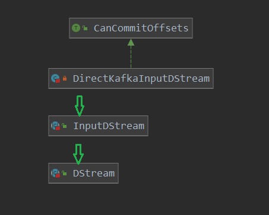

[TOC]

# KafkaUtils创建的DStream解析

本篇看一下spark streaming和kafka的整合使用。本篇就以spark example中一个示例，来看一下这个DStream的作用。

```scala
object DirectKafkaWordCount {
  def main(args: Array[String]) {
    if (args.length < 3) {
      System.err.println(s"""
        |Usage: DirectKafkaWordCount <brokers> <groupId> <topics>
        |  <brokers> is a list of one or more Kafka brokers
        |  <groupId> is a consumer group name to consume from topics
        |  <topics> is a list of one or more kafka topics to consume from
        |
        """.stripMargin)
      System.exit(1)
    }
	// 设置日志级别
    StreamingExamples.setStreamingLogLevels()
	// 获取参数
    val Array(brokers, groupId, topics) = args

    // Create context with 2 second batch interval
    val sparkConf = new SparkConf().setAppName("DirectKafkaWordCount")
    val ssc = new StreamingContext(sparkConf, Seconds(2))

    // Create direct kafka stream with brokers and topics
      // kakfa参数设置
    val topicsSet = topics.split(",").toSet
    val kafkaParams = Map[String, Object](
      ConsumerConfig.BOOTSTRAP_SERVERS_CONFIG -> brokers,
      ConsumerConfig.GROUP_ID_CONFIG -> groupId,
      ConsumerConfig.KEY_DESERIALIZER_CLASS_CONFIG -> classOf[StringDeserializer],
      ConsumerConfig.VALUE_DESERIALIZER_CLASS_CONFIG -> classOf[StringDeserializer])
      // 创建DStream
    val messages = KafkaUtils.createDirectStream[String, String](
      ssc,
      LocationStrategies.PreferConsistent,
      ConsumerStrategies.Subscribe[String, String](topicsSet, kafkaParams))

    // Get the lines, split them into words, count the words and print
      // 获取从kafka获取的 record,进行进一步的处理
    val lines = messages.map(_.value)
    val words = lines.flatMap(_.split(" "))
    val wordCounts = words.map(x => (x, 1L)).reduceByKey(_ + _)
    wordCounts.print()

    // Start the computation
      // 开始运行
    ssc.start()
      // 等待运行结束
    ssc.awaitTermination()
  }
}
```

看起来寥寥几行代码，脉络也比较清晰，下面就先从StreamingContext的创建开始，之后再看一下创建DStream的地方开始看其工作把。

StreamingContext的创建：

> org.apache.spark.streaming.StreamingContext#this

```scala
// 创建 StreamingContext
// 先调用 StreamingContext.createNewSparkContext 创建了 sparkContext
def this(conf: SparkConf, batchDuration: Duration) = {
    // 创建了一个sparkContext, 设置checkpoint为null,记录了一下 batchDuration
    this(StreamingContext.createNewSparkContext(conf), null, batchDuration)
}


// 创建 sparkContext
private[streaming] def createNewSparkContext(conf: SparkConf): SparkContext = {
    new SparkContext(conf)
}
```

之后就调用主构造函数进行初始化了:

```scala
class StreamingContext private[streaming] (
    _sc: SparkContext,
    _cp: Checkpoint,
    _batchDur: Duration
  ) extends Logging {
  // 1. 是否设置了  checkpoint dir
  private[streaming] val isCheckpointPresent: Boolean = _cp != null
  // 2.sparkContext的创建
  private[streaming] val sc: SparkContext = {
    if (_sc != null) {
      _sc
    } else if (isCheckpointPresent) {
      SparkContext.getOrCreate(_cp.createSparkConf())
    } else {
      throw new SparkException("Cannot create StreamingContext without a SparkContext")
    }
  }

  if (sc.conf.get("spark.master") == "local" || sc.conf.get("spark.master") == "local[1]") {
    logWarning("spark.master should be set as local[n], n > 1 in local mode if you have receivers" +
      " to get data, otherwise Spark jobs will not get resources to process the received data.")
  }
  // 3.sparkConf配置
  private[streaming] val conf = sc.conf
  // 4.env
  private[streaming] val env = sc.env
  // 5.创建 graph,其中包括了各个数据接收器和输出器,会根据输入和输出器来生成任务
  private[streaming] val graph: DStreamGraph = {
    if (isCheckpointPresent) {
      _cp.graph.setContext(this)
      _cp.graph.restoreCheckpointData()
      _cp.graph
    } else {
      require(_batchDur != null, "Batch duration for StreamingContext cannot be null")
      // 创建了一个新的  DStreamGraph
      val newGraph = new DStreamGraph()
      // 设置了 batch的时间
      newGraph.setBatchDuration(_batchDur)
      newGraph
    }
  }
  // 6.inputStream 的id生成器
  private val nextInputStreamId = new AtomicInteger(0)
  // 7.checkpoint 的目录
  private[streaming] var checkpointDir: String = {
    if (isCheckpointPresent) {
      sc.setCheckpointDir(_cp.checkpointDir)
      _cp.checkpointDir
    } else {
      null
    }
  }
  // 8.checkpoint的 duration,即保持时间
  private[streaming] val checkpointDuration: Duration = {
    if (isCheckpointPresent) _cp.checkpointDuration else graph.batchDuration
  }
  // 9.job 调度器
  private[streaming] val scheduler = new JobScheduler(this)
  // 10.waiter 函数,一个等待结束的函数
  private[streaming] val waiter = new ContextWaiter
  // 11.处理过程的监听器, 会更新提交的任务,完成的任务等信息
  private[streaming] val progressListener = new StreamingJobProgressListener(this)
 // 12. 向ui 注册信息使用 
  private[streaming] val uiTab: Option[StreamingTab] =
    sparkContext.ui match {
      case Some(ui) => Some(new StreamingTab(this, ui))
      case None => None
    }
  /* Initializing a streamingSource to register metrics */
  // streamingSource
  // 13.  streamingSource 检测信息的使用
  private val streamingSource = new StreamingSource(this)
  // 14. 更新当前的状态
  private var state: StreamingContextState = INITIALIZED
  // 保存 创建DStream 的调用stack
  private val startSite = new AtomicReference[CallSite](null)

  // Copy of thread-local properties from SparkContext. These properties will be set in all tasks
  // submitted by this StreamingContext after start.
  // 15.保存从 sparkContext中获取的 threadLocal 配置,用于设置到所有的task中使用
  private[streaming] val savedProperties = new AtomicReference[Properties](new Properties)
  //
  private[streaming] def getStartSite(): CallSite = startSite.get()
  // 16.关闭的回调函数
  private var shutdownHookRef: AnyRef = _

  conf.getOption("spark.streaming.checkpoint.directory").foreach(checkpoint)
}
```

总的来说还是做了很多的工作的，比较重要的死活 graph的创建，并且向graph中设置了每个批次的时间。

下面看一下创建DStream的操作：

```scala
val messages = KafkaUtils.createDirectStream[String, String](
      ssc,
      LocationStrategies.PreferConsistent,
      ConsumerStrategies.Subscribe[String, String](topicsSet, kafkaParams))
```

> org.apache.spark.streaming.kafka010.KafkaUtils#createDirectStream

```scala
  def createDirectStream[K, V](
      ssc: StreamingContext,
      locationStrategy: LocationStrategy,
      consumerStrategy: ConsumerStrategy[K, V]
    ): InputDStream[ConsumerRecord[K, V]] = {
    // 创建一个默认的 限流器
    val ppc = new DefaultPerPartitionConfig(ssc.sparkContext.getConf)
    // 创建 directStream
    createDirectStream[K, V](ssc, locationStrategy, consumerStrategy, ppc)
  }
```

> org.apache.spark.streaming.kafka010.KafkaUtils#createDirectStream

```scala
  @Experimental
  def createDirectStream[K, V](
      ssc: StreamingContext,
      locationStrategy: LocationStrategy,
      consumerStrategy: ConsumerStrategy[K, V],
      perPartitionConfig: PerPartitionConfig
    ): InputDStream[ConsumerRecord[K, V]] = {
      // 创建了一个 DirectKafkaInputDStream
    new DirectKafkaInputDStream[K, V](ssc, locationStrategy, consumerStrategy, perPartitionConfig)
  }
```

可以看到这里就创建了一个DirectKafkaInputDStream返回了。看一下此类的DirectKafkaInputDStream初始化：

```scala
private[spark] class DirectKafkaInputDStream[K, V](
    _ssc: StreamingContext,
    locationStrategy: LocationStrategy,
    consumerStrategy: ConsumerStrategy[K, V],
    ppc: PerPartitionConfig
  ) extends InputDStream[ConsumerRecord[K, V]](_ssc) with Logging with CanCommitOffsets {
  // 初始拉取消息数
  private val initialRate = context.sparkContext.getConf.getLong(
    "spark.streaming.backpressure.initialRate", 0)
  // executor kakfa 的参数
  val executorKafkaParams = {
    val ekp = new ju.HashMap[String, Object](consumerStrategy.executorKafkaParams)
    // 重新设置了一下要发送给 executor的 kakfa配置
    KafkaUtils.fixKafkaParams(ekp)
    ekp
  }
  // 存储偏移信息
  protected var currentOffsets = Map[TopicPartition, Long]()

  @transient private var kc: Consumer[K, V] = null
      // 持久化的信息
  protected[streaming] override val checkpointData =
    new DirectKafkaInputDStreamCheckpointData
    
        // 速率控制器
  override protected[streaming] val rateController: Option[RateController] = {
    if (RateController.isBackPressureEnabled(ssc.conf)) {
      Some(new DirectKafkaRateController(id,
        RateEstimator.create(ssc.conf, context.graph.batchDuration)))
    } else {
      None
    }
  }
  // 存储要提交的数据
  protected val commitQueue = new ConcurrentLinkedQueue[OffsetRange]
  protected val commitCallback = new AtomicReference[OffsetCommitCallback]
    
}
```

其类图:



可以看到其是DStream和InputStream的子类，这里也看一下这两个类的初始化：

> InputDStream

```scala
abstract class InputDStream[T: ClassTag](_ssc: StreamingContext)
  extends DStream[T](_ssc) {

  private[streaming] var lastValidTime: Time = null
  // 这里把 InputDStream 也就是  DirectKafkaInputDStream 注册到了 graph中
  ssc.graph.addInputStream(this)

  /** This is a unique identifier for the input stream. */
  val id = ssc.getNewInputStreamId()

  // Keep track of the freshest rate for this stream using the rateEstimator
  protected[streaming] val rateController: Option[RateController] = None
  protected[streaming] override val baseScope: Option[String] = {
    val scopeName = Option(ssc.sc.getLocalProperty(SparkContext.RDD_SCOPE_KEY))
      .map { json => RDDOperationScope.fromJson(json).name + s" [$id]" }
      .getOrElse(name.toLowerCase(Locale.ROOT))
    Some(new RDDOperationScope(scopeName).toJson)
  }      
}
```

这里**注意**哦，ssc.graph.addInputStream(this) 把自己注册到了 graph中的inputStream中。

> DStream

```scala
abstract class DStream[T: ClassTag] (
    @transient private[streaming] var ssc: StreamingContext
  ) extends Serializable with Logging {

  validateAtInit()
      // 生成的 RDD
  @transient
  private[streaming] var generatedRDDs = new HashMap[Time, RDD[T]]()

  // Time zero for the DStream
  private[streaming] var zeroTime: Time = null

  // Duration for which the DStream will remember each RDD created
  private[streaming] var rememberDuration: Duration = null

  // Storage level of the RDDs in the stream
  private[streaming] var storageLevel: StorageLevel = StorageLevel.NONE

  // Checkpoint details
  private[streaming] val mustCheckpoint = false
  private[streaming] var checkpointDuration: Duration = null
  // checkpoint的处理
  private[streaming] val checkpointData = new DStreamCheckpointData(this)
  @transient
  private var restoredFromCheckpointData = false

  // Reference to whole DStream graph
  // 记录注册的 graph
  private[streaming] var graph: DStreamGraph = null
  // 获取 DStream 的创建 调用栈
  private[streaming] val creationSite = DStream.getCreationSite()

  protected[streaming] val baseScope: Option[String] = {
    Option(ssc.sc.getLocalProperty(SparkContext.RDD_SCOPE_KEY))
  }
}
```

这个分析一下创建的DirectKafkaInputDStream的计算具体工作，主要看一下start和compute方法：

> org.apache.spark.streaming.kafka010.DirectKafkaInputDStream#start

```scala
  // 开始
  override def start(): Unit = {
    // 创建consumer
    val c = consumer
    // 设置各个partition的offset为最小
    paranoidPoll(c)
    if (currentOffsets.isEmpty) {
      // 记录最先的 topic中partition中对应的offset
      currentOffsets = c.assignment().asScala.map { tp =>
        tp -> c.position(tp)
      }.toMap
    }
  }
```

> org.apache.spark.streaming.kafka010.DirectKafkaInputDStream#consumer

```scala
  // 使用已经的consumer,或创建
  def consumer(): Consumer[K, V] = this.synchronized {
    if (null == kc) {
      // 这里会使用不同的消费策略来进行初始化,
      // 1. 创建KafkaConsumer
      // 2. 设置topic的 offset
      kc = consumerStrategy.onStart(currentOffsets.mapValues(l => new java.lang.Long(l)).asJava)
    }
    kc
  }
```

> org.apache.spark.streaming.kafka010.Subscribe#onStart

```scala
 // 策略开始执行
  def onStart(currentOffsets: ju.Map[TopicPartition, jl.Long]): Consumer[K, V] = {
    // 创建consumer
    val consumer = new KafkaConsumer[K, V](kafkaParams)
    // 订阅主题
    consumer.subscribe(topics)
    // 要设置的 offset信息
      // 如果onStart函数 参数为空,则使用Subscribe 策略类的构造参数 offset
      // 如果currentOffsets 则使用currentOffsets
    val toSeek = if (currentOffsets.isEmpty) {
        // 此是参数中 带的offset
      offsets
    } else {
      currentOffsets
    }
      // 如果toSeek不为空,则说明存在要设置offset的 partition
    if (!toSeek.isEmpty) {
      // work around KAFKA-3370 when reset is none
      // poll will throw if no position, i.e. auto offset reset none and no explicit position
      // but cant seek to a position before poll, because poll is what gets subscription partitions
      // So, poll, suppress the first exception, then seek
      val aor = kafkaParams.get(ConsumerConfig.AUTO_OFFSET_RESET_CONFIG)
      val shouldSuppress =
        aor != null && aor.asInstanceOf[String].toUpperCase(Locale.ROOT) == "NONE"
      try {
        // 消费消息
        consumer.poll(0)
      } catch {
        case x: NoOffsetForPartitionException if shouldSuppress =>
          logWarning("Catching NoOffsetForPartitionException since " +
            ConsumerConfig.AUTO_OFFSET_RESET_CONFIG + " is none.  See KAFKA-3370")
      }
      // 设置topic的offset地址
      toSeek.asScala.foreach { case (topicPartition, offset) =>
          consumer.seek(topicPartition, offset)
      }
      // we've called poll, we must pause or next poll may consume messages and set position
      // 先暂停消费
      consumer.pause(consumer.assignment())
    }
	// 返回创建的 consumer
    consumer
  }
```

> org.apache.spark.streaming.kafka010.DirectKafkaInputDStream#paranoidPoll

```scala
    // 此次主要是再次设置每一个topic的offset为最小的
  private def paranoidPoll(c: Consumer[K, V]): Unit = {
    // don't actually want to consume any messages, so pause all partitions
      // 暂停消费所有的partition
    c.pause(c.assignment())
    // 消费消息
    val msgs = c.poll(0)
    if (!msgs.isEmpty) {
      // position should be minimum offset per topicpartition
      // 根据消费的消息,记录消息中对应的topic的partition的最下offset
      // 这里的acc用于存储最后的结果,和foldLeft 算子有关
      msgs.asScala.foldLeft(Map[TopicPartition, Long]()) { (acc, m) =>
        // 创建 TopicPartition
        val tp = new TopicPartition(m.topic, m.partition)
        // 先去acc中获取,并 和消费到的 offset对比, 选小的
        val off = acc.get(tp).map(o => Math.min(o, m.offset)).getOrElse(m.offset)
        // 最后记录到 acc中
        acc + (tp -> off)
        // 下面的foreach 又是对acc的遍历
      }.foreach { case (tp, off) =>
          logInfo(s"poll(0) returned messages, seeking $tp to $off to compensate")
        // 设置 topic的offset
        // 此处就是根据acc 设置topic的offset
          c.seek(tp, off)
      }
    }
  }
```

可以看到start最主要的工作有几个:

1. 创建了consumer，如果设置了offset呢，会在创建consumer后，重新设置offset
2. 设置了订阅的partition到最记录中最下的offset
3. 记录现在的partition-> offset 信息到 currentOffsets

下面看一下此rdd的具体计算了:

> org.apache.spark.streaming.kafka010.DirectKafkaInputDStream#compute

```scala
 // 此就是 rdd的计算了
  override def compute(validTime: Time): Option[KafkaRDD[K, V]] = {
    // 此是得到了每个partition 可以拉取的最大数量
    val untilOffsets = clamp(latestOffsets())
    // 此创建了一个 OffsetRange,其中包含了要拉取的partition的 start end区间
    val offsetRanges = untilOffsets.map { case (tp, uo) =>
      val fo = currentOffsets(tp)
      OffsetRange(tp.topic, tp.partition, fo, uo)
    }
    // 是否使用 consumerCache
    val useConsumerCache = context.conf.getBoolean("spark.streaming.kafka.consumer.cache.enabled",
      true)
    // 创建了一个KafkaRDD
    val rdd = new KafkaRDD[K, V](context.sparkContext, executorKafkaParams, offsetRanges.toArray,
      getPreferredHosts, useConsumerCache)
    // Report the record number and metadata of this batch interval to InputInfoTracker.
    // 1.过滤掉那些 offsetRanges是空的
    // 2.然后创建了一个字符串,其中包含了要消费的一些信息
    val description = offsetRanges.filter { offsetRange =>
      // Don't display empty ranges.
      offsetRange.fromOffset != offsetRange.untilOffset
    }.map { offsetRange =>
      s"topic: ${offsetRange.topic}\tpartition: ${offsetRange.partition}\t" +
        s"offsets: ${offsetRange.fromOffset} to ${offsetRange.untilOffset}"
    }.mkString("\n")
    // Copy offsetRanges to immutable.List to prevent from being modified by the user
    val metadata = Map(
      "offsets" -> offsetRanges.toList,
      StreamInputInfo.METADATA_KEY_DESCRIPTION -> description)
    val inputInfo = StreamInputInfo(id, rdd.count, metadata)
    // 把inputInfo注册 inputInfoTracker
    ssc.scheduler.inputInfoTracker.reportInfo(validTime, inputInfo)

    currentOffsets = untilOffsets
    commitAll()
    Some(rdd)
  }
```

>org.apache.spark.streaming.kafka010.DirectKafkaInputDStream#latestOffsets

```scala
    // 获取最新的可用的partition对应的  offset
    // 感知动态的 分区信息
  protected def latestOffsets(): Map[TopicPartition, Long] = {
    val c = consumer
    paranoidPoll(c)
      // 获取 Set<TopicPartition>
    val parts = c.assignment().asScala

    // make sure new partitions are reflected in currentOffsets
      // 得到新加入的 partition
    val newPartitions = parts.diff(currentOffsets.keySet)

    // Check if there's any partition been revoked because of consumer rebalance.
      // 得到移除的partition
    val revokedPartitions = currentOffsets.keySet.diff(parts)
    if (revokedPartitions.nonEmpty) {
      throw new IllegalStateException(s"Previously tracked partitions " +
        s"${revokedPartitions.mkString("[", ",", "]")} been revoked by Kafka because of consumer " +
        s"rebalance. This is mostly due to another stream with same group id joined, " +
        s"please check if there're different streaming application misconfigure to use same " +
        s"group id. Fundamentally different stream should use different group id")
    }

    // position for new partitions determined by auto.offset.reset if no commit
    currentOffsets = currentOffsets ++ newPartitions.map(tp => tp -> c.position(tp)).toMap

    // find latest available offsets
      // 把所有的topic设置到 最新位置
    c.seekToEnd(currentOffsets.keySet.asJava)
      // 获取到每个partition 最新的offset,并返回
    parts.map(tp => tp -> c.position(tp)).toMap
  }
```

> org.apache.spark.streaming.kafka010.DirectKafkaInputDStream#clamp

```scala
  // limits the maximum number of messages per partition
  protected def clamp(
    offsets: Map[TopicPartition, Long]): Map[TopicPartition, Long] = {
    // 限制每个分区的最大消息数
    maxMessagesPerPartition(offsets).map { mmp =>
      mmp.map { case (tp, messages) =>
        // uo 在这里是最新的offset
          val uo = offsets(tp)
        // currentOffsets(tp) 是设置的offset(如果有的话)
      // currentOffsets(tp) + messages 就是一个endOffset,也就是根据速率算出来的最终此次任务可以消费到的位置
          tp -> Math.min(currentOffsets(tp) + messages, uo)
      }
    }.getOrElse(offsets)
  }
```

> org.apache.spark.streaming.kafka010.DirectKafkaInputDStream#maxMessagesPerPartition

```scala
 // 每个分区数能获得的 最大消息数
  protected[streaming] def maxMessagesPerPartition(
    offsets: Map[TopicPartition, Long]): Option[Map[TopicPartition, Long]] = {
    val estimatedRateLimit = rateController.map { x => {
      val lr = x.getLatestRate()
      if (lr > 0) lr else initialRate
    }}

    // calculate a per-partition rate limit based on current lag
    val effectiveRateLimitPerPartition = estimatedRateLimit.filter(_ > 0) match {
      case Some(rate) =>
        //  first_set_____________other message______________________latest
        // 此时计算 没有消费过的消息,即lag
        val lagPerPartition = offsets.map { case (tp, offset) =>
          tp -> Math.max(offset - currentOffsets(tp), 0)
        }
        // 总共的lag,各个分区的相加
        val totalLag = lagPerPartition.values.sum

        lagPerPartition.map { case (tp, lag) =>
          // 得到每个分区最大的值
          val maxRateLimitPerPartition = ppc.maxRatePerPartition(tp)
          // 计算每个分区的速率
          val backpressureRate = lag / totalLag.toDouble * rate
          // 如果maxRateLimitPerPartition 存在,取 maxRateLimitPerPartition和backpressureRate中比较小的
          // 如果不存在,则使用backpressureRate
          tp -> (if (maxRateLimitPerPartition > 0) {
            Math.min(backpressureRate, maxRateLimitPerPartition)} else backpressureRate)
        }
        // 没有合适的速率,则使用默认的速率 maxRate = conf.getLong("spark.streaming.kafka.maxRatePerPartition", 0)
      case None => offsets.map { case (tp, offset) => tp -> ppc.maxRatePerPartition(tp).toDouble }
    }

    if (effectiveRateLimitPerPartition.values.sum > 0) {
      // 每个批次是几秒
      val secsPerBatch = context.graph.batchDuration.milliseconds.toDouble / 1000
      Some(effectiveRateLimitPerPartition.map {
            // 再次计算 每个分区的 最大速率
            // 如果这里最大速率没有最小速率大,则使用最小速率minRate
            // val minRate = conf.getLong("spark.streaming.kafka.minRatePerPartition", 1)
        case (tp, limit) => tp -> Math.max((secsPerBatch * limit).toLong,
          ppc.minRatePerPartition(tp))
      })
    } else {
      None
    }
  }
```

这四个函数就比较重要了，其先使用latestOffsets获取了每一个partition最大的offset，之后maxMessagesPerPartition来计算每个partition可以获取的消息的速率，即每秒可以拉取多少条，clamp根据速率计算出此次任务可以消费到的最大的offset是多少，也就是在这里就指定了任务可用的获取到的消息的数量。

```scala
// 此是得到了每个partition 可以拉取的最大数量
val untilOffsets = clamp(latestOffsets())
```

此方法的威力可见一斑。

之后使用了OffsetRange包装了对应topic对应的每个partition可以消费的offset范围。

```scala
// 此创建了一个 OffsetRange,其中包含了要拉取的partition的 start end区间
val offsetRanges = untilOffsets.map { case (tp, uo) =>
    // 获取offset的开始位置
    val fo = currentOffsets(tp)
          // uo 是offset的结束位置
    OffsetRange(tp.topic, tp.partition, fo, uo)
}
```

```scala
// 是否使用 consumerCache
val useConsumerCache = context.conf.getBoolean("spark.streaming.kafka.consumer.cache.enabled",
                                               true)
// 创建了一个KafkaRDD
val rdd = new KafkaRDD[K, V](context.sparkContext, executorKafkaParams, offsetRanges.toArray,
                             getPreferredHosts, useConsumerCache)
```

这里就创建了一个KafkaRdd。这里的 executorKafkaParams比较特殊，看见对传递到executor的kakfa参数进行了修改：

```scala
  // executor kakfa 的参数
  val executorKafkaParams = {
    val ekp = new ju.HashMap[String, Object](consumerStrategy.executorKafkaParams)
    // 重新设置了一下要发送给 executor的 kakfa配置
    KafkaUtils.fixKafkaParams(ekp)
    ekp
  }
```

> org.apache.spark.streaming.kafka010.KafkaUtils#fixKafkaParams

```scala
    // 发送给executor的 kafka参数
  private[kafka010] def fixKafkaParams(kafkaParams: ju.HashMap[String, Object]): Unit = {
    logWarning(s"overriding ${ConsumerConfig.ENABLE_AUTO_COMMIT_CONFIG} to false for executor")
      // 1.设置不可以自动提交  enable.auto.commit=false
    kafkaParams.put(ConsumerConfig.ENABLE_AUTO_COMMIT_CONFIG, false: java.lang.Boolean)

    logWarning(s"overriding ${ConsumerConfig.AUTO_OFFSET_RESET_CONFIG} to none for executor")
      // 2.设置 auto.offset.reset = none
    kafkaParams.put(ConsumerConfig.AUTO_OFFSET_RESET_CONFIG, "none")

    // driver and executor should be in different consumer groups
      // 获取groupId
    val originalGroupId = kafkaParams.get(ConsumerConfig.GROUP_ID_CONFIG)
    if (null == originalGroupId) {
      logError(s"${ConsumerConfig.GROUP_ID_CONFIG} is null, you should probably set it")
    }
      // 3.设置新的groupid为 spark-executor- + originalGroupId
    val groupId = "spark-executor-" + originalGroupId
    logWarning(s"overriding executor ${ConsumerConfig.GROUP_ID_CONFIG} to ${groupId}")
    kafkaParams.put(ConsumerConfig.GROUP_ID_CONFIG, groupId)

    // possible workaround for KAFKA-3135
    val rbb = kafkaParams.get(ConsumerConfig.RECEIVE_BUFFER_CONFIG)
    if (null == rbb || rbb.asInstanceOf[java.lang.Integer] < 65536) {
      logWarning(s"overriding ${ConsumerConfig.RECEIVE_BUFFER_CONFIG} to 65536 see KAFKA-3135")
      // 4.设置 receive.buffer.bytes = 65536
      kafkaParams.put(ConsumerConfig.RECEIVE_BUFFER_CONFIG, 65536: java.lang.Integer)
    }
  }
```

这里关闭了自动提交，设置auto.offset.reset为None，同样修改了groupId；因为提交offset的操作在driver进行操作，而offset已经为每一个任务设置好了，不需要在reset，修改groupId因为executor中的所有task属于同一个消费组，而driver是另一个消费组，它们的作用和功能不一样。


```scala
  // 1.过滤掉那些 offsetRanges是空的
    // 2.然后创建了一个字符串,其中包含了要消费的一些信息
    val description = offsetRanges.filter { offsetRange =>
      // Don't display empty ranges.
      offsetRange.fromOffset != offsetRange.untilOffset
    }.map { offsetRange =>
      s"topic: ${offsetRange.topic}\tpartition: ${offsetRange.partition}\t" +
        s"offsets: ${offsetRange.fromOffset} to ${offsetRange.untilOffset}"
    }.mkString("\n")
    // Copy offsetRanges to immutable.List to prevent from being modified by the user
    val metadata = Map(
      "offsets" -> offsetRanges.toList,
      StreamInputInfo.METADATA_KEY_DESCRIPTION -> description)
    val inputInfo = StreamInputInfo(id, rdd.count, metadata)
    // 把inputInfo注册 inputInfoTracker
    ssc.scheduler.inputInfoTracker.reportInfo(validTime, inputInfo)
```

这里是记录StreamInputInfo到 inputInfoTracker中，保持对任务的一个信息追踪。

```scala
currentOffsets = untilOffsets
commitAll()
Some(rdd)
```

最后会执行一次offset提交操作.

看到此DirectKafkaInputDStream的compute计算，重点三大工作：

1. 计算每一个partition的消费offset  开始和结束位置
2. 创建KafkaRDD
3. 提交offset

下面咱们在看一下这个offset的提交。来DirectKafkaInputDStream还有一个父类CanCommitOffsets：

```scala
private[spark] class DirectKafkaInputDStream[K, V](
    _ssc: StreamingContext,
    locationStrategy: LocationStrategy,
    consumerStrategy: ConsumerStrategy[K, V],
    ppc: PerPartitionConfig
  ) extends InputDStream[ConsumerRecord[K, V]](_ssc) with Logging with CanCommitOffsets 
```

此类作用:

```scala
@Experimental
trait CanCommitOffsets {

  @Experimental
  def commitAsync(offsetRanges: Array[OffsetRange]): Unit

  @Experimental
  def commitAsync(offsetRanges: Array[OffsetRange], callback: OffsetCommitCallback): Unit
}
```

可以看到此类是一个接口类，主要用于offset的提交。这里看下载DirectKafkaInputDStream的实现：

```scala
// 提交操作
def commitAsync(offsetRanges: Array[OffsetRange]): Unit = {
    commitAsync(offsetRanges, null)
}
```

```scala
// 存储要提交的数据
protected val commitQueue = new ConcurrentLinkedQueue[OffsetRange]
protected val commitCallback = new AtomicReference[OffsetCommitCallback]  

def commitAsync(offsetRanges: Array[OffsetRange], callback: OffsetCommitCallback): Unit = {
    commitCallback.set(callback)
    commitQueue.addAll(ju.Arrays.asList(offsetRanges: _*))
}
```

可以看到最终的提交操作，其实就是把offsetRanges提交到了一个队列中commitQueue。具体的提交在哪里呢？

上面在compute计算中，最后调用了一个commitAll的操作，其就是提交操作：

```scala
  // 真正提交 offset的地方
  protected def commitAll(): Unit = {
    // 创建一个容器,用于保存要提交的offset
    val m = new ju.HashMap[TopicPartition, OffsetAndMetadata]()
    // 从队列中获取offset
    var osr = commitQueue.poll()
    while (null != osr) {
      val tp = osr.topicPartition
      val x = m.get(tp)
      // 如果m中没有,则使用 osr.untilOffset
      // 如果m中已经存在了,则使用一个 值大的一个
      val offset = if (null == x) { osr.untilOffset } else { Math.max(x.offset, osr.untilOffset) }
      // 保存起来
      m.put(tp, new OffsetAndMetadata(offset))
      // 继续获取
      osr = commitQueue.poll()
    }
    // 如果存在offset呢
    // 那就进行提交了
    if (!m.isEmpty) {
      consumer.commitAsync(m, commitCallback.get)
    }
  }
```

对DirectKafkaInputDStream的解析就到这里，可以看到其应该是在Driver端运行的，主要用来生成KafkaRdd。


