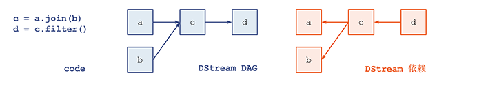

[TOC]

# sparkStreaming的任务提交

本地的任务提交主要是分析spark-streaming 和kafka整合时的情况，如果是sparkStreaming和socket，file整合有些不同，不过整体是可以借鉴的。后面会分析一下socket情况下的实现。

分析前，在回顾下连个主要点：

1，DirectKafkaInputDStream初始化时的一个注册操作

```scala
// 在 InputDStream中的一个注册操作
ssc.graph.addInputStream(this)
```

2，demo中的action动作

```scala
val messages = KafkaUtils.createDirectStream[String, String](
    ssc,
    LocationStrategies.PreferConsistent,
    ConsumerStrategies.Subscribe[String, String](topicsSet, kafkaParams))

// Get the lines, split them into words, count the words and print
// 获取从kafka获取的 record,进行进一步的处理
val lines = messages.map(_.value)
val words = lines.flatMap(_.split(" "))
val wordCounts = words.map(x => (x, 1L)).reduceByKey(_ + _)
wordCounts.print()
```

此处主要是此print操作：

> org.apache.spark.streaming.dstream.DStream#print

```scala
def print(): Unit = ssc.withScope {
    print(10)
}
```

> org.apache.spark.streaming.dstream.DStream#print

```scala
  def print(num: Int): Unit = ssc.withScope {
    def foreachFunc: (RDD[T], Time) => Unit = {
      (rdd: RDD[T], time: Time) => {
        val firstNum = rdd.take(num + 1)
        // scalastyle:off println
        println("-------------------------------------------")
        println(s"Time: $time")
        println("-------------------------------------------")
        firstNum.take(num).foreach(println)
        if (firstNum.length > num) println("...")
        println()
        // scalastyle:on println
      }
    }
    foreachRDD(context.sparkContext.clean(foreachFunc), displayInnerRDDOps = false)
  }
```

```scala
  private def foreachRDD(
      foreachFunc: (RDD[T], Time) => Unit,
      displayInnerRDDOps: Boolean): Unit = {
    new ForEachDStream(this,
      context.sparkContext.clean(foreachFunc, false), displayInnerRDDOps).register()
  }
```

主要就是这里创建了一个 ForEachDStream，以及调用了register的注册操作。先了解这里的注册，以及第一种情况下的注册，下面咱们继续分析。
下面就是流处理的开始了:

> org.apache.spark.streaming.StreamingContext#start

```scala
  def start(): Unit = synchronized {
    state match {
      case INITIALIZED =>
        // DStream.getCreationSite()  获取刚才创建DStream的 调用stack
        startSite.set(DStream.getCreationSite())
        StreamingContext.ACTIVATION_LOCK.synchronized {
          StreamingContext.assertNoOtherContextIsActive()
          try {
            validate()
            // 注册 process 的监听器
            registerProgressListener()
            // Start the streaming scheduler in a new thread, so that thread local properties
            // like call sites and job groups can be reset without affecting those of the
            // current thread.
              // 一个新线程运行任务调度
            ThreadUtils.runInNewThread("streaming-start") {
              sparkContext.setCallSite(startSite.get)
              sparkContext.clearJobGroup()
              sparkContext.setLocalProperty(SparkContext.SPARK_JOB_INTERRUPT_ON_CANCEL, "false")
              savedProperties.set(SerializationUtils.clone(sparkContext.localProperties.get()))
              scheduler.start()
            }
            state = StreamingContextState.ACTIVE
            scheduler.listenerBus.post(
              StreamingListenerStreamingStarted(System.currentTimeMillis()))
          } catch {
            case NonFatal(e) =>
              logError("Error starting the context, marking it as stopped", e)
              scheduler.stop(false)
              state = StreamingContextState.STOPPED
              throw e
          }
            // 更新状态
          StreamingContext.setActiveContext(this)
        }
        logDebug("Adding shutdown hook") // force eager creation of logger
        // 注册关闭回调函数
        shutdownHookRef = ShutdownHookManager.addShutdownHook(
          StreamingContext.SHUTDOWN_HOOK_PRIORITY)(() => stopOnShutdown())
        // Registering Streaming Metrics at the start of the StreamingContext
        assert(env.metricsSystem != null)
        // 注册  监测信息
        env.metricsSystem.registerSource(streamingSource)
        uiTab.foreach(_.attach())
        logInfo("StreamingContext started")
     	..... // 省略非关键
    }
  }
```

这里看一下这个任务调度把:

> org.apache.spark.streaming.scheduler.JobScheduler#start

```scala
  // 任务调度器开始
  def start(): Unit = synchronized {
    if (eventLoop != null) return // scheduler has already been started

    logDebug("Starting JobScheduler")
    // 创建事件处理器  并开始运行
    eventLoop = new EventLoop[JobSchedulerEvent]("JobScheduler") {
      override protected def onReceive(event: JobSchedulerEvent): Unit = processEvent(event)

      override protected def onError(e: Throwable): Unit = reportError("Error in job scheduler", e)
    }
    eventLoop.start()
    // attach rate controllers of input streams to receive batch completion updates
    for {
      inputDStream <- ssc.graph.getInputStreams
      rateController <- inputDStream.rateController
    } ssc.addStreamingListener(rateController)
    // 监听总线 开始
    listenerBus.start()
    // 创建receiveerTracter
    receiverTracker = new ReceiverTracker(ssc)
    // 创建 inputInfotracter
    inputInfoTracker = new InputInfoTracker(ssc)
  //
    val executorAllocClient: ExecutorAllocationClient = ssc.sparkContext.schedulerBackend match {
      case b: ExecutorAllocationClient => b.asInstanceOf[ExecutorAllocationClient]
      case _ => null
    }
    executorAllocationManager = ExecutorAllocationManager.createIfEnabled(
      executorAllocClient,
      receiverTracker,
      ssc.conf,
      ssc.graph.batchDuration.milliseconds,
      clock)
    executorAllocationManager.foreach(ssc.addStreamingListener)
    // receiverTracter 开始
    // 此是和 socket 监听 file监听配合使用的
    receiverTracker.start()
    // 任务生成器 开始
    jobGenerator.start()
    executorAllocationManager.foreach(_.start())
    logInfo("Started JobScheduler")
  }
```

这里主要看一下这个任务生成器的开始：

> org.apache.spark.streaming.scheduler.JobGenerator#start

```scala
   // 开始 生成任务
  def start(): Unit = synchronized {
    if (eventLoop != null) return // generator has already been started

    // Call checkpointWriter here to initialize it before eventLoop uses it to avoid a deadlock.
    // See SPARK-10125
    checkpointWriter
	// 创建了一个 消息监听线程
    eventLoop = new EventLoop[JobGeneratorEvent]("JobGenerator") {
      override protected def onReceive(event: JobGeneratorEvent): Unit = processEvent(event)

      override protected def onError(e: Throwable): Unit = {
        jobScheduler.reportError("Error in job generator", e)
      }
    }
      // 线程运行
    eventLoop.start()
    if (ssc.isCheckpointPresent) {
      restart()
    } else {
      startFirstTime()
    }
  }
```

这里再注意一下，在任务生成器初始化时，也创建了一个任务:

```scala
  // 此是一个后台线程,每间隔一个batch 的时间就发送 GenerateJobs来生成一个job
  // 这也是steaming 按照batch 时间来提交任务的原理
  // 此是一个后天持续运行的任务,其在每个batch 间 会sleep
  private val timer = new RecurringTimer(clock, ssc.graph.batchDuration.milliseconds,
    longTime => eventLoop.post(GenerateJobs(new Time(longTime))), "JobGenerator")
```

看一下此任务的执行：

```scala
private[streaming]
class RecurringTimer(clock: Clock, period: Long, callback: (Long) => Unit, name: String)
  extends Logging {
    // 此创建了一个 后台运行线程
  private val thread = new Thread("RecurringTimer - " + name) {
    setDaemon(true)
    // 线程只是执行函数 loop
    override def run() { loop }
  }

  @volatile private var prevTime = -1L
  @volatile private var nextTime = -1L
  @volatile private var stopped = false

  }
```

可以看到此RecurringTimer创建了一个后台执行，就执行函数loop:

> org.apache.spark.streaming.util.RecurringTimer#loop

```scala
    // 重复执行,
  private def loop() {
    try {
      while (!stopped) {
          // 重复执行,来触发 下一次 action
        triggerActionForNextInterval()
      }
      triggerActionForNextInterval()
    } catch {
      case e: InterruptedException =>
    }
  }
}
```

> org.apache.spark.streaming.util.RecurringTimer#triggerActionForNextInterval

```scala
  // 等待一段时间,然后执行 传递的函数  callback
  private def triggerActionForNextInterval(): Unit = {
    // 线程睡眠
    clock.waitTillTime(nextTime)
    callback(nextTime)
    // 把此处执行时间记录为 前一个时间
    prevTime = nextTime
    // 下一次执行的时间
    // 此period 就是 一个 batch的时间
    nextTime += period
    logDebug("Callback for " + name + " called at time " + prevTime)
  }
```

> org.apache.spark.util.SystemClock#waitTillTime

```scala
  def waitTillTime(targetTime: Long): Long = {
    var currentTime = 0L
    currentTime = System.currentTimeMillis()

    var waitTime = targetTime - currentTime
    if (waitTime <= 0) {
      return currentTime
    }

    val pollTime = math.max(waitTime / 10.0, minPollTime).toLong
    while (true) {
      currentTime = System.currentTimeMillis()
      waitTime = targetTime - currentTime
      if (waitTime <= 0) {
        return currentTime
      }
      val sleepTime = math.min(waitTime, pollTime)
        // 可以看到, 等待就是线程睡眠一段时间
      Thread.sleep(sleepTime)
    }
    -1
  }
```

在看一下持续执行的函数:

```scala
longTime => eventLoop.post(GenerateJobs(new Time(longTime)))
```

此是发送一个GenerateJobs事件到 eventLoop，看一下其如何处理：

> org.apache.spark.streaming.scheduler.JobGenerator#processEvent

```scala
  /** Processes all events */
  private def processEvent(event: JobGeneratorEvent) {
    logDebug("Got event " + event)
    event match {
        // 生成job
      case GenerateJobs(time) => generateJobs(time)
      case ClearMetadata(time) => clearMetadata(time)
        // checkpoint 操作
      case DoCheckpoint(time, clearCheckpointDataLater) =>
        doCheckpoint(time, clearCheckpointDataLater)
        // 清除checkPoint操作
      case ClearCheckpointData(time) => clearCheckpointData(time)
    }
  }
```

> org.apache.spark.streaming.scheduler.JobGenerator#generateJobs

```scala
    // 生成job
  private def generateJobs(time: Time) {
    // Checkpoint all RDDs marked for checkpointing to ensure their lineages are
    // truncated periodically. Otherwise, we may run into stack overflows (SPARK-6847).
    ssc.sparkContext.setLocalProperty(RDD.CHECKPOINT_ALL_MARKED_ANCESTORS, "true")
    Try {
      // 1. 为任务分配 blockId 以及记录其信息(socket  file 监听)
      jobScheduler.receiverTracker.allocateBlocksToBatch(time) // allocate received blocks to batch
      // 2. 生成job 并提交到集群中去进行执行
      graph.generateJobs(time) // generate jobs using allocated block
    } match {
      case Success(jobs) =>
        // 记录这些job的 信息
        val streamIdToInputInfos = jobScheduler.inputInfoTracker.getInfo(time)
        // 3.成功生成了job, 则提交job
        jobScheduler.submitJobSet(JobSet(time, jobs, streamIdToInputInfos))
      case Failure(e) =>
        jobScheduler.reportError("Error generating jobs for time " + time, e)
        PythonDStream.stopStreamingContextIfPythonProcessIsDead(e)
    }
    eventLoop.post(DoCheckpoint(time, clearCheckpointDataLater = false))
  }
```

这里很重要啊，主要做了一下几个工作：

1. receiverTracker.allocateBlocksToBatch 分配block到batch，此跟  socket监听流有关，此处不展开
2. graph.generateJobs  生成job，并提交到集群去执行
3. jobScheduler.submitJobSet  对生成的job 在driver端进行进一步的处理，一般是调用action的算子，如：foreach，print

此处看一下job的生成:

> org.apache.spark.streaming.DStreamGraph#generateJobs

```scala
 // 生成job  也就是任务
  def generateJobs(time: Time): Seq[Job] = {
    logDebug("Generating jobs for time " + time)
    val jobs = this.synchronized {
      // 根据注册到 outputStreams 中的 DStream 来创建任务
      outputStreams.flatMap { outputStream =>
        val jobOption = outputStream.generateJob(time)
        jobOption.foreach(_.setCallSite(outputStream.creationSite))
        jobOption
      }
    }
    logDebug("Generated " + jobs.length + " jobs for time " + time)
    jobs
  }
```

看到哦，这里是调用outputStreams来生成job，那这个outputStreams 是如何添加进来的呢？

开篇说action算子最后调用一个register的操作，就是在这个register中注册的：

> org.apache.spark.streaming.dstream.DStream#register

```scala
    // 注册此DStream到  context的graph的outputStream
  private[streaming] def register(): DStream[T] = {
    ssc.graph.addOutputStream(this)
    this
  }
```

之后开始调用generateJob生成job，那这个是如何调用的呢？

还记得前面是谁调用此register的，就是ForEachDStream，看一下此函数：

> org.apache.spark.streaming.dstream.ForEachDStream#generateJob

```scala
  override def generateJob(time: Time): Option[Job] = {
    parent.getOrCompute(time) match {
      case Some(rdd) =>
        val jobFunc = () => createRDDWithLocalProperties(time, displayInnerRDDOps) {
          foreachFunc(rdd, time)
        }
        Some(new Job(time, jobFunc))
      case None => None
    }
  }
```

这里就是调用parent的getOrCompute，还记得前面的demo中的操作：

```scala
val lines = messages.map(_.value)
val words = lines.flatMap(_.split(" "))
val wordCounts = words.map(x => (x, 1L)).reduceByKey(_ + _)
wordCounts.print()
```

此处就跟spark-core中的很相似了，DAG生成时使用的是反向，即从结果往前生成的：



此处即是:  wordCounts -> words -> lines -> messages  即最后调用到 DirectKafkaInputDStream的generateJob，此函数：

> org.apache.spark.streaming.dstream.DStream#generateJob

```scala
    // 如果是streaming -kakfa,当前是 DirectKafkaInputDStream,调用其comput创建一个 KafkaRDD,并把其
    // 作为任务提交到 集群中执行
  private[streaming] def generateJob(time: Time): Option[Job] = {
    // 创建 DirectKafkaInputDStream 的comput方法来创建一个 KafkaRDD
      getOrCompute(time) match {
      case Some(rdd) =>
        val jobFunc = () => {
          val emptyFunc = { (iterator: Iterator[T]) => {} }
          // 真正提交streaming 任务
          context.sparkContext.runJob(rdd, emptyFunc)
        }
        Some(new Job(time, jobFunc))
      case None => None
    }
  }
```

context.sparkContext.runJob 此就是spark-core的操作了，就不展开了。

提交任务后集群后，返回了一个job，看如何对此job进行进一步处理：

> org.apache.spark.streaming.scheduler.JobGenerator#generateJobs

```scala
 private def generateJobs(time: Time) {
    // Checkpoint all RDDs marked for checkpointing to ensure their lineages are
    // truncated periodically. Otherwise, we may run into stack overflows (SPARK-6847).
    ssc.sparkContext.setLocalProperty(RDD.CHECKPOINT_ALL_MARKED_ANCESTORS, "true")
    Try {
      // 为任务分配 blockId 以及记录其信息
      jobScheduler.receiverTracker.allocateBlocksToBatch(time) // allocate received blocks to batch
      // 生成job 并提交到集群中去进行执行
      graph.generateJobs(time) // generate jobs using allocated block
    } match {
      case Success(jobs) =>
        // 记录这些job的 信息
        val streamIdToInputInfos = jobScheduler.inputInfoTracker.getInfo(time)
        // 成功生成了job, 则提交job
        jobScheduler.submitJobSet(JobSet(time, jobs, streamIdToInputInfos))
      case Failure(e) =>
        jobScheduler.reportError("Error generating jobs for time " + time, e)
        PythonDStream.stopStreamingContextIfPythonProcessIsDead(e)
    }
    eventLoop.post(DoCheckpoint(time, clearCheckpointDataLater = false))
  }
```

> org.apache.spark.streaming.scheduler.JobScheduler#submitJobSet

```scala
  // 对job进行处理
  def submitJobSet(jobSet: JobSet) {
    if (jobSet.jobs.isEmpty) {
      logInfo("No jobs added for time " + jobSet.time)
    } else {
      listenerBus.post(StreamingListenerBatchSubmitted(jobSet.toBatchInfo))
      jobSets.put(jobSet.time, jobSet)
        // 把所有job提交到线程池中去运行
      jobSet.jobs.foreach(job => jobExecutor.execute(new JobHandler(job)))
      logInfo("Added jobs for time " + jobSet.time)
    }
  }
```

> org.apache.spark.streaming.scheduler.JobScheduler.JobHandler#run

```scala
    def run() {
      val oldProps = ssc.sparkContext.getLocalProperties
      try {
        ssc.sparkContext.setLocalProperties(SerializationUtils.clone(ssc.savedProperties.get()))
        val formattedTime = UIUtils.formatBatchTime(
          job.time.milliseconds, ssc.graph.batchDuration.milliseconds, showYYYYMMSS = false)
        val batchUrl = s"/streaming/batch/?id=${job.time.milliseconds}"
        val batchLinkText = s"[output operation ${job.outputOpId}, batch time ${formattedTime}]"

        ssc.sc.setJobDescription(
          s"""Streaming job from <a href="$batchUrl">$batchLinkText</a>""")
        ssc.sc.setLocalProperty(BATCH_TIME_PROPERTY_KEY, job.time.milliseconds.toString)
        ssc.sc.setLocalProperty(OUTPUT_OP_ID_PROPERTY_KEY, job.outputOpId.toString)
        // Checkpoint all RDDs marked for checkpointing to ensure their lineages are
        // truncated periodically. Otherwise, we may run into stack overflows (SPARK-6847).
        ssc.sparkContext.setLocalProperty(RDD.CHECKPOINT_ALL_MARKED_ANCESTORS, "true")

        // We need to assign `eventLoop` to a temp variable. Otherwise, because
        // `JobScheduler.stop(false)` may set `eventLoop` to null when this method is running, then
        // it's possible that when `post` is called, `eventLoop` happens to null.
        var _eventLoop = eventLoop
        if (_eventLoop != null) {
          // 发送消息 JobStarted
          _eventLoop.post(JobStarted(job, clock.getTimeMillis()))
          // 执行job 的具体任务,即action操作,如 foreach  print
          SparkHadoopWriterUtils.disableOutputSpecValidation.withValue(true) {
              // 调用job 的run方法进行处理
            job.run()
          }
          _eventLoop = eventLoop
          if (_eventLoop != null) {
            // 发送 JobCompleted 消息
            _eventLoop.post(JobCompleted(job, clock.getTimeMillis()))
          }
        } else {
          // JobScheduler has been stopped.
        }
      } finally {
        ssc.sparkContext.setLocalProperties(oldProps)
      }
    }
```

```scala
private[streaming]
class Job(val time: Time, func: () => _) {
  private var _id: String = _
  private var _outputOpId: Int = _
  private var isSet = false
  private var _result: Try[_] = null
  private var _callSite: CallSite = null
  private var _startTime: Option[Long] = None
  private var _endTime: Option[Long] = None

  def run() {
    _result = Try(func())
  }
    ...
}
```

看一下此job参数中的func函数是什么:

> org.apache.spark.streaming.dstream.DStream#generateJob

```scala
    // 如果是streaming -kakfa,当前是 DirectKafkaInputDStream,调用其comput创建一个 KafkaRDD,并把其
    // 作为任务提交到 集群中执行
  private[streaming] def generateJob(time: Time): Option[Job] = {
    // 创建 DirectKafkaInputDStream 的comput方法来创建一个 KafkaRDD
      getOrCompute(time) match {
      case Some(rdd) =>
        val jobFunc = () => {
          val emptyFunc = { (iterator: Iterator[T]) => {} }
          // 真正提交streaming 任务
          context.sparkContext.runJob(rdd, emptyFunc)
        }
        Some(new Job(time, jobFunc))
      case None => None
    }
  }

// 可以看到func其实就是 jobFunc, 而jobFunc函数体:
	/* () => {
          val emptyFunc = { (iterator: Iterator[T]) => {} }
          // 真正提交streaming 任务
          context.sparkContext.runJob(rdd, emptyFunc)
        }
        
        即真正提交任务到集群
      */
```


小结一下此生成任务到集群去运行，其实现一个固定时间作为一个批次（batch）来执行任务，核心是通过一个RecurringTimer的后台任务，固定时间唤醒，发送一个生成任务的job提交到集群中运行，其他时间执行sleep操作进行睡眠。


