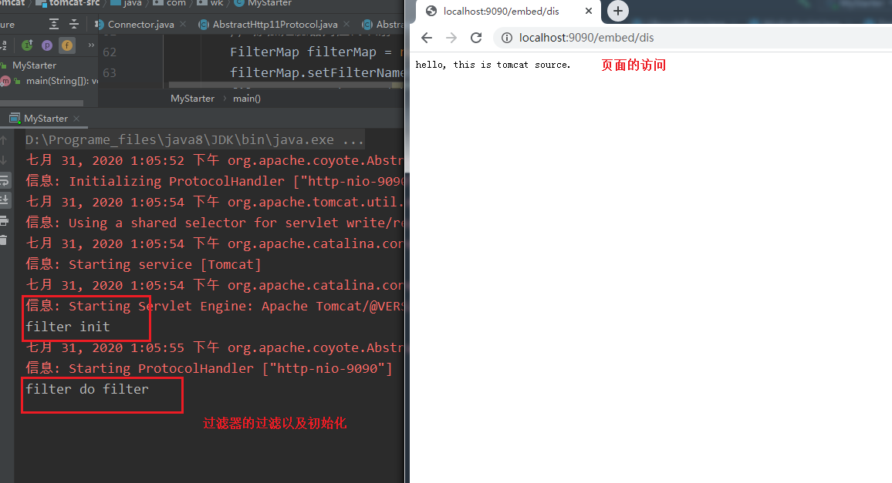

[TOC]

# tomcat  分析入口

今天开始[2020-07-31]就开始分析tomcat的架构源码系列的第一篇，作为第一篇，这里不讲解框架，本篇只说一个tomcat的编程式demo，后面的章节就会以此为入口来对tomcat进行分析。

```java
public class MyStarter {
    public static void main(String[] args) {
        // 编程式 tomcat的创建
        Tomcat tomcat = new Tomcat();
        tomcat.setHostname("localhost");
        tomcat.setPort(9090);
        Context context = tomcat.addContext("/embed", null);
        HttpServlet httpServlet = new HttpServlet() {
            @Override
            protected void doGet(HttpServletRequest req, HttpServletResponse resp) throws ServletException, IOException {
                resp.getWriter().write("hello, this is tomcat source.");
            }
            @Override
            protected void doPost(HttpServletRequest req, HttpServletResponse resp) throws ServletException, IOException {
                doGet(req, resp);
            }
        };

        Filter filter = new Filter() {
            @Override
            public void init(FilterConfig filterConfig) throws ServletException {
                System.out.println("filter init");
            }
            @Override
            public void doFilter(ServletRequest request, ServletResponse response, FilterChain chain) throws IOException, ServletException {
                System.out.println("filter do filter");
                chain.doFilter(request, response);
            }

            @Override
            public void destroy() {
                System.out.println("destory");
            }
        };
        tomcat.addServlet(context, "dispatch", httpServlet);
        // 添加对应的servlet的映射
        context.addServletMappingDecoded("/dis", "dispatch");
        // 添加过滤器
        FilterDef filterDef = new FilterDef();
        filterDef.setFilter(filter);
        filterDef.setFilterName("myFilter");
        filterDef.addInitParameter("username", "Allen");
        // 添加过滤器对应的映射
        FilterMap filterMap = new FilterMap();
        filterMap.setFilterName("myFilter");
        filterMap.setCharset(Charset.forName("UTF-8"));
        filterMap.addURLPatternDecoded("/");
        filterMap.addServletName("*");
        // 添加filter  以及 filterMap
        context.addFilterDef(filterDef);
        context.addFilterMap(filterMap);

        try{
            tomcat.init();
            tomcat.start();
            // 1. 第一种情况: sleep
            // 2. 开一个serversocket等待接收客户端发送的shutdown命令,接收到命令,则退出
            tomcat.getServer().await();
        } catch (LifecycleException e) {
            e.printStackTrace();
        }
    }
```

总体呢做了下面几件事：

1. 创建Tomcat实例
2. 添加一个context到容器中
3. 创建一个 servlet 和一个filter
4. 注册servlet和filter到容器中
5. 初始化创建的tomcat实例
6. 启动创建的tomcat

使用此编程入口，也同样启动了tomcat，并可以正常访问。

