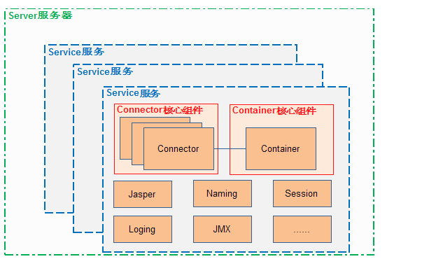
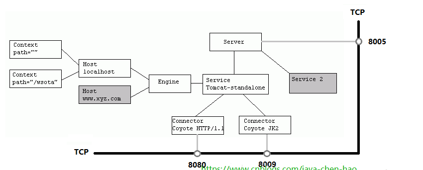
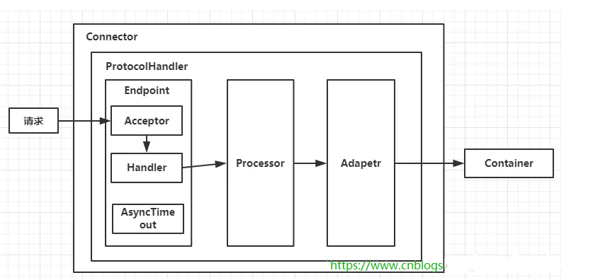
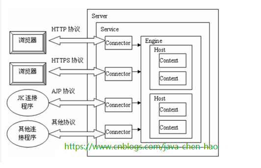
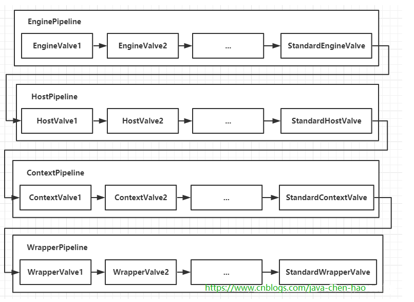
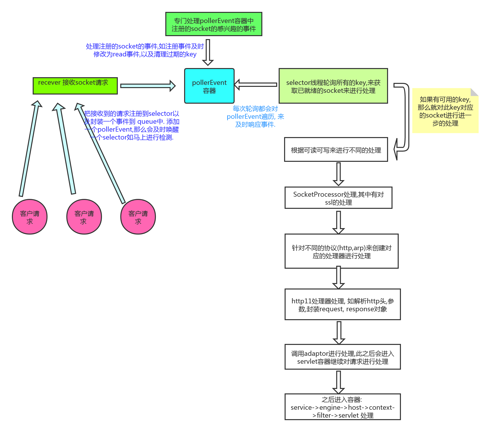

[TOC]

# tomcat的架构

tomcat的总体架构图：

可以从上面的两个图来了解tomcat的整体轮廓，以及组件关系。

1. 每个Tomcat只有一个server
2. server中可以有多个service
3. service中只有一个container，即 engine，但是service中可以有多个connector，connector用于处理客户端的连接以及请求
4. engine中可以有多个host
5. host中可有多个context（每个context表示一个应用）
6. context中有多个servlet

连接器的处理流程：

此图表示了tomcat对连接的处理器流程，以及数据在各个组件间的传递

1. 可以从图2中看出，一个service对应多个connector
2. 具体的socket接收，由Endpoint中的Acceptor来接收
3. 由handler来对socket进行处理，之后再由 processor进一步处理，在之后由 adaptor进行处理，最后传递到容器中，也就是engine，host，context，servlet进行一步一步的处理。
4. 从图2中，也能看出tomcat中各个组件间的关系。

pipeline的处理流程：

此图形象的描述了pipeline的处理，像流水线一样来进行由engine到wrapper中进行处理，而且每一个组件的pipeline中，可以有多个value处理器。

请求处理图:

