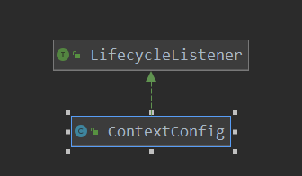

[TOC]

# web.xml文件解析

tomcat对web.xml文件是什么时候解析的呢？ ServletContainerInitializer是什么时候获得的呢？

本篇就来分析一下tomcat对web.xml文件的解析。具体的解析类为 ContextConfig。

先看一下其类图：



可以看到其是一个监听器，所以直接看其对各种事件的处理：

> org.apache.catalina.startup.ContextConfig#lifecycleEvent

```java
// 对各种事件的解析,其中包括了对 web.xml文件的解析
// 从中可以看到,包含了其整个的生命周期
@Override
public void lifecycleEvent(LifecycleEvent event) {

    // Identify the context we are associated with
    try {
        context = (Context) event.getLifecycle();
    } catch (ClassCastException e) {
        log.error(sm.getString("contextConfig.cce", event.getLifecycle()), e);
        return;
    }
    // Process the event that has occurred
    if (event.getType().equals(Lifecycle.CONFIGURE_START_EVENT)) {
        // 配置文件 开始解析
        configureStart();
    } else if (event.getType().equals(Lifecycle.BEFORE_START_EVENT)) {
        beforeStart();
    } else if (event.getType().equals(Lifecycle.AFTER_START_EVENT)) {
        // Restore docBase for management tools
        if (originalDocBase != null) {
            context.setDocBase(originalDocBase);
        }
    } else if (event.getType().equals(Lifecycle.CONFIGURE_STOP_EVENT)) {
        configureStop();
    } else if (event.getType().equals(Lifecycle.AFTER_INIT_EVENT)) {
        init();
    } else if (event.getType().equals(Lifecycle.AFTER_DESTROY_EVENT)) {
        destroy();
    }
}
```

看一下事件的发送：

CONFIGURE_START_EVENT:

> org.apache.catalina.core.StandardServer#startInternal

```java
// server的启动
@Override
protected void startInternal() throws LifecycleException {
    fireLifecycleEvent(CONFIGURE_START_EVENT, null);
    setState(LifecycleState.STARTING);
    globalNamingResources.start();
    // Start our defined Services
    synchronized (servicesLock) {
        for (int i = 0; i < services.length; i++) {
            services[i].start();
        }
    }
}
```

可以看到，在server启动时，发布了CONFIGURE_START_EVENT事件。

> org.apache.catalina.startup.ContextConfig#configureStart

```java
// 开始对配置解析
protected synchronized void configureStart() {
    // Called from StandardContext.start()
    if (log.isDebugEnabled()) {
        log.debug(sm.getString("contextConfig.start"));
    }
    if (log.isDebugEnabled()) {
        log.debug(sm.getString("contextConfig.xmlSettings",
                               context.getName(),
                               Boolean.valueOf(context.getXmlValidation()),
                               Boolean.valueOf(context.getXmlNamespaceAware())));
    }
    // 解析 web.xml 文件
    webConfig();
    // 添加的jsp解析
    context.addServletContainerInitializer(new JasperInitializer(),null);
    if (!context.getIgnoreAnnotations()) {
        applicationAnnotationsConfig();
    }
    if (ok) {
        // 校验 安全规则
        validateSecurityRoles();
    }
    // Configure an authenticator if we need one
    if (ok) {
        // 校验认证规则
        authenticatorConfig();
    }
    // Dump the contents of this pipeline if requested
    if (log.isDebugEnabled()) {
        log.debug("Pipeline Configuration:");
        Pipeline pipeline = context.getPipeline();
        Valve valves[] = null;
        if (pipeline != null) {
            valves = pipeline.getValves();
        }
        if (valves != null) {
            for (int i = 0; i < valves.length; i++) {
                log.debug("  " + valves[i].getClass().getName());
            }
        }
        log.debug("======================");
    }
    // Make our application available if no problems were encountered
    if (ok) {
        // 标记 对此context,进行过配置的解析了
        context.setConfigured(true);
    } else {
        log.error(sm.getString("contextConfig.unavailable"));
        context.setConfigured(false);
    }
}
```

> org.apache.catalina.startup.ContextConfig#webConfig

```java
// 对web.xml文件的解析
protected void webConfig() {
    // 创建解析器
    WebXmlParser webXmlParser = new WebXmlParser(context.getXmlNamespaceAware(),
      context.getXmlValidation(), context.getXmlBlockExternal());

    Set<WebXml> defaults = new HashSet<>();
    defaults.add(getDefaultWebXmlFragment(webXmlParser));

    WebXml webXml = createWebXml();

    // Parse context level web.xml
    InputSource contextWebXml = getContextWebXmlSource();
    if (!webXmlParser.parseWebXml(contextWebXml, webXml, false)) {
        ok = false;
    }

    ServletContext sContext = context.getServletContext();

    // Ordering is important here

    // Step 1. Identify all the JARs packaged with the application and those
    // provided by the container. If any of the application JARs have a
    // web-fragment.xml it will be parsed at this point. web-fragment.xml
    // files are ignored for container provided JARs.
    Map<String,WebXml> fragments = processJarsForWebFragments(webXml, webXmlParser);

    // Step 2. Order the fragments.
    Set<WebXml> orderedFragments = null;
    orderedFragments =
        WebXml.orderWebFragments(webXml, fragments, sContext);

    // Step 3. Look for ServletContainerInitializer implementations
    if (ok) {
        processServletContainerInitializers();
    }

    if  (!webXml.isMetadataComplete() || typeInitializerMap.size() > 0) {
        // Steps 4 & 5.
        processClasses(webXml, orderedFragments);
    }

    if (!webXml.isMetadataComplete()) {
        // Step 6. Merge web-fragment.xml files into the main web.xml
        // file.
        if (ok) {
            ok = webXml.merge(orderedFragments);
        }

        // Step 7. Apply global defaults
        // Have to merge defaults before JSP conversion since defaults
        // provide JSP servlet definition.
        webXml.merge(defaults);

        // Step 8. Convert explicitly mentioned jsps to servlets
        if (ok) {
            convertJsps(webXml);
        }

        // Step 9. Apply merged web.xml to Context
        if (ok) {
            configureContext(webXml);
        }
    } else {
        webXml.merge(defaults);
        convertJsps(webXml);
        configureContext(webXml);
    }

    if (context.getLogEffectiveWebXml()) {
        log.info("web.xml:\n" + webXml.toXml());
    }
    // Always need to look for static resources
    // Step 10. Look for static resources packaged in JARs
    if (ok) {
        // Spec does not define an order.
        // Use ordered JARs followed by remaining JARs
        Set<WebXml> resourceJars = new LinkedHashSet<>();
        for (WebXml fragment : orderedFragments) {
            resourceJars.add(fragment);
        }
        for (WebXml fragment : fragments.values()) {
            if (!resourceJars.contains(fragment)) {
                resourceJars.add(fragment);
            }
        }
        processResourceJARs(resourceJars);
        // See also StandardContext.resourcesStart() for
        // WEB-INF/classes/META-INF/resources configuration
    }
    // Step 11. Apply the ServletContainerInitializer config to the
    // context
    if (ok) {
        for (Map.Entry<ServletContainerInitializer,
             Set<Class<?>>> entry :
             initializerClassMap.entrySet()) {
            if (entry.getValue().isEmpty()) {
                context.addServletContainerInitializer(
                    entry.getKey(), null);
            } else {
                context.addServletContainerInitializer(
                    entry.getKey(), entry.getValue());
            }
        }
    }
}

```

此函数比较长，不进行深入的分析，源码中自带的注释也比较清楚，主要是知道这里做了解析的工作，稍微小结一下：

1. 识别与应用程序一起打包的所有jar包，以及由容器提供的jar包。 如果任何应用程序jar都具有web-fragment.xml，则将在此处进行解析。 容器提供的jar会忽略web-fragment.xml文件
2. 对fragments 进行排序
3. 查找ServletContainerInitializer的实现
4. 处理class
5. 处理class，和步骤4同为一个步骤
6. 把web-fragment.xml文件和web.xml进行合并
7. 应用全局默认值。因为jsp转换提供了默认值，所以必须在JSP转换前进行合并
8. 将明确提到的jsp转换为servlet
9. 将合并的web.xml应用于上下文
10. 查找在jar包中的 静态资源
11. 把ServletContainerInitializer 这个配置应用到 context中

到此对web.xml的解析就完成了。


