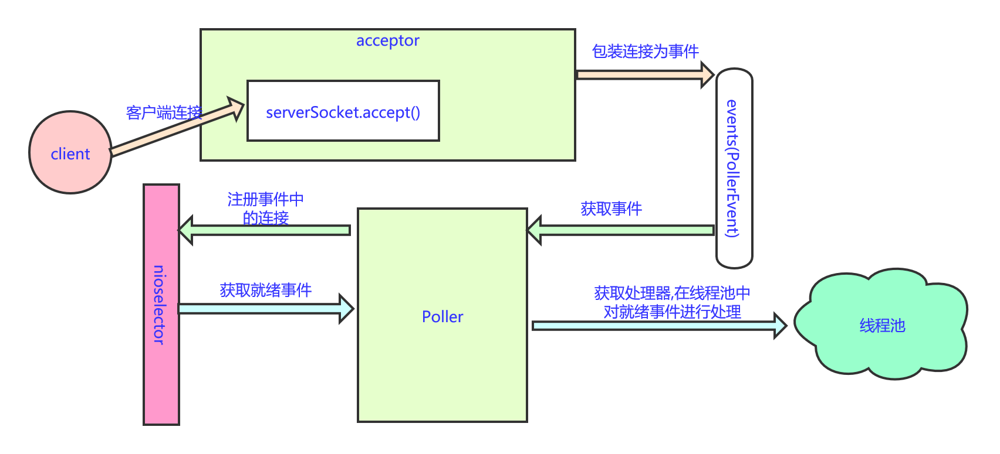

[TOC]

# tomcat-nio-1

本篇来分析一下tomcat是的前端连接架构是如何实现的，通过源码来了解其实现原理。

其他的就不分析了，直接看NioEndpoint的启动，此NioEndpoint主要就是处理连接过来的socket进行处理。先看一下其启动的方法:

> org.apache.tomcat.util.net.NioEndpoint#startInternal

```java
        // socket接收的 后台线程
        @Override
        public void startInternal() throws Exception {

            if (!running) {
                running = true;
                paused = false;
                // 默认长度大小为 128
                // 三个缓存的 列表都是 128
                processorCache = new SynchronizedStack<>(SynchronizedStack.DEFAULT_SIZE,
                        socketProperties.getProcessorCache());
                eventCache = new SynchronizedStack<>(SynchronizedStack.DEFAULT_SIZE,
                                socketProperties.getEventCache());
                nioChannels = new SynchronizedStack<>(SynchronizedStack.DEFAULT_SIZE,
                        socketProperties.getBufferPool());

                // Create worker collection
                // 创建  executor
                if ( getExecutor() == null ) {
                    createExecutor();
                }
                // 限流使用
                // 变相的限制 连接数
                initializeConnectionLatch();

                // Start poller threads
                // 控制pollers线程数量的是
                // pollerThreadCount = Math.min(2,Runtime.getRuntime().availableProcessors())
                // poller 用于进行 读写处理
                pollers = new Poller[getPollerThreadCount()];
                for (int i=0; i<pollers.length; i++) {
                    // 看一下poller的run方法
                    pollers[i] = new Poller();
                    Thread pollerThread = new Thread(pollers[i], getName() + "-ClientPoller-"+i);
                    pollerThread.setPriority(threadPriority);
                    //pollerThread.setDaemon(true);
                    // 同步
                    pollerThread.setDaemon(false);
                    pollerThread.start();
                }
                // 接收器 用于接收
                startAcceptorThreads();
            }
        }
```

可以看到这里创建了pollerThreadCount个poller，并在后台线程中运行，并启动了acceptor。

> org.apache.tomcat.util.net.AbstractEndpoint#startAcceptorThreads

```java
    // 开启接收线程
    protected final void startAcceptorThreads() {
        // 默认的接收线程数 为1
        int count = getAcceptorThreadCount();
        acceptors = new Acceptor[count];
        // 创建并启动接收器
        for (int i = 0; i < count; i++) {
            acceptors[i] = createAcceptor();
            String threadName = getName() + "-Acceptor-" + i;
            acceptors[i].setThreadName(threadName);
            Thread t = new Thread(acceptors[i], threadName);
            t.setPriority(getAcceptorThreadPriority());
            //t.setDaemon(getDaemon());
            t.setDaemon(false);
            t.start();
        }
    }
```

这里同样是创建了acceptorThreadCount个 Acceptor，并在后台线程中运行它。Acceptor主要就是用来接收过来连接的socket，poller主要是对接收来的socket进行读写操作。下面就来看一下acceptor是如何接收连接，以及poller是如何对连接过来的socket进行读写操作的。

## Acceptor

> org.apache.tomcat.util.net.NioEndpoint.Acceptor#run

```java
        @Override
        public void run() {

            int errorDelay = 0;

            // Loop until we receive a shutdown command
            while (running) {

                // Loop if endpoint is paused
                // 1.如果设置的 pause,则持续sleep
                while (paused && running) {
                    state = AcceptorState.PAUSED;
                    try {
                        Thread.sleep(50);
                    } catch (InterruptedException e) {
                        // Ignore
                    }
                }

                if (!running) {
                    break;
                }
                // 2. 更新状态为 正在运行
                state = AcceptorState.RUNNING;

                try {
                    //if we have reached max connections, wait
                    // 3. 限制连接数
                    countUpOrAwaitConnection();

                    SocketChannel socket = null;
                    try {
                        // Accept the next incoming connection from the server
                        // socket  接收连接
                        // 4. 阻塞式的接收连接
                        socket = serverSock.accept();
                    } catch (IOException ioe) {
                        // We didn't get a socket
                        countDownConnection();
                        if (running) {
                            // Introduce delay if necessary
                            errorDelay = handleExceptionWithDelay(errorDelay);
                            // re-throw
                            throw ioe;
                        } else {
                            break;
                        }
                    }
                    // Successful accept, reset the error delay
                    errorDelay = 0;
                    // Configure the socket
                    if (running && !paused) {
                        // 5. todo 对socket进行处理
                        if (!setSocketOptions(socket)) {
                            closeSocket(socket);
                        }
                    } else {
                        closeSocket(socket);
                    }
                } catch (Throwable t) {
                    ExceptionUtils.handleThrowable(t);
                    log.error(sm.getString("endpoint.accept.fail"), t);
                }
            }
            state = AcceptorState.ENDED;
        }

```

这里的处理总结如下：

1. 如果是pause状态，则持续sleep线程，知道pause状态解除
2. 更新状态为running
3. 连接数的countDown的初始化
4. socket = serverSock.accept();  阻塞式的接收连接，注意，此处没有使用nioselector
5. 对接收到的socketChannel进行配置

这里看下步骤3和5.

> org.apache.tomcat.util.net.AbstractEndpoint#countUpOrAwaitConnection

```java
protected void countUpOrAwaitConnection() throws InterruptedException {
    if (maxConnections==-1) return;
    LimitLatch latch = connectionLimitLatch;
    if (latch!=null) latch.countUpOrAwait();
}

public void countUpOrAwait() throws InterruptedException {
    sync.acquireSharedInterruptibly(1);
}
```

这里的 LimitLatch内部主要是由AQS的实现类Sync来实现，此处的操作主要是AQS的一个试下，相当于是尝试获取锁（锁的数量就是最大连接数），如果连接数已经为0，则等待。 继续看对socket的处理：

> org.apache.tomcat.util.net.NioEndpoint#setSocketOptions

```java
    // 把socket注册到selector上
    protected boolean setSocketOptions(SocketChannel socket) {
        // Process the connection
        try {
            //disable blocking, APR style, we are gonna be polling it
            // 配置socket为非阻塞
            socket.configureBlocking(false);
            // 获取socket
            Socket sock = socket.socket();
            // socket的配置 设置到socket
            socketProperties.setProperties(sock);
            // 去缓存中获取一个 Niochannel
            // 去 nioChannels中获取一个 NioChannel,用于本次处理
            // 可见NioChannel是循环利用的
            NioChannel channel = nioChannels.pop();
            // 如果不存在可用的NioChannel
            // 则创建一个
            if (channel == null) {
                // 这里主要是创建了 缓冲区  ByteBuffer
                SocketBufferHandler bufhandler = new SocketBufferHandler(
                        // read size 8192 == writeBuffer size
                        socketProperties.getAppReadBufSize(),
                        socketProperties.getAppWriteBufSize(),
                        // 默认不适用 directBuffer
                        socketProperties.getDirectBuffer());
                if (isSSLEnabled()) {
                    // 如果使能了 ssl,则创建 SecureNioChannel
                    channel = new SecureNioChannel(socket, bufhandler, selectorPool, this);
                } else {
                    // 如果是正常的, 则创建NioChannel
                    channel = new NioChannel(socket, bufhandler);
                }
            } else {
                // 存在 channel,则配置channel为新接收的socket
                channel.setIOChannel(socket);
                // reset此channel
                channel.reset();
            }
            // 获取一个poller,把此channel注册到 其中
            // 即 后面的读写操作 就由poller来进行处理了
            getPoller0().register(channel);
        } catch (Throwable t) {
            /// ....... 
            // Tell to close the socket
            return false;
        }
        return true;
    }
```

这里主要分为三步:

1. 对接收到的socketChannel进行属性配置
2. 使用NioChannel包装此接收到的socketChannel，其中包括了一个SocketBufferHandler，此handler分配了ByteBuffer内存
3. 把此接收到的socketChannel注册到poller中。

看一下注册动作：

> org.apache.tomcat.util.net.NioEndpoint#getPoller0

```java
// 获取poller
public Poller getPoller0() {
    int idx = Math.abs(pollerRotater.incrementAndGet()) % pollers.length;
    return pollers[idx];
}
```

可见，对于多个poller的选择，是轮询选择的。

> org.apache.tomcat.util.net.NioEndpoint.Poller#register

```java
        // 注册socket到poller中
        public void register(final NioChannel socket) {
            // 更新 socket的poller
            socket.setPoller(this);
            // 使用NioSocketWrapper 封装一下 接收到的socket
            NioSocketWrapper ka = new NioSocketWrapper(socket, NioEndpoint.this);
            socket.setSocketWrapper(ka);
            ka.setPoller(this);
            // 设置 读写超时时间
            // 此读写超时时间是 soTimeout 的值 默认为 20000
            ka.setReadTimeout(getSocketProperties().getSoTimeout());
            ka.setWriteTimeout(getSocketProperties().getSoTimeout());
            // 设置是否keepalive
            // 最大值为100
            ka.setKeepAliveLeft(NioEndpoint.this.getMaxKeepAliveRequests());
            // 是否是 ssl 打开
            ka.setSecure(isSSLEnabled());
            // 读写时间  超时, 设置为 connectionTimeout
            // 具体值为 soTimeout 20000
            ka.setReadTimeout(getConnectionTimeout());
            ka.setWriteTimeout(getConnectionTimeout());
            // 这里对一个socket注册前, 会先去缓存中看是否有可复用的pollerEvent
            // 这里可以看到 PollerEvent 同样也是复用的
            PollerEvent r = eventCache.pop();
            // 这里可以看到,当socket进行注册时,感兴趣事件是 OP_READ,而第一次注册的事件OP_REGISTER
            // 那么当下一次此socket准备好时,就会注册op_read事件
            ka.interestOps(SelectionKey.OP_READ);//this is what OP_REGISTER turns into.
            if ( r==null) r = new PollerEvent(socket,ka,OP_REGISTER);
            else r.reset(socket,ka,OP_REGISTER);
            // 发布一个 PollerEvent 事件到队列中
            addEvent(r);
        }


        // 发布事件
        private void addEvent(PollerEvent event) {
            events.offer(event);
            // 注册完socket后,就立即唤醒一个selector
            // 如果wakeupCounter 值为0,则立即进行一次 唤醒操作
            if ( wakeupCounter.incrementAndGet() == 0 ) selector.wakeup();
        }
```

这里步骤也比较清晰：

1. 使用NioSocketWrapper 包装了NioChannel
2. 对NioSocketWrapper进行了一个配置
3. 使用PollerEvent再包装了NioSocketWrapper，并把此event放入到了events队列中

到此前端的acceptor接收就完成了，最终的处理结果是通过PollerEvent包装接收到的SocketChannel并放入到了 一个队列events中。下面接着看poller的处理。

## Poller

> org.apache.tomcat.util.net.NioEndpoint.Poller#run

```java
@Override
public void run() {
    // Loop until destroy() is called
    while (true) {

        boolean hasEvents = false;

        try {
            if (!close) {
                // 检测现在是否有事件, 并对事件进行处理
                // 这里修改事件中 对应的socket的 感兴趣的事件,以及进行了具体的注册动作
                hasEvents = events();
                // wakeupCounter大于0,表示有pollerEvent事件进入
                // 那么就selectNow,不会有超时等待; 也就是为了及时处理请求
                if (wakeupCounter.getAndSet(-1) > 0) {
                    //if we are here, means we have other stuff to do
                    //do a non blocking select
                    keyCount = selector.selectNow();
                } else {
                    // 如果到此,说明暂时没有注册的socket
                    keyCount = selector.select(selectorTimeout);
                }
                // 把此设置为0,用于下次有事件后,能快速检测到
                wakeupCounter.set(0);
            }
            if (close) {
                // 要关闭了,对events中的事件的处理
                events();
                //
                timeout(0, false);
                try {
                    // nioselector 关闭
                    selector.close();
                } catch (IOException ioe) {
                    log.error(sm.getString("endpoint.nio.selectorCloseFail"), ioe);
                }
                break;
            }
        } catch (Throwable x) {
            //.....
            continue;
        }
        //either we timed out or we woke up, process events first
        // 如果之前检测没有事件,那么此处在检测一次
        // 如果被唤醒,先进行一次事件的处理; 即为了timeout处理,也为了及时对事件响应
        if ( keyCount == 0 ) hasEvents = (hasEvents | events());
        // 获取所有可用的key的迭代器
        // 如果检测没有事件, 则不会对key进行遍历
        Iterator<SelectionKey> iterator =
            keyCount > 0 ? selector.selectedKeys().iterator() : null;
        // Walk through the collection of ready keys and dispatch
        // any active event.
        // todo  遍历所有的可用的事件, 并进行处理
        while (iterator != null && iterator.hasNext()) {
            SelectionKey sk = iterator.next();
            NioSocketWrapper attachment = (NioSocketWrapper)sk.attachment();
            // Attachment may be null if another thread has called
            // cancelledKey()
            if (attachment == null) {
                // selectionKey没有attachment 则把此key remote掉
                iterator.remove();
            } else {
                iterator.remove();
                // 对就绪的key对应的socket的channel进行处理
                processKey(sk, attachment);
            }
        }//while

        //process timeouts
        // timeout的处理
        timeout(keyCount,hasEvents);
    }//while

    getStopLatch().countDown();
}
```

这里也小结一下处理的工作：

1. 调用event() 函数来对 events 队列中的事件进行处理
2. 如果有就绪的事件，则遍历所有的就绪key，进行处理
   1. 如果就绪key 没有attachment，则删除key，遍历下一个
   2. 就绪key有attachment，则继续处理

这里先看下对event事件的处理，注意哦，这里的events事件就是acceptor接收到新连接时包装的事件。

> org.apache.tomcat.util.net.NioEndpoint.Poller#events

```java
// 对队列中事件的处理
public boolean events() {
    boolean result = false;
    PollerEvent pe = null;
    for (int i = 0, size = events.size(); i < size && (pe = events.poll()) != null; i++ ) {
        result = true;
        try {
            // 此处的run相当于重新注册了socket的感兴趣的事件
            pe.run();
            // 之后复位pollerEvent, 并放置到eventCache中,是为了复用此pollerEvent
            pe.reset();
            if (running && !paused) {
                // 复位之后,再次缓存起来,用于进行循环使用
                eventCache.push(pe);
            }
        } catch ( Throwable x ) {
            log.error("",x);
        }
    }
    return result;
}
```

这里的操作也很粗暴了，遍历events容器中所有的事件，运行其run方法，运行完后复位一下，缓存到eventCache中，以备下次使用；可见PollerEvent实例是重复使用的。

> org.apache.tomcat.util.net.NioEndpoint.PollerEvent#run

```java
// pollerEvent事件的run方法,对感兴趣事件的处理
@Override
public void run() {
    // 如果事件是OP_REGISTER,则注册下次的感兴趣事件是OP_READ
    if (interestOps == OP_REGISTER) {
        try {
            // 进行注册操作
            // socket.getPoller().getSelector()  获取 selector
            // SelectionKey.OP_READ   感兴趣的事件
            // socketWrapper  socket的包装,此会 attach 到 selectionKey上
            socket.getIOChannel().register(
                socket.getPoller().getSelector(), SelectionKey.OP_READ, socketWrapper);
        } catch (Exception x) {
            log.error(sm.getString("endpoint.nio.registerFail"), x);
        }
    } else {
        // 获取此 channel对应的key
        final SelectionKey key = socket.getIOChannel().keyFor(socket.getPoller().getSelector());
        try {
            // 如果socket的对应的key不存在了,则取消此key
            if (key == null) {
                socket.socketWrapper.getEndpoint().countDownConnection();
                ((NioSocketWrapper) socket.socketWrapper).closed = true;
            } else {
                // 存在,则获取此key对应的socketWrapper,设置其下一次的事件为 key.interestOps() | interestOps
                final NioSocketWrapper socketWrapper = (NioSocketWrapper) key.attachment();
                if (socketWrapper != null) {
                    //we are registering the key to start with, reset the fairness counter.
                    int ops = key.interestOps() | interestOps;
                    socketWrapper.interestOps(ops);
                    key.interestOps(ops);
                } else {
                    socket.getPoller().cancelledKey(key);
                }
            }
        } catch (CancelledKeyException ckx) {
            try {
                socket.getPoller().cancelledKey(key);
            } catch (Exception ignore) {}
        }
    }
}
```

PollerEvent的run方法，就是把此event中包装的socketChannel注册真正注册到nioselector中，感兴趣事件为SelectionKey.OP_READ。

这里把前面acceptor接收到的连接注册到了nioselector中，这样acceptor和poller的处理就连接起来了，poller下面执行select查询就绪事件就可以感知到前面acceptor接收的新连接。继续看poller遍历就绪selectionKey的处理：

> org.apache.tomcat.util.net.NioEndpoint.Poller#processKey

```java
// 针对不同就绪事件的处理
protected void processKey(SelectionKey sk, NioSocketWrapper attachment) {
    try {
        if ( close ) {
            // 1.如果关系了,则取消key
            cancelledKey(sk);
        } else if ( sk.isValid() && attachment != null ) {
            // 如果可读 或者 可写,则进行处理
            if (sk.isReadable() || sk.isWritable() ) {
               // 2. 处理文件数据发送
                if ( attachment.getSendfileData() != null ) {
                    // 发送文件
                    processSendfile(sk,attachment, false);
                } else {
                    // sk.readyOps() 就绪的key
                    // --- 重点 ---
                    // 3.这里重新做了感兴趣事件的注册,把就绪的事件移除了
                    unreg(sk, attachment, sk.readyOps());
                    boolean closeSocket = false;
                    // Read goes before write
                    if (sk.isReadable()) {
                        // 4. 处理可读事件
                        // todo  继续看此方法对socket的处理
                        if (!processSocket(attachment, SocketEvent.OPEN_READ, true)) {
                            closeSocket = true;
                        }
                    }
                    if (!closeSocket && sk.isWritable()) {
                        // 5.处理可写事件
                        if (!processSocket(attachment, SocketEvent.OPEN_WRITE, true)) {
                            closeSocket = true;
                        }
                    }
                    if (closeSocket) {
                        cancelledKey(sk);
                    }
                }
            }
        } else {
            //invalid key
            cancelledKey(sk);
        }
    } catch ( CancelledKeyException ckx ) {
        cancelledKey(sk);
    } catch (Throwable t) {
        ExceptionUtils.handleThrowable(t);
        log.error("",t);
    }
}
```

从注释就能看到大概的处理流程，其中包括了对读写事件的处理。总体步骤：

1. 如果关闭了，则取消key
2. 处理发送文件的操作
3. 取消已经发送的事件，以防止重复处理
4. 处理读事件
5. 处理写事件

这里先看一下防止重复处理的一个操作：

> org.apache.tomcat.util.net.NioEndpoint.Poller#unreg

```java
// 此函数的主要作用: 重新注册感兴趣事件,把就绪key 移除
protected void unreg(SelectionKey sk, NioSocketWrapper attachment, int readyOps) {
    //this is a must, so that we don't have multiple threads messing with the socket
    // sk.interestOps()& (~readyOps) 这里移除了 就绪的key
    // 之后重新注册了感兴趣事件
    reg(sk,attachment,sk.interestOps()& (~readyOps));
}

protected void reg(SelectionKey sk, NioSocketWrapper attachment, int intops) {
    // 这里修改了 感兴趣的事件
    sk.interestOps(intops);
    attachment.interestOps(intops);
}
```

可以看到，这里相当于是清除了已就绪的事件，来达到防止重复处理。

读事件的处理：

> org.apache.tomcat.util.net.AbstractEndpoint#processSocket

```java
// 开始对socket  进行读写的处理
public boolean processSocket(SocketWrapperBase<S> socketWrapper,
                             SocketEvent event, boolean dispatch) {
    try {
        if (socketWrapper == null) {
            return false;
        }
        // 从缓存中获取一个处理器
        SocketProcessorBase<S> sc = processorCache.pop();
        // 如果没有, 则创建一个新的处理器
        if (sc == null) {
            // 创建对socket具体的一个处理器
            sc = createSocketProcessor(socketWrapper, event);
        } else {
            // 如果有,则复位 处理器的属性为当前的 socket
            sc.reset(socketWrapper, event);
        }
        // 获取线程池
        // 这里修改为同步
        //Executor executor = getExecutor();
        Executor executor = null;
        // 如果存在线程池中,就在线程池中进行处理了
        // 这里修改为同步,方便调试,不在线程池中进行处理
        // todo  修改同步操作  修改同步
        // 这里其实就把具体的处理流程,放到了 线程池中去进行处理
        if (dispatch && executor != null) {
            executor.execute(sc);
        } else {
            // 没有线程池呢,则在当前的线程中进行处理
            sc.run();
        }
    } catch (RejectedExecutionException ree) {
		/// .......
        return false
    }
    return true;
}
```

这里的处理呢，先去缓存中获取一个处理器，如果没有呢，就创建一个，之后再线程池中运行后续对socket读事件的处理。继续看：

> org.apache.tomcat.util.net.SocketProcessorBase#run

```java
@Override
public final void run() {
    synchronized (socketWrapper) {
        if (socketWrapper.isClosed()) {
            return;
        }
        doRun();
    }
}
```

> org.apache.tomcat.util.net.NioEndpoint.SocketProcessor#doRun

```java
// 对socket的处理
@Override
protected void doRun() {
    // 获取此NioSocketWrapper 绑定的nioChannel
    NioChannel socket = socketWrapper.getSocket();
    // 获取此 socketChannel的 selectionKey
    SelectionKey key = socket.getIOChannel().keyFor(socket.getPoller().getSelector());

    try {
        int handshake = -1;
        try {
            if (key != null) {
                if (socket.isHandshakeComplete()) {
                    // No TLS handshaking required. Let the handler
                    // process this socket / event combination.
                    // 握手完成  设置 handshake为0
                    handshake = 0;
                } else if (event == SocketEvent.STOP || event == SocketEvent.DISCONNECT ||
                           event == SocketEvent.ERROR) {
                    // Unable to complete the TLS handshake. Treat it as
                    // if the handshake failed.
                    // 如果事件是 stop disconnect  error,则设置 handshake为-1, 对于handshake为-1,后续会关闭
                    handshake = -1;
                } else {
                    // 开始握手
                    handshake = socket.handshake(key.isReadable(), key.isWritable());
                    event = SocketEvent.OPEN_READ;
                }
            }
        } catch (IOException x) {
            handshake = -1;
            if (log.isDebugEnabled()) log.debug("Error during SSL handshake",x);
        } catch (CancelledKeyException ckx) {
            handshake = -1;
        }
        // 如果handshake完成,
        if (handshake == 0) {
            SocketState state = SocketState.OPEN;
            // Process the request from this socket
            if (event == null) {
                // event为null, 默认是对 read 事件进行处理
                state = getHandler().process(socketWrapper, SocketEvent.OPEN_READ);
            } else {
                // 调用handler对 socket的event事件进行处理
                state = getHandler().process(socketWrapper, event);
            }
            // 处理后的状态为 clsoe,则关闭对应的 socket
            if (state == SocketState.CLOSED) {
                // 关闭 socket
                close(socket, key);
            }
        } else if (handshake == -1 ) {
            // 如果握手失败,则关闭socket
            close(socket, key);
        } else if (handshake == SelectionKey.OP_READ){
            // 此是吧 接收到的socketchannel 包装为 pollerevent 放置到 events中
            // 之后在poller中会对这里pollerevent进行处理
            // 会把其中的socketChannel 按照事件重新注册到 nioselector中
            socketWrapper.registerReadInterest();
        } else if (handshake == SelectionKey.OP_WRITE){
            socketWrapper.registerWriteInterest();
        }
    } catch (CancelledKeyException cx) {
        	////.......
    } finally {
        socketWrapper = null;
        event = null;
        //return to cache
        if (running && !paused) {
            processorCache.push(this);
        }
    }
}
```

这里看到有一个handshake的值，如果是ssl通信，握手期间会有多次的读写操作，通过对handshake的判断，来重新注册此socketChannel对应的事件：

```java
else if (handshake == SelectionKey.OP_READ){
    // 此是吧 接收到的socketchannel 包装为 pollerevent 放置到 events中
    // 之后在poller中会对这里pollerevent进行处理
    // 会把其中的socketChannel 按照事件重新注册到 nioselector中
    socketWrapper.registerReadInterest();
} else if (handshake == SelectionKey.OP_WRITE){
    socketWrapper.registerWriteInterest();
}
```

依次来达到了对握手信息的操作.

握手完成后，调用 state = getHandler().process(socketWrapper, event) 开始对socketChannel的继续处理：

> org.apache.coyote.AbstractProtocol.ConnectionHandler#process

```java
// 对socket的处理
@Override
public SocketState process(SocketWrapperBase<S> wrapper, SocketEvent status) {
    // 1.先去缓存中获取处理器
    if (processor == null) {
        processor = recycledProcessors.pop();
        if (getLog().isDebugEnabled()) {
            getLog().debug(sm.getString("abstractConnectionHandler.processorPop",
                                        processor));
        }
    }
    // 2. 如果缓存中没有,则创建一个
    if (processor == null) {
        // 如果缓存中没有处理器, 那么就创建一个处理器来进行处理
        // 创建 Http11Processor, 来对socket进行进一步的处理
        processor = getProtocol().createProcessor();
        // 注册processor到jmx
        register(processor);
    }

    processor.setSslSupport(
        wrapper.getSslSupport(getProtocol().getClientCertProvider()));

    // Associate the processor with the connection
    // 3.记录创建的 processor
    connections.put(socket, processor);

    SocketState state = SocketState.CLOSED;
    do {
        // 对请求进行处理
        // 处理器的关键请求
        // 关键代码
        // 4. 处理器对socket的进一步处理
        state = processor.process(wrapper, status);
        // ...
    } while ( state == SocketState.UPGRADING);
    //.... 省略非关键代码
}
```

继续看这里也可以看到处理器processor也是重复利用的.

> org.apache.coyote.AbstractProcessorLight#process

```java
@Override
public SocketState process(SocketWrapperBase<?> socketWrapper, SocketEvent status)
    throws IOException {

    SocketState state = SocketState.CLOSED;
    Iterator<DispatchType> dispatches = null;
    do {
        if (dispatches != null) {
            DispatchType nextDispatch = dispatches.next();
            state = dispatch(nextDispatch.getSocketStatus());
        } else if (status == SocketEvent.DISCONNECT) {
            // Do nothing here, just wait for it to get recycled
        } else if (isAsync() || isUpgrade() || state == SocketState.ASYNC_END) {
            //  分发操作
            // 这里有对 写操作的 flush 操作
            state = dispatch(status);
            if (state == SocketState.OPEN) {
                // 重点  重点
                // 对socke记性处理
                // 生成request  response ,调用adaptor.service
                state = service(socketWrapper);
            }
        } else if (status == SocketEvent.OPEN_WRITE) {
            // Extra write event likely after async, ignore
            state = SocketState.LONG;
        } else if (status == SocketEvent.OPEN_READ){
            // 这里主要是调用service方法来进行处理
            state = service(socketWrapper);
        } else {
            // Default to closing the socket if the SocketEvent passed in
            // is not consistent with the current state of the Processor
            state = SocketState.CLOSED;
        }
        if (state != SocketState.CLOSED && isAsync()) {
            state = asyncPostProcess();
            if (getLog().isDebugEnabled()) {
                getLog().debug("Socket: [" + socketWrapper +
                               "], State after async post processing: [" + state + "]");
            }
        }
        if (dispatches == null || !dispatches.hasNext()) {
            // Only returns non-null iterator if there are
            // dispatches to process.
            dispatches = getIteratorAndClearDispatches();
        }
    } while (state == SocketState.ASYNC_END ||
             dispatches != null && state != SocketState.CLOSED);
    return state;
}
```

调用到这里是processSocket(attachment, SocketEvent.OPEN_READ, true)， 即对read事件的处理，对应这里：

```java
else if (status == SocketEvent.OPEN_READ){
    // 这里主要是调用service方法来进行处理
    state = service(socketWrapper);
```

> org.apache.coyote.http11.Http11Processor#service

```java
  // 对socket的处理,解析http header, 封装request 和 response
    @Override
    public SocketState service(SocketWrapperBase<?> socketWrapper)
        throws IOException {
        // 获取 requestInfo
        RequestInfo rp = request.getRequestProcessor();
        // 这是stage
        rp.setStage(org.apache.coyote.Constants.STAGE_PARSE);
        // Setting up the I/O
        // 记录 NioSocketWrapper
        setSocketWrapper(socketWrapper);
        inputBuffer.init(socketWrapper);
        // 输出 buffer
        outputBuffer.init(socketWrapper);

        // Flags
        // 可见默认是 keepalive
        keepAlive = true;
        openSocket = false;
        readComplete = true;
        boolean keptAlive = false;
        SendfileState sendfileState = SendfileState.DONE;

        while (!getErrorState().isError() && keepAlive && !isAsync() && upgradeToken == null &&
                sendfileState == SendfileState.DONE && !endpoint.isPaused()) {

            // Parsing the request header
            try {
                /**
                 * 1. 解析 requestLine
                 */
                if (!inputBuffer.parseRequestLine(keptAlive)) {
                    if (inputBuffer.getParsingRequestLinePhase() == -1) {
                        return SocketState.UPGRADING;
                    } else if (handleIncompleteRequestLineRead()) {
                        break;
                    }
                }
			/// ..... 省略非关键代码
            }
```

这里实现了对socket的真正解析操作，请求头，请求方法，请求参数等，这里就看一个解析过程是如何的，以及前面输入输出buffer的初始化。

输入buffer初始化:

> org.apache.coyote.http11.Http11InputBuffer#init

```java
// 输入buffer的初始化
void init(SocketWrapperBase<?> socketWrapper) {
    wrapper = socketWrapper;
    // 记录当前的 Http11InputBuffer 到 NioChannel中
    wrapper.setAppReadBufHandler(this);
    // buf 的 长度
    // header的长度 + SocketBufferHandler.readBuf.capacity
    int bufLength = headerBufferSize +
        wrapper.getSocketBufferHandler().getReadBuffer().capacity();
    if (byteBuffer == null || byteBuffer.capacity() < bufLength) {
        // 重新分配一个 buffer
        byteBuffer = ByteBuffer.allocate(bufLength);
        byteBuffer.position(0).limit(0);
    }
}
```

输出buffer的初始化：

> org.apache.coyote.http11.Http11OutputBuffer#init

```java
public void init(SocketWrapperBase<?> socketWrapper) {
    this.socketWrapper = socketWrapper;
}
```

解析操作 requestLine：

> org.apache.coyote.http11.Http11InputBuffer#parseRequestLine

```java
boolean parseRequestLine(boolean keptAlive) throws IOException {
    // check state
    if (!parsingRequestLine) {
        return true;
    }
    // Skipping blank lines
    if (parsingRequestLinePhase < 2) {
        byte chr = 0;
        do {

            // Read new bytes if needed
            if (byteBuffer.position() >= byteBuffer.limit()) {
                if (keptAlive) {
                    // Haven't read any request data yet so use the keep-alive
                    // timeout.
                    wrapper.setReadTimeout(wrapper.getEndpoint().getKeepAliveTimeout());
                }
                // -- 重点 --
                // 从socketChannel中读取数据 到 this.byteBuffer中
                if (!fill(false)) {
                    // A read is pending, so no longer in initial state
                    parsingRequestLinePhase = 1;
                    return false;
                }
                // At least one byte of the request has been received.
                // Switch to the socket timeout.
                wrapper.setReadTimeout(wrapper.getEndpoint().getConnectionTimeout());
            }
         //.... 此函数很长, 这里只看部分,了解原理   
        }
```

这里看到解析的内容来自buffer中，而buffer中的内容就是从socketChannel中读取的，看一下具体的读取操作：

> org.apache.coyote.http11.Http11InputBuffer#fill

```java
// 从socketChannel中读取数据到 byteBuffer中
private boolean fill(boolean block) throws IOException {

    if (parsingHeader) {
        if (byteBuffer.limit() >= headerBufferSize) {
            if (parsingRequestLine) {
                // Avoid unknown protocol triggering an additional error
                request.protocol().setString(Constants.HTTP_11);
            }
            throw new IllegalArgumentException(sm.getString("iib.requestheadertoolarge.error"));
        }
    } else {
        byteBuffer.limit(end).position(end);
    }

    byteBuffer.mark();
    if (byteBuffer.position() < byteBuffer.limit()) {
        byteBuffer.position(byteBuffer.limit());
    }
    byteBuffer.limit(byteBuffer.capacity());
    // --- ----
    // 真正从 socketChannel读取数据到 byteBuffer中
    int nRead = wrapper.read(block, byteBuffer);
    byteBuffer.limit(byteBuffer.position()).reset();
    if (nRead > 0) {
        return true;
    } else if (nRead == -1) {
        throw new EOFException(sm.getString("iib.eof.error"));
    } else {
        return false;
    }
}
```

> org.apache.tomcat.util.net.NioEndpoint.NioSocketWrapper#read(boolean, java.nio.ByteBuffer)

```java
// 从socketChannel中读取数据
@Override
public int read(boolean block, ByteBuffer to) throws IOException {
    // 把 socketBufferHandler中的readBuf内容拷贝到 to buffer中
    int nRead = populateReadBuffer(to);
    // 如果有数据流动,则直接返回
    if (nRead > 0) {
        return nRead;
    }

    // The socket read buffer capacity is socket.appReadBufSize
    int limit = socketBufferHandler.getReadBuffer().capacity();
    // 如果to buffer的可用空间大于  readBuffer的容量
    // 则直接从socketChannel中读取数据到 to buffer中
    if (to.remaining() >= limit) {
        to.limit(to.position() + limit);
        // 则直接从 socketChannel中读取数据到  to  buffer中
        nRead = fillReadBuffer(block, to);
        if (log.isDebugEnabled()) {
            log.debug("Socket: [" + this + "], Read direct from socket: [" + nRead + "]");
        }
        // 更新 NioSocketWrapper中的上次读取时间
        updateLastRead();
    } else {
        // 否则,读取数到 socketBufferHandler的readBuf中
        // Fill the read buffer as best we can.
        nRead = fillReadBuffer(block);
        if (log.isDebugEnabled()) {
            log.debug("Socket: [" + this + "], Read into buffer: [" + nRead + "]");
        }
        // 更新上次读取的时间
        updateLastRead();

        // Fill as much of the remaining byte array as possible with the
        // data that was just read
        if (nRead > 0) {
            // 如果读取到数据,则把socketBufferHandler.readBuffer中的数据拷贝到to buffer中
            nRead = populateReadBuffer(to);
        }
    }
    return nRead;
}
```

> org.apache.tomcat.util.net.NioEndpoint.NioSocketWrapper#fillReadBuffer(boolean)

```java
// 从socketChannel中读取数据到 socketBufferHandler.readBuffer
private int fillReadBuffer(boolean block) throws IOException {
    // 配置 readBuffer 到写模式
    socketBufferHandler.configureReadBufferForWrite();
    // 从socketChannel读取数据到 socketBufferHandler.readBuffer
    return fillReadBuffer(block, socketBufferHandler.getReadBuffer());
}
```

```java
// 从socketChannel中读取数据
private int fillReadBuffer(boolean block, ByteBuffer to) throws IOException {
    int nRead;
    // 获取 NioChannel
    NioChannel channel = getSocket();
    // 如果是 阻塞的,则使用 selectorPool来读取
    // 此处先不展开
    if (block) {
        Selector selector = null;
        try {
            selector = pool.get();
        } catch (IOException x) {
            // Ignore
        }
        try {
            NioEndpoint.NioSocketWrapper att = (NioEndpoint.NioSocketWrapper) channel
                .getAttachment();
            if (att == null) {
                throw new IOException("Key must be cancelled.");
            }
            // 从channel中读取数据到 to中
            nRead = pool.read(to, channel, selector, att.getReadTimeout());
        } finally {
            if (selector != null) {
                pool.put(selector);
            }
        }
    } else {
        // 不是阻塞的,则直接从 socketChannel中读取数据
        // 直接从 nioChannel中读取数据到 to buffer中
        nRead = channel.read(to);
        if (nRead == -1) {
            throw new EOFException();
        }
    }
    return nRead;
}
```

这里看到数据从socketChannel中读取到buffer中：

1. 当inputBuffer中的ByteBuffer remain大于  socketBufferHandler中的readBuffer容量，则直接从socketChannel中读取数据到InputBuffer中
2. 否则读取数据到socketBufferHandler的readBuffer中，之后从readBuffer拷贝到 inputBuffer中。

当InputBuffer中有数据时，就可以继续分析了。这里画个图，小结一下acceptor和poller的关系：




