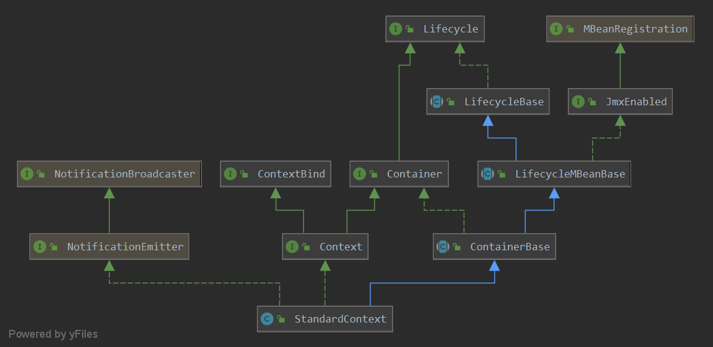

# tomcat对servlet3.0 注解的支持

本篇解析一下tomcat中对servlet3.0添加的 @WebServlet、@WebFilter、@WebListener注解的支持。

tomcat在解析这三个注解的时，并没有把对应的class进行加载，然后进行分析。如果把所有的class都加载，很可能会加载很多不用的class，很有可能会导致jvm的堆内存溢出，或占用过多的内存。

通过前面的分析，对tomcat的整体架构会有所了解，这里对这三个注解的解析处理主要是用StandardContext以及ContextConfig这两个类中，本篇直接从StandardContext的启动来进行解析。

## 2. standardContext的启动

看一下standardContext的类图:



这里看到standardContext是ContainerBase的，并且复写了启动的部分方法:


可以看到复写的方法，下面看一下启动的startInternal方法:

> org.apache.catalina.core.StandardContext#startInternal

```java
// 省略其中的非关键方法.    
// context的启动操作
    @Override
    protected synchronized void startInternal() throws LifecycleException {

        if(log.isDebugEnabled())
            log.debug("Starting " + getBaseName());

        // Post work directory
        /**
         * workdir的创建
         */
        postWorkDirectory();

        // Add missing components as necessary
        if (getResources() == null) {   // (1) Required by Loader
            if (log.isDebugEnabled())
                log.debug("Configuring default Resources");

            try {
                // 设置rootResources
                setResources(new StandardRoot(this));
            } catch (IllegalArgumentException e) {
                log.error(sm.getString("standardContext.resourcesInit"), e);
                ok = false;
            }
        }
        if (ok) {
            resourcesStart();
        }

        if (getLoader() == null) {
            WebappLoader webappLoader = new WebappLoader(getParentClassLoader());
            webappLoader.setDelegate(getDelegate());
            setLoader(webappLoader);
        }

        // An explicit cookie processor hasn't been specified; use the default
        if (cookieProcessor == null) {
            cookieProcessor = new Rfc6265CookieProcessor();
        }

        // Initialize character set mapper
        getCharsetMapper();

        // Validate required extensions
        boolean dependencyCheck = true;
        try {
            dependencyCheck = ExtensionValidator.validateApplication
                (getResources(), this);
        } catch (IOException ioe) {
            log.error(sm.getString("standardContext.extensionValidationError"), ioe);
            dependencyCheck = false;
        }


        // Standard container startup
        if (log.isDebugEnabled())
            log.debug("Processing standard container startup");

        // Binding thread
        ClassLoader oldCCL = bindThread();

        try {
            if (ok) {
                // Start our subordinate components, if any
                Loader loader = getLoader();
                if (loader instanceof Lifecycle) {
                    ((Lifecycle) loader).start();
                }


                // Notify our interested LifecycleListeners
                // 触发配置文件的解析
                fireLifecycleEvent(Lifecycle.CONFIGURE_START_EVENT, null);

                // Start our child containers, if not already started
                for (Container child : findChildren()) {
                    if (!child.getState().isAvailable()) {
                        child.start();
                    }
                }

               ....
            }
        }
```


上面的方法有所省略，具体可以看一下对应的代码，这里主要是standardContext启动的一个过程，其在启动过程中发布了Lifecycle.CONFIGURE_START_EVENT事件，而ContextConfig会接收此事件，并对配置文件进行一些处理，其中包括了（web.xml，resource文件，WEB-INF/lib , web-INF/classes），具体看一下其处理过程.


## 2. ContextConfig

```java
public class ContextConfig implements LifecycleListener
```

可以看到contextConfig其实是一个Listener，其会监听tomcat声明周期中的事件，并进行处理。

> org.apache.catalina.startup.ContextConfig#lifecycleEvent

```java
// 对各种事件的解析,其中包括了对 web.xml文件的解析
// 从中可以看到,包含了其整个的生命周期
@Override
public void lifecycleEvent(LifecycleEvent event) {

    // Identify the context we are associated with
    try {
        context = (Context) event.getLifecycle();
    } catch (ClassCastException e) {
        log.error(sm.getString("contextConfig.cce", event.getLifecycle()), e);
        return;
    }

    // Process the event that has occurred
    if (event.getType().equals(Lifecycle.CONFIGURE_START_EVENT)) {
        // 配置文件 开始解析
        configureStart();
    } else if (event.getType().equals(Lifecycle.BEFORE_START_EVENT)) {
        beforeStart();
    } else if (event.getType().equals(Lifecycle.AFTER_START_EVENT)) {
        // Restore docBase for management tools
        if (originalDocBase != null) {
            context.setDocBase(originalDocBase);
        }
    } else if (event.getType().equals(Lifecycle.CONFIGURE_STOP_EVENT)) {
        configureStop();
    } else if (event.getType().equals(Lifecycle.AFTER_INIT_EVENT)) {
        init();
    } else if (event.getType().equals(Lifecycle.AFTER_DESTROY_EVENT)) {
        destroy();
    }

}
```

> org.apache.catalina.startup.ContextConfig#configureStart

```java
protected synchronized void configureStart() {
    // Called from StandardContext.start()

    if (log.isDebugEnabled()) {
        log.debug(sm.getString("contextConfig.start"));
    }

    if (log.isDebugEnabled()) {
        log.debug(sm.getString("contextConfig.xmlSettings",
                               context.getName(),
                               Boolean.valueOf(context.getXmlValidation()),
                               Boolean.valueOf(context.getXmlNamespaceAware())));
    }
    // 解析 web.xml 文件
    // 1. 解析web.xml
    // 2. 解析 servlet 3.0 注解的 servlet filter  listener 并注册
    // 3. 解析servletContainerInitializer 并注册
    webConfig();
    // 添加的jsp解析
    context.addServletContainerInitializer(new JasperInitializer(),null);
    if (!context.getIgnoreAnnotations()) {
        applicationAnnotationsConfig();
    }
    if (ok) {
        validateSecurityRoles();
    }

    // Configure an authenticator if we need one
    if (ok) {
        authenticatorConfig();
    }

    // Dump the contents of this pipeline if requested
    if (log.isDebugEnabled()) {
        log.debug("Pipeline Configuration:");
        Pipeline pipeline = context.getPipeline();
        Valve valves[] = null;
        if (pipeline != null) {
            valves = pipeline.getValves();
        }
        if (valves != null) {
            for (int i = 0; i < valves.length; i++) {
                log.debug("  " + valves[i].getClass().getName());
            }
        }
        log.debug("======================");
    }

    // Make our application available if no problems were encountered
    if (ok) {
        context.setConfigured(true);
    } else {
        log.error(sm.getString("contextConfig.unavailable"));
        context.setConfigured(false);
    }
}
```

这里其实同样是web.xml文件的解析过程，其中在解析完web.xml后，会继续对servlet3.0 注解的处理，前面已经说过对web.xml文件的解析，此处就简单介绍下对web.xml的解析，详解看一下对注解的处理过程。

```java
    // 对web.xml文件的解析
    protected void webConfig() {
        WebXmlParser webXmlParser = new WebXmlParser(context.getXmlNamespaceAware(),
                context.getXmlValidation(), context.getXmlBlockExternal());

        Set<WebXml> defaults = new HashSet<>();
        defaults.add(getDefaultWebXmlFragment(webXmlParser));

        WebXml webXml = createWebXml();

        // Parse context level web.xml
        InputSource contextWebXml = getContextWebXmlSource();
        if (!webXmlParser.parseWebXml(contextWebXml, webXml, false)) {
            ok = false;
        }

        ServletContext sContext = context.getServletContext();
        Map<String,WebXml> fragments = processJarsForWebFragments(webXml, webXmlParser);

        // Step 2. Order the fragments.
        Set<WebXml> orderedFragments = null;
        orderedFragments =
                WebXml.orderWebFragments(webXml, fragments, sContext);

        // Step 3. Look for ServletContainerInitializer implementations
        if (ok) {
            // 解析 META-INF/services/" 下面的 ServletContainerInitializer
            processServletContainerInitializers();
        }

        if  (!webXml.isMetadataComplete() || typeInitializerMap.size() > 0) {
            // Steps 4 & 5.
            // 解析 /WEB-INF/classes 中的文件
            // 对 servlet 3.0 注解的解析
            processClasses(webXml, orderedFragments);
        }
        ....... 
    }
```

这里看一下ServletContainerInitializer的解析，以及servlet3.0的解析

### 2.1 ServletContainerInitializer

> org.apache.catalina.startup.ContextConfig#processServletContainerInitializers

```java
// 记录 ServletContainerInitializer对应的class
protected final Map<ServletContainerInitializer, Set<Class<?>>> initializerClassMap =
    new LinkedHashMap<>();

// class对应的 ServletContainerInitializer
protected final Map<Class<?>, Set<ServletContainerInitializer>> typeInitializerMap =
    new HashMap<>();


// 解析 META-INF/services/" 下面的 ServletContainerInitializer 文件
protected void processServletContainerInitializers() {

    List<ServletContainerInitializer> detectedScis;
    try {
        // 1. 创建一个  serviceLoad对 ServletContainerInitializer进行解析并加载
        WebappServiceLoader<ServletContainerInitializer> loader = new WebappServiceLoader<>(context);
        // 2. 加载  ServletContainerInitializer
        detectedScis = loader.load(ServletContainerInitializer.class);
    } catch (IOException e) {
        log.error(sm.getString(
            "contextConfig.servletContainerInitializerFail",
            context.getName()),
                  e);
        ok = false;
        return;
    }
    // 3. 保存解析到的  ServletContainerInitializer
    for (ServletContainerInitializer sci : detectedScis) {
        // 3.1 每一个ServletContainerInitializer会对多个class感兴趣,故 这里一个ServletContainerInitializer对应多个class
        initializerClassMap.put(sci, new HashSet<Class<?>>());

        HandlesTypes ht;
        try {
            // 获取类上的注解
            ht = sci.getClass().getAnnotation(HandlesTypes.class);
        } catch (Exception e) {
            if (log.isDebugEnabled()) {
                log.info(sm.getString("contextConfig.sci.debug",
                                      sci.getClass().getName()),
                         e);
            } else {
                log.info(sm.getString("contextConfig.sci.info",
                                      sci.getClass().getName()));
            }
            continue;
        }
        // 没有注解则 继续
        if (ht == null) {
            continue;
        }
        // 获取注解中设置的 感兴趣的 class
        Class<?>[] types = ht.value();
        if (types == null) {
            continue;
        }

        for (Class<?> type : types) {
            if (type.isAnnotation()) {
                handlesTypesAnnotations = true;
            } else {
                handlesTypesNonAnnotations = true;
            }
            // 3.2 此处的 typeInitializerMap 记录 HandlesTypes中设置的class对应的 ServletContainerInitializer
            // 也就是说 一个class可以对应多个  ServletContainerInitializer
            Set<ServletContainerInitializer> scis =
                typeInitializerMap.get(type);
            if (scis == null) {
                scis = new HashSet<>();
                typeInitializerMap.put(type, scis);
            }
            scis.add(sci);
        }
    }
}
```

这里注释大体也勾勒出了处理流程:

1. 创建一个 WebappServiceLoader , 此用于解析 WEB-INF/service/ 下的设置的文件
2. 解析WEB-INF/service/javax.servlet.ServletContainerInitializer 文件，并加载文件中的ServletContainerInitializer的实现类
3. 把加载的ServletContainerInitializer  实现类记录到initializerClassMap
4. 处理注解HandlesTypes，并把对应的信息保存到 typeInitializerMap

看一下对 ServletContainerInitializer 的解析:

> org.apache.catalina.startup.WebappServiceLoader#load

```java
// 对 "META-INF/services/" 下面的 ServletContainerInitializer 进行解析
public List<T> load(Class<T> serviceType) throws IOException {
    // String SERVICES = "META-INF/services/";
    // configFile= "META-INF/services/javax.servlet.ServletContainerInitializer"
    String configFile = SERVICES + serviceType.getName();
    // 保存 jar包中的  ServletContainerInitializer 实现类
    LinkedHashSet<String> applicationServicesFound = new LinkedHashSet<>();
    // 保存当前容器中的 ServletContainerInitializer实现类
    LinkedHashSet<String> containerServicesFound = new LinkedHashSet<>();

    ClassLoader loader = servletContext.getClassLoader();

    // if the ServletContext has ORDERED_LIBS, then use that to specify the
    // set of JARs from WEB-INF/lib that should be used for loading services
    @SuppressWarnings("unchecked")
    List<String> orderedLibs =
        (List<String>) servletContext.getAttribute(ServletContext.ORDERED_LIBS);
    // 1.解析 jar包中的 META-INF/services/" 下面的 ServletContainerInitializer
    if (orderedLibs != null) {
        // handle ordered libs directly, ...
        for (String lib : orderedLibs) {
            URL jarUrl = servletContext.getResource(LIB + lib);
            if (jarUrl == null) {
                // should not happen, just ignore
                continue;
            }

            String base = jarUrl.toExternalForm();
            URL url;
            //
            if (base.endsWith("/")) {
                url = new URL(base + configFile);
            } else {
                url = JarFactory.getJarEntryURL(jarUrl, configFile);
            }
            try {
                // 解析jar包中的 configFile
                parseConfigFile(applicationServicesFound, url);
            } catch (FileNotFoundException e) {
                // no provider file found, this is OK
            }
        }

        // and the parent ClassLoader for all others
        loader = context.getParentClassLoader();
    }

    Enumeration<URL> resources;
    if (loader == null) {
        resources = ClassLoader.getSystemResources(configFile);
    } else {
        // 2. 解析当前容器中 META-INF/services/" 下面的 ServletContainerInitializer
        resources = loader.getResources(configFile);
    }
    // 解析 META-INF/services/" 下面的 ServletContainerInitializer 文件中的内容
    while (resources.hasMoreElements()) {
        // 3. 解析当前容器中中的 configFile
        parseConfigFile(containerServicesFound, resources.nextElement());
    }

    // Filter the discovered container SCIs if required
    if (containerSciFilterPattern != null) {
        Iterator<String> iter = containerServicesFound.iterator();
        while (iter.hasNext()) {
            if (containerSciFilterPattern.matcher(iter.next()).find()) {
                iter.remove();
            }
        }
    }

    // Add the application services after the container services to ensure
    // that the container services are loaded first
    containerServicesFound.addAll(applicationServicesFound);

    // load the discovered services
    if (containerServicesFound.isEmpty()) {
        return Collections.emptyList();
    }
    // 加载 META-INF/services/" 下面的 ServletContainerInitializer 中对应的 实现类
    // 4. 加载 configFile中的所有的ServletContainerInitializer实现类
    return loadServices(serviceType, containerServicesFound);
}
```

`configFile= "META-INF/services/javax.servlet.ServletContainerInitializer`

此函数主要是解析configFile:

1. 解析jar包中的configFile
2. 解析当前容器中的configFile
3. 加载configFile中的ServletContainerInitializer实现类

> org.apache.catalina.startup.WebappServiceLoader#loadServices

```java

// 加载 class
List<T> loadServices(Class<T> serviceType, LinkedHashSet<String> servicesFound)
    throws IOException {
    ClassLoader loader = servletContext.getClassLoader();
    List<T> services = new ArrayList<>(servicesFound.size());
    for (String serviceClass : servicesFound) {
        try {
            Class<?> clazz = Class.forName(serviceClass, true, loader);
            services.add(serviceType.cast(clazz.getConstructor().newInstance()));
        } catch (ReflectiveOperationException | ClassCastException e) {
            throw new IOException(e);
        }
    }
    return Collections.unmodifiableList(services);
}
```

这里就是把class加载到虚拟机中.

### 2.2 sevlet3.0 解析

#### 2.2.1 processClasses

> org.apache.catalina.startup.ContextConfig#processClasses

```java
// 解析 /WEB-INF/classes中的文件
//   添加对   webServlet  webFilter  webListener注解的解析
protected void processClasses(WebXml webXml, Set<WebXml> orderedFragments) {
    // Step 4. Process /WEB-INF/classes for annotations and
    // @HandlesTypes matches
    Map<String, JavaClassCacheEntry> javaClassCache = new HashMap<>();

    if (ok) {
        WebResource[] webResources =
            context.getResources().listResources("/WEB-INF/classes");

        for (WebResource webResource : webResources) {
            // Skip the META-INF directory from any JARs that have been
            // expanded in to WEB-INF/classes (sometimes IDEs do this).
            if ("META-INF".equals(webResource.getName())) {
                continue;
            }
            // 解析 
            processAnnotationsWebResource(webResource, webXml,
                                          webXml.isMetadataComplete(), javaClassCache);
        }
    }

    // Step 5. Process JARs for annotations and
    // @HandlesTypes matches - only need to process those fragments we
    // are going to use (remember orderedFragments includes any
    // container fragments)
    if (ok) {
        processAnnotations(
            orderedFragments, webXml.isMetadataComplete(), javaClassCache);
    }

    // Cache, if used, is no longer required so clear it
    javaClassCache.clear();
}
```


> org.apache.catalina.startup.ContextConfig#processAnnotationsWebResource

```java
// 对资源文件的解析
//  1. 对servlet 3.0 注解的解析
protected void processAnnotationsWebResource(WebResource webResource,
                                             WebXml fragment, boolean handlesTypesOnly,
                                             Map<String,JavaClassCacheEntry> javaClassCache) {

    if (webResource.isDirectory()) {
        WebResource[] webResources =
            webResource.getWebResourceRoot().listResources(
            webResource.getWebappPath());
        if (webResources.length > 0) {
            if (log.isDebugEnabled()) {
                log.debug(sm.getString(
                    "contextConfig.processAnnotationsWebDir.debug",
                    webResource.getURL()));
            }
            for (WebResource r : webResources) {
                processAnnotationsWebResource(r, fragment, handlesTypesOnly, javaClassCache);
            }
        }
    } else if (webResource.isFile() &&
               webResource.getName().endsWith(".class")) {
        try (InputStream is = webResource.getInputStream()) {
            // 1. 解析 webServlet  webFilter  webListener 注解的 操作
            processAnnotationsStream(is, fragment, handlesTypesOnly, javaClassCache);
        } catch (IOException e) {
            log.error(sm.getString("contextConfig.inputStreamWebResource",
                                   webResource.getWebappPath()),e);
        } catch (ClassFormatException e) {
            log.error(sm.getString("contextConfig.inputStreamWebResource",
                                   webResource.getWebappPath()),e);
        }
    }
}
```

> org.apache.catalina.startup.ContextConfig#processAnnotationsStream

```java
// 对 servlet 3.0 注解的操作
protected void processAnnotationsStream(InputStream is, WebXml fragment,
                                        boolean handlesTypesOnly, Map<String,JavaClassCacheEntry> javaClassCache)
    throws ClassFormatException, IOException {
	// 读取class文件,并进行一些解析,可以看到,这里并没有把class文件加载到jvm中
    ClassParser parser = new ClassParser(is);
    JavaClass clazz = parser.parse();
    checkHandlesTypes(clazz, javaClassCache);

    if (handlesTypesOnly) {
        return;
    }
	/// 对解析后的class进行分析
    processClass(fragment, clazz);
}
```

这里要特别**注意**的是: 

​		对于class文件的处理，tomcat并没有加载到jvm中，然后在进行解析，而是直接对class文件进行了解析操作，这避免了加载一些非必要的类到jvm中。


> org.apache.catalina.startup.ContextConfig#processClass

```java
//  对Servlet 3.0 中新添加的注解    WebServlet webFilter  webListener 注解的解析 及 注解动作
protected void processClass(WebXml fragment, JavaClass clazz) {
    AnnotationEntry[] annotationsEntries = clazz.getAnnotationEntries();
    if (annotationsEntries != null) {
        String className = clazz.getClassName();
        for (AnnotationEntry ae : annotationsEntries) {
            String type = ae.getAnnotationType();
            if ("Ljavax/servlet/annotation/WebServlet;".equals(type)) {
                processAnnotationWebServlet(className, ae, fragment);
            }else if ("Ljavax/servlet/annotation/WebFilter;".equals(type)) {
                processAnnotationWebFilter(className, ae, fragment);
            }else if ("Ljavax/servlet/annotation/WebListener;".equals(type)) {
                fragment.addListener(className);
            } else {
                // Unknown annotation - ignore
            }
        }
    }
}
```


