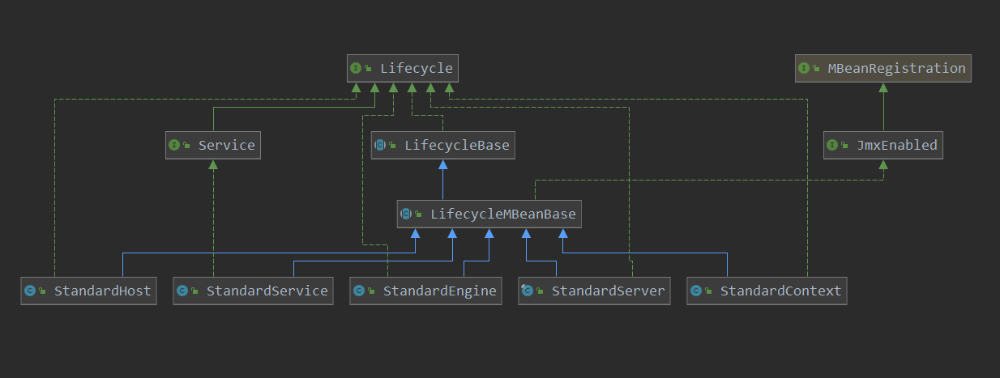
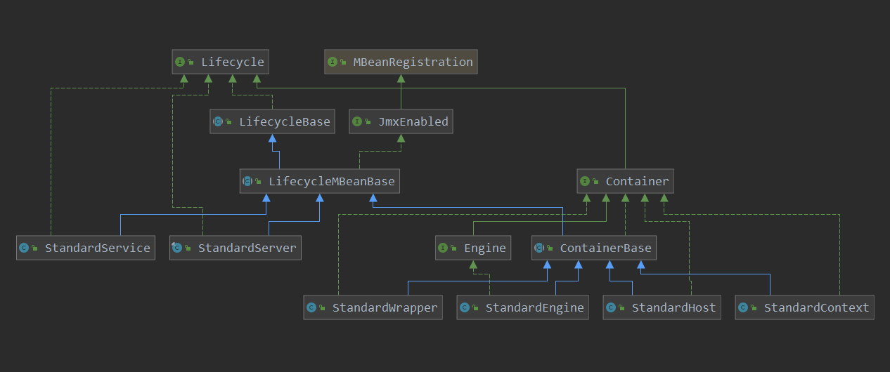

[TOC]

# 添加context到容器

根据上篇demo咱们来一步一步进行分析，短短的几段代码是如何把tomcat容器启动的。

```java
// 编程式 tomcat的创建
Tomcat tomcat = new Tomcat();
tomcat.setHostname("localhost");
tomcat.setPort(9090);
Context context = tomcat.addContext("/embed", null);
```

tomcat的初始化函数:

> org.apache.catalina.startup.Tomcat#Tomcat

```java
private static final StringManager sm = StringManager.getManager(Tomcat.class);
private final Map<String, Logger> pinnedLoggers = new HashMap<>();

protected Server server;
// 默认的端口
protected int port = 8080;
// 默认的主机
protected String hostname = "localhost";
protected String basedir;
protected boolean defaultConnectorCreated = false;

private final Map<String, String> userPass = new HashMap<>();
private final Map<String, List<String>> userRoles = new HashMap<>();
private final Map<String, Principal> userPrincipals = new HashMap<>();
// 构造函数
public Tomcat() {
    ExceptionUtils.preload();
}

public static void preload() {
    // NO-OP
}
```

属性配置:

```java
// 记录主机 和 端口
// 设置hostname
public void setHostname(String s) {
    hostname = s;
}
public void setPort(int port) {
    this.port = port;
}
```

> org.apache.catalina.startup.Tomcat#addContext(java.lang.String, java.lang.String)

```java
public Context addContext(String contextPath, String docBase) {
    // getHost()在此处就会创建standardServer  standardService  standardEngine 以及standardHost
    // 然后把context添加到host中
    return addContext(getHost(), contextPath, docBase);
}
```

先剧透一下，这里就要开始创建容器中的主要组件server，service，engine，host，context，这里先看一下他们的类图：



可以看到这些主要组件都是LifecycleBase的子类，而tomcat的整个生命周期的操作，都会和此有关系。

> org.apache.catalina.startup.Tomcat#getHost

```java
public Host getHost() {
    // 获取engine,如果没有就创建
    Engine engine = getEngine();
    // 第一次的时候,engine肯定是没有host容器的
    // 那么就会走下面创建一个
    if (engine.findChildren().length > 0) {
        return (Host) engine.findChildren()[0];
    }
    // 创建host
    Host host = new StandardHost();
    host.setName(hostname);
    // 添加 host到 engine中
    getEngine().addChild(host);
    return host;
}
```

> org.apache.catalina.startup.Tomcat#getServer

```java
// 获取StandardServer ，没有就进行创建
public Server getServer() {
    if (server != null) {
        return server;
    }
    System.setProperty("catalina.useNaming", "false");
    // 创建StandardServer
    server = new StandardServer();
    initBaseDir();
    server.setPort( -1 );
    // 创建service
    Service service = new StandardService();
    service.setName("Tomcat");
    // 把service添加到server中
    server.addService(service);
    return server;
}
```

server构造器:

```java
public StandardServer() {
    super();
    globalNamingResources = new NamingResourcesImpl();
    globalNamingResources.setContainer(this);
    if (isUseNaming()) {
        namingContextListener = new NamingContextListener();
        addLifecycleListener(namingContextListener);
    } else {
        namingContextListener = null;
    }
}
```

> org.apache.catalina.startup.Tomcat#initBaseDir

```java
// 初始化 catalina.base 目录
protected void initBaseDir() {
    // 从环境中获取 catalina.home 的值
    String catalinaHome = System.getProperty(Globals.CATALINA_HOME_PROP);
    // 如果没有设置basedir,则从环境变量catalina.base中获取
    if (basedir == null) {
        basedir = System.getProperty(Globals.CATALINA_BASE_PROP);
    }
    // 如果都没有,那么basedir = catalinaHome
    if (basedir == null) {
        basedir = catalinaHome;
    }
    // 如果还没有 basedir, 那么basedir 就在 user.dir 创建  tomcat. + port
    if (basedir == null) {
        // Create a temp dir.
        basedir = System.getProperty("user.dir") +
            "/tomcat." + port;
    }
    // 创建文件夹 tomcat. + port,如 tomcat.8080
    File baseFile = new File(basedir);
    baseFile.mkdirs();
    try {
        baseFile = baseFile.getCanonicalFile();
    } catch (IOException e) {
        baseFile = baseFile.getAbsoluteFile();
    }
    // 设置catalina.base
    server.setCatalinaBase(baseFile);
    // 设置环境变量中 catalina.base的值
    System.setProperty(Globals.CATALINA_BASE_PROP, baseFile.getPath());
    // 记录创建的 catalina.base的值,作为 basedir
    basedir = baseFile.getPath();
    // 设置catalina.home的值
    if (catalinaHome == null) {
        server.setCatalinaHome(baseFile);
    } else {
        File homeFile = new File(catalinaHome);
        homeFile.mkdirs();
        try {
            homeFile = homeFile.getCanonicalFile();
        } catch (IOException e) {
            homeFile = homeFile.getAbsoluteFile();
        }
        server.setCatalinaHome(homeFile);
    }
    // 设置环境变量中的 catalina.home的值
    System.setProperty(Globals.CATALINA_HOME_PROP,
                       server.getCatalinaHome().getPath());
}

```

之后创建service，并把service记录到  sever中。

> org.apache.catalina.core.StandardServer#addService

```java
// 此server记录的service
private Service services[] = new Service[0];
private final Object servicesLock = new Object();

@Override
public void addService(Service service) {
    // 设置service 对应的 server
    service.setServer(this);
    // 记录service 到此server中
    synchronized (servicesLock) {
        // 把service存放到services数组中
        Service results[] = new Service[services.length + 1];
        System.arraycopy(services, 0, results, 0, services.length);
        results[services.length] = service;
        services = results;
        if (getState().isAvailable()) {
            try {
                // 启动
                service.start();
            } catch (LifecycleException e) {
                // Ignore
            }
        }
        // Report this property change to interested listeners
        support.firePropertyChange("service", null, service);
    }
}
```

由此可以看到，一个server中可以有多个 service。

初始化完server以及service后，往回拉一下：

```java
public Engine getEngine() {
    // getServer()如获取server,如果没有呢,就创建
    Service service = getServer().findServices()[0];
    // 第一次的时候,service中肯定是没有engine的,那么就会走下面创建一个
    // 而service的获取engine的方法也能看出,一个service只能有一个engine
    // 而一个server可以有多个service
    if (service.getContainer() != null) {
        return service.getContainer();
    }
    // 创建 engine
    Engine engine = new StandardEngine();
    engine.setName( "Tomcat" );
    engine.setDefaultHost(hostname);
    // createDefaultRealm 创建realm,用于用户的认证
    engine.setRealm(createDefaultRealm());
    // service 记录 engine
    service.setContainer(engine);
    return engine;
}
```

再看一下类图：



engine的构造函数：

```java
// ContainerBase中初始化 pipeline
protected final Pipeline pipeline = new StandardPipeline(this);
// 创建
public StandardEngine() {
    super();
    // 添加pipeline
    pipeline.setBasic(new StandardEngineValve());
    /* Set the jmvRoute using the system property jvmRoute */
    try {
        setJvmRoute(System.getProperty("jvmRoute"));
    } catch(Exception ex) {
        log.warn(sm.getString("standardEngine.jvmRouteFail"));
    }
    // By default, the engine will hold the reloading thread
    backgroundProcessorDelay = 10;
}
```

> 

```java
// 设置 service 对应的container
@Override
public void setContainer(Engine engine) {
    Engine oldEngine = this.engine;
    if (oldEngine != null) {
        oldEngine.setService(null);
    }
    this.engine = engine;
    if (this.engine != null) {
        // engine 记录其对应的service
        this.engine.setService(this);
    }
    if (getState().isAvailable()) {
        if (this.engine != null) {
            try {
                this.engine.start();
            } catch (LifecycleException e) {
                log.error(sm.getString("standardService.engine.startFailed"), e);
            }
        }
        // Restart MapperListener to pick up new engine.
        try {
            mapperListener.stop();
        } catch (LifecycleException e) {
            log.error(sm.getString("standardService.mapperListener.stopFailed"), e);
        }
        try {
            mapperListener.start();
        } catch (LifecycleException e) {
            log.error(sm.getString("standardService.mapperListener.startFailed"), e);
        }
        if (oldEngine != null) {
            try {
                oldEngine.stop();
            } catch (LifecycleException e) {
                log.error(sm.getString("standardService.engine.stopFailed"), e);
            }
        }
    }
    // Report this property change to interested listeners
    // 发布事件到监听器中
    support.firePropertyChange("container", oldEngine, this.engine);
}
```

从此service记录engine(container)的操作可以看出，其实一个service就对应一个engine(container)。

创建完了engine，继续往回拉:

> org.apache.catalina.startup.Tomcat#getHost

```java
// 获取host, 如果没有就创建一个
public Host getHost() {
    // 获取engine,如果没有就创建
    Engine engine = getEngine();
    // 第一次的时候,engine肯定是没有host容器的
    // 那么就会走下面创建一个
    if (engine.findChildren().length > 0) {
        return (Host) engine.findChildren()[0];
    }
    // 创建 host
    Host host = new StandardHost();
    host.setName(hostname);
    // 记录其此 host
    getEngine().addChild(host);
    return host;
}
```

host的构造函数：

```java
public StandardHost() {
    super();
    // 在创建的时候,向pipeline添加组件
    pipeline.setBasic(new StandardHostValve());

}
```

再看一下engine是如何记录host的：

> org.apache.catalina.core.StandardEngine#addChild

```java
public void addChild(Container child) {
    if (!(child instanceof Host))
        throw new IllegalArgumentException
        (sm.getString("standardEngine.notHost"));
    super.addChild(child);
}
```

```java
// 向容器中添加 child
@Override
public void addChild(Container child) {
    if (Globals.IS_SECURITY_ENABLED) {
        PrivilegedAction<Void> dp =
            new PrivilegedAddChild(child);
        AccessController.doPrivileged(dp);
    } else {
        addChildInternal(child);
    }
}


// 记录此 容器的子组件
protected final HashMap<String, Container> children = new HashMap<>();
// 添加child,也就是子组件到内部
private void addChildInternal(Container child) {

    if( log.isDebugEnabled() )
        log.debug("Add child " + child + " " + this);
    synchronized(children) {
        if (children.get(child.getName()) != null)
            throw new IllegalArgumentException("addChild:  Child name '" +
                                               child.getName() +
                                               "' is not unique");
        // 子组件记录对应的父容器是谁
        child.setParent(this);  // May throw IAE
        // 记录子组件
        children.put(child.getName(), child);
    }
    try {
        if ((getState().isAvailable() ||
             LifecycleState.STARTING_PREP.equals(getState())) &&
            startChildren) {
            child.start();
        }
    } catch (LifecycleException e) {
        log.error("ContainerBase.addChild: start: ", e);
        throw new IllegalStateException("ContainerBase.addChild: start: " + e);
    } finally {
        fireContainerEvent(ADD_CHILD_EVENT, child);
    }
}
```

此也可以看到，一个engine可以存储多个host子组件。

host也创建完了，再往回拉：

```java
public Context addContext(String contextPath, String docBase) {
    // getHost()在此处就会创建standardServer  standardService  standardEngine 以及standardHost
    // 然后把context添加到host中
    return addContext(getHost(), contextPath, docBase);
}

public Context addContext(Host host, String contextPath, String dir) {
    return addContext(host, contextPath, contextPath, dir);
}
```

> org.apache.catalina.startup.Tomcat#addContext(org.apache.catalina.Host, java.lang.String, java.lang.String, java.lang.String)

```java
// 添加一个context到容器中
public Context addContext(Host host, String contextPath, String contextName,String dir) {
    // 设置log的级别
    silence(host, contextName);
    // 根据给定的 contextPath,来创建一个context
    Context ctx = createContext(host, contextPath);
    // 设置context 的属性
    ctx.setName(contextName);
    ctx.setPath(contextPath);
    ctx.setDocBase(dir);
    ctx.addLifecycleListener(new FixContextListener());
    if (host == null) {
        getHost().addChild(ctx);
    } else {
        // 添加context到 host中
        host.addChild(ctx);
    }
    return ctx;
}
```

> org.apache.catalina.startup.Tomcat#createContext

```java
// 创建context
private Context createContext(Host host, String url) {
    // 默认就是创建StandardContext
    String contextClass = StandardContext.class.getName();
    if (host == null) {
        host = this.getHost();
    }
    // 如果参数中设置的host是standardHost
    // 那么使用host中设置的contextClass
    if (host instanceof StandardHost) {
        contextClass = ((StandardHost) host).getContextClass();
    }
    try {
        // 反射创建StandardContext的实例
        return (Context) Class.forName(contextClass).getConstructor()
            .newInstance();
    } catch (InstantiationException | IllegalAccessException
             | IllegalArgumentException | InvocationTargetException
             | NoSuchMethodException | SecurityException
             | ClassNotFoundException e) {
        throw new IllegalArgumentException(
            "Can't instantiate context-class " + contextClass
            + " for host " + host + " and url "
            + url, e);
    }
}
```

看一下StandardContext的创建：

```java
public StandardContext() {
    super();
    // 向pipeline中添加组件
    pipeline.setBasic(new StandardContextValve());
    // 广播器
    broadcaster = new NotificationBroadcasterSupport();
    // Set defaults
    if (!Globals.STRICT_SERVLET_COMPLIANCE) {
        // Strict servlet compliance requires all extension mapped servlets
        // to be checked against welcome files
        resourceOnlyServlets.add("jsp");
    }
}
```

> org.apache.catalina.core.StandardHost#addChild

```java
@Override
public void addChild(Container child) {
    if (!(child instanceof Context))
        throw new IllegalArgumentException
        (sm.getString("standardHost.notContext"));
    // 给子组件 添加监听器
    child.addLifecycleListener(new MemoryLeakTrackingListener());

    // Avoid NPE for case where Context is defined in server.xml with only a
    // docBase
    Context context = (Context) child;
    if (context.getPath() == null) {
        ContextName cn = new ContextName(context.getDocBase(), true);
        context.setPath(cn.getPath());
    }
    // 调用父类也就是 concontainerBase来添加child 容器, 并把child的父容器设置为this(当前host)
    // 容器都根据name来存储在containerBase中的HashMap<String, Container> children = new HashMap<>()
    // 一般情况下  contextPath和contextName相等
    // 把要添加的context,添加到此hsot容器的map中
    super.addChild(child);
}
```

> org.apache.catalina.core.ContainerBase#addChild

```java
    // 向容器中添加 child
    @Override
    public void addChild(Container child) {
        if (Globals.IS_SECURITY_ENABLED) {
            PrivilegedAction<Void> dp =
                new PrivilegedAddChild(child);
            AccessController.doPrivileged(dp);
        } else {
            addChildInternal(child);
        }
    }
```

这里添加context到host中，和engine添加host是一个操作。也就是说一个host中可以注册多个context。

可以看到添加一个context到容器中，就把容器中server，service，engine，host就都进行了创建，并设置了其的关系。

下面看一下向context中添加servlet以及filter的操作。


