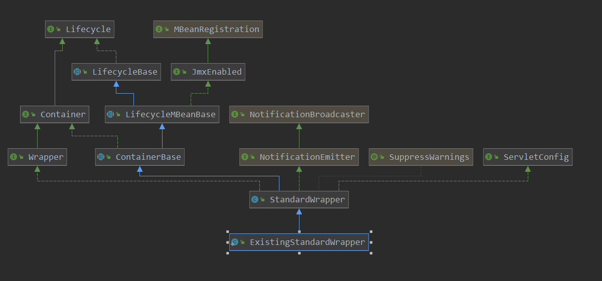

[TOC]

# 添加servlet以及filter

## 实例回顾

沿着demo的顺序，咱们继续看一下添加servlet和filter到容器中，其具体做了哪些工作：

```java
// servlet 创建
HttpServlet httpServlet = new HttpServlet() {
    @Override
    protected void doGet(HttpServletRequest req, HttpServletResponse resp) throws ServletException, IOException {
        resp.getWriter().write("hello, this is tomcat source.");
    }

    @Override
    protected void doPost(HttpServletRequest req, HttpServletResponse resp) throws ServletException, IOException {
        doGet(req, resp);
    }
};
// 过滤器 创建
Filter filter = new Filter() {
    @Override
    public void init(FilterConfig filterConfig) throws ServletException {
        System.out.println("filter init");
    }
    @Override
    public void doFilter(ServletRequest request, ServletResponse response, FilterChain chain) throws IOException, ServletException {
        System.out.println("filter do filter");
        chain.doFilter(request, response);
    }
    @Override
    public void destroy() {
        System.out.println("destory");
    }
};
tomcat.addServlet(context, "dispatch", httpServlet);
// 添加对应的servlet的映射
context.addServletMappingDecoded("/dis", "dispatch");
// 添加过滤器
FilterDef filterDef = new FilterDef();
filterDef.setFilter(filter);
filterDef.setFilterName("myFilter");
filterDef.addInitParameter("username", "Allen");
// 添加过滤器对应的映射
FilterMap filterMap = new FilterMap();
filterMap.setFilterName("myFilter");
filterMap.setCharset(Charset.forName("UTF-8"));
filterMap.addURLPatternDecoded("/");
filterMap.addServletName("*");
// 添加filter  以及 filterMap
context.addFilterDef(filterDef);
context.addFilterMap(filterMap);
```

## 添加servlet

> org.apache.catalina.startup.Tomcat#addServlet(org.apache.catalina.Context, java.lang.String, javax.servlet.Servlet)

看一下ExistingStandardWrapper类图:



构造函数：

```java
@SuppressWarnings("deprecation")
public ExistingStandardWrapper( Servlet existing ) {
    this.existing = existing;
    // 根据是否是 SingleThreadModel, 来记录一个servlet的mode
    if (existing instanceof javax.servlet.SingleThreadModel) {
        singleThreadModel = true;
        instancePool = new Stack<>();
    }
    // 对异步请求的支持
    this.asyncSupported = hasAsync(existing);
}
```

```java
private static boolean hasAsync(Servlet existing) {
            boolean result = false;
            Class<?> clazz = existing.getClass();
	    // 获取其是否有WebServlet 注解
            WebServlet ws = clazz.getAnnotation(WebServlet.class);
	    // 如果有WebServlet注解,且其属性设置了 支持异步
            if (ws != null) {
                result = ws.asyncSupported();
            }
            return result;
        }
```

把此servlet记录到context中:

> org.apache.catalina.core.StandardContext#addChild

```java
// 添加servlet 到此 context中
@Override
public void addChild(Container child) {

    // Global JspServlet
    Wrapper oldJspServlet = null;
    if (!(child instanceof Wrapper)) {
        throw new IllegalArgumentException
            (sm.getString("standardContext.notWrapper"));
    }
    boolean isJspServlet = "jsp".equals(child.getName());
    // Allow webapp to override JspServlet inherited from global web.xml.
    if (isJspServlet) {
        oldJspServlet = (Wrapper) findChild("jsp");
        if (oldJspServlet != null) {
            removeChild(oldJspServlet);
        }
    }
    // 添加servlet到context中,同样是调用父类的addChild;简单说同样是把此servlet根据name来存放到containerBase中的map
    super.addChild(child);
    if (isJspServlet && oldJspServlet != null) {
        String[] jspMappings = oldJspServlet.findMappings();
        for (int i=0; jspMappings!=null && i<jspMappings.length; i++) {
            addServletMappingDecoded(jspMappings[i], child.getName());
        }
    }
}
```

> org.apache.catalina.core.ContainerBase#addChild

```java
// 向容器中添加 child
@Override
public void addChild(Container child) {
    if (Globals.IS_SECURITY_ENABLED) {
        PrivilegedAction<Void> dp =
            new PrivilegedAddChild(child);
        AccessController.doPrivileged(dp);
    } else {
        addChildInternal(child);
    }
}
```

此函数又出现了，千万不要混淆了，前面依次是 engine添加host为组件，之后是host添加context为组件，现在是context添加servlet为组件，因为这三个类都是 containerBase的子类，所以代码看起来是一样的，但是实现的意义是不一样的哦。

可见添加一个servlet到容器中，其实就是注册到context中。

> org.apache.catalina.core.StandardContext#addServletMappingDecoded(java.lang.String, java.lang.String)

```java
// 添加此context中对应的servlet的映射
@Override
public void addServletMappingDecoded(String pattern, String name) {
    addServletMappingDecoded(pattern, name, false);
}
```

```java
// 注册 servelt的映射关系
// key为映射, value为 sevelet的name
private HashMap<String, String> servletMappings = new HashMap<>();

// 添加一个servlet的映射
@Override
public void addServletMappingDecoded(String pattern, String name,
                                     boolean jspWildCard) {
    // Validate the proposed mapping
    // 此findChild就是从containerBase中的map来查找此组件是否注册
    if (findChild(name) == null)
        throw new IllegalArgumentException
        (sm.getString("standardContext.servletMap.name", name));
    // 对映射的pattern来进行一些调整,如添加/
    String adjustedPattern = adjustURLPattern(pattern);
    if (!validateURLPattern(adjustedPattern))
        throw new IllegalArgumentException
        (sm.getString("standardContext.servletMap.pattern", adjustedPattern));
    // Add this mapping to our registered set
    // 注册映射关系
    // 注册 servelt的映射关系
    // key为映射, value为 sevelet的name
    synchronized (servletMappingsLock) {
        String name2 = servletMappings.get(adjustedPattern);
        if (name2 != null) {
            // Don't allow more than one servlet on the same pattern
            // 查找serlvet
            Wrapper wrapper = (Wrapper) findChild(name2);
            wrapper.removeMapping(adjustedPattern);
        }
        // 注册映射关系,由此可见servletMappings中key是映射关系,value是对应组件的name
        servletMappings.put(adjustedPattern, name);
    }
    // 把映射关系设置到此name对应的wrapper中
    Wrapper wrapper = (Wrapper) findChild(name);
    wrapper.addMapping(adjustedPattern);
    // 发布一个事件
    fireContainerEvent("addServletMapping", adjustedPattern);
}
```

查找子组件的操作:

> org.apache.catalina.core.ContainerBase#findChild

```java
@Override
public Container findChild(String name) {
    if (name == null) {
        return null;
    }
    synchronized (children) {
        return children.get(name);
    }
}
```

> org.apache.catalina.core.StandardContext#adjustURLPattern

```java
// 对应关系的一个调整
protected String adjustURLPattern(String urlPattern) {
    if (urlPattern == null)
        return urlPattern;
    if (urlPattern.startsWith("/") || urlPattern.startsWith("*."))
        return urlPattern;
    if (!isServlet22())
        return urlPattern;
    if(log.isDebugEnabled())
        log.debug(sm.getString("standardContext.urlPattern.patternWarning",
                               urlPattern));
    return "/" + urlPattern;
}
```

> org.apache.catalina.core.StandardWrapper#addMapping

```java
// 此servlet对应的mapping
protected final ArrayList<String> mappings = new ArrayList<>();

public void addMapping(String mapping) {
    mappingsLock.writeLock().lock();
    try {
        // 记录此wraper对应的映射
        mappings.add(mapping);
    } finally {
        mappingsLock.writeLock().unlock();
    }
    if(parent.getState().equals(LifecycleState.STARTED))
        fireContainerEvent(ADD_MAPPING_EVENT, mapping);
}
```

向容器添加一个servlet就完成了，主要为：

1. 把此servlet注册到context中
2. 记录此servelt的映射关系，也就是  映射 --> serveltName

## 添加filter

> org.apache.catalina.core.StandardContext#addFilterDef

```java
// 记录此context中的filter
// key为 filter的name , value为filter的定义
private HashMap<String, FilterDef> filterDefs = new HashMap<>();
// 添加一个filter到context中
@Override
public void addFilterDef(FilterDef filterDef) {
    synchronized (filterDefs) {
        filterDefs.put(filterDef.getFilterName(), filterDef);
    }
    fireContainerEvent("addFilterDef", filterDef);
}
```

> org.apache.catalina.core.StandardContext#addFilterMap

```java
// 记录此context中filter的过滤pattern
// 此使用了一个 FilterMap[] array = new FilterMap[0] 数组,来存储具体的过滤器 映射
private final ContextFilterMaps filterMaps = new ContextFilterMaps();

// 添加过滤器的映射关系
@Override
public void addFilterMap(FilterMap filterMap) {
    validateFilterMap(filterMap);
    // Add this filter mapping to our registered set
    filterMaps.add(filterMap);
    fireContainerEvent("addFilterMap", filterMap);
}
```

添加一个filter到容器，主要工作：

1. 注册filter的定义到context中
2. 记录filter的映射关系到context中


