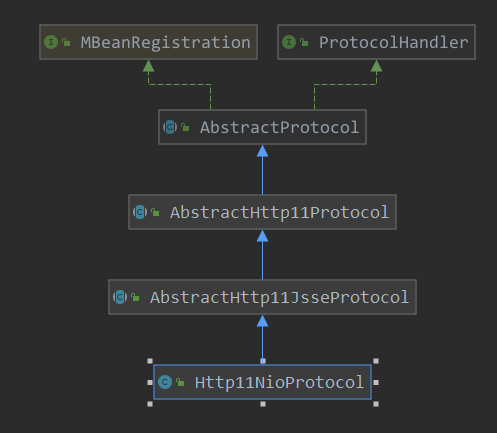
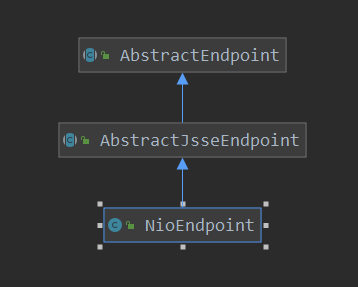
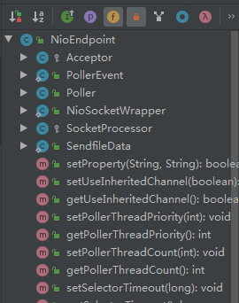

[TOC]

# tomcat的初始化动作

## 实例回顾

```java
tomcat.init();
```

> org.apache.catalina.startup.Tomcat#init

```java
public void init() throws LifecycleException {
    // 这里获取server,如果还没有创建,在这里就会进行创建
    getServer();
    // 创建connector
    getConnector();
    // 从server开始进行 初始化
    server.init();
}
```

> org.apache.catalina.startup.Tomcat#getConnector

```java
// 获取连接器
public Connector getConnector() {
    // 这里获取service, 如果没有service呢,也会进行创建
    Service service = getService();
    // 从server中查找是否有 connector
    if (service.findConnectors().length > 0) {
        // 如果存在的话,返回connector的第一个
        return service.findConnectors()[0];
    }
    // 是否已经创建了默认的connector
    if (defaultConnectorCreated) {
        return null;
    }
    // 创建连接器
    Connector connector = new Connector("HTTP/1.1");
    connector.setPort(port);
    service.addConnector(connector);
    // 已经创建了connector,更新此标志
    defaultConnectorCreated = true;
    return connector;
}
```

```java
// 记录此service 中的connector
protected Connector connectors[] = new Connector[0];

public Connector[] findConnectors() {
    return connectors;
}
```

从这里看出，连接器是和service进行的绑定，并且一个service可以绑定多个connector。

## connector 创建

connector的构造：

```java
// connector 的创建
public Connector(String protocol) {
    setProtocol(protocol);
    // Instantiate protocol handler
    ProtocolHandler p = null;
    try {
        // protocolHandlerClassName ="org.apache.coyote.http11.Http11NioProtocol
        // 反射创建 Nio
        Class<?> clazz = Class.forName(protocolHandlerClassName);
        p = (ProtocolHandler) clazz.getConstructor().newInstance();
    } catch (Exception e) {
        log.error(sm.getString(
            "coyoteConnector.protocolHandlerInstantiationFailed"), e);
    } finally {
        // 记录创建的 handler
        this.protocolHandler = p;
    }

    if (Globals.STRICT_SERVLET_COMPLIANCE) {
        uriCharset = StandardCharsets.ISO_8859_1;
    } else {
        uriCharset = StandardCharsets.UTF_8;
    }
}
```

Http11NioProtocol 的类图及其构造:





```java
public Http11NioProtocol() {
    super(new NioEndpoint());
}

public AbstractHttp11Protocol(AbstractEndpoint<S> endpoint) {
    super(endpoint);
    //  设置连接超时
    setConnectionTimeout(Constants.DEFAULT_CONNECTION_TIMEOUT);
    // 一协议处理器
    ConnectionHandler<S> cHandler = new ConnectionHandler<>(this);
    // 记录处理器
    setHandler(cHandler);
    // 设置endpoint的处理器
    getEndpoint().setHandler(cHandler);
}


public AbstractProtocol(AbstractEndpoint<S> endpoint) {
    this.endpoint = endpoint;
    // 设置socket属性 solinger
    setSoLinger(Constants.DEFAULT_CONNECTION_LINGER);
    // 设置 tcpNodelay
    setTcpNoDelay(Constants.DEFAULT_TCP_NO_DELAY);
}
```

在看一下NioEndpoint的一些主要内部类：



可见对于socket的连接操作会由此 NioEndpoint来执行。

connector创建完成了，添加到service中：

> org.apache.catalina.core.StandardService#addConnector

```java
// 记录此service 中的connector
protected Connector connectors[] = new Connector[0];
private final Object connectorsLock = new Object();

// 向service中添加connector
@Override
public void addConnector(Connector connector) {
    synchronized (connectorsLock) {
        connector.setService(this);
        Connector results[] = new Connector[connectors.length + 1];
        System.arraycopy(connectors, 0, results, 0, connectors.length);
        results[connectors.length] = connector;
        connectors = results;
        if (getState().isAvailable()) {
            try {
                connector.start();
            } catch (LifecycleException e) {
                log.error(sm.getString(
                    "standardService.connector.startFailed",connector), e);
            }
        }
        // Report this property change to interested listeners
        support.firePropertyChange("connector", null, connector);
    }
}
```

## server的初始化

```java
// 从server开始进行 初始化
server.init();
```

> org.apache.catalina.util.LifecycleBase#init

```java
@Override
public final synchronized void init() throws LifecycleException {
    // 注意此state初始化状态就是NEW
    if (!state.equals(LifecycleState.NEW)) {
        invalidTransition(Lifecycle.BEFORE_INIT_EVENT);
    }
    try {
        setStateInternal(LifecycleState.INITIALIZING, null, false);
        // init
        initInternal();
        setStateInternal(LifecycleState.INITIALIZED, null, false);
    } catch (Throwable t) {
        ExceptionUtils.handleThrowable(t);
        setStateInternal(LifecycleState.FAILED, null, false);
        throw new LifecycleException(
            sm.getString("lifecycleBase.initFail",toString()), t);
    }
}
```

> org.apache.catalina.core.StandardServer#initInternal

```java
@Override
protected void initInternal() throws LifecycleException {
    // 把此server 注册到jmx中
    super.initInternal();

    // Register global String cache
    // Note although the cache is global, if there are multiple Servers
    // present in the JVM (may happen when embedding) then the same cache
    // will be registered under multiple names
    onameStringCache = register(new StringCache(), "type=StringCache");

    // Register the MBeanFactory
    MBeanFactory factory = new MBeanFactory();
    factory.setContainer(this);
    onameMBeanFactory = register(factory, "type=MBeanFactory");

    // Register the naming resources
    globalNamingResources.init();
    // Populate the extension validator with JARs from common and shared
    // class loaders
    if (getCatalina() != null) {
        ClassLoader cl = getCatalina().getParentClassLoader();
        // Walk the class loader hierarchy. Stop at the system class loader.
        // This will add the shared (if present) and common class loaders
        while (cl != null && cl != ClassLoader.getSystemClassLoader()) {
            if (cl instanceof URLClassLoader) {
                URL[] urls = ((URLClassLoader) cl).getURLs();
                for (URL url : urls) {
                    if (url.getProtocol().equals("file")) {
                        try {
                            File f = new File (url.toURI());
                            if (f.isFile() &&
                                f.getName().endsWith(".jar")) {
                                ExtensionValidator.addSystemResource(f);
                            }
                        } catch (URISyntaxException e) {
                            // Ignore
                        } catch (IOException e) {
                            // Ignore
                        }
                    }
                }
            }
            cl = cl.getParent();
        }
    }
    // Initialize our defined Services
    // 启动server对应下的service,由此可见一个server可以对应多个service
    // 此处是对service的init
    for (int i = 0; i < services.length; i++) {
        services[i].init();
    }
}
```

```java
protected void initInternal() throws LifecycleException {
    // If oname is not null then registration has already happened via
    // preRegister().
    if (oname == null) {
        mserver = Registry.getRegistry(null, null).getMBeanServer();
        oname = register(this, getObjectNameKeyProperties());
    }
}
```

由上面server的初始化看到，主要点是其会调其注册的service进行初始化。

## service初始化

> org.apache.catalina.core.StandardService#initInternal

```java
// service的初始化操作
@Override
protected void initInternal() throws LifecycleException {
    // 同样是吧此service注册到jmx中
    super.initInternal();
    if (engine != null) {
        engine.init();
    }
    // Initialize any Executors
    // 线程池初始化
    for (Executor executor : findExecutors()) {
        if (executor instanceof JmxEnabled) {
            ((JmxEnabled) executor).setDomain(getDomain());
        }
        executor.init();
    }
    // Initialize mapper listener
    mapperListener.init();
    // Initialize our defined Connectors
    synchronized (connectorsLock) {
        for (Connector connector : connectors) {
            try {
                connector.init();
            } catch (Exception e) {
                String message = sm.getString("standardService.connector.initFailed", connector);
                log.error(message, e);

                if (Boolean.getBoolean("org.apache.catalina.startup.EXIT_ON_INIT_FAILURE"))
                    throw new LifecycleException(message);
            }
        }
    }
}
```

可以看此处主要进行了:

1. engine的初始化
2. executor 线程池的初始化
3. connector的初始化

## engine的初始化

> org.apache.catalina.core.StandardEngine#initInternal

```java
// engine的初始化
@Override
protected void initInternal() throws LifecycleException {
    // Ensure that a Realm is present before any attempt is made to start
    // one. This will create the default NullRealm if necessary.
    getRealm();
    // 设置一个启动停止的线程池
    super.initInternal();
}
```

> org.apache.catalina.core.ContainerBase#initInternal

```java
@Override
protected void initInternal() throws LifecycleException {
    BlockingQueue<Runnable> startStopQueue = new LinkedBlockingQueue<>();
    // 创建一个线程池
    startStopExecutor = new ThreadPoolExecutor(
        getStartStopThreadsInternal(),
        getStartStopThreadsInternal(), 10, TimeUnit.SECONDS,
        startStopQueue,
        new StartStopThreadFactory(getName() + "-startStop-"));
    startStopExecutor.allowCoreThreadTimeOut(true);
    super.initInternal();
}
```

> org.apache.catalina.util.LifecycleMBeanBase#initInternal

```java
@Override
protected void initInternal() throws LifecycleException {
    // If oname is not null then registration has already happened via
    // preRegister().
    if (oname == null) {
        mserver = Registry.getRegistry(null, null).getMBeanServer();
        oname = register(this, getObjectNameKeyProperties());
    }
}
```

## connector初始化

```java
// connector的初始化
@Override
protected void initInternal() throws LifecycleException {

    super.initInternal();

    // Initialize adapter
    // 创建一个 adapter,此适配器 主要是读取socket中的http的协议信息
    adapter = new CoyoteAdapter(this);
    protocolHandler.setAdapter(adapter);
    // Make sure parseBodyMethodsSet has a default
    if (null == parseBodyMethodsSet) {
        setParseBodyMethods(getParseBodyMethods());
    }

    if (protocolHandler.isAprRequired() && !AprLifecycleListener.isAprAvailable()) {
        throw new LifecycleException(sm.getString("coyoteConnector.protocolHandlerNoApr",
                                                  getProtocolHandlerClassName()));
    }
    if (AprLifecycleListener.isAprAvailable() && AprLifecycleListener.getUseOpenSSL() &&
        protocolHandler instanceof AbstractHttp11JsseProtocol) {
        AbstractHttp11JsseProtocol<?> jsseProtocolHandler =
            (AbstractHttp11JsseProtocol<?>) protocolHandler;
        // 如果使能 ssl,则配置 ssl相关属性
        if (jsseProtocolHandler.isSSLEnabled() &&
            jsseProtocolHandler.getSslImplementationName() == null) {
            // OpenSSL is compatible with the JSSE configuration, so use it if APR is available
            jsseProtocolHandler.setSslImplementationName(OpenSSLImplementation.class.getName());
        }
    }
    try {
        // handler的初始化
        protocolHandler.init();
    } catch (Exception e) {
        throw new LifecycleException(
            sm.getString("coyoteConnector.protocolHandlerInitializationFailed"), e);
    }
}
```

> org.apache.coyote.http11.AbstractHttp11Protocol#init

```java
// protocol 的初始化
@Override
public void init() throws Exception {
    for (UpgradeProtocol upgradeProtocol : upgradeProtocols) {
        configureUpgradeProtocol(upgradeProtocol);
    }

    super.init();
}
```

> org.apache.coyote.AbstractProtocol#init

endpint初始化

```java
@Override
public void init() throws Exception {
    if (getLog().isInfoEnabled()) {
        getLog().info(sm.getString("abstractProtocolHandler.init", getName()));
    }
    if (oname == null) {
        // Component not pre-registered so register it
        oname = createObjectName();
        if (oname != null) {
            Registry.getRegistry(null, null).registerComponent(this, oname, null);
        }
    }
    if (this.domain != null) {
        rgOname = new ObjectName(domain + ":type=GlobalRequestProcessor,name=" + getName());
        Registry.getRegistry(null, null).registerComponent(
            getHandler().getGlobal(), rgOname, null);
    }
    String endpointName = getName();
    endpoint.setName(endpointName.substring(1, endpointName.length()-1));
    endpoint.setDomain(domain);
    endpoint.init();
}
```

> org.apache.tomcat.util.net.AbstractEndpoint#init

```java
public void init() throws Exception {
    if (bindOnInit) {
        bind();
        bindState = BindState.BOUND_ON_INIT;
    }
    if (this.domain != null) {
        // Register endpoint (as ThreadPool - historical name)
        oname = new ObjectName(domain + ":type=ThreadPool,name=\"" + getName() + "\"");
        Registry.getRegistry(null, null).registerComponent(this, oname, null);

        ObjectName socketPropertiesOname = new ObjectName(domain +":type=ThreadPool,name=\"" + getName() + "\",subType=SocketProperties");
        socketProperties.setObjectName(socketPropertiesOname);
 Registry.getRegistry(null, null).registerComponent(socketProperties, socketPropertiesOname, null);
        for (SSLHostConfig sslHostConfig : findSslHostConfigs()) {
            registerJmx(sslHostConfig);
        }
    }
}
```

> org.apache.tomcat.util.net.NioEndpoint#bind

```java
private boolean useInheritedChannel = false;
public boolean getUseInheritedChannel() { return useInheritedChannel; }

/**
     * Initialize the endpoint.
     * 对endpoint的初始化
     * 1. 创建severSocketchannel
     * 2. 绑定地址端口
     * 3. 初始化ssl
     * 4.
     */
@Override
public void bind() throws Exception {
    if (!getUseInheritedChannel()) {
        // 初始化这里
        serverSock = ServerSocketChannel.open();
        // 配置socket属性
        socketProperties.setProperties(serverSock.socket());
        // 地址绑定
        InetSocketAddress addr = (getAddress()!=null?new InetSocketAddress(getAddress(),getPort()):new InetSocketAddress(getPort()));
        // 端口地址 绑定
        serverSock.socket().bind(addr,getAcceptCount());
    } else {
        // Retrieve the channel provided by the OS
        Channel ic = System.inheritedChannel();
        if (ic instanceof ServerSocketChannel) {
            serverSock = (ServerSocketChannel) ic;
        }
        if (serverSock == null) {
            throw new IllegalArgumentException(sm.getString("endpoint.init.bind.inherited"));
        }
    }
    serverSock.configureBlocking(true); //mimic APR behavior
    // Initialize thread count defaults for acceptor, poller
    if (acceptorThreadCount == 0) {
        // FIXME: Doesn't seem to work that well with multiple accept threads
        acceptorThreadCount = 1;
    }
    if (pollerThreadCount <= 0) {
        //minimum one poller thread
        pollerThreadCount = 1;
    }
    setStopLatch(new CountDownLatch(pollerThreadCount));
    // Initialize SSL if needed
    // ssl的初始化
    initialiseSsl();
    selectorPool.open();
}
```

这里初始化就完成了，发现初始化时，根本没有对host，context组件做什么操作。

继续看一下启动操作。


