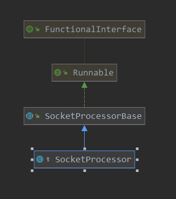

[TOC]

# socket的处理

上篇分析到了，当一个socket接收到之后，会发送一个PollerEvent事件到poller线程的队列中，本篇就来分析一下poller中对socket的处理。

回顾一下上篇：

```java
// 注册socket到poller中
public void register(final NioChannel socket) {
    // 更新 socket的poller
    socket.setPoller(this);
    // 使用NioSocketWrapper 封装一下 接收到的socket
    NioSocketWrapper ka = new NioSocketWrapper(socket, NioEndpoint.this);
    socket.setSocketWrapper(ka);
    ka.setPoller(this);
    // 设置 读写超时时间
    ka.setReadTimeout(getSocketProperties().getSoTimeout());
    ka.setWriteTimeout(getSocketProperties().getSoTimeout());
    // 设置是否keepalive
    ka.setKeepAliveLeft(NioEndpoint.this.getMaxKeepAliveRequests());
    // 是否是 ssl 打开
    ka.setSecure(isSSLEnabled());
    // 读写时间  超时, 设置为 connectionTimeout
    ka.setReadTimeout(getConnectionTimeout());
    ka.setWriteTimeout(getConnectionTimeout());
    // 这里对一个socket注册前, 会先去缓存中看是否有可复用的pollerEvent
    PollerEvent r = eventCache.pop();
    // 这里可以看到,当socket进行注册时,感兴趣事件是 OP_READ,而第一次注册的事件OP_REGISTER
    // 那么当下一次此socket准备好时,就会注册op_read事件
    ka.interestOps(SelectionKey.OP_READ);//this is what OP_REGISTER turns into.
    if ( r==null) r = new PollerEvent(socket,ka,OP_REGISTER);
    else r.reset(socket,ka,OP_REGISTER);
    // 发布一个 PollerEvent 事件到队列中
    addEvent(r);
}


// 发布事件
private void addEvent(PollerEvent event) {
    events.offer(event);
    // 注册完socket后,就立即唤醒一个selector
    // 如果是第一次进行唤醒,则立即进行一次 唤醒操作
    if ( wakeupCounter.incrementAndGet() == 0 ) selector.wakeup();
}
```

下面看一下poller线程的处理逻辑：

> org.apache.tomcat.util.net.NioEndpoint.Poller#run

```java
@Override
public void run() {
    // Loop until destroy() is called
    while (true) {
        boolean hasEvents = false;
        try {
            if (!close) {
                // 检测现在是否有事件, 并对事件进行处理
                // 这里修改事件中 对应的socket的 感兴趣的事件,以及进行了具体的注册动作
                hasEvents = events();
                // wakeupCounter大于0,表示有pollerEvent事件进入
                // 那么就selectNow,不会有超时等待; 也就是为了及时处理请求
                if (wakeupCounter.getAndSet(-1) > 0) {
                    //if we are here, means we have other stuff to do
                    //do a non blocking select
                    keyCount = selector.selectNow();
                } else {
                    // 如果到此,说明暂时没有注册的socket
                    keyCount = selector.select(selectorTimeout);
                }
                wakeupCounter.set(0);
            }
            // 如果关闭了呢, 这里会进行 selector 关闭操作
            if (close) {
                events();
                timeout(0, false);
                try {
                    selector.close();
                } catch (IOException ioe) {
                    log.error(sm.getString("endpoint.nio.selectorCloseFail"), ioe);
                }
                break;
            }
        } catch (Throwable x) {
            ExceptionUtils.handleThrowable(x);
            log.error("",x);
            continue;
        }
        //either we timed out or we woke up, process events first
        // 如果之前检测没有事件,那么此处在检测一次
        // 如果被唤醒,先进行一次事件的处理; 即为了timeout处理,也为了及时对事件响应
        if ( keyCount == 0 ) hasEvents = (hasEvents | events());
        // 获取所有可用的key的迭代器
        // 如果检测没有事件, 则不会对key进行遍历
        Iterator<SelectionKey> iterator =
            keyCount > 0 ? selector.selectedKeys().iterator() : null;
        // Walk through the collection of ready keys and dispatch
        // any active event.
        // todo  遍历所有的可用的事件, 并进行处理
        while (iterator != null && iterator.hasNext()) {
            SelectionKey sk = iterator.next();
            NioSocketWrapper attachment = (NioSocketWrapper)sk.attachment();
            // Attachment may be null if another thread has called
            // cancelledKey()
            if (attachment == null) {
                iterator.remove();
            } else {
                iterator.remove();
                // 对就绪的key对应的socket的channel进行处理
                processKey(sk, attachment);
            }
        }//while
        //process timeouts
        // timeout的处理
        timeout(keyCount,hasEvents);
    }//while
    getStopLatch().countDown();
}
```

可以看到poller的处理:

1. 对队列中事件的处理，此事件的处理修改了接收到的socket对应channel的感兴趣事件，以及进行了正在的注册动作
2. 如果有事件的话立即进行一下 selectorNow操作，如果没有事件呢，则在进行 select(selectorTimeout)
3. 遍历 selector获取到的所有的key，进行处理

事件的处理

> org.apache.tomcat.util.net.NioEndpoint.Poller#events

```java
// 对队列中事件的处理
public boolean events() {
    boolean result = false;

    PollerEvent pe = null;
    for (int i = 0, size = events.size(); i < size && (pe = events.poll()) != null; i++ ) {
        result = true;
        try {
            // 此处的run相当于重新注册了socket的感兴趣的事件
            pe.run();
            // 之后复位pollerEvent, 并放置到eventCache中,是为了复用此pollerEvent
            pe.reset();
            if (running && !paused) {
                 // 复位之后,再次缓存起来,用于进行循环使用
                eventCache.push(pe);
            }
        } catch ( Throwable x ) {
            log.error("",x);
        }
    }
    return result;
}
```

> org.apache.tomcat.util.net.NioEndpoint.PollerEvent#run

```java
// pollerEvent事件的run方法,对感兴趣事件的处理
@Override
public void run() {
    // 如果事件是OP_REGISTER,则注册下次的感兴趣事件是OP_READ
    if (interestOps == OP_REGISTER) {
        try {
            // 对事件中的channel进行注册操作
            // socket.getPoller().getSelector()  获取 selector
            // SelectionKey.OP_READ   感兴趣的事件
            // socketWrapper  socket的包装
            socket.getIOChannel().register(
                socket.getPoller().getSelector(), SelectionKey.OP_READ, socketWrapper);
        } catch (Exception x) {
            log.error(sm.getString("endpoint.nio.registerFail"), x);
        }
    } else {
        final SelectionKey key = socket.getIOChannel().keyFor(socket.getPoller().getSelector());
        try {
            // 如果socket的对应的key不存在了,则取消此key
            if (key == null) {
                // The key was cancelled (e.g. due to socket closure)
                // and removed from the selector while it was being
                // processed. Count down the connections at this point
                // since it won't have been counted down when the socket
                // closed.
                socket.socketWrapper.getEndpoint().countDownConnection();
                ((NioSocketWrapper) socket.socketWrapper).closed = true;
            } else {
// 存在,则获取此key对应的socketWrapper,设置其下一次的事件为 key.interestOps() | interestOps
                final NioSocketWrapper socketWrapper = (NioSocketWrapper) key.attachment();
                if (socketWrapper != null) {
                    //we are registering the key to start with, reset the fairness counter.
                    int ops = key.interestOps() | interestOps;
                    socketWrapper.interestOps(ops);
                    key.interestOps(ops);
                } else {
                    socket.getPoller().cancelledKey(key);
                }
            }
        } catch (CancelledKeyException ckx) {
            try {
                socket.getPoller().cancelledKey(key);
            } catch (Exception ignore) {}
        }
    }
}
```

注册动作：

> java.nio.channels.spi.AbstractSelectableChannel#register

此具体注册，就是JDK中的注册了。注册完成后，咱们往回拉一下，继续看poller的处理。其处理完事件后，立即进行了一次selectNow，查看有哪些可以处理的key，下面进行具体的读写处理。

> org.apache.tomcat.util.net.NioEndpoint.Poller#processKey

```java
// 针对不同就绪事件的处理
protected void processKey(SelectionKey sk, NioSocketWrapper attachment) {
    try {
        if ( close ) {
            // 如果关系了,则取消key
            cancelledKey(sk);
        } else if ( sk.isValid() && attachment != null ) {
            // 如果可读 或者 可写,则进行处理
            if (sk.isReadable() || sk.isWritable() ) {
                if ( attachment.getSendfileData() != null ) {
                    // 发送文件
                    processSendfile(sk,attachment, false);
                } else {
                    unreg(sk, attachment, sk.readyOps());
                    boolean closeSocket = false;
                    // Read goes before write
                    if (sk.isReadable()) {
                        // 处理可读事件
                        // todo  继续看此方法对socket的处理
                        if (!processSocket(attachment, SocketEvent.OPEN_READ, true)) {
                            closeSocket = true;
                        }
                    }
                    if (!closeSocket && sk.isWritable()) {
                        // 处理可写事件
                        if (!processSocket(attachment, SocketEvent.OPEN_WRITE, true)) {
                            closeSocket = true;
                        }
                    }
                    if (closeSocket) {
                        cancelledKey(sk);
                    }
                }
            }
        } else {
            //invalid key
            cancelledKey(sk);
        }
    } catch ( CancelledKeyException ckx ) {
        cancelledKey(sk);
    } catch (Throwable t) {
        ExceptionUtils.handleThrowable(t);
        log.error("",t);
    }
}
```

进行处理:

> 

```java
// 开始对socket  进行读写的处理
public boolean processSocket(SocketWrapperBase<S> socketWrapper, SocketEvent event, boolean dispatch) {
    try {
        if (socketWrapper == null) {
            return false;
        }
        // 从缓存中获取一个处理器
        SocketProcessorBase<S> sc = processorCache.pop();
        // 如果没有, 则创建一个新的处理器
        if (sc == null) {
            // 创建对socket具体的一个处理器
            sc = createSocketProcessor(socketWrapper, event);
        } else {
            // 如果有,则复位 处理器的属性为当前的 socket
            sc.reset(socketWrapper, event);
        }
        // 获取线程池
        // 这里修改为同步
        //Executor executor = getExecutor();
        Executor executor = null;
        // 如果存在线程池中,就在线程池中进行处理了
        // 这里修改为同步,方便调试,不在线程池中进行处理
        // todo  修改同步操作  修改同步
        // 这里其实就把具体的处理流程,放到了 线程池中去进行处理
        if (dispatch && executor != null) {
            executor.execute(sc);
        } else {
            // 没有线程池呢,则在当前的线程中进行处理
            sc.run();
        }
    } catch (RejectedExecutionException ree) {
        getLog().warn(sm.getString("endpoint.executor.fail", socketWrapper) , ree);
        return false;
    } catch (Throwable t) {
        ExceptionUtils.handleThrowable(t);
        // This means we got an OOM or similar creating a thread, or that
        // the pool and its queue are full
        getLog().error(sm.getString("endpoint.process.fail"), t);
        return false;
    }
    return true;
}
```

这里主要呢就是创建了一个 socketProcessor，然后调用此processor来对socket进行进一步的处理操作。

> org.apache.tomcat.util.net.NioEndpoint#createSocketProcessor

```java
@Override
protected SocketProcessorBase<NioChannel> createSocketProcessor(
    SocketWrapperBase<NioChannel> socketWrapper, SocketEvent event) {
    // 创建一个处理器,对接收到的socket的进行处理
    return new SocketProcessor(socketWrapper, event);
}
```

看一下此处理器类图：



创建好processor后，下面就把其放到线程池，进行具体的处理。处理看一下处理器的processor的run方法，其run方法调用doRun

> org.apache.tomcat.util.net.NioEndpoint.SocketProcessor#doRun

```java
// 对socket的处理
@Override
protected void doRun() {
    NioChannel socket = socketWrapper.getSocket();
    SelectionKey key = socket.getIOChannel().keyFor(socket.getPoller().getSelector());
    try {
        int handshake = -1;
        try {
            if (key != null) {
                if (socket.isHandshakeComplete()) {
                    // No TLS handshaking required. Let the handler
                    // process this socket / event combination.
                    handshake = 0;
                } else if (event == SocketEvent.STOP || event == SocketEvent.DISCONNECT ||
                           event == SocketEvent.ERROR) {
                    // Unable to complete the TLS handshake. Treat it as
                    // if the handshake failed.
                    handshake = -1;
                } else {
                    handshake = socket.handshake(key.isReadable(), key.isWritable());
                    // The handshake process reads/writes from/to the
                    // socket. status may therefore be OPEN_WRITE once
                    // the handshake completes. However, the handshake
                    // happens when the socket is opened so the status
                    // must always be OPEN_READ after it completes. It
                    // is OK to always set this as it is only used if
                    // the handshake completes.
                    event = SocketEvent.OPEN_READ;
                }
            }
        } catch (IOException x) {
            handshake = -1;
            if (log.isDebugEnabled()) log.debug("Error during SSL handshake",x);
        } catch (CancelledKeyException ckx) {
            handshake = -1;
        }
        if (handshake == 0) {
            SocketState state = SocketState.OPEN;
            // Process the request from this socket
            if (event == null) {
                // event为null, 默认是对 read 事件进行处理
                state = getHandler().process(socketWrapper, SocketEvent.OPEN_READ);
            } else {
                // 调用handler对 socket的event事件进行处理
                state = getHandler().process(socketWrapper, event);
            }
            if (state == SocketState.CLOSED) {
                close(socket, key);
            }
        } else if (handshake == -1 ) {
            close(socket, key);
        } else if (handshake == SelectionKey.OP_READ){
            socketWrapper.registerReadInterest();
        } else if (handshake == SelectionKey.OP_WRITE){
            socketWrapper.registerWriteInterest();
        }
    } catch (CancelledKeyException cx) {
        socket.getPoller().cancelledKey(key);
    } catch (VirtualMachineError vme) {
        ExceptionUtils.handleThrowable(vme);
    } catch (Throwable t) {
        log.error("", t);
        socket.getPoller().cancelledKey(key);
    } finally {
        socketWrapper = null;
        event = null;
        //return to cache
        if (running && !paused) {
            processorCache.push(this);
        }
    }
}
}
```

> org.apache.coyote.AbstractProtocol.ConnectionHandler#process

```java
// 对socket的处理
@Override
public SocketState process(SocketWrapperBase<S> wrapper, SocketEvent status) {
    if (getLog().isDebugEnabled()) {
        getLog().debug(sm.getString("abstractConnectionHandler.process",
                                    wrapper.getSocket(), status));
    }
    if (wrapper == null) {
        // Nothing to do. Socket has been closed.
        return SocketState.CLOSED;
    }
    // 获取 接收到的socket
    S socket = wrapper.getSocket();

    Processor processor = connections.get(socket);
    if (getLog().isDebugEnabled()) {
        getLog().debug(sm.getString("abstractConnectionHandler.connectionsGet",processor, socket));
    }

    if (SocketEvent.TIMEOUT == status && (processor == null ||!processor.isAsync() || !processor.checkAsyncTimeoutGeneration())) {
        // This is effectively a NO-OP
        return SocketState.OPEN;
    }
    if (processor != null) {
        // Make sure an async timeout doesn't fire
        getProtocol().removeWaitingProcessor(processor);
    } else if (status == SocketEvent.DISCONNECT || status == SocketEvent.ERROR) {
        // Nothing to do. Endpoint requested a close and there is no
        // longer a processor associated with this socket.
        return SocketState.CLOSED;
    }
    ContainerThreadMarker.set();
    try {
        if (processor == null) {
            String negotiatedProtocol = wrapper.getNegotiatedProtocol();
            // OpenSSL typically returns null whereas JSSE typically
            // returns "" when no protocol is negotiated
            if (negotiatedProtocol != null && negotiatedProtocol.length() > 0) {
                UpgradeProtocol upgradeProtocol =
                    getProtocol().getNegotiatedProtocol(negotiatedProtocol);
                if (upgradeProtocol != null) {
                    processor = upgradeProtocol.getProcessor(
                        wrapper, getProtocol().getAdapter());
                } else if (negotiatedProtocol.equals("http/1.1")) {
                    // Explicitly negotiated the default protocol.
                    // Obtain a processor below.
                } else {
                    // TODO:
                    // OpenSSL 1.0.2's ALPN callback doesn't support
                    // failing the handshake with an error if no
                    // protocol can be negotiated. Therefore, we need to
                    // fail the connection here. Once this is fixed,
                    // replace the code below with the commented out
                    // block.
                    if (getLog().isDebugEnabled()) {
                        getLog().debug(sm.getString(
                            "abstractConnectionHandler.negotiatedProcessor.fail",
                            negotiatedProtocol));
                    }
                    return SocketState.CLOSED;
                }
            }
        }
        if (processor == null) {
            processor = recycledProcessors.pop();
            if (getLog().isDebugEnabled()) {
                getLog().debug(sm.getString("abstractConnectionHandler.processorPop", processor));
            }
        }
        if (processor == null) {
            // 如果缓存中没有处理器, 那么就创建一个处理器来进行处理
            // 创建 Http11Processor, 来对socket进行进一步的处理
            processor = getProtocol().createProcessor();
            // 注册processor到jmx
            register(processor);
        }

        processor.setSslSupport(
            wrapper.getSslSupport(getProtocol().getClientCertProvider()));

        // Associate the processor with the connection
        // 记录创建的 processor
        connections.put(socket, processor);

        SocketState state = SocketState.CLOSED;
        do {
            // 对请求进行处理
            // 处理器的关键请求
            // 关键代码
            state = processor.process(wrapper, status);
            // 协议升级
            if (state == SocketState.UPGRADING) {
                // Get the HTTP upgrade handler
                UpgradeToken upgradeToken = processor.getUpgradeToken();
                // Retrieve leftover input
                ByteBuffer leftOverInput = processor.getLeftoverInput();
                if (upgradeToken == null) {
                    // Assume direct HTTP/2 connection
                    UpgradeProtocol upgradeProtocol = getProtocol().getUpgradeProtocol("h2c");
                    if (upgradeProtocol != null) {
                        processor = upgradeProtocol.getProcessor(
                            wrapper, getProtocol().getAdapter());
                        wrapper.unRead(leftOverInput);
                        // Associate with the processor with the connection
                        connections.put(socket, processor);
                    } else {
                        if (getLog().isDebugEnabled()) {
                            getLog().debug(sm.getString(
                                "abstractConnectionHandler.negotiatedProcessor.fail","h2c"));
                        }
                        return SocketState.CLOSED;
                    }
                } else {
                    HttpUpgradeHandler httpUpgradeHandler = upgradeToken.getHttpUpgradeHandler();
                    // Release the Http11 processor to be re-used
                    release(processor);
                    // Create the upgrade processor
                    processor = getProtocol().createUpgradeProcessor(wrapper, upgradeToken);
                    if (getLog().isDebugEnabled()) {
                        getLog().debug(sm.getString("abstractConnectionHandler.upgradeCreate",
                                                    processor, wrapper));
                    }
                    wrapper.unRead(leftOverInput);
                    // Mark the connection as upgraded
                    wrapper.setUpgraded(true);
                    // Associate with the processor with the connection
                    connections.put(socket, processor);
                    // Initialise the upgrade handler (which may trigger
                    // some IO using the new protocol which is why the lines
                    // above are necessary)
                    // This cast should be safe. If it fails the error
                    // handling for the surrounding try/catch will deal with
                    // it.
                    if (upgradeToken.getInstanceManager() == null) {
                        httpUpgradeHandler.init((WebConnection) processor);
                    } else {
                        ClassLoader oldCL = upgradeToken.getContextBind().bind(false, null);
                        try {
                            httpUpgradeHandler.init((WebConnection) processor);
                        } finally {
                            upgradeToken.getContextBind().unbind(false, oldCL);
                        }
                    }
                }
            }
        } while ( state == SocketState.UPGRADING);
        if (state == SocketState.LONG) {
            // In the middle of processing a request/response. Keep the
            // socket associated with the processor. Exact requirements
            // depend on type of long poll
            longPoll(wrapper, processor);
            if (processor.isAsync()) {
                getProtocol().addWaitingProcessor(processor);
            }
        } else if (state == SocketState.OPEN) {
            // In keep-alive but between requests. OK to recycle
            // processor. Continue to poll for the next request.
            connections.remove(socket);
            release(processor);
            wrapper.registerReadInterest();
        } else if (state == SocketState.SENDFILE) {
            // Sendfile in progress. If it fails, the socket will be
            // closed. If it works, the socket either be added to the
            // poller (or equivalent) to await more data or processed
            // if there are any pipe-lined requests remaining.
        } else if (state == SocketState.UPGRADED) {
            // Don't add sockets back to the poller if this was a
            // non-blocking write otherwise the poller may trigger
            // multiple read events which may lead to thread starvation
            // in the connector. The write() method will add this socket
            // to the poller if necessary.
            if (status != SocketEvent.OPEN_WRITE) {
                longPoll(wrapper, processor);
            }
        } else if (state == SocketState.SUSPENDED) {
            // Don't add sockets back to the poller.
            // The resumeProcessing() method will add this socket
            // to the poller.
        } else {
            // Connection closed. OK to recycle the processor. Upgrade
            // processors are not recycled.
            connections.remove(socket);
            if (processor.isUpgrade()) {
                UpgradeToken upgradeToken = processor.getUpgradeToken();
                HttpUpgradeHandler httpUpgradeHandler = upgradeToken.getHttpUpgradeHandler();
                InstanceManager instanceManager = upgradeToken.getInstanceManager();
                if (instanceManager == null) {
                    httpUpgradeHandler.destroy();
                } else {
                    ClassLoader oldCL = upgradeToken.getContextBind().bind(false, null);
                    try {
                        httpUpgradeHandler.destroy();
                    } finally {
                        try {
                            instanceManager.destroyInstance(httpUpgradeHandler);
                        } catch (Throwable e) {
                            ExceptionUtils.handleThrowable(e);
                            getLog().error(sm.getString("abstractConnectionHandler.error"), e);
                        }
                        upgradeToken.getContextBind().unbind(false, oldCL);
                    }
                }
            } else {
                release(processor);
            }
        }
        return state;
    } catch(java.net.SocketException e) {
       ......
    } finally {
        ContainerThreadMarker.clear();
    }
    connections.remove(socket);
    release(processor);
    return SocketState.CLOSED;
}
```

代码比较长，不过关键代码还是比较清晰的：

1. 先从connections 中获取此socket对应的处理器 processor
2. 如果connections中没有，则从recycledProcessors获取一个 processor
3. 如果还没有processor，则创建一个processor
4. 保存好此socket对应的processor
5. 使用此创建好的processor对socket进行处理

创建processor：

> org.apache.coyote.http11.AbstractHttp11Protocol#createProcessor

```java
// 根据协议创建具体的处理器,来对接收到的scoket进行处理
@SuppressWarnings("deprecation")
@Override
protected Processor createProcessor() {
    // 此处是创建 Http11Processor 处理器
    Http11Processor processor = new Http11Processor(getMaxHttpHeaderSize(),getAllowHostHeaderMismatch(), getRejectIllegalHeaderName(), getEndpoint(),getMaxTrailerSize(), allowedTrailerHeaders, getMaxExtensionSize(),getMaxSwallowSize(), httpUpgradeProtocols, getSendReasonPhrase(),relaxedPathChars, relaxedQueryChars);
    // 设置 adaptor
    processor.setAdapter(getAdapter());
    // 最大 keepAlive的请求数量
    processor.setMaxKeepAliveRequests(getMaxKeepAliveRequests());
    // upload的 超时时间
    processor.setConnectionUploadTimeout(getConnectionUploadTimeout());
    //
    processor.setDisableUploadTimeout(getDisableUploadTimeout());
    // 设置压缩的最下大小
    processor.setCompressionMinSize(getCompressionMinSize());
    // 设置压缩
    processor.setCompression(getCompression());
    processor.setNoCompressionUserAgents(getNoCompressionUserAgents());
    processor.setCompressibleMimeTypes(getCompressibleMimeTypes());
    processor.setRestrictedUserAgents(getRestrictedUserAgents());
    processor.setMaxSavePostSize(getMaxSavePostSize());
    // 设置此 processor 对应的server
    processor.setServer(getServer());
    processor.setServerRemoveAppProvidedValues(getServerRemoveAppProvidedValues());
    return processor;
}
```

进行处理：

> org.apache.coyote.AbstractProcessorLight#process

```java
@Override
public SocketState process(SocketWrapperBase<?> socketWrapper, SocketEvent status)
    throws IOException {

    SocketState state = SocketState.CLOSED;
    Iterator<DispatchType> dispatches = null;
    do {
        if (dispatches != null) {
            DispatchType nextDispatch = dispatches.next();
            state = dispatch(nextDispatch.getSocketStatus());
        } else if (status == SocketEvent.DISCONNECT) {
            // Do nothing here, just wait for it to get recycled
        } else if (isAsync() || isUpgrade() || state == SocketState.ASYNC_END) {
            state = dispatch(status);
            if (state == SocketState.OPEN) {
                // 重点  重点
                // 对socke记性处理
                // 生成request  response ,调用adaptor.service
                state = service(socketWrapper);
            }
        } else if (status == SocketEvent.OPEN_WRITE) {
            // Extra write event likely after async, ignore
            state = SocketState.LONG;
        } else if (status == SocketEvent.OPEN_READ){
            // 这里主要是调用service方法来进行处理
            state = service(socketWrapper);
        } else {
            // Default to closing the socket if the SocketEvent passed in
            // is not consistent with the current state of the Processor
            state = SocketState.CLOSED;
        }
        if (getLog().isDebugEnabled()) {
            getLog().debug("Socket: [" + socketWrapper +
                           "], Status in: [" + status +
                           "], State out: [" + state + "]");
        }

        if (state != SocketState.CLOSED && isAsync()) {
            state = asyncPostProcess();
            if (getLog().isDebugEnabled()) {
                getLog().debug("Socket: [" + socketWrapper +
                               "], State after async post processing: [" + state + "]");
            }
        }

        if (dispatches == null || !dispatches.hasNext()) {
            // Only returns non-null iterator if there are
            // dispatches to process.
            dispatches = getIteratorAndClearDispatches();
        }
    } while (state == SocketState.ASYNC_END ||
             dispatches != null && state != SocketState.CLOSED);
    return state;
}
```

此处的重点主要就是调用service方法对socket的处理了。

此方法还是比较长的，功能主要是：

1. 创建了request，response
2. 嗲用adaptor.service 方法，之后就真正进入到容器中进行处理了

> org.apache.coyote.http11.Http11Processor#service

```java
// 对socket的处理,解析http header, 封装request 和 response
@Override
public SocketState service(SocketWrapperBase<?> socketWrapper)
    throws IOException {
    RequestInfo rp = request.getRequestProcessor();
    rp.setStage(org.apache.coyote.Constants.STAGE_PARSE);

    // Setting up the I/O
    setSocketWrapper(socketWrapper);
    inputBuffer.init(socketWrapper);
    outputBuffer.init(socketWrapper);

    // Flags
    // 可见默认是 keepalive
    keepAlive = true;
    openSocket = false;
    readComplete = true;
    boolean keptAlive = false;
    SendfileState sendfileState = SendfileState.DONE;

    while (!getErrorState().isError() && keepAlive && !isAsync() && upgradeToken == null &&
           sendfileState == SendfileState.DONE && !endpoint.isPaused()) {

        // Parsing the request header
        try {
            /**
                 * 1. 解析 requestLine
                 */
            if (!inputBuffer.parseRequestLine(keptAlive)) {
                if (inputBuffer.getParsingRequestLinePhase() == -1) {
                    return SocketState.UPGRADING;
                } else if (handleIncompleteRequestLineRead()) {
                    break;
                }
            }

            if (endpoint.isPaused()) {
                // 503 - Service unavailable
                response.setStatus(503);
                setErrorState(ErrorState.CLOSE_CLEAN, null);
            } else {
                keptAlive = true;
                // Set this every time in case limit has been changed via JMX
                request.getMimeHeaders().setLimit(endpoint.getMaxHeaderCount());
                /**
                     * 2. 解析http header
                     */
                if (!inputBuffer.parseHeaders()) {
                    // We've read part of the request, don't recycle it
                    // instead associate it with the socket
                    openSocket = true;
                    readComplete = false;
                    break;
                }
                if (!disableUploadTimeout) {
                    socketWrapper.setReadTimeout(connectionUploadTimeout);
                }
            }
        } catch (IOException e) {
            if (log.isDebugEnabled()) {
                log.debug(sm.getString("http11processor.header.parse"), e);
            }
            setErrorState(ErrorState.CLOSE_CONNECTION_NOW, e);
            break;
        } catch (Throwable t) {
            ExceptionUtils.handleThrowable(t);
            UserDataHelper.Mode logMode = userDataHelper.getNextMode();
            if (logMode != null) {
                String message = sm.getString("http11processor.header.parse");
                switch (logMode) {
                    case INFO_THEN_DEBUG:
                        message += sm.getString("http11processor.fallToDebug");
                        //$FALL-THROUGH$
                    case INFO:
                        log.info(message, t);
                        break;
                    case DEBUG:
                        log.debug(message, t);
                }
            }
            // 400 - Bad Request
            response.setStatus(400);
            setErrorState(ErrorState.CLOSE_CLEAN, t);
        }

        // Has an upgrade been requested?
        Enumeration<String> connectionValues = request.getMimeHeaders().values("Connection");
        boolean foundUpgrade = false;
        while (connectionValues.hasMoreElements() && !foundUpgrade) {
            foundUpgrade = connectionValues.nextElement().toLowerCase(
                Locale.ENGLISH).contains("upgrade");
        }

        if (foundUpgrade) {
            // Check the protocol
            String requestedProtocol = request.getHeader("Upgrade");

            UpgradeProtocol upgradeProtocol = httpUpgradeProtocols.get(requestedProtocol);
            if (upgradeProtocol != null) {
                if (upgradeProtocol.accept(request)) {
                    // TODO Figure out how to handle request bodies at this
                    // point.
                    response.setStatus(HttpServletResponse.SC_SWITCHING_PROTOCOLS);
                    response.setHeader("Connection", "Upgrade");
                    response.setHeader("Upgrade", requestedProtocol);
                    action(ActionCode.CLOSE,  null);
                    getAdapter().log(request, response, 0);

                    InternalHttpUpgradeHandler upgradeHandler =
                        upgradeProtocol.getInternalUpgradeHandler(
                        getAdapter(), cloneRequest(request));
                    UpgradeToken upgradeToken = new UpgradeToken(upgradeHandler, null, null);
                    action(ActionCode.UPGRADE, upgradeToken);
                    return SocketState.UPGRADING;
                }
            }
        }

        if (getErrorState().isIoAllowed()) {
            // Setting up filters, and parse some request headers
            rp.setStage(org.apache.coyote.Constants.STAGE_PREPARE);
            try {
                /**
                     *  1. 解析协议
                     *  2. 验证header的头
                     *  3. 解析host 以及 port
                     *
                     */
                prepareRequest();
            } catch (Throwable t) {
                ExceptionUtils.handleThrowable(t);
                if (log.isDebugEnabled()) {
                    log.debug(sm.getString("http11processor.request.prepare"), t);
                }
                // 500 - Internal Server Error
                response.setStatus(500);
                setErrorState(ErrorState.CLOSE_CLEAN, t);
            }
        }

        if (maxKeepAliveRequests == 1) {
            keepAlive = false;
        } else if (maxKeepAliveRequests > 0 &&
                   socketWrapper.decrementKeepAlive() <= 0) {
            keepAlive = false;
        }

        // Process the request in the adapter
        if (getErrorState().isIoAllowed()) {
            try {
                rp.setStage(org.apache.coyote.Constants.STAGE_SERVICE);
                // 前面解析号request 和response后, 调用adapter来进行下一步处理
                // todo 这里通过adaptor来进行进一步的处理,之后就会进入容器中进行具体的处理
                getAdapter().service(request, response);
                // Handle when the response was committed before a serious
                // error occurred.  Throwing a ServletException should both
                // set the status to 500 and set the errorException.
                // If we fail here, then the response is likely already
                // committed, so we can't try and set headers.
                if(keepAlive && !getErrorState().isError() && !isAsync() &&
                   statusDropsConnection(response.getStatus())) {
                    setErrorState(ErrorState.CLOSE_CLEAN, null);
                }
            } catch (InterruptedIOException e) {
                setErrorState(ErrorState.CLOSE_CONNECTION_NOW, e);
            } catch (HeadersTooLargeException e) {
                log.error(sm.getString("http11processor.request.process"), e);
                // The response should not have been committed but check it
                // anyway to be safe
                if (response.isCommitted()) {
                    setErrorState(ErrorState.CLOSE_NOW, e);
                } else {
                    response.reset();
                    response.setStatus(500);
                    setErrorState(ErrorState.CLOSE_CLEAN, e);
                    response.setHeader("Connection", "close"); // TODO: Remove
                }
            } catch (Throwable t) {
                ExceptionUtils.handleThrowable(t);
                log.error(sm.getString("http11processor.request.process"), t);
                // 500 - Internal Server Error
                response.setStatus(500);
                setErrorState(ErrorState.CLOSE_CLEAN, t);
                getAdapter().log(request, response, 0);
            }
        }

        // Finish the handling of the request
        rp.setStage(org.apache.coyote.Constants.STAGE_ENDINPUT);
        if (!isAsync()) {
            // If this is an async request then the request ends when it has
            // been completed. The AsyncContext is responsible for calling
            // endRequest() in that case.
            endRequest();
        }
        rp.setStage(org.apache.coyote.Constants.STAGE_ENDOUTPUT);

        // If there was an error, make sure the request is counted as
        // and error, and update the statistics counter
        if (getErrorState().isError()) {
            response.setStatus(500);
        }

        if (!isAsync() || getErrorState().isError()) {
            request.updateCounters();
            if (getErrorState().isIoAllowed()) {
                inputBuffer.nextRequest();
                outputBuffer.nextRequest();
            }
        }

        if (!disableUploadTimeout) {
            int soTimeout = endpoint.getConnectionTimeout();
            if(soTimeout > 0) {
                socketWrapper.setReadTimeout(soTimeout);
            } else {
                socketWrapper.setReadTimeout(0);
            }
        }

        rp.setStage(org.apache.coyote.Constants.STAGE_KEEPALIVE);
        // 发送文件
        sendfileState = processSendfile(socketWrapper);
    }

    rp.setStage(org.apache.coyote.Constants.STAGE_ENDED);

    if (getErrorState().isError() || endpoint.isPaused()) {
        return SocketState.CLOSED;
    } else if (isAsync()) {
        return SocketState.LONG;
    } else if (isUpgrade()) {
        return SocketState.UPGRADING;
    } else {
        if (sendfileState == SendfileState.PENDING) {
            return SocketState.SENDFILE;
        } else {
            if (openSocket) {
                if (readComplete) {
                    return SocketState.OPEN;
                } else {
                    return SocketState.LONG;
                }
            } else {
                return SocketState.CLOSED;
            }
        }
    }
}
```

函数比较长，其主要的工作小结一下：

1.  解析requestLine
2. 解析 http header
3.  解析协议，验证header的头， 解析host以及port
4. 调用adaptor.service，并把创建的request，response传递进入，此处就进入到容器中进行处理了。

> org.apache.catalina.connector.CoyoteAdapter#service

```java
// adapter 此是请求进入容器处理前的适配器
@Override
public void service(org.apache.coyote.Request req, org.apache.coyote.Response res)
    throws Exception {
    Request request = (Request) req.getNote(ADAPTER_NOTES);
    Response response = (Response) res.getNote(ADAPTER_NOTES);
    if (request == null) {
        // Create objects
        request = connector.createRequest();
        request.setCoyoteRequest(req);
        response = connector.createResponse();
        response.setCoyoteResponse(res);

        // Link objects
        request.setResponse(response);
        response.setRequest(request);

        // Set as notes
        req.setNote(ADAPTER_NOTES, request);
        res.setNote(ADAPTER_NOTES, response);

        // Set query string encoding
        req.getParameters().setQueryStringCharset(connector.getURICharset());
    }
    // 补充header
    if (connector.getXpoweredBy()) {
        response.addHeader("X-Powered-By", POWERED_BY);
    }

    boolean async = false;
    boolean postParseSuccess = false;

    req.getRequestProcessor().setWorkerThreadName(THREAD_NAME.get());

    try {
        // Parse and set Catalina and configuration specific
        // request parameters
        // todo 重要
        // 1. 解析请求参数
        // 2. 解析schema
        // 3. 解析对应的host container
        // 4. 解析对应的context container
        // 5. 解析对应的servlet
        postParseSuccess = postParseRequest(req, request, res, response);
        if (postParseSuccess) {
            //check valves if we support async
            request.setAsyncSupported(
                connector.getService().getContainer().getPipeline().isAsyncSupported());
            // Calling the container
            // todo  重点 重点  此时转换后的request和response就会进入到容器中进行进一步的处理
            // 此处就是 engine的pipeline 进行处理了
            connector.getService().getContainer().getPipeline().getFirst().invoke(
                request, response);
        }
        if (request.isAsync()) {
            async = true;
            ReadListener readListener = req.getReadListener();
            if (readListener != null && request.isFinished()) {
                // Possible the all data may have been read during service()
                // method so this needs to be checked here
                ClassLoader oldCL = null;
                try {
                    oldCL = request.getContext().bind(false, null);
                    if (req.sendAllDataReadEvent()) {
                        req.getReadListener().onAllDataRead();
                    }
                } finally {
                    request.getContext().unbind(false, oldCL);
                }
            }
            Throwable throwable =
                (Throwable) request.getAttribute(RequestDispatcher.ERROR_EXCEPTION);
            if (!request.isAsyncCompleting() && throwable != null) {
                request.getAsyncContextInternal().setErrorState(throwable, true);
            }
        } else {
            request.finishRequest();
            response.finishResponse();
        }
    } catch (IOException e) {
        // Ignore
    } finally {
        AtomicBoolean error = new AtomicBoolean(false);
        res.action(ActionCode.IS_ERROR, error);

        if (request.isAsyncCompleting() && error.get()) {
            // Connection will be forcibly closed which will prevent
            // completion happening at the usual point. Need to trigger
            // call to onComplete() here.
            res.action(ActionCode.ASYNC_POST_PROCESS,  null);
            async = false;
        }
        // Access log
        if (!async && postParseSuccess) {
            // Log only if processing was invoked.
            // If postParseRequest() failed, it has already logged it.
            Context context = request.getContext();
            Host host = request.getHost();
            // If the context is null, it is likely that the endpoint was
            // shutdown, this connection closed and the request recycled in
            // a different thread. That thread will have updated the access
            // log so it is OK not to update the access log here in that
            // case.
            // The other possibility is that an error occurred early in
            // processing and the request could not be mapped to a Context.
            // Log via the host or engine in that case.
            long time = System.currentTimeMillis() - req.getStartTime();
            if (context != null) {
                context.logAccess(request, response, time, false);
            } else if (response.isError()) {
                if (host != null) {
                    host.logAccess(request, response, time, false);
                } else {
                    connector.getService().getContainer().logAccess(
                        request, response, time, false);
                }
            }
        }
        req.getRequestProcessor().setWorkerThreadName(null);
        // Recycle the wrapper request and response
        if (!async) {
            updateWrapperErrorCount(request, response);
            request.recycle();
            response.recycle();
        }
    }
}
```

此处可以看到后面就是调用engine中pipeline中的第一个来继续进行处理了。由此就进入到了容器内部进行处理，下篇咱们分析一下容器内部的处理。


