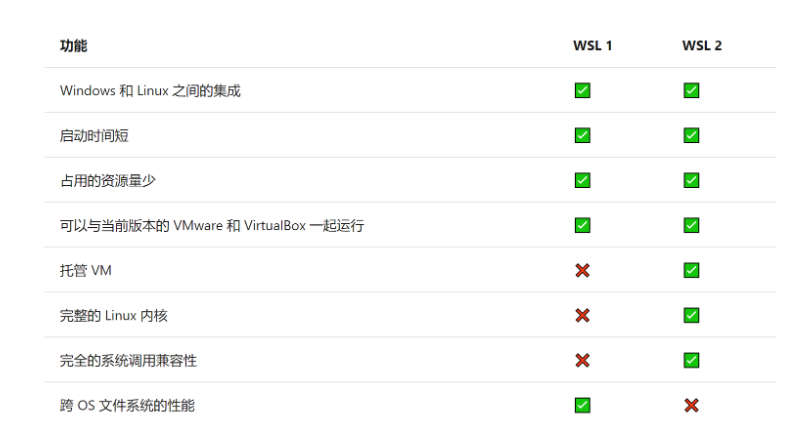
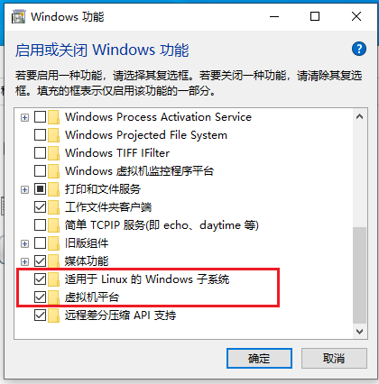
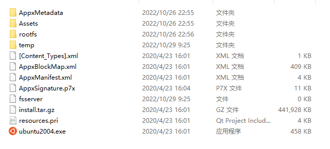
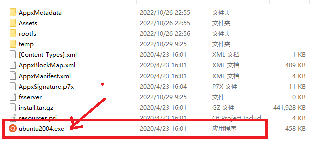
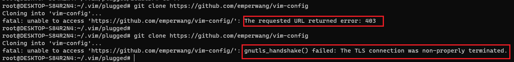

# windows安装WSL

## 1. wsl1 和wsl2对比

WSL1和WSL2的简单功能对比:




## 2. 安装

### 2.0 打开windows WSL功能



此两项是安装WSL的前提，安装完成后需要重启电脑。

### 2.1 创建安装目录

```shell
mkdir d:\Ubuntu20
cd d:\Ubuntu20
```


### 2.2 下载要安装的ubuntu wsl app

```shell
Invoke-WebRequest -Uri https://wsldownload.azureedge.net/Ubuntu_2004.2020.424.0_x64.appx -OutFile Ubuntu20.04.appx -UseBasicParsing
```


### 2.3 重命名并解压app包

```shell
Rename-Item .\Ubuntu20.04.appx Ubuntu.zip
Expand-Archive .\Ubuntu.zip -Verbose
```

解压后文件如下：



###  2.4  启动wsl

运行刚才下载的wsl package



### 2.5 更细yum源

ubuntu 更新软件源

```shell
sudo mv /etc/apt/sources.list /etc/apt/sources.list.backup
sudo nano /etc/apt/sources.list
```

更换为阿里源

```shell

deb http://mirrors.aliyun.com/ubuntu/ focal main restricted universe multiverse
deb http://mirrors.aliyun.com/ubuntu/ focal-security main restricted universe multiverse
deb http://mirrors.aliyun.com/ubuntu/ focal-updates main restricted universe multiverse
deb http://mirrors.aliyun.com/ubuntu/ focal-proposed main restricted universe multiverse
deb http://mirrors.aliyun.com/ubuntu/ focal-backports main restricted universe multiverse
deb-src http://mirrors.aliyun.com/ubuntu/ focal main restricted universe multiverse
deb-src http://mirrors.aliyun.com/ubuntu/ focal-security main restricted universe multiverse
deb-src http://mirrors.aliyun.com/ubuntu/ focal-updates main restricted universe multiverse
deb-src http://mirrors.aliyun.com/ubuntu/ focal-proposed main restricted universe multiverse
deb-src http://mirrors.aliyun.com/ubuntu/ focal-backports main restricted universe multiverse focal
```


更新软件源:

```shell
apt update
apt upgrade
```


## 3. 问题

在使用WSL过程中遇到的问题.

### 3.1 git clone

在wsl使用中，可以访问外网，但是下载github中的repo出错，不能下载成功，但是主机下载没问题。

`文件目前还没有得到解决`。

目前是把repo下载到宿主机，然后复制到WSL中。




参考文档

https://blogs.oopswow.com/2021/01/06/WSL2-install-ubuntu20-and-change-the-default-installation-driver/

