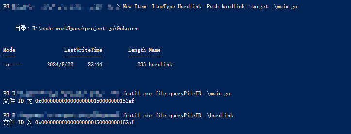

---
tags:
  - windows
  - powershell
  - symbolic
---

## symbolic file
windows软连接创建
```bat
; create symbolic link

mklink
创建符号链接。

MKLINK [[/D] | [/H] | [/J]] Link Target     

        /D      创建目录符号链接。默认为文件
                符号链接。
        /H      创建硬链接而非符号链接。    
        /J      创建目录联接。
        Link    指定新的符号链接名称。      
        Target  指定新链接引用的路径        
                (相对或绝对)。

```


```powershell
## create symbolic link
New-Item -ItemType symbolic -Path linkfile -target main.go


```


## Hardlink file

```powershell
##  create hardlink file
New-Item -ItemType HardLink -Path hardLinkfile  -Target main


## query file ID
fsutil file queryFileID  filename

```




## 应用场景


### 1. 云同步
以印象笔记 或 onenote为例,  两种软件都会把笔记同步到云端,  默认的位置同样是 C 盘,  那我们可以存储位置链接到 D 盘,   那么真正文件保存到D 盘,  当onenote或印象笔记存储时 ,  会读取真正的文件进行 云存储.


### 2. 软件安装
以windows系统为例, 很多软件的temp文件, 配置文件, 系统运行的temp文件都会再C盘,  那么我们其实可以再C盘创建对应的`symbolic link` 软链文件, 其指向为D或其他盘的位置, 那么真正存储的位置就会是此 软链指向的文件夹,  可以大大减少 C 盘的占用.


>reference

[symbolic](https://sspai.com/post/66834)