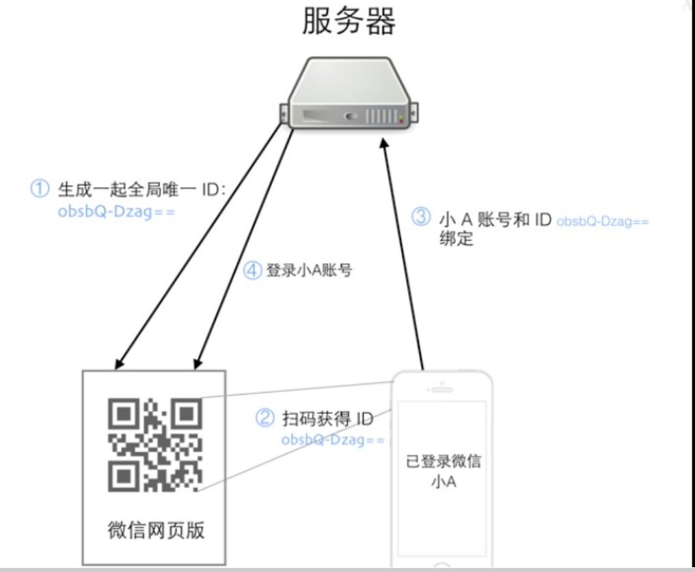

## 1. 扫码登陆思路

登陆流程：

1. 用户小A访问微信网页版，微信服务器为这个会话生成一个全局唯一的ID，上面的URL中obsbQ-Dzag==就是这个ID，此时系统并不知道访问者是谁
2. 用户小A打开自己的手机微信并扫描这个二维码，并提示用户是否确认登陆
3. 手机上的微信是登陆状态，用户点击确认登陆后，手机上的微信客户端将微信账号和这个扫描得到的ID一起提交到服务器
4. 服务器将这个ID和用户小A的微信号绑定在一起，并通知网页版微信，这个ID对应的微信号为小A，网页版微信加载用户小A的信息，至此扫码登陆完成。

